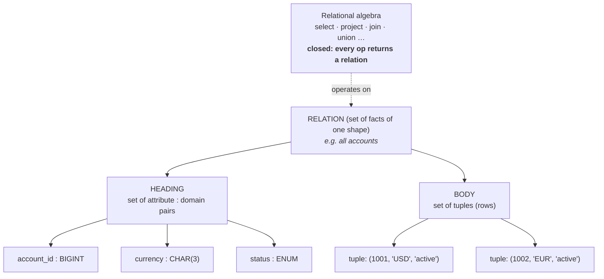
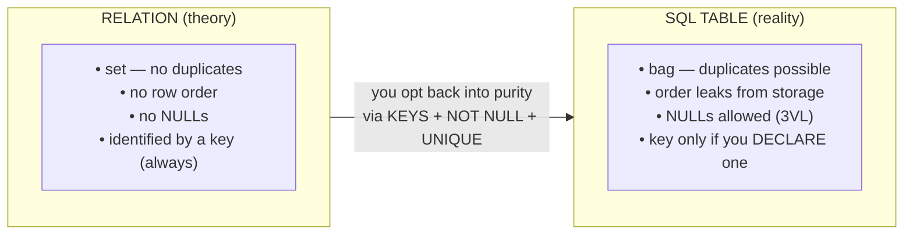
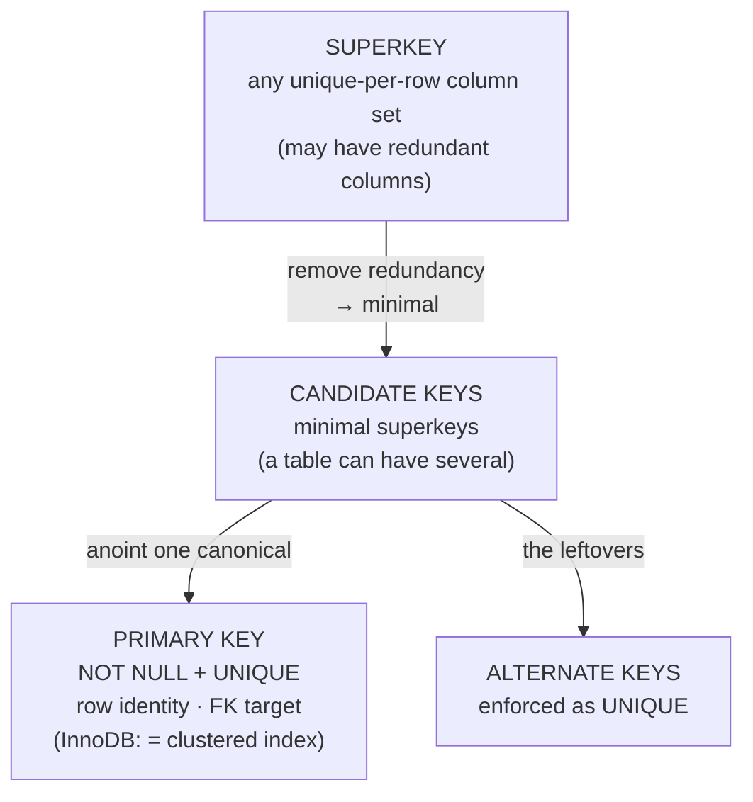
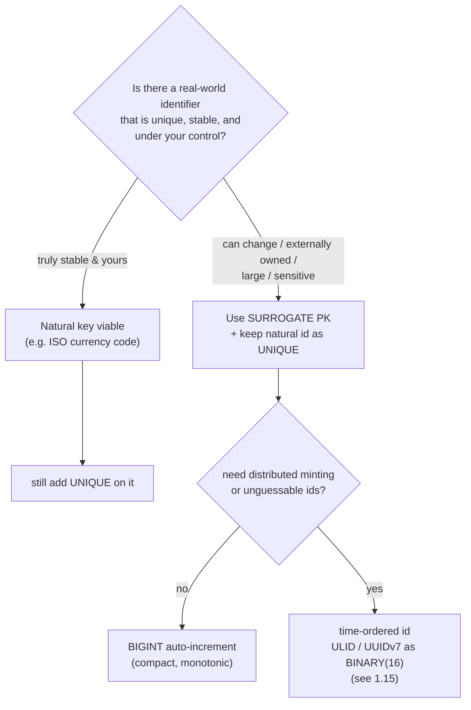
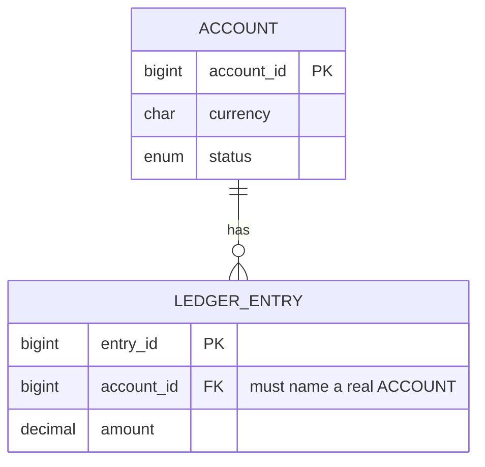
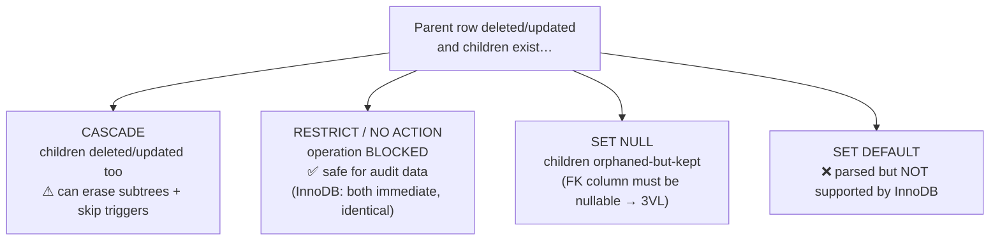
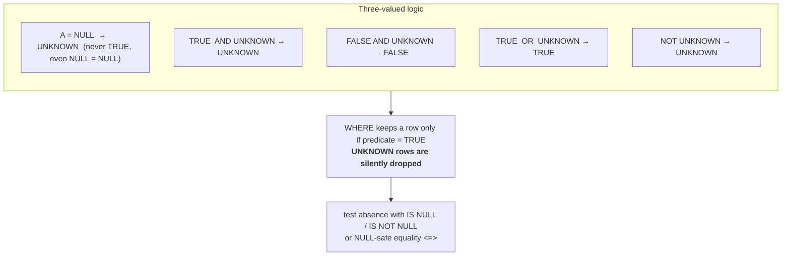
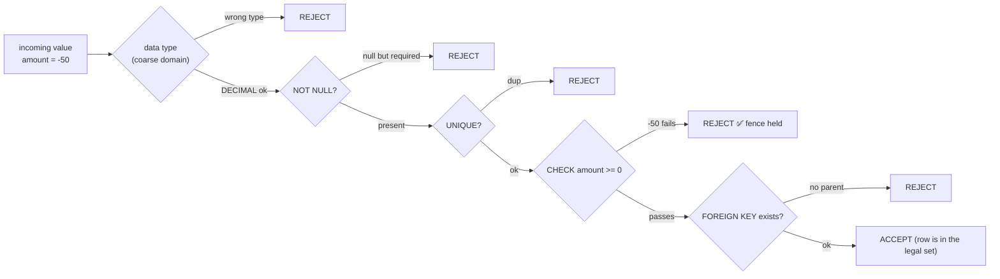

# M01 · Pass C — Diagrams & Worked Examples · Concepts 1.1–1.8

> **Pass C scope:** content-contract items **#12 Diagram(s)** and **#8 Worked example** (narrated, no code in prose). Pairs with the Pass B core notes in `01-relational-core.md`. Diagrams are Mermaid; ER diagrams use **crow's-foot**. Worked examples use the running **payments/wallet** domain.

---

## 1.1 · The relational model

**Diagram — concept map (relation → tuple → attribute → domain):**

**Worked example — "declare the set, don't walk the data."**
Picture the question *"give me every active USD account."* In a pointer/file mindset you'd open the accounts file, read it record by record, and for each one check two fields and collect the matches — you're describing *how to traverse*. In the relational mindset you instead **declare a set**: "the subset of the `account` relation where status = active and currency = USD." You never say how to find them. Behind the scenes the engine is free to satisfy that declaration by a full scan today and by an index seek tomorrow (after you add an index) — and *your request doesn't change*. That invariance of the request under changing physical access paths is **data independence**, and it's the whole point: you reason about *which set you want*, the engine owns *how to produce it*. (The "how" is exactly what M05–M06 are about.)

---

## 1.2 · Relations vs tables (theory vs SQL)

**Diagram — pure relation vs real SQL table:**

**Worked example — the duplicate that "can't happen."**
You build a `ledger_entry` table and, during a retry storm, your service posts the *same* entry twice — same account, same amount, same transaction. In relational *theory* this is impossible: a relation is a set, so two identical tuples collapse to one. But your SQL table is a **bag**: it cheerfully stores both rows, and now the account's computed balance is off by one entry's worth of money. Nothing in the table's "table-ness" stopped it. The fix is to *opt back into* set semantics by declaring a key the duplicate would violate — e.g., a uniqueness promise on the transaction's natural identity (the idempotency key, M16). The lesson made concrete: **a SQL table only behaves like a relation to the extent you constrain it to** — and the gap is measured in real money here.

---

## 1.3 · Keys: candidate, primary, alternate

**Diagram — superkey → candidate → primary/alternate:**

**Worked example — choosing the PK for `account`.**
Two candidates present themselves: the internal `account_id`, and the business pair `(bank_code, account_number)`. Both are unique, so both are candidate keys. Which becomes *primary*? Promote `account_id`: it's a single compact column, it never changes, and — crucially in InnoDB — it becomes the **clustered index** that every secondary index will embed (1.3 MySQL reality). The business pair stays as an **alternate key**, enforced UNIQUE so the real-world rule ("no two accounts share a bank+number") still holds. Notice the two distinct jobs: the primary key is for *the system to address and reference rows efficiently*; the alternate key is for *the business uniqueness rule*. Conflating them — making the wide, externally-owned pair your PK — would bloat every index in the table and couple your row identity to a value the bank controls (1.4).

---

## 1.4 · Natural vs surrogate keys

**Diagram — decision tree:**

**Worked example — when an IBAN gets reassigned.**
Suppose you'd used the IBAN as the primary key of `account`, and every `ledger_entry` references accounts by IBAN. Years later the bank *reassigns* a closed account's IBAN to a new customer (this happens). Now your ledger's historical entries — keyed by that IBAN — silently re-point at a *different person's* account. The money record is corrupted not by a bug in your code but by an external party changing a value you built identity on. With a **surrogate** `account_id`, this is a non-event: the old account keeps its immutable `account_id` and all its entries; the reassigned IBAN is just a new value in a `UNIQUE` column on a *new* row. The principle made vivid: **identity must not be built on data you don't control** — and in fintech, "the bank reused an identifier" is exactly the kind of thing that turns a natural-key shortcut into a money-attribution disaster.

---

## 1.5 · Foreign keys & referential integrity

**Diagram — FK as a pointer that can't dangle:**

**Worked example — the orphaned entry the FK refuses.**
A batch job tries to delete an old `account` row that still has ledger entries pointing at it. Without a foreign key, the delete succeeds and you now have entries referencing an `account_id` that no longer exists — *orphaned money*: charges and credits attributed to nothing. Reports that join entries to accounts silently drop them; the books no longer balance and nobody notices until reconciliation (M16). **With** an InnoDB foreign key, the engine checks for children at delete time and **rejects the delete** ("cannot delete or update a parent row: a foreign key constraint fails"). The broken state was never representable. This is "make illegal states unrepresentable" (the generic) turned into a hard runtime guarantee — and it's the database, not hopeful application code, doing the guarding. (*What* the engine should do instead of just rejecting — block, cascade, or null — is concept 1.6.)

---

## 1.6 · Referential actions (CASCADE / RESTRICT / SET NULL / NO ACTION)

**Diagram — action × event matrix:**

**Worked example — why the ledger says RESTRICT (★ money-never-lies).**
An ops engineer runs a routine "delete closed customer" cleanup. That customer owns an account, and the account has thousands of immutable ledger entries — the legal record of every payment they ever made. Consider the FK choice:
- If `customer → account → ledger_entry` were wired **ON DELETE CASCADE**, that single innocuous DELETE silently destroys the entire financial history: accounts gone, entries gone, audit trail gone — and because **InnoDB cascades bypass triggers**, your audit-logging triggers never even fire to record that it happened. Money records vanish with no trace.
- With **RESTRICT**, the DELETE simply *fails loudly* ("foreign key constraint fails") because children exist. The engineer is forced to do the correct thing instead: mark the customer/account **closed** (a status change), never physically delete, and leave the immutable entries untouched.

The canonical fintech shape falls out of this: accounts/customers are *closed, not deleted*; ledger entries are *never deleted at all*; FKs **RESTRICT** so a stray delete is an error, not a silent catastrophe. The referential action is doing real risk management — it's the difference between "a mis-click is annoying" and "a mis-click erased the books."

---

## 1.7 · NULL and three-valued logic

**Diagram — 3VL truth tables + the WHERE filter:**

**Worked example — the report that quietly loses rows.**
You run a sweep to find every account that *isn't* settled to exactly zero: `WHERE balance <> 0`. It returns a clean list, you act on it. But some accounts have `balance = NULL` (newly opened, balance not yet computed). For those rows, `NULL <> 0` evaluates to **UNKNOWN**, not TRUE — so `WHERE` **silently drops them**. Your "every nonzero account" list quietly excluded an entire category of accounts, and nobody got an error. The intuition "`<> 0` means everything that isn't zero" is simply false in SQL's three-valued world. The fixes are explicit: either decide those rows shouldn't be NULL at all (make `balance` NOT NULL DEFAULT 0 with a CHECK — 1.8, the usual fintech choice so money math is never ambiguous), or write the predicate to handle absence on purpose (`balance <> 0 OR balance IS NULL`, or NULL-safe `<=>`). The takeaway: **NULL doesn't error — it silently changes your result set**, which is exactly what makes it dangerous in money queries.

---

## 1.8 · Domains, constraints & the closed-world assumption

**Diagram — value → domain → constraints → accept/reject (the fence):**

**Worked example — the CHECK that stops a negative credit.**
A `ledger_entry` on a *credit-only* promotional account should never carry a negative amount. You declare `CHECK (amount >= 0)` on it. Now a buggy refund path tries to insert `amount = -50`. The engine evaluates the predicate, it's FALSE, and the insert is **rejected at the database** — the invalid money movement never lands, in *any* code path, regardless of which service or script attempted it. Compare the alternative where this rule lived only in application code: one forgotten validation, one migration script, one new service, and the negative row slips in. The constraint is the *last line that cannot be bypassed*. **But the MySQL caveat is load-bearing:** on MySQL **before 8.0.16**, that `CHECK` was *parsed and silently ignored* — the fence looked present but enforced nothing, and the -50 would have sailed through. So the worked example has a second lesson: confirm you're on 8.0.16+ **and** running in strict SQL mode, or your "fence" is decorative. Concept-first principle (make invalid states unrepresentable) + MySQL reality (verify the version actually enforces it) together.

---

*Diagrams + worked examples for 1.1–1.8 complete. Next Pass C file: 1.9–1.14 (modeling altitudes, ER, cardinality, junctions, weak entities, design-for-queries).*
