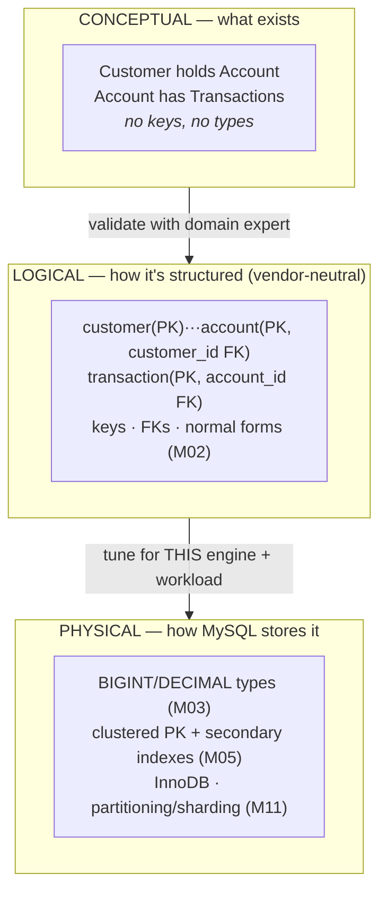
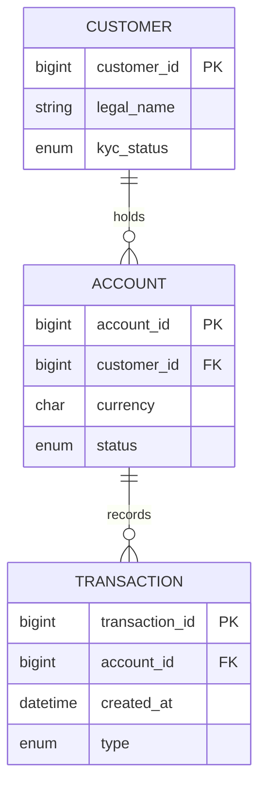
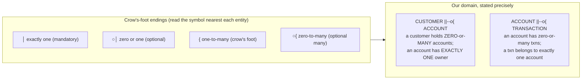
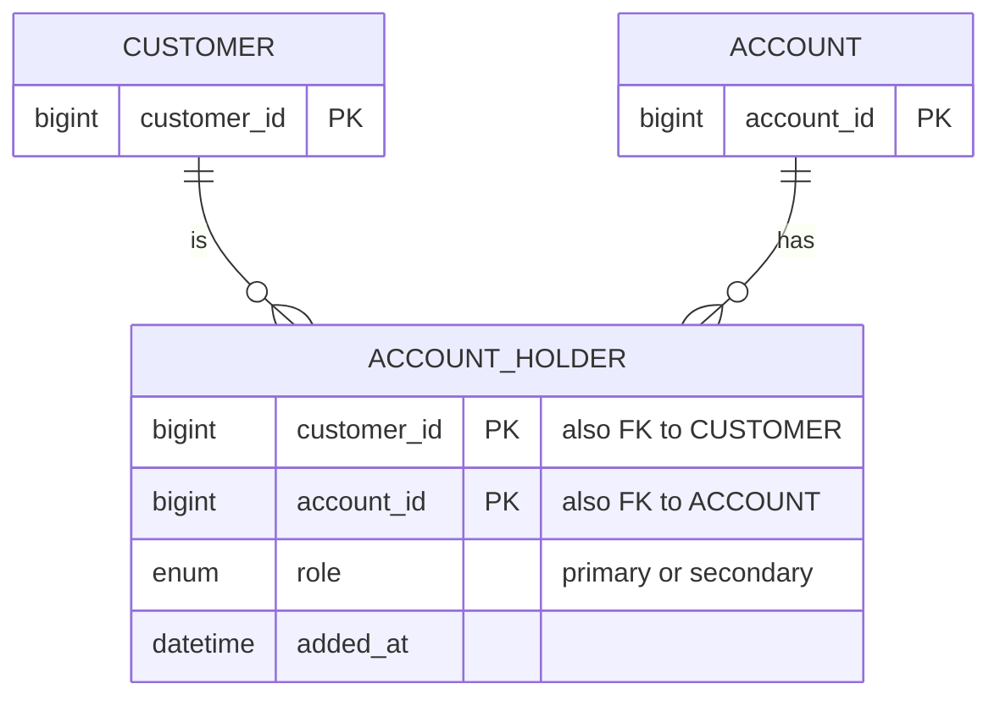
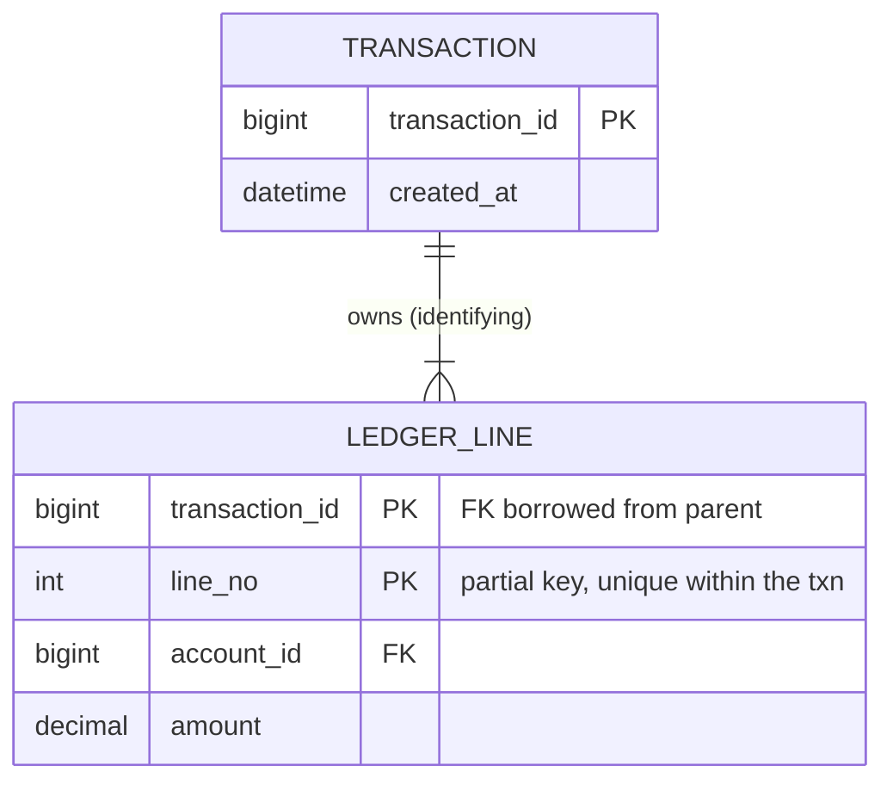
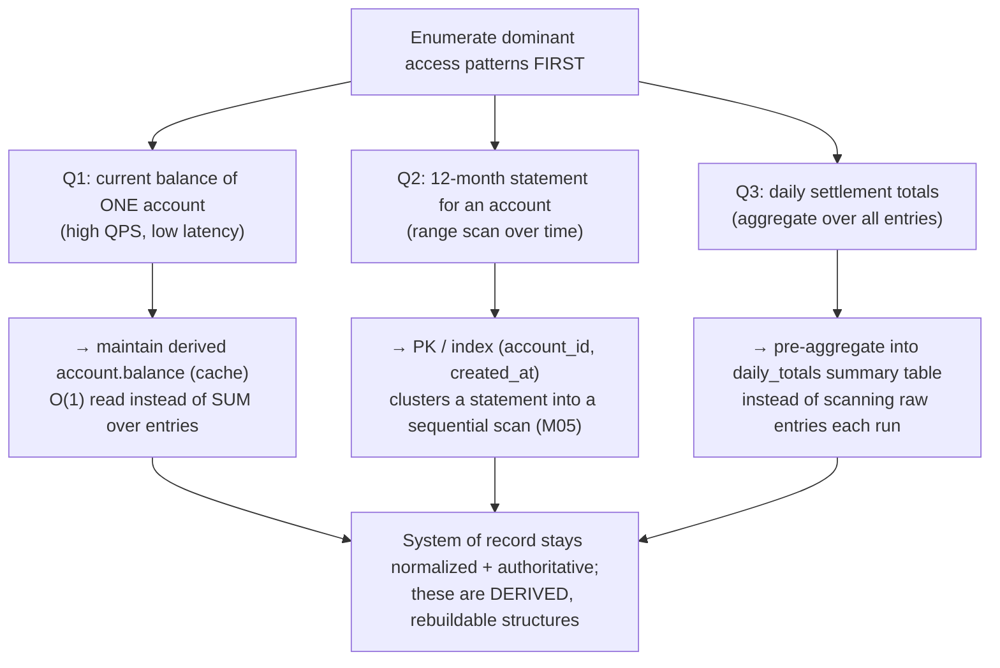

# M01 · Pass C — Diagrams & Worked Examples · Concepts 1.9–1.14

> Pass C scope: **#12 Diagram(s)** + **#8 Worked example** (narrated). Pairs with `02-modeling-and-er.md`. ER diagrams: **crow's-foot**. Domain: payments/wallet.

---

## 1.9 · Conceptual → logical → physical modeling

**Diagram — the three-altitude pipeline:**

**Worked example — "customer holds accounts" at all three altitudes.**
*Conceptual:* on a whiteboard with a product manager you draw two boxes, `Customer` and `Account`, and a line "holds." You confirm the business truth: a customer can hold several accounts; an account has at least one owner. No column names, no types — just the shape, validated by someone who knows the domain.
*Logical:* that becomes relations: `customer(customer_id PK)`, `account(account_id PK, customer_id FK NOT NULL)`. The "holds" line resolved into a foreign key on the *many* side (1.11). Still nothing MySQL-specific — this schema is portable to Postgres unchanged.
*Physical:* now MySQL reality lands. `customer_id`/`account_id` become `BIGINT` (or time-ordered IDs, 1.15); the PK is chosen knowing InnoDB will cluster on it (M05); you add a secondary index on `account.customer_id` because "all accounts for a customer" is a hot query (1.14); you pick InnoDB; you anticipate sharding by customer later (M11). **The same idea, refined three times** — and notice you could re-tune the physical layer (add an index, change a type) without touching the conceptual truth.

---

## 1.10 · Entities, attributes & relationships (ER modeling)

**Diagram — crow's-foot primer (the running domain's core entities):**

**Worked example — turning a sentence into entities, attributes, relationships.**
Take the business sentence: *"A customer (with a legal name and KYC status) holds accounts, each in a currency, and each account records transactions that happen at a time and have a type."* Mechanically decompose it. **Nouns you keep data about → entities:** Customer, Account, Transaction. **Their details → attributes:** Customer.legal_name, Customer.kyc_status; Account.currency, Account.status; Transaction.created_at, Transaction.type. **Verbs connecting them → relationships:** customer *holds* account, account *records* transaction. Already the act of drawing it forces precision the sentence hid: *how many* accounts per customer, and must an account have an owner? (→ cardinality/optionality, 1.11). One subtle catch the decomposition surfaces: if "a customer has *phone numbers*" (plural) came up, "phone numbers" is a **multi-valued attribute** — a signal it can't be a single column and needs its own child table (foreshadowing 1NF, M02). ER modeling is exactly this disciplined noun/verb/detail extraction, made visual so a domain expert can catch a wrong assumption before it's `CREATE TABLE`.

---

## 1.11 · Cardinality & optionality

**Diagram — crow's-foot cardinality/optionality cheat sheet:**

**Worked example — reading a relationship off the diagram, then placing the key.**
The line `CUSTOMER ||--o{ ACCOUNT` reads, symbol by symbol: next to ACCOUNT is the crow's foot (many) → a customer relates to *many* accounts; next to CUSTOMER is the double bar (exactly one) → an account relates to *exactly one* customer. That single line dictates the physical schema: because it's **one-to-many**, the foreign key goes on the **many side** — `account.customer_id` — and because the account's participation is *mandatory* ("exactly one" owner), that FK is **NOT NULL**. Now suppose the business later says "actually, joint accounts — an account can have *several* owners." The relationship was secretly **many-to-many**, and a single `customer_id` FK can no longer represent it; you're forced into a painful migration to a junction table (1.12). That's the costly-mistake the concept warns about: getting cardinality wrong isn't a cosmetic error, it's a schema you have to rebuild. Reading the crow's-foot symbols correctly *is* deciding where keys live and whether columns can be NULL.

---

## 1.12 · Associative (junction) tables & many-to-many

**Diagram — M:N resolved via a junction (joint accounts):**

**Worked example — a joint account, and the second index you'll forget.**
Two customers, Alice and Bob, jointly own one savings account. You cannot model this with a `customer_id` on `account` (that's one owner) or an `account_id` on `customer` (that's one account) — it's genuinely **many-to-many**, so you manufacture `account_holder`, one row per (customer, account) pairing: (Alice, acct-9), (Bob, acct-9). Its **composite PK `(customer_id, account_id)`** does double duty — it's the key *and* it forbids accidentally adding Alice twice. The junction also becomes the natural home for **attributes of the relationship itself**: Alice's `role` = primary, Bob's = secondary, each with an `added_at` — data that belongs to the *pairing*, not to Alice or to the account alone. Now the easy-to-miss part (1.12 MySQL reality): the composite PK `(customer_id, account_id)` efficiently answers *"which accounts does Alice hold?"* (leftmost-prefix, M05) but **not** *"who holds account-9?"* — that reverse query needs a **second index `(account_id, customer_id)`**. A junction queried from both directions almost always needs that extra index, and forgetting it turns "list the holders of this account" into a full scan. This is "model for your queries" (1.14) biting inside the very structure that resolved the M:N.

---

## 1.13 · Weak entities & identifying relationships

**Diagram — strong owner vs weak dependent (transaction → line):**

**Worked example — "line 2" only means something inside its transaction.**
A transfer transaction `T-500` produces two ledger lines: line 1 (debit account A, −100) and line 2 (credit account B, +100). Ask "what is line 2?" globally and it's meaningless — every transaction has a line 2. The line's identity is inherently **relative to its parent**: it's "line 2 *of T-500*." So `ledger_line` is a **weak entity** with a **composite primary key `(transaction_id, line_no)`** — `line_no` alone isn't unique, but the pair is, and the key *borrows* the parent's `transaction_id`. This is an *identifying* relationship (the child's identity includes the parent's), distinct from the plain 1:N FK in 1.11 where the child had its own independent key. Two practical payoffs in MySQL: (1) the composite PK starts with `transaction_id`, so InnoDB **clusters all of a transaction's lines physically together** — fetching the whole transaction is one sequential read, a genuine performance win (1.13 MySQL reality); (2) the pattern makes the rule "line numbers are unique within a transaction" *structural*. In practice many teams still bolt on a surrogate `id` for convenience while keeping `UNIQUE(transaction_id, line_no)` — preserving the invariant without paying the composite-key tax in every referencing table.

---

## 1.14 · Designing for the queries you'll run

**Diagram — access patterns drive the model:**

**Worked example — the same domain, two access patterns, two shapes.**
Same `account` + `ledger_entry` domain, two very different needs:
- *Need A — "show this account's current balance" on every app screen, thousands of times a second.* Deriving it as `SUM(amount)` over a growing entry log gets slower forever. So you **denormalize**: keep `account.balance` as a derived column, updated transactionally alongside each entry insert (1.17). Reads are O(1). The entry log stays the source of truth; the balance is a cache reconciled against it (M16).
- *Need B — "produce a 12-month statement for an account."* This is a **range scan over time within one account**. If your `ledger_entry` clustered primary key is `(account_id, created_at, …)`, all of that account's entries for that period sit *physically adjacent* on disk, and the statement is one sequential read (M05/M09). If instead the PK were a random UUID (1.15), those same entries are scattered across the whole index and the statement becomes thousands of random IO hits.

Two equally-normalized models, but the *physical* choices (a derived column; a query-shaped clustered key) make the difference between fast and unusable. And the discipline holds: the authoritative ledger stays normalized; `balance` and any `daily_totals` summary are **derived and rebuildable**, never the source of truth. This query-first loop — *write the query → EXPLAIN it → adjust schema/indexes → repeat* — is the spine of M05–M06.

---

*Diagrams + worked examples for 1.9–1.14 complete. Next Pass C file: 1.15–1.19 (keygen matrix, bitemporal timeline, event-fold, anti-pattern catalog, and the ★ money-model ER).*
