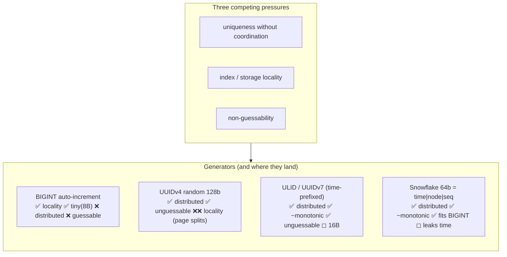
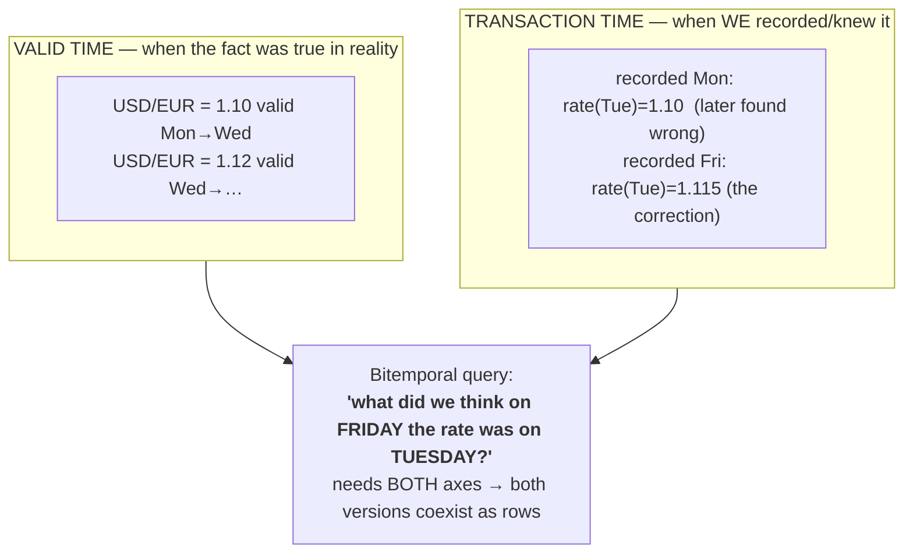
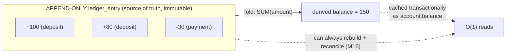
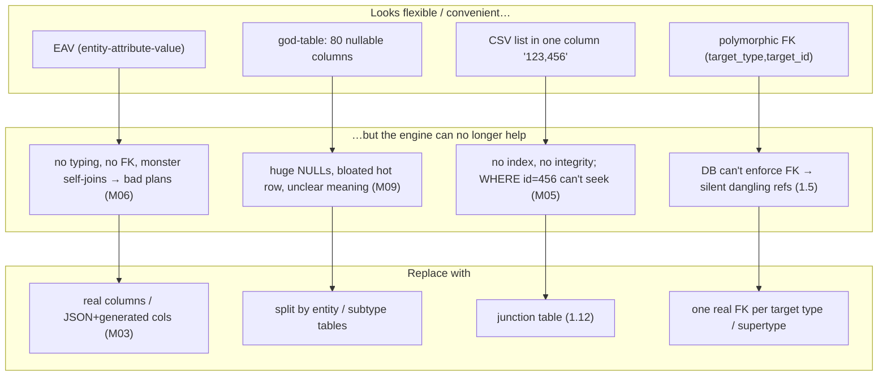
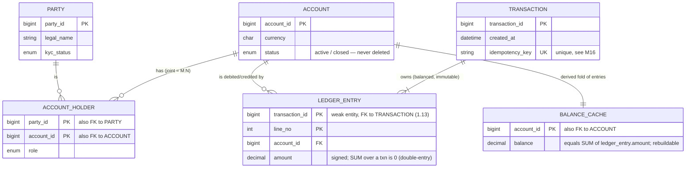

# M01 · Pass C — Diagrams & Worked Examples · Concepts 1.15–1.19

> Pass C scope: **#12 Diagram(s)** + **#8 Worked example** (narrated). Pairs with `03-deeper-keygen-temporal-antipatterns-money.md`. Includes the **★ bespoke money-model ER** (1.19), drawn once here and reused in M16. Domain: payments/wallet.

---

## 1.15 · Surrogate-key generation strategies

**Diagram — generator comparison matrix:**

**Worked example — the random-PK insert that thrashes the B-tree.**
You pick `UUIDv4` as the primary key of your ever-growing `ledger_entry` table, stored (worse) as `CHAR(36)`. Because InnoDB clusters rows by primary key (1.3), each new entry's key is *random*, so each insert lands at a random point in the clustered index — not at the end. The consequences cascade: pages that were full must **split** to make room mid-tree (fragmentation, wasted space), the "hot" set of pages being written is scattered across the entire index so it won't fit in the buffer pool (M09) and you start hitting disk on writes, and the 36-byte string key is embedded into *every secondary index* (1.3), bloating all of them. Insert throughput on the highest-volume table in a payments system quietly collapses as it grows. Swap to **BIGINT auto-increment** (or a **time-ordered ULID/UUIDv7 stored as BINARY(16)** if you need distributed/unguessable IDs) and every insert appends to the *right edge* of the index — sequential, cache-friendly, no splits. Same logical "surrogate key," wildly different physics. This is precisely why the surrogate-*generation* choice is a performance decision in MySQL, revisited in depth in M05/M09.

---

## 1.16 · Temporal & bitemporal modeling

**Diagram — valid-time vs transaction-time (two axes):**

**Worked example — the FX rate that was corrected after the fact.**
On Tuesday your system records the USD/EUR rate as **1.10** and posts conversions using it. On Friday, a data-provider correction arrives: the rate on Tuesday was actually **1.115**. Now two very different questions both have legitimate answers:
- *"What was the rate on Tuesday?"* (valid time) → **1.115**, the corrected truth.
- *"What did we believe on Tuesday, when we posted those conversions?"* (transaction time) → **1.10**, what we acted on.

If you'd simply **overwritten** 1.10 with 1.115, the second question becomes unanswerable — you can no longer explain or audit why Tuesday's conversions used 1.10, which in a regulated context is a compliance failure. **Bitemporal** modeling keeps *both* rows: the originally-recorded value (valid Tue, recorded Mon→Fri) and the correction (valid Tue, recorded Fri→now), each carrying its own `valid_from/valid_to` and `recorded_from/recorded_to`. You can now reconstruct *what was true* and *what we knew, when* — independently. MySQL has no native support for this (1.16 MySQL reality), so you model it by hand with those four columns and **append-on-change instead of UPDATE**, accepting that "no overlapping valid periods for one currency pair" usually needs application enforcement rather than a simple UNIQUE.

---

## 1.17 · Modeling history: append-only vs mutable state

**Diagram — fold an immutable event log into current state:**

**Worked example — balance-as-column vs balance-as-fold.**
Two ways to keep a wallet's balance:
- *Mutable state:* a single `account.balance` column you `UPDATE` on each change. Reads are instant, but the moment you set it to 150 you've **destroyed** the fact that it was 100 then 180 then 150 — there's no history, and two concurrent updates can race and lose one (the lost-update problem, M07/M08).
- *Append-only:* you only ever **INSERT** signed entries (+100, +80, −30) and the balance is the **fold** `SUM(amount) = 150`. You now have a perfect, ordered, auditable history for free — you can answer "how did we get to 150?" and replay to any point in time — at the cost of computing the sum.

The production answer is the **hybrid**: the append-only log is the *system of record*, and you *also* maintain `account.balance` as a derived cache, updated **in the same transaction** as each entry insert so they can't diverge. Fast reads from the cache; integrity and audit from the immutable log; and the log can always rebuild the cache, with reconciliation (M16) continuously checking they agree. The beautiful mirror (1.17 MySQL reality): InnoDB *itself* works this way internally — its **redo log is an append-only WAL** and current pages are derived by applying it (M09). "Logs are primary, state is derived" is true of your ledger *and* of the engine underneath it.

---

## 1.18 · Data-modeling anti-patterns ★

**Diagram — anti-pattern → why it rots → fix:**

**Worked example — the polymorphic FK that loses money (★ money-never-lies).**
To "save tables," someone models attachments/notes generically and extends the idea to a `transactions` table with a **polymorphic reference**: `(source_type, source_id)` where `source_type` ∈ {'card', 'bank', 'crypto'} names *which* table `source_id` lives in. It feels elegant — one column pair handles every funding source. But the database **cannot create a real foreign key** here: it has no way to know that `source_id` should exist in `card_account` when `source_type='card'`. So referential integrity is simply *gone*. A bug, a race, or a deleted card row leaves a transaction pointing at a `source_id` that no longer exists — a **dangling reference the engine never stopped** (contrast 1.5, where a real FK would reject it). In a payments system that's a transaction attributed to a funding source that isn't there: money you can't trace. The fix restores the engine's help: **one real, nullable FK column per source type** (`card_account_id`, `bank_account_id`, each a genuine FK with a CHECK that exactly one is set), or a supertype `funding_source` table the others reference. More columns/tables, yes — but every reference is now guaranteed to point at something real. The anti-pattern's whole cost is summarized by the generic: *flexibility bought by hiding structure from the database is integrity the database can no longer keep for you.*

---

## 1.19 · Fintech capstone — modeling a money system ★ (bespoke)

**★ Diagram — the canonical money-model (drawn once; reused in M16):**

**Worked example — model a wallet, double-entry-ready (the seed of M16).**
Alice transfers **100 USD** to Bob. Watch the canonical model absorb it correctly:
1. One **`transaction`** row `T-700` is created, carrying an `idempotency_key` so a retry can't double-post it (1.2's duplicate hazard; full treatment in M16).
2. `T-700` owns **two immutable `ledger_entry` lines** (it's the strong entity; entries are the weak entity, 1.13): line 1 = **−100 against Alice's account**, line 2 = **+100 against Bob's account**. Their amounts **sum to zero** — that's **double-entry**, and it makes "money is neither created nor destroyed" a *structural* invariant, not a thing application code remembers to check.
3. Both accounts' **`balance_cache`** rows are updated **in the same transaction** as the entries (1.17 hybrid), so reads stay O(1) and the cache can never silently drift from the log; reconciliation (M16) continuously verifies `balance == SUM(entries)`.
4. Nothing is ever deleted: if Alice closes her account it's *status = closed* (1.6 RESTRICT/soft-delete), her entries remain forever as the audit record.

In that one transfer, the model exercised almost the whole module: surrogate keys (1.4/1.15), FKs with RESTRICT-not-CASCADE (1.5/1.6), the duplicate/idempotency hazard (1.2), domains/constraints on amount and currency (1.8), the M:N junction for joint accounts (1.12), the weak-entity ledger lines (1.13), query-shaped derived balance (1.14/1.17) — and it *avoided* the anti-patterns (1.18: a real FK per account, no polymorphic source, no CSV of entries). **MySQL reality** ties it together: post all entries + balance updates in one **InnoDB transaction** (M07) so the transfer is atomic; choose `ledger_entry (account_id, created_at, line_no)` clustering for fast statements (1.14/M05); store `amount` as **DECIMAL or integer minor units, never FLOAT** (M03 — floating point silently loses cents); keep keys compact/time-ordered (1.15) for the unbounded ledger (M09); and plan partitioning/archival as it grows (M11). This diagram and example are the literal **seed that M16 grows into a full payments-platform design.**

---

*Diagrams + worked examples for 1.15–1.19 complete. **M01 Pass C is fully drafted (all 19 concepts).** Remaining for M01: Pass D — code-specifics boxes, failure modes & gotchas, fintech lens, interview/SD angle, and self-check questions (contract #7, #9, #10, #11).*
