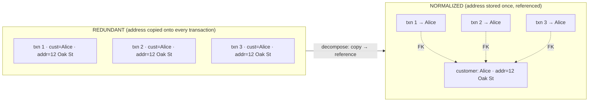
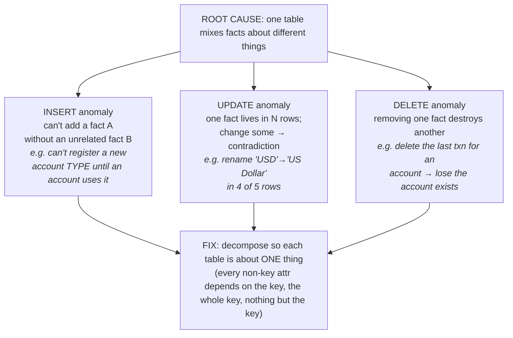
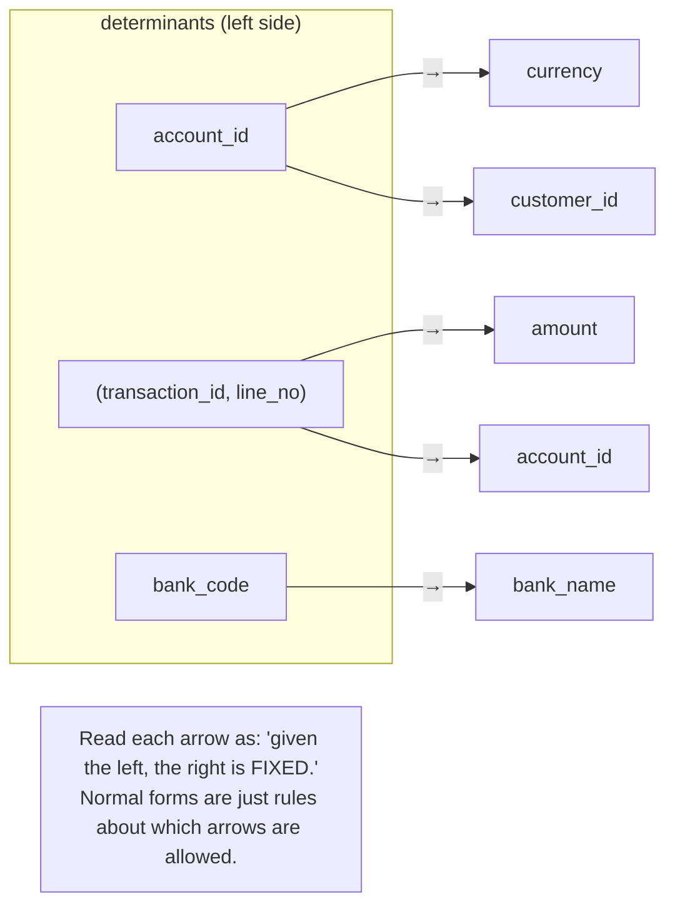
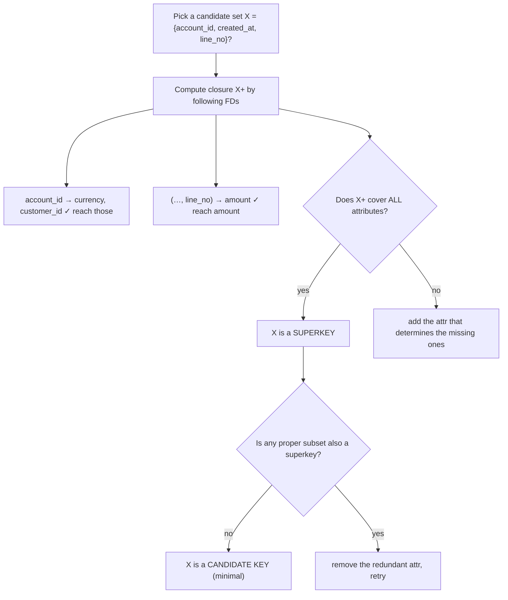
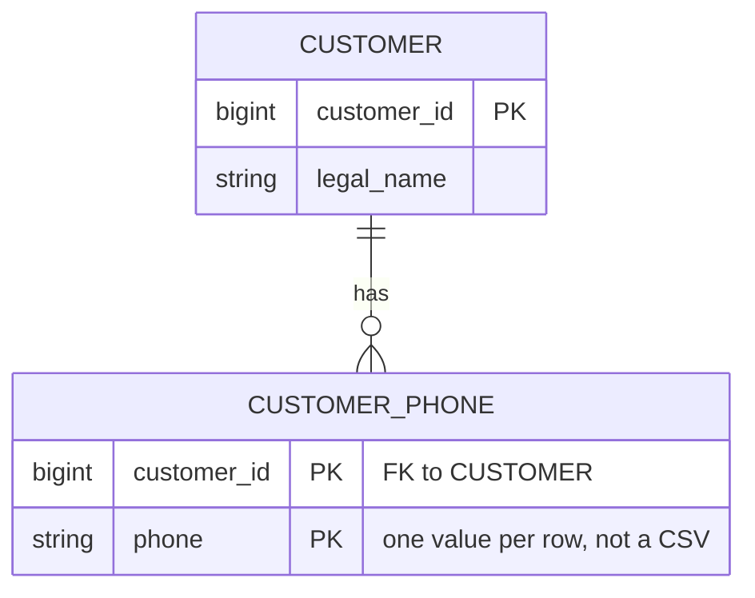
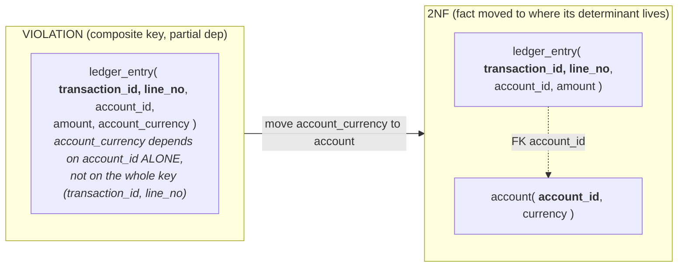
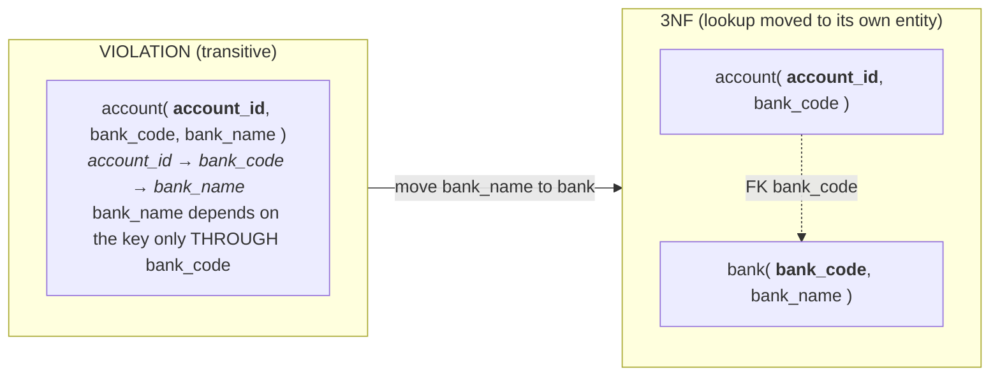
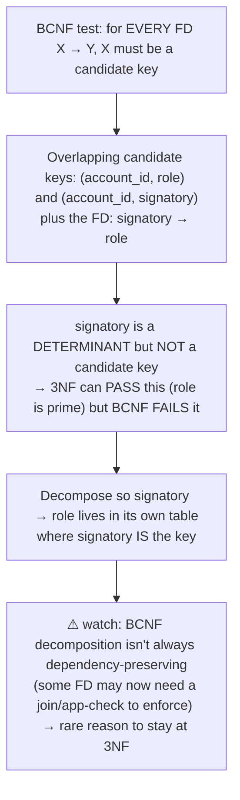

# M02 · Pass C — Diagrams & Worked Examples · Concepts 2.1–2.8

> **Pass C scope:** content-contract items **#12 Diagram(s)** and **#8 Worked example** (narrated, no code in prose). Pairs with `01-redundancy-fds-1nf-bcnf.md`. ER diagrams use **crow's-foot**; dependency diagrams use FD arrows. Domain: payments/wallet, with the deliberately-messy `payment_record` table as the recurring teaching vehicle.

---

## 2.1 · Why normalize? The cost of redundancy

**Diagram — one redundant table → split tables (fact stored once):**

**Worked example — the address that becomes two truths.**
Alice's mailing address is copied onto every one of her transaction rows. She moves, and a support agent updates her address — but the update only touches transactions from the last 90 days (that was the query they ran). Now the database holds **two contradictory addresses for one person**, and there is no field that says which is current. Nothing was "wrong" in any single row; the corruption is *between* rows, born purely from the duplication. Normalize it — store the address once on the `customer` row, have transactions reference the customer — and the contradiction becomes **structurally impossible**: there's exactly one place the address lives, so "update Alice's address" is one write that can't be partially applied. The redundancy didn't just waste space; it created the *capacity to disagree*, and removing it removed that capacity. (The reads now pay a join — the tradeoff this whole module is about.)

---

## 2.2 · The three update anomalies

**Diagram — the anomaly triptych (one root cause, three symptoms):**

**Worked example — all three, in one bad `payment_record` table.**
Picture a single wide `payment_record` table that stores, per row: the transaction, the account, the account's type and its human label, and the customer's name. Watch all three anomalies appear:
- **Insert:** Product wants to launch a new account type, "escrow," *before* any escrow account exists. But the only place account-type labels live is on `payment_record` rows — and there are no escrow rows yet. You **can't record the new type at all** without inventing a fake transaction. The schema won't let you state an independent fact.
- **Update:** The label for type "savings" is being changed to "Savings Account." It's copied on thousands of rows. A migration updates most of them but times out partway. Now some rows say "savings" and some say "Savings Account" — the database **disagrees with itself** about what one code means.
- **Delete:** An account has exactly one transaction, and it gets reversed and the row deleted for cleanup. That row was the *only* place the account's existence and type were recorded — so deleting the transaction **silently erases the account**. A fact (the account exists) was destroyed as collateral damage of deleting an unrelated fact (a transaction).

Decompose — `account_type` table, `account` table, `customer` table, `transaction`/`ledger_entry` table, each about one thing — and all three vanish simultaneously, because no fact is entangled with another anymore. This same messy table is the one we climb the full ladder with in 2.10.

---

## 2.3 · Functional dependencies (FDs)

**Diagram — FD arrows over the attribute set:**

**Worked example — reading the domain as dependencies.**
Before touching any normal form, you write down what your domain *guarantees*, as arrows:
- `account_id → currency` — an account has exactly one currency (no account is simultaneously USD and EUR). True fact about the business.
- `account_id → customer_id` — an account has exactly one owning customer. (If joint accounts make this false, that's an MVD, not an FD — 2.9. Spotting *that* is why FDs matter.)
- `(transaction_id, line_no) → amount` — a specific line of a specific transaction has one amount.
- `bank_code → bank_name` — a bank code determines the bank's name.

These arrows *are* your normalization plan. The rule the whole ladder enforces is "**every determinant should be a key**" (that's literally BCNF, 2.8). So you immediately scan the arrows: is `bank_code` a key of `payment_record`? No — so `bank_code → bank_name` sitting in that table is a transitive-dependency smell (2.7) you'll need to fix. Notice the discipline: you didn't guess "this looks redundant"; you wrote the FDs and *derived* where the redundancy must be. And the danger the example also shows: if you assert a false FD — say `zip → city` (which has real-world exceptions) — you'll "correctly" normalize around a rule that doesn't hold and build a wrong schema. FDs are a *model of the domain*; their correctness is on you.

---

## 2.4 · Keys, revisited through FDs

**Diagram — FD closure → candidate key:**

**Worked example — finding the key of a table you don't understand.**
You inherit the wide `payment_record` table with no documentation and need its real key. Eyeballing fails (too many columns), so you do it by closure. You list the FDs you can establish from the domain, then test a candidate set: start with `{transaction_id, line_no}`. Compute its closure — `(transaction_id, line_no) → amount, account_id`; then `account_id → currency, customer_id`; chaining, you reach `currency`, `customer_id`, and onward. If following every arrow from `{transaction_id, line_no}` eventually reaches **every** attribute, it's a superkey; check that neither `transaction_id` nor `line_no` alone suffices (they don't — a transaction has many lines, a line_no repeats across transactions), so the pair is **minimal → a candidate key.** You've now *derived* the key rather than assumed it, and in doing so you've found the **prime attributes** (`transaction_id`, `line_no`) versus the **non-prime** ones (`amount`, `currency`, `bank_name`, …) — which is exactly the vocabulary 2NF and 3NF are stated in. This closure procedure is rarely needed on a clean table, but it's the only reliable way to untangle a legacy mess (and a classic interview exercise).

---

## 2.5 · First Normal Form (1NF): atomic values

**Diagram — repeating group / list → child rows:**

**Worked example — the CSV column that can't be queried.**
The original `customer` table stores `phone_numbers = "555-0101,555-0102"` in one `VARCHAR`. It looks compact, but every operation the relational model offers is now broken: you can't index an individual number (so "which customer owns 555-0102?" is a full-table scan with a `LIKE '%555-0102%'` that even matches it as a substring of another number), you can't put a UNIQUE constraint on a single number, you can't FK to it, and counting numbers means parsing strings. The value isn't *atomic* — it's a smuggled list, invisible to the engine. The 1NF fix: a `customer_phone` child table, one row per number, keyed by `(customer_id, phone)`. Now each number is a first-class element — indexable, constrainable, joinable, countable. **The nuance worth stating:** "atomic" is relative to how you query — if you genuinely only ever displayed the phone blob and never searched inside it, a JSON column (M03) would be a *sanctioned* exception (queried-as-a-whole, indexable via generated columns). The line is: data you query *into* must be rows; data you fetch *as a unit* may be a structured blob. A CSV is the worst of both — opaque to queries yet pretending to be structured.

---

## 2.6 · Second Normal Form (2NF): no partial dependencies

**Diagram — pull the partially-dependent attribute out:**

**Worked example — the currency parked on the wrong key.**
A `ledger_entry` table has the composite key `(transaction_id, line_no)` and, for "convenience," also stores `account_currency` on every line. But `account_currency` is determined by `account_id` — i.e., by the *account*, which is only *part* of what the row is keyed on. That's a **partial dependency**: the attribute depends on a piece of the key, not the whole key. The cost is concrete redundancy: every single line of every transaction touching account #42 repeats "USD," so a (rare but possible) currency redenomination, or simply a data fix, must touch thousands of line rows — the update anomaly (2.2), and a real one on a high-volume table. The 2NF fix moves `currency` to the `account` table where its true determinant (`account_id`) *is* the key, and `ledger_entry` references it by FK. **MySQL payoff (worth noting in the example):** removing `account_currency` from the line table shrinks the InnoDB clustered row, so more lines fit per page and every secondary index that included it gets smaller — 2NF normalization here is *also* a storage/IO win on your hottest table (M09). This is why 2NF earns its own concept: the partial-dependency smell lives exactly on composite-key tables, which in fintech are the line-item/junction tables.

---

## 2.7 · Third Normal Form (3NF): no transitive dependencies

**Diagram — break the transitive chain key → A → B:**

**Worked example — why does the account row know the bank's name?**
The `account` table carries `bank_code` (fine — an account belongs to one bank) but *also* `bank_name`. The dependency chain is `account_id → bank_code → bank_name`: the bank's name depends on the account only **transitively**, via the bank code. The tell is a question that sounds slightly wrong said aloud: "*why does an account row store the bank's name?*" It's a fact about the **bank**, parked on the **account**. The redundancy: every account at "Barclays / code BARC" repeats "Barclays," so renaming the bank means updating every account row (update anomaly, again). The 3NF fix: a `bank(bank_code, bank_name)` table; `account` keeps `bank_code` as an FK. A bank rename is now **one row**. **The deliberate-exception nuance (the senior point):** sometimes you'd *keep* `bank_name` on `account` on purpose — if a hot read path shows the bank name and you've measured the lookup join as too slow. That's fine — *if* it's a conscious denormalization (2.12) with a sync plan, not an accidental transitive dependency you never noticed. And in MySQL the first thing to try before denormalizing is a **covering index** (M05) that serves `bank_name` from the index without a row lookup — often eliminating the join cost while *staying* in 3NF.

---

## 2.8 · Boyce-Codd Normal Form (BCNF): every determinant is a key

**Diagram — the 3NF-but-not-BCNF loophole:**

**Worked example — the overlapping-keys case 3NF lets slip.**
Consider a table linking accounts, their authorized **signatories**, and each signatory's **role**, where the business rule is: *a signatory has exactly one role* (`signatory → role`), and the candidate keys are `(account_id, signatory)` and (because roles are limited) the data also yields overlapping key structure involving `role`. Here `signatory` is a **determinant** (it fixes `role`) but `signatory` alone is **not a candidate key** of the table. **3NF can pass this** — its definition has an exception that permits a dependency *into* a prime attribute — yet the redundancy is real: a signatory who appears on five accounts has their role repeated five times, and changing that role means five updates (update anomaly that "3NF-compliant" didn't stop). **BCNF's cleaner rule catches it immediately**: *every determinant must be a key*, and `signatory` isn't, so the table fails BCNF. Fix: split `signatory → role` into its own `signatory(signatory_id, role)` table where `signatory` *is* the key; the link table keeps `signatory` as an FK. **The tradeoff the diagram flags:** occasionally a BCNF split makes some FD only checkable via a join (non-dependency-preserving) — the rare, legitimate reason to consciously *stay* at 3NF for one table and enforce the FD another way (app check / trigger / approximating UNIQUE). Default to BCNF; fall back to 3NF only with that specific reason. BCNF violations are uncommon (they need overlapping candidate keys), but naming this loophole is exactly the kind of thing that signals depth in an interview.

---

*Diagrams + worked examples for 2.1–2.8 complete. Next Pass C file: 2.9–2.11 (MVD fan-out, the ★ full ladder on `payment_record`, where-to-stop).*
