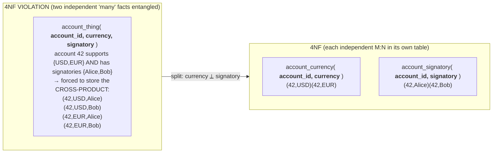
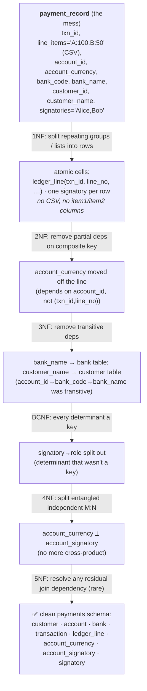
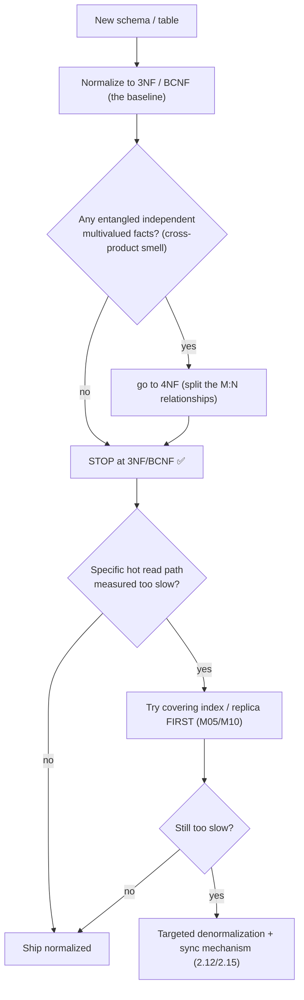

# M02 · Pass C — Diagrams & Worked Examples · Concepts 2.9–2.11

> Pass C scope: **#12 Diagram(s)** + **#8 Worked example** (narrated). Pairs with `02-higher-forms-ladder-target.md`. Includes the **★ full-ladder visual** taking the messy `payment_record` table 1NF→5NF. Domain: payments/wallet.

---

## 2.9 · Higher normal forms (4NF, 5NF): multivalued & join dependencies

**Diagram — MVD fan-out → two clean tables:**

**Worked example — the cross-product that explodes.**
Account #42 is multi-currency (it supports USD and EUR) and has two authorized signatories (Alice and Bob). Someone models all of this in one `account_thing(account_id, currency, signatory)` table. Because currency and signatory are **independent** — Alice isn't tied to USD, Bob isn't tied to EUR; any signatory can act in any currency — the table is forced to store **every combination**: (42, USD, Alice), (42, USD, Bob), (42, EUR, Alice), (42, EUR, Bob). That's 2×2 = 4 rows to express what is really just "2 currencies and 2 signatories." Now add a third currency (GBP): to keep the cross-product complete you must insert it paired with *every* signatory — two new rows for one new fact. That "add one value → insert N rows" pain is the **4NF/MVD smell**, and the cross-product is pure redundancy BCNF can't see (it's not a functional dependency — currency doesn't *determine* signatory). The 4NF fix splits the two independent relationships into their own junction tables: `account_currency(account_id, currency)` and `account_signatory(account_id, signatory)`. Adding GBP is now **one row**. **The practical punchline:** if you'd just modeled each many-to-many as its own junction table from the start (M01/1.12), you'd have been in 4NF automatically and never met an MVD. You learn 4NF mainly to *diagnose* a legacy table that mashed two M:N relationships together — and to name it in interviews. (5NF — the join-dependency case needing a 3-way split — is rarer still; the formal box in Pass B has it.)

---

## 2.10 · The normalization ladder, end to end ★

**★ Diagram — climbing the messy `payment_record` table rung by rung:**

**Worked example — one table, all the way up.**
Start with the deliberately-awful `payment_record` from 2.2 — it crams a CSV of line items, the account and its currency, the bank code *and* name, the customer id *and* name, and a CSV of signatories, all in one row. Climb:
1. **→1NF:** kill the smuggled lists. The `line_items` CSV becomes `ledger_line` rows (one per line, a weak entity, M01/1.13); the `signatories` CSV becomes one row per signatory. Every cell is now atomic — the relational operators can finally see the data.
2. **→2NF:** the key of a line is composite `(transaction_id, line_no)`, and `account_currency` depends only on `account_id` (part of the key's reach, not the whole key) → move currency to where `account_id` is the key.
3. **→3NF:** `bank_name` depends on the key only through `bank_code`, and `customer_name` only through `customer_id` — both transitive → split out `bank` and `customer` tables.
4. **→BCNF:** `signatory → role` has a determinant (`signatory`) that isn't a key → split into a `signatory` table.
5. **→4NF:** the account's currencies and its signatories are independent M:N facts that were entangled → separate `account_currency` and `account_signatory` junctions (no cross-product).
6. **→5NF:** check no residual join dependency forces a spurious-row problem (here, none) → done.

The output is the clean payments schema: `customer`, `account`, `bank`, `transaction`, `ledger_line`, `account_currency`, `account_signatory`, `signatory` — and *every anomaly from 2.2 is gone*, because no table is about more than one thing anymore. The point the climb makes viscerally: the six normal forms aren't six rules to memorize — they're **one question** ("does every fact depend on the whole key and nothing but a key?") asked at finer and finer resolution, and each rung is a lossless decomposition you could rejoin to recover the original. This is also the physical hand-off to M01/1.9: now you assign types (M03), clustered PKs, and the secondary indexes the new joins need (M05).

---

## 2.11 · "3NF is usually enough" — the practical target

**Diagram — how far to climb (decision note):**

**Worked example — knowing when to stop, both directions.**
You're designing the OLTP core of the payments system. You climb to **3NF/BCNF** as the baseline — that removes every FD-based redundancy (all the anomalies from 2.2). Then you check for the 4NF smell: are there independent multivalued facts entangled in one table (the currency-×-signatory cross-product)? You modeled currencies and signatories as separate junction tables from the start, so you're already in 4NF — **stop climbing.** You do *not* hunt for 5NF; it's not justified here. That's the "don't over-normalize" half: pushing further would add tables and joins to remove redundancy that doesn't exist.

Now the other direction. The balance-display screen needs an account's balance on every page load, thousands of times a second; in the pure normalized schema that's `SUM` over a growing `ledger_entry` log. You **measure** it (EXPLAIN + profiling, M06) and confirm it's too slow at scale. Before denormalizing you try the cheaper move — could a covering index or a read replica fix it? For a `SUM` over an unbounded log, no index makes it O(1). *Only now*, with measurement in hand and cheaper options exhausted, do you denormalize: a derived `account.balance` maintained transactionally (2.14/2.17) with reconciliation. That's the "don't under-normalize / don't denormalize prematurely" half — the denormalization is a **measured, deliberate exception**, not a default. The skill on display is calibration: 3NF/BCNF baseline, climb to 4NF only if the smell is present, step *down* to denormalized only on a measured hot path with a sync plan. Maximizing the normal-form number is not the goal; matching the schema to the workload is.

---

*Diagrams + worked examples for 2.9–2.11 complete. Next Pass C file: 2.12–2.17 (denormalization, seesaw, derived-projection flow, ★ sync-mechanism matrix, distributed joins, ★ ledger+balance money-model).*
