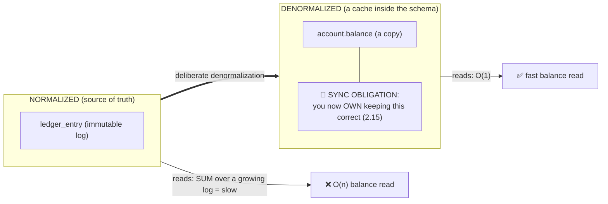
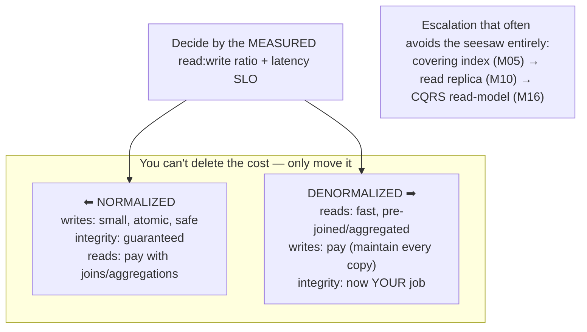
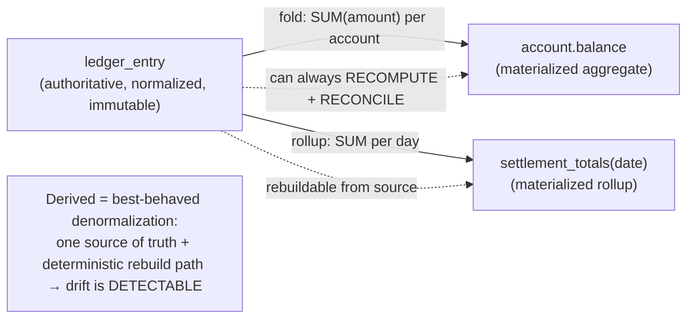
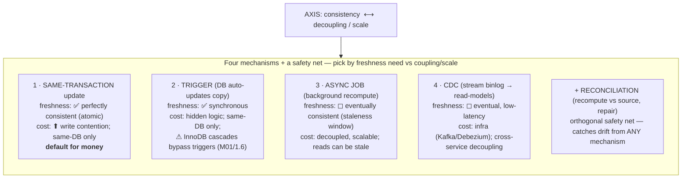
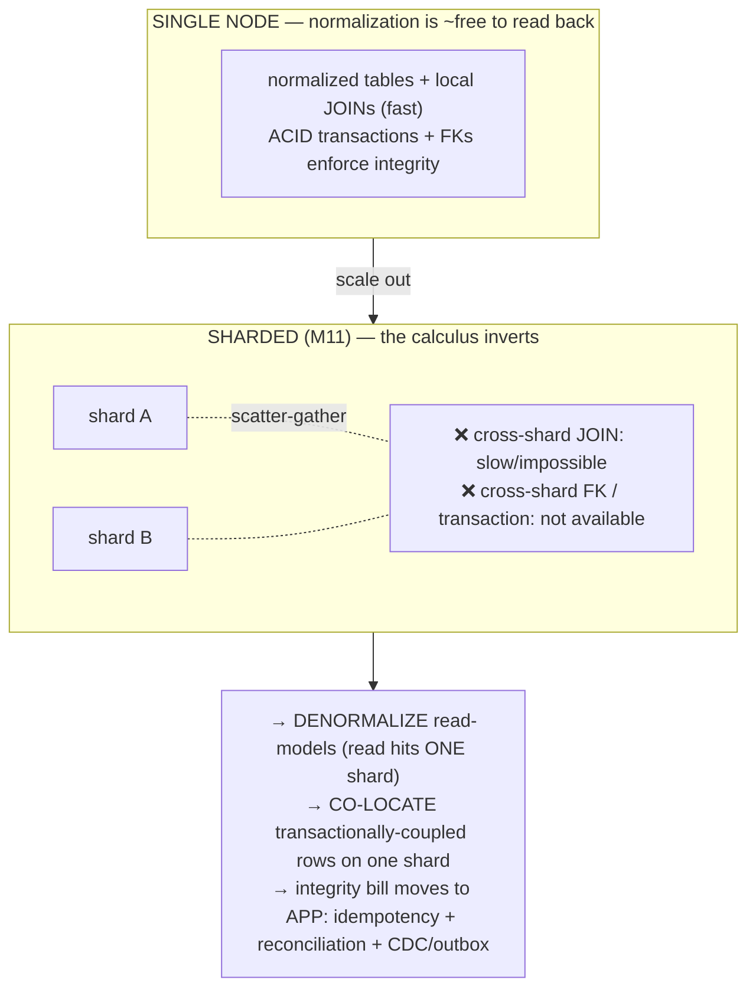
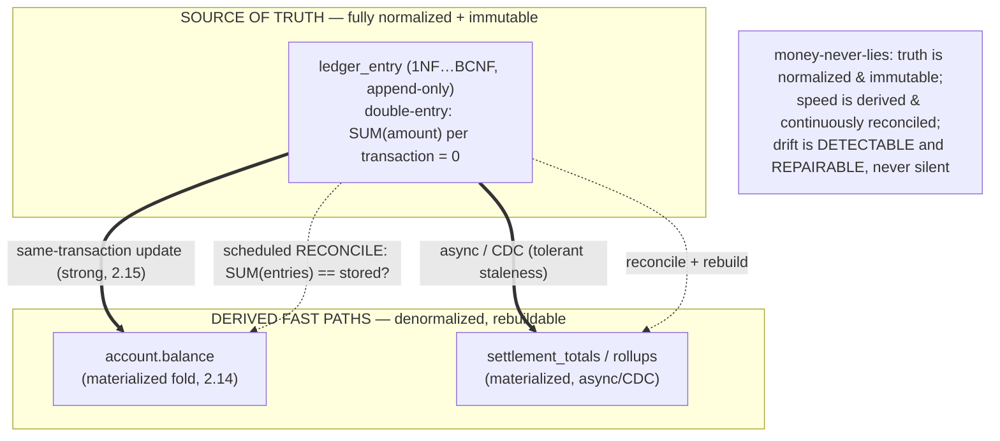

# M02 · Pass C — Diagrams & Worked Examples · Concepts 2.12–2.17

> Pass C scope: **#12 Diagram(s)** + **#8 Worked example** (narrated). Pairs with `03-denormalization-sync-distributed-capstone.md`. Includes the **★ sync-mechanism matrix** (2.15) and the **★ ledger+balance money-model** (2.17, reused in M16). Domain: payments/wallet.

---

## 2.12 · Denormalization: the deliberate reversal

**Diagram — normalized → denormalized, with the sync obligation tagged:**

**Worked example — escalating to denormalization the right way.**
The balance screen is slow. The *wrong* reflex is "joins/aggregations are slow, denormalize." The disciplined path, in order:
1. **Start normalized** — `ledger_entry` is the immutable source of truth; balance is `SUM(amount)`.
2. **Measure the actual problem** — `EXPLAIN` + profiling (M06) confirm the `SUM` over a million-row-and-growing log is genuinely too slow for a per-page-load read. (Measured, not assumed.)
3. **Try cheaper fixes first** — would a covering index help? For a running `SUM` over an unbounded log, no index makes it O(1); a replica (M10) moves the load but doesn't make the sum cheap. So indexes/replicas don't solve *this* one.
4. **Only now denormalize** — introduce `account.balance` as a derived copy, and *in the same breath* attach a sync mechanism (same-transaction update, 2.15) and a reconciliation check (2.17). The normalized log stays authoritative; the balance is explicitly *derived and rebuildable*.

The example's whole lesson is the red tag in the diagram: the moment you add that `balance` column you've taken on a **standing consistency debt**. Denormalization isn't free speed — it's speed bought with a promise. The senior move is to denormalize **last**, only on a measured path, and only with the sync/reconciliation already designed. (Contrast the junior move: denormalize first, discover the drift later in production as balances that lie.)

---

## 2.13 · Read vs write tradeoffs

**Diagram — the seesaw (you choose which side pays):**

**Worked example — same domain, opposite sides of the seesaw.**
Two access patterns in the same payments system land on opposite ends:
- **The ledger write path** — every transfer posts entries; correctness is non-negotiable; this is *write-heavy and integrity-critical*. You keep it **fully normalized**: small atomic writes, no copies to keep in sync, the double-entry invariant enforceable in one local transaction. Reads of raw entries do the work. *Left side of the seesaw.*
- **The balance display** — shown on every screen, thousands of reads per second, must be O(1); writes (new entries) are comparatively rare per account. This is *read-latency-critical*. You **denormalize** a derived `balance`, accepting extra write work and a sync obligation to buy the read speed. *Right side.*

Same schema, both choices correct — because the *workload* differs, not the aesthetics. And the diagram's escalation note is the real-world nuance: before committing to the right side, you ask whether a **covering index** (M05) captures the read win without a copy, whether a **read replica** (M10) sheds the load without touching the schema, or whether a separate **CQRS read-model** (M16) is warranted. Often one of those avoids the seesaw entirely. The framing to carry: every optimization *moves* cost; the job is to spend the abundant resource (here, the occasional extra write) to protect the scarce one (read latency) — never the reverse.

---

## 2.14 · Derived & materialized data

**Diagram — source of truth → derived projection (rebuildable):**

**Worked example — the daily rollup that's always provable.**
Finance needs end-of-day settlement totals per currency, fast, for a dashboard. Computing them live means scanning the entire day's `ledger_entry` on each dashboard load — too slow. So you **materialize** a `settlement_totals(date, currency, total)` table, derived as a rollup of the day's entries. Crucially, this is the *well-behaved* kind of denormalization (2.14's point): unlike an arbitrary duplicated column, this value has an **unambiguous source of truth** (the entries) and a **deterministic rebuild path** (re-run the `GROUP BY SUM`). That means drift is never silent — at any time you can recompute from `ledger_entry` and compare; if the materialized total disagrees, you *know*, and you can repair by rebuilding. Contrast a hypothetical independently-writable copy (someone can `UPDATE settlement_totals` directly) — that could drift with no way to know which value is "right." So the discipline: derived/materialized data must be treated as a **projection** of the source, never as an independently-authored fact. **MySQL reality in the example:** MySQL has *no native materialized views*, so `settlement_totals` is a hand-built summary table you maintain yourself (async job or CDC, since a dashboard tolerates slight staleness — 2.15), and the reconciliation query (`SELECT date,currency,SUM(amount) … GROUP BY date,currency`) is trivial and best run on a **replica** (M10) so it doesn't load the primary. Same-row derivations (e.g., `amount_minor = amount*100`) get the even stronger MySQL tool — a **generated column** (M03) that literally can't drift.

---

## 2.15 · Keeping copies consistent: the sync problem ★

**★ Diagram — sync-mechanism matrix (freshness × coupling × cost):**

**Worked example — four ways to keep `account.balance` honest, and what each costs.**
You've decided to denormalize `account.balance`. *How* you keep it in sync is the decision that makes it safe or catastrophic:
1. **Same-transaction** — update `balance` in the *same* InnoDB transaction that inserts the ledger entry (M07). Balance and log can **never** disagree (atomic). Cost: every posting now also writes the balance row, so a *hot* account (many concurrent transactions) sees contention on that single row (M08). This is the **default for money**, because for balances correctness beats throughput.
2. **Trigger** — an `AFTER INSERT` trigger on `ledger_entry` updates `balance`. Synchronous and keeps the logic in the DB, but it's hidden (easy to forget in testing), adds per-row overhead, can't reach another system, and — the sharp edge — **InnoDB cascades bypass triggers**, so a cascaded change wouldn't fire it.
3. **Async job** — a worker recomputes balances on a queue/schedule. Decoupled and scalable, writes stay cheap — but now reads can see a **stale balance** (a window where the log moved and the balance hasn't). Unacceptable for an authoritative spendable balance; fine for a "roughly current" display with a freshness note.
4. **CDC** — stream `ledger_entry` changes off the **binlog** (M10) via Debezium into a read-model/other service. Cleanly decouples across services and scales, at the cost of infrastructure and eventual consistency — the basis of the **outbox/CQRS** pattern (M12/M16).

And spanning all four: **reconciliation** — periodically recompute `SUM(entries)` and compare to stored `balance`, repairing drift. This is what lets you *safely* pick a weaker-but-faster mechanism, because drift becomes detectable and fixable rather than silent and permanent. The example's core lesson: "keep it in sync" is never one thing — it's a **costed choice** along the consistency-vs-decoupling axis, and in a money system you pick same-transaction for the authoritative balance and reserve async/CDC for tolerant read-models, always backstopped by reconciliation.

---

## 2.16 · Normalization vs denormalization in distributed/scaled systems

**Diagram — local joins vs cross-shard reality:**

**Worked example — sharding forces denormalization, and the integrity bill moves.**
On a single big node, your normalized payments schema reads back fine: "show this transaction with its account, bank, and customer" is a four-table join, all local, milliseconds. Now you outgrow one node and shard by `account_id` (M11). Two things break:
- That same join may now need data from **multiple shards** (the customer or bank rows live elsewhere) — a cross-shard join, which is slow (scatter-gather) or simply unsupported by the routing layer. So you **denormalize a read-model**: store the transaction pre-joined with the display fields it needs, so a read hits **one shard, one row**. Denormalization here isn't an optimization you chose after measuring — it's **forced by the physics** of partitioning.
- Worse, a money *transfer* touches two accounts that might hash to **different shards**, and there's **no cross-shard transaction or FK** to keep the debit and credit atomic. The integrity that a single InnoDB transaction gave you for free is gone. The fix that preserves correctness: **co-locate** both legs of a transfer on the *same* shard (shard so that each money-conserving transaction stays local — M11), so the double-entry invariant is still enforced by one local InnoDB transaction. For everything genuinely cross-shard, the integrity bill **moves out of the database and into the application/pipeline**: idempotency keys (M16), reconciliation jobs (2.15), and CDC/outbox propagation (M12) replace the FKs and joins you can no longer use.

The lesson that overrides the single-node advice: "normalize, denormalize only when measured" is right on one node; **at scale, locality changes the cost model** — joins/transactions are cheap within a shard and prohibitive across one — so denormalization becomes structural and the integrity you stop getting for free must be re-bought explicitly. (This is the bridge into M11/M12, and the reason the fintech sharding rule is "keep each transaction within one shard.")

---

## 2.17 · Fintech capstone — the normalized ledger + denormalized balance ★

**★ Diagram — normalized truth → derived/reconciled fast paths:**

**Worked example — which parts are normalized, which denormalized, and how they stay honest.**
Walk the whole money system through the seesaw, deciding each piece's place on the ladder and *why*:
- **`ledger_entry` → fully normalized + immutable.** It's the source of truth, so it's normalized to the hilt (each entry one atomic fact, depends only on its key) and append-only (M01/1.17). Normalization here means **no two entries can disagree about money** — the structural core of *money-never-lies*. The double-entry invariant (`SUM`=0 per transaction) is a normalized conservation law.
- **`account.balance` → denormalized derived aggregate.** Every screen needs it O(1), so it's a materialized fold over entries (2.14) — denormalized for read speed (the right side of 2.13's seesaw). It's kept honest by being updated **in the same transaction** as each entry (2.15 mechanism #1 — strong consistency, because a spendable balance must never lie), and by a **reconciliation job** that recomputes `SUM(entries)` and repairs any drift.
- **Rollups (`settlement_totals`) → further denormalized.** Reporting tolerates slight staleness, so these are materialized via **async/CDC** (2.15 #3/#4), reconciled periodically, ideally on a **replica** (M10) so the primary isn't loaded.

The design delivers all three of *fast reads*, *perfect auditability*, and *provable correctness* at once — which neither pure normalization (balance reads too slow) nor naive denormalization (a `balance` column with no immutable backing can silently lie) achieves alone. The verdict box is the thread's structural answer: **truth is normalized and immutable; speed is served from derived, reconciled projections; drift is detectable and repairable, never silent and permanent.** **MySQL specifics that make it real:** normalized InnoDB tables with FKs (RESTRICT, never CASCADE — M01/1.6); balance maintained in the same InnoDB transaction (M07); no native materialized views, so rollups are hand-built summary tables fed by job/CDC off the binlog (M10/M12); reconciliation `SUM`-vs-stored on a replica; and money as **DECIMAL or integer minor units, never FLOAT** (M03) so every derived sum is exact. This is precisely the schema M16 expands into a full payments platform — M02's normalize/denormalize discipline is what keeps that platform simultaneously **fast and honest**.

---

*Diagrams + worked examples for 2.12–2.17 complete. **M02 Pass C is fully drafted (all 17 concepts).** Remaining for M02: Pass D — code-specifics boxes, failure modes & gotchas, fintech lens, interview/SD angle, and self-check questions.*
