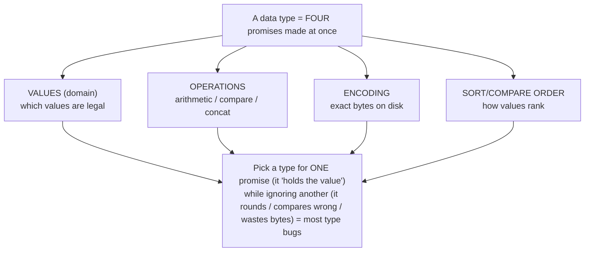
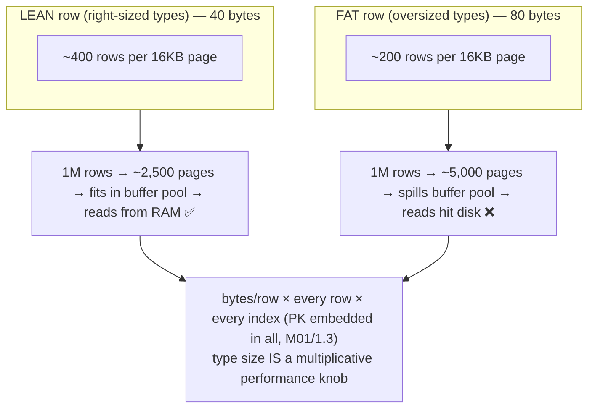
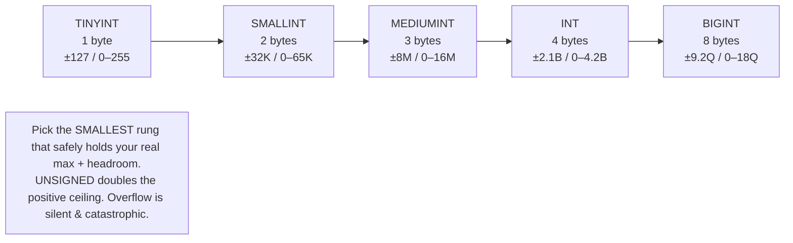
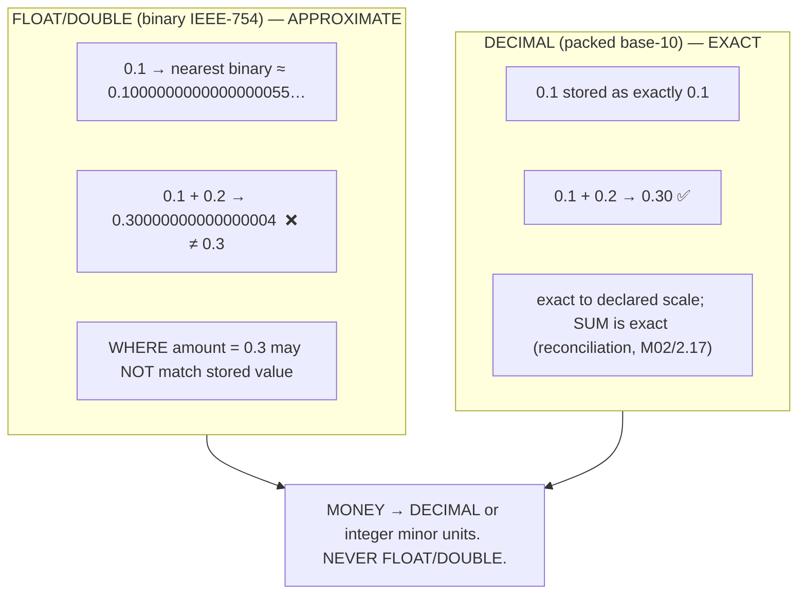
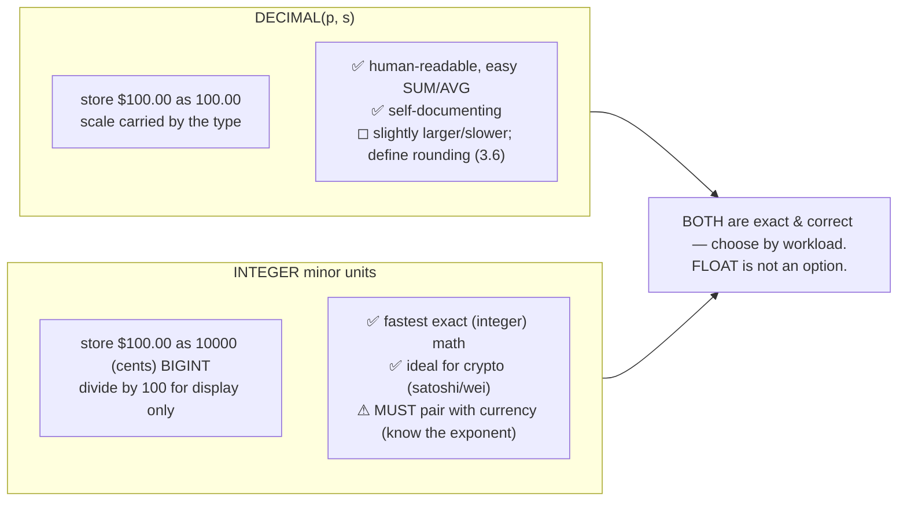
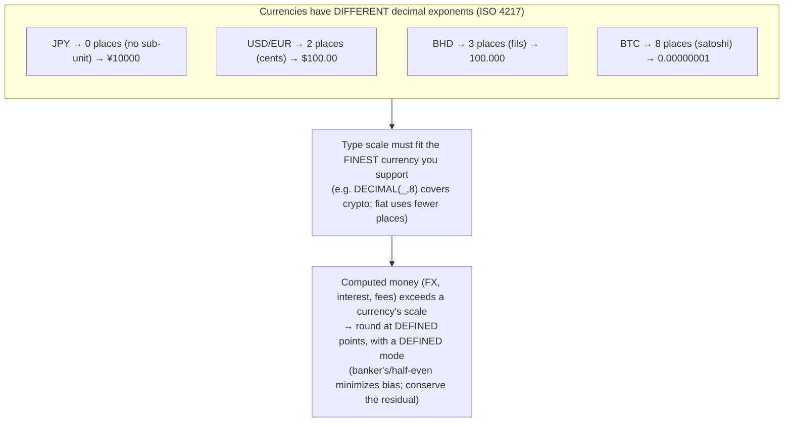

# M03 · Pass C — Diagrams & Worked Examples · Concepts 3.1–3.6

> **Pass C scope:** content-contract items **#12 Diagram(s)** and **#8 Worked example** (narrated, no code in prose). Pairs with `01-type-basics-footprint-integers-money.md`. Domain: payments/wallet.

---

## 3.1 · What a data type really is

**Diagram — the four-promise triad (+ sort):**

**Worked example — one amount, three candidate types, three behaviors.**
Take the value "one hundred dollars and ten cents" and consider storing it three ways. As **`DECIMAL(18,2)`**: the domain is exact base-10 numbers, arithmetic is exact, the encoding is packed decimal, and `100.10 = 100.10` reliably. As **`FLOAT`**: the domain becomes *approximate binary fractions*, so 100.10 is stored as the nearest representable binary value (slightly off), arithmetic compounds the error, and a later `WHERE amount = 100.10` might not match the stored row at all. As **`VARCHAR(10)` holding `"100.10"`**: it "holds the value," but the operations are *string* operations — `"100.10" + "0.05"` is nonsense, sorting is lexicographic (so `"1000.00"` sorts *before* `"99.00"`), and you can't range-scan numerically or reject `"abc"`. The same logical value behaves completely differently under each type because the type fixes all four promises, not just "does it fit." The lesson the example drives: **choose the type that honors the value's true semantics** (money → exact, ordered, numeric), not the most permissive container that technically stores the characters. (And note the MySQL twist: in loose mode `'10abc' = 10` can be *true* via silent coercion — which strict mode rightly rejects.)

---

## 3.2 · Storage footprint → performance (the core link) ★

**★ Diagram — row size → rows/page → buffer-pool fit → IO:**

**Worked example — the oversized row that doubles your IO.**
You're designing `ledger_entry`, the highest-volume table in the system. Version A uses right-sized types: `BIGINT` account id, `DECIMAL(18,2)` amount, `DATETIME(6)` timestamp, a `TINYINT` status — a lean ~40-byte row. Version B is careless: a `CHAR(36)` UUID id (36 bytes instead of 8), `DOUBLE` amount, a `VARCHAR(255)` status string, a `DATETIME` plus redundant columns — an ~80-byte row. Same data, same row count. But InnoDB reads in 16 KB pages, so Version A packs ~400 rows per page and Version B only ~200. For a billion-row ledger, Version B needs **twice the pages** — twice the disk IO to scan, and, decisively, its working set is twice as large so far *less* of it fits in the **buffer pool** (InnoDB's RAM cache, M09). Version A's hot data stays in RAM (fast); Version B constantly evicts and re-reads from disk (slow). And it compounds: the fat id is embedded in *every secondary index* (M01/1.3), so every index is bloated too. The query latency difference can be an order of magnitude — caused entirely by type choices, before a single index or query was tuned. This is *why* "smallest type that safely fits" is a performance rule, and it's the foundation M05 (indexing) and M09 (buffer pool) build on.

---

## 3.3 · Integer types & signedness

**Diagram — the integer-width ladder:**

**Worked example — the auto-increment PK that must never wrap.**
You're choosing the type for `transaction_id`, an `AUTO_INCREMENT` primary key on a table that grows fast. The tempting "default" is `INT` (4 bytes) — but signed `INT` tops out at ~2.1 billion. A busy payments platform can post billions of transactions over its life, and the day the counter hits the `INT` ceiling, **every insert fails** — a full production outage, at the worst possible time (peak volume), and the fix (widening `INT`→`BIGINT`) is a COPY migration that rewrites the entire billion-row table (3.15). The right call is **`BIGINT UNSIGNED`** from day one: 8 bytes instead of 4, but a ceiling of ~18 *quintillion* — effectively un-exhaustible. Here the footprint rule (3.2, "smallest type") is correctly *overridden* by the overflow-safety rule for a PK, because the 4 extra bytes/row are cheap insurance against a catastrophic, hard-to-fix failure. Contrast a `status_code` column: a small bounded set fits `TINYINT` (1 byte) with no overflow risk, so there the smallest type wins outright. The example shows both sides of the same tradeoff — right-size *down* for bounded columns, but leave *headroom* (BIGINT) for unbounded-growth keys, because integer overflow doesn't degrade gracefully, it wraps or halts.

---

## 3.4 · DECIMAL vs FLOAT/DOUBLE — exactness vs approximation ★

**★ Diagram — binary-float rounding vs exact-decimal lanes:**

**Worked example — the cent that drifts away.**
A team stores `amount` as `DOUBLE` because "it's just a number." Early on, nothing looks wrong — a single $100.10 displays fine. But the system *accumulates*: it sums millions of entries to compute balances and daily totals. Because each `DOUBLE` value is the *nearest binary approximation* (0.10 isn't exactly representable in binary), every addition carries a microscopic error, and across millions of operations those errors compound into a **visible discrepancy** — a balance that's off by a cent, then several cents, with no single "wrong" row to point to. Worse, reconciliation (M02/2.17) breaks subtly: `WHERE balance = expected` fails to match because the stored approximation isn't bit-equal to the computed one, and `SUM(amount)` over the ledger no longer equals the stored balance even when nothing is actually lost — the comparison itself is unreliable. The auditors find a books-don't-balance discrepancy that's purely an artifact of the type. Switching `amount` to `DECIMAL(18,2)` makes 0.10 *exactly* 0.10, sums exact, and equality reliable — the discrepancy vanishes because it was never a logic bug, only a representation bug. This is the single most reliably-tested "do you actually know this" fact in fintech engineering, and the spine of the money-never-lies thread: **binary floats cannot represent decimal money; never use them for it.**

---

## 3.5 · Representing money: DECIMAL vs integer minor units ★

**★ Diagram — two correct money encodings side by side:**

**Worked example — $100.00 two ways, and the exponent trap.**
The same $100.00 payment is stored two correct ways. As **`DECIMAL(18,2)`**: the column literally holds `100.00`; queries read it as money, `SUM` is exact, and reports are human-readable — convenient for a traditional fiat ledger. As **integer minor units**: a `BIGINT` holds `10000` (the count of cents), all arithmetic is plain exact integer math (no fractional type, fastest and least surprising), and display divides by 100. Both avoid float's drift (3.4). The decision is a tradeoff, not a correctness question — DECIMAL for readability/fiat, integer minor units for crypto/high-precision and ultra-high-throughput arithmetic. **But the worked example's real lesson is the trap unique to minor units:** the integer `10000` is *meaningless without its currency's exponent.* If it's USD (exponent 2), it's $100.00; if some code path assumes JPY (exponent 0), the *same* `10000` reads as ¥10,000 — and if a value stored as USD cents is ever interpreted with the wrong exponent, you have a **100× money error**. So integer minor units *must* be stored alongside the currency code, and the exponent applied consistently everywhere (3.6). DECIMAL is more self-documenting (the scale is in the type) which is why it's a gentler default for mixed fiat work — but both are exact, and the choice should be deliberate and consistent across the whole schema, never mixed for the same currency.

---

## 3.6 · Currency, scale & rounding

**Diagram — currency → exponent → required scale (+ rounding):**

**Worked example — three currencies in one schema, and a rounding policy that balances.**
Your platform supports JPY, USD, BHD, and BTC. They have *different granularities*: ¥ has no sub-unit (exponent 0 — a fractional yen is invalid), $ has cents (2), Bahraini dinar has fils (3), Bitcoin has 8. A single `amount DECIMAL(_, 2)` would be *wrong* for both JPY (allows fractional yen) and BHD/BTC (can't represent their precision) — so the schema uses a scale that fits the finest currency (e.g., `DECIMAL(_, 8)` for crypto) and **rounds each amount to its own currency's exponent**, with the currency code stored alongside so the right exponent is always known. Now the rounding bite: a $10.00 fee split three ways is $3.333… — which can't exist in cents. You must round to 2 places, but `3.33 × 3 = 9.99 ≠ 10.00` — a penny vanished. A defined policy handles this: round at a *defined point* (e.g., compute each share, round, and assign the leftover cent deterministically — "largest remainder" — so the parts sum back to the whole), using a *defined mode* (**banker's rounding / half-to-even** is preferred in finance because over many operations it doesn't bias systematically upward like half-up does). The principle the example makes concrete: **scale and rounding are explicit schema-and-policy decisions, not emergent** — get them wrong and you get fractional yen, lost pennies, or totals that don't reconcile (M02/2.17). And the MySQL note: `ROUND()` is half-up by default and has no native banker's rounding, so half-to-even is implemented in application logic.

---

*Diagrams + worked examples for 3.1–3.6 complete. Next Pass C file: 3.7–3.11 (text layout, charset×collation grid, DATETIME-vs-TIMESTAMP timeline, ENUM mapping, JSON→generated→index).*
