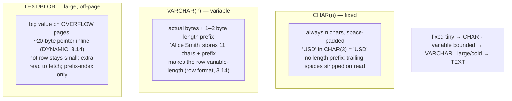
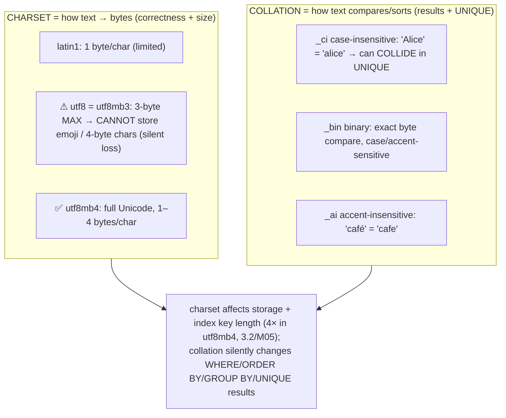
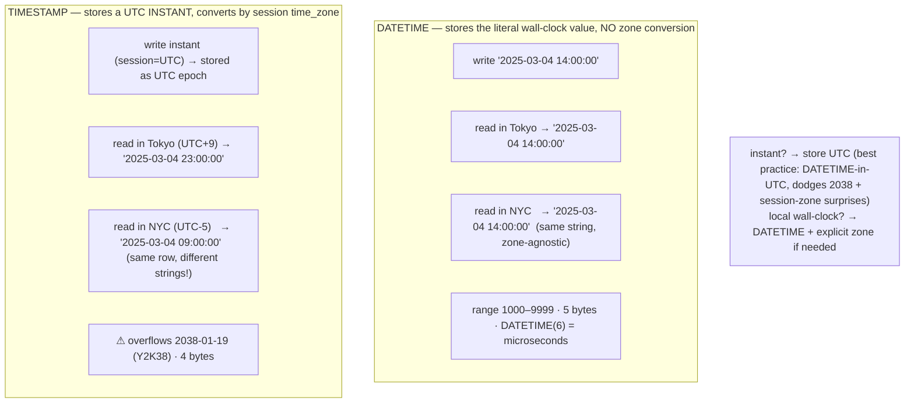
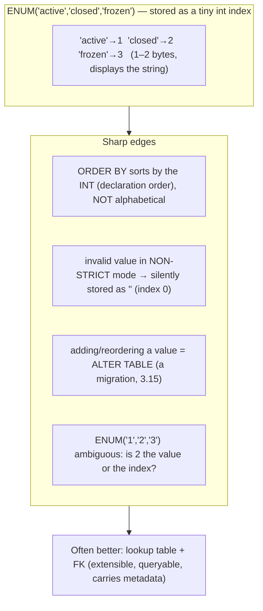
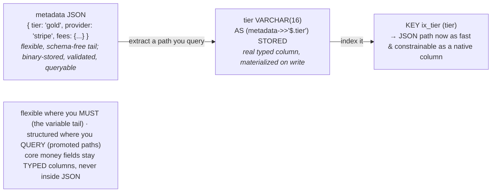

# M03 · Pass C — Diagrams & Worked Examples · Concepts 3.7–3.11

> Pass C scope: **#12 Diagram(s)** + **#8 Worked example** (narrated). Pairs with `02-text-charset-temporal-enum-json.md`. Includes the **★ DATETIME-vs-TIMESTAMP timeline** (3.9). Domain: payments/wallet.

---

## 3.7 · CHAR vs VARCHAR vs TEXT/BLOB

**Diagram — storage layout of the three:**

**Worked example — three string columns, three right answers.**
The `account` table needs three text-ish columns, and each wants a different type. The **currency code** is always exactly 3 letters ("USD", "EUR") → **`CHAR(3)`**: fixed width, predictable, no length-prefix overhead, and it signals "this is always 3 chars." The **account holder name** varies ("Al" to "Alexandra Wellington-Smythe") → **`VARCHAR(100)`**: stores only the real bytes plus a small length prefix, compact for varying data. A free-text **compliance note** can be paragraphs and you never filter on it → **`TEXT`**: stored on overflow pages with just a ~20-byte pointer in the main row (3.14), so the big note doesn't bloat the hot `account` row that every balance lookup reads. The payoff is footprint discipline (3.2): the columns you read constantly (currency, name) stay dense in the hot row, while the rarely-read big note sits off-page. The anti-pattern the example warns against is `VARCHAR(255)` (or worse, `TEXT`) for *everything* regardless of real length — over-declared lengths can bloat index key sizes and force the max allocation in in-memory temp tables, and TEXT can't be fully indexed (only a prefix, M05) and historically forced on-disk temp tables. Right-size each column to its real shape.

---

## 3.8 · Character sets & collations

**Diagram — charset (bytes) × collation (compare/sort), and the utf8 trap:**

**Worked example — the emoji that broke an insert, and the UNIQUE that collided.**
Two classic failures, both silent. **First:** the schema uses MySQL's `utf8` charset (which is really `utf8mb3`, max 3 bytes/char). A customer sets their display name to include an emoji (a 4-byte character). On insert, MySQL — depending on mode — either **errors** ("Incorrect string value") or **truncates the name at the emoji**, silently losing data. The fix is to use **`utf8mb4`** (real, full UTF-8) everywhere; this is such a common bug that "always use utf8mb4, never utf8" is a standing rule. **Second:** a `username` column uses the default case-insensitive collation (`utf8mb4_..._ci`) with a UNIQUE constraint. User "Alice" registers; later someone tries "alice" — and the insert is **rejected as a duplicate**, because the case-insensitive collation considers `'Alice' = 'alice'`. Sometimes that's exactly what you want (prevent confusable usernames); sometimes it's a surprising bug (you intended case-sensitive identifiers). The point both examples make: **charset and collation are two separate decisions, and both fail silently** — charset corrupts/truncates storage (mojibake, lost emoji), collation changes what "equal" means for comparisons, sorting, *and* UNIQUE constraints. There's also a footprint angle (3.2/M05): a utf8mb4 indexed column reserves up to 4 bytes/char, so over-long VARCHAR indexes can hit key-length limits. For fintech, currency codes and tokens often use an exact (`_bin`/ASCII) collation; user-facing text uses utf8mb4 `_ci`.

---

## 3.9 · Temporal types: DATE, DATETIME, TIMESTAMP, time zones ★

**★ Diagram — DATETIME (wall clock) vs TIMESTAMP (UTC instant):**

**Worked example — the settlement timestamp read in two cities.**
A payment settles, and the system records `settled_at`. Watch what happens under each type when an ops person in Tokyo and one in New York both query the row. With **`TIMESTAMP`**: the value is stored as a UTC instant and *converted by each session's `time_zone`*, so Tokyo sees `23:00:00` and New York sees `09:00:00` for the **same row** — correct as "the same instant shown locally," but a trap if anyone assumes the displayed string is the stored value, and your audit logs now read differently depending on who ran the query. With **`DATETIME`** storing the literal value: everyone sees the identical string regardless of zone — but the type carries *no* zone, so it's only meaningful if you've enforced a convention. The widely-adopted best practice resolves both: **store the UTC instant in a `DATETIME(6)`** and convert to local *only at display time in the application*. You get absolute-instant semantics (one canonical value in audit records), microsecond precision for deterministic ordering of high-frequency ledger entries (M01/1.15), *and* you dodge TIMESTAMP's two hazards — the **2038 epoch overflow** (a real ceiling for TIMESTAMP) and session-zone ambiguity. The example crystallizes the universal rule that this concept exists to teach: **an instant and a wall-clock time are different types — store instants in UTC, localize at the edges, and never store a local time without its zone.**

---

## 3.10 · ENUM & SET — compact domains with sharp edges

**Diagram — ENUM internal int mapping + the gotchas:**

**Worked example — `status` as ENUM vs lookup table, and the silent empty string.**
You model `account.status`. The quick choice is **`ENUM('active','closed','frozen')`** — compact (stored as a 1-byte int), self-documenting, no join. It works until three things happen. (1) Product wants to add a `'pending_kyc'` status — which now requires an **`ALTER TABLE`** (a schema migration, 3.15) rather than a simple data insert, because the value list is part of the type. (2) Someone runs `ORDER BY status` and is baffled that it sorts active→closed→frozen (declaration order, by internal int) instead of alphabetically. (3) The worst one: a buggy code path inserts `'frozenn'` (typo). In **non-strict mode**, MySQL doesn't reject it — it **silently stores the empty string `''`** (the special index-0 "error" element), so the account now has a blank status that no query for a valid status will match, and the corruption is invisible until something breaks. Contrast a **lookup table** `account_status(code, label, sort_order, is_active)` with a FK from `account.status`: adding `'pending_kyc'` is an `INSERT` (no DDL); the status set is queryable data (you can list/join/filter it); you can attach metadata (display label, sort order); and the FK *rejects* an invalid code outright (no silent empty string). The tradeoff is a small join and a few bytes. The guidance the example yields: ENUM only for **tiny, truly stable** sets (with strict mode on to kill the empty-string trap); prefer a **lookup table + FK** for anything that evolves — which, for fintech statuses subject to product/regulatory change, is usually the case. (And avoid SET almost always — its bitmask semantics are even more error-prone.)

---

## 3.11 · JSON & generated columns — structure inside a value

**Diagram — JSON doc → generated column → index:**

**Worked example — flexible metadata, indexed where it counts (ties to M02/2.5).**
Different payment providers attach different fields — Stripe sends one set, a bank transfer another, a crypto rail another. Modeling every possible provider field as its own nullable column would create a god-table (M01/1.18) of mostly-empty columns; modeling them as EAV would destroy typing and queryability (M01/1.18). The sanctioned middle ground: a **`metadata JSON`** column holding the provider-specific tail as a parsed, validated document — no migration needed when a provider adds a field. But you *do* frequently query one path — say, the customer `tier` for routing/limits. So you add a **STORED generated column** `tier AS (metadata->>'$.tier')` and **index it**: now that one JSON path is a first-class, typed, indexable column (fast `WHERE tier = 'gold'`), while the rest of the metadata stays flexible. This is exactly M02/2.5's "1NF escape hatch done right" — flexibility for the long tail, structure for what you query. The discipline the example enforces (and the money-never-lies guardrail): **core money fields never go in JSON.** `amount`, `account_id`, `status` stay typed columns (DECIMAL/BIGINT/FK) because you must *sum them exactly* (3.4), *reconcile them* (M02/2.17), and *constrain them*; burying an amount in a JSON blob would make it un-summable-exactly and un-constrainable. JSON is for the variable periphery, never the financial core.

---

*Diagrams + worked examples for 3.7–3.11 complete. Next Pass C file: 3.12–3.17 (id byte-cost ★, null bitmap, row-format off-page ★, ALTER cost spectrum, principles checklist, fully-typed money-model ER ★).*
