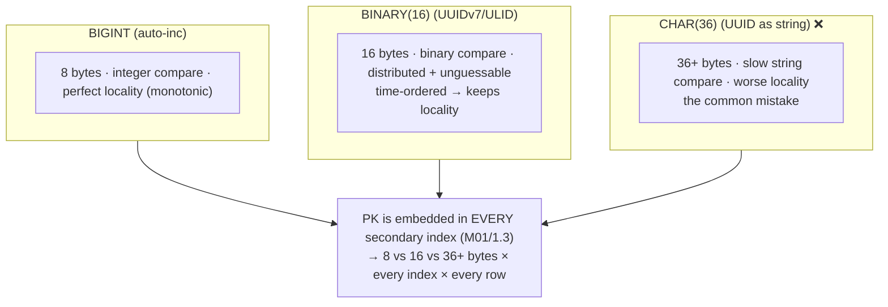
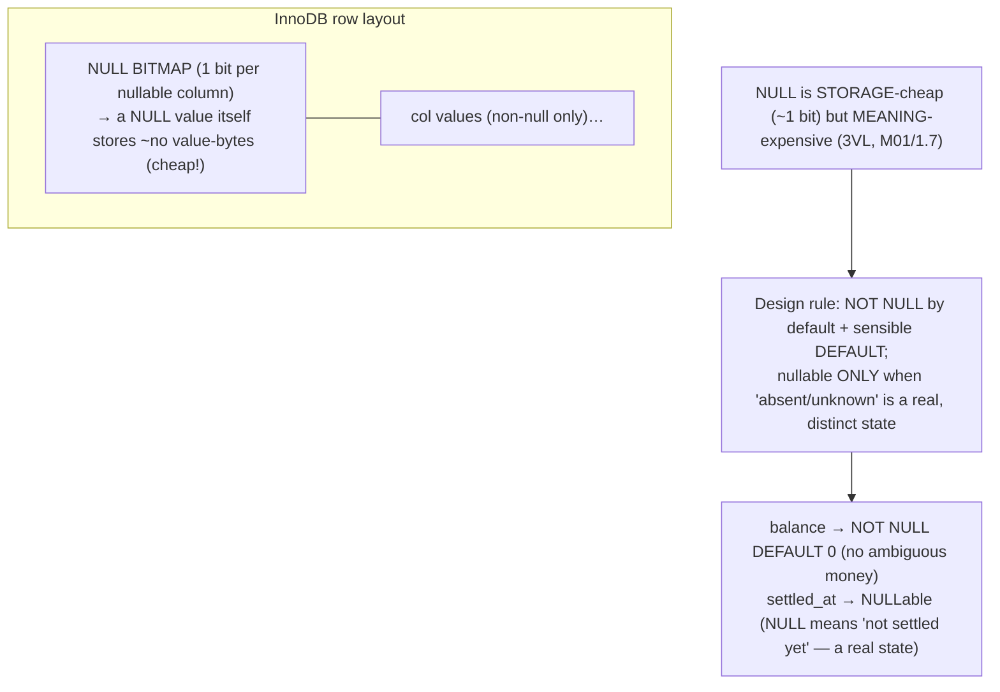
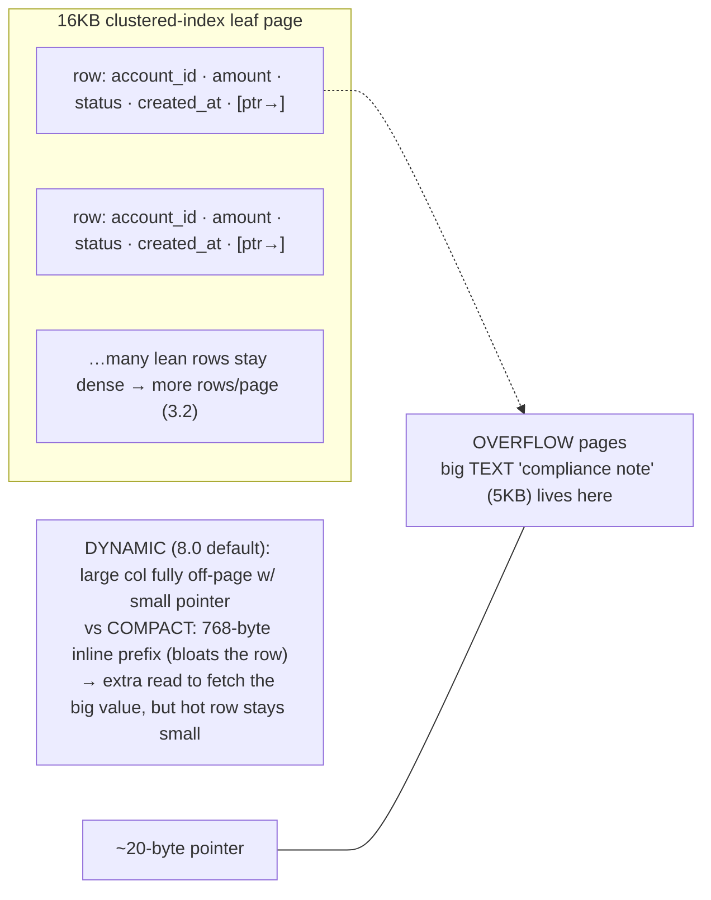
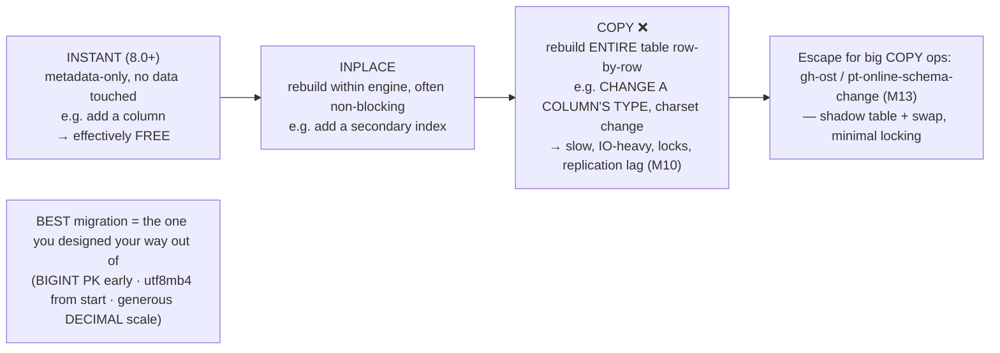
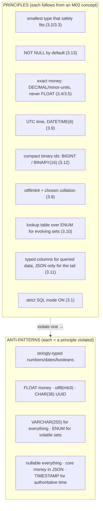
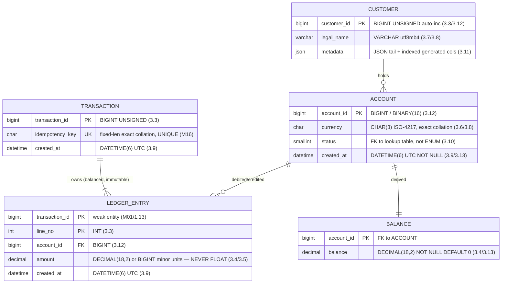

# M03 · Pass C — Diagrams & Worked Examples · Concepts 3.12–3.17

> Pass C scope: **#12 Diagram(s)** + **#8 Worked example** (narrated). Pairs with `03-idstorage-null-rowformat-evolution-principles-capstone.md`. Includes the **★ id byte-cost** (3.12), **★ row-format off-page** (3.14), and the **★ fully-typed money-model ER** (3.17, reused in M05/M16). Domain: payments/wallet.

---

## 3.12 · Keys as types: AUTO_INCREMENT vs UUID vs ULID storage ★

**★ Diagram — same id under three storage types (cost × every index):**

**Worked example — the CHAR(36) UUID that doubled every index.**
A team needs distributed, unguessable ids, so they (correctly) choose UUIDs — but store them as **`CHAR(36)`** (the human-readable hex-with-dashes form). On the `ledger_entry` table, which has several secondary indexes, this is quietly expensive: the PK is **embedded in every secondary index** (M01/1.3), so each index now carries a 36-byte key where a `BINARY(16)` would carry 16 — more than doubling every index's size. Across a billion-row table with five indexes, that's a large, permanent waste of disk and, decisively, of **buffer-pool space** (3.2) — far less of each index fits in RAM, so more reads hit disk. String comparison is also slower than binary, and the textual UUIDs are in random order so inserts scatter (page splits, M09). The fix keeps the *generation* choice (UUIDs) but corrects the *storage type*: **`BINARY(16)`**, using MySQL 8's `UUID_TO_BIN(uuid, 1)` to convert — and the `1` flag **byte-swaps the time component** so the binary sorts in time order, restoring insert locality (mimicking ULID/UUIDv7). The same logical ids, stored in 16 bytes instead of 36, shrink every index and recover cache efficiency. The lesson (and a frequent interview probe): **the id's storage type matters as much as its generation strategy** — never store an indexed UUID as CHAR(36); render the readable form at the application boundary, store the compact binary form. This is M01/1.15's theory made physically real, feeding M05 (index size) and M09 (page fit).

---

## 3.13 · NULL storage, defaults & the cost of nullable columns

**Diagram — null bitmap + the design rule:**

**Worked example — `balance` vs `settled_at`: when NULL earns its place.**
Two columns, opposite decisions. **`account.balance`**: should this be nullable? No. A NULL balance is *ambiguous* — does it mean zero, or unknown? — and it spreads three-valued-logic hazards into every money query (M01/1.7: `WHERE balance <> 0` silently drops NULL rows). So `balance DECIMAL(18,2) NOT NULL DEFAULT 0` — "no balance" is impossible, money math is unambiguous, and the storage cost saved by allowing NULL (about one bit per row) isn't remotely worth the semantic mess. **`ledger_entry.settled_at`**: should this be nullable? Yes. Here NULL has a *genuine, distinct meaning*: "this entry has not settled yet." That's a real state different from any timestamp value, and a `settled_at IS NULL` query meaningfully finds unsettled entries. Forcing NOT NULL would require an awkward sentinel (a fake date) that's worse than NULL. The example illustrates the calibration rule: NULL is **storage-cheap** (a per-row null bitmap, the value itself takes ~no bytes) but **meaning-expensive**, so the decision is purely semantic — *use NULL only when absence is a real, distinct, meaningful state; otherwise NOT NULL with a sensible default.* For fintech specifically: money and status columns are NOT NULL with defaults (no ambiguity); "hasn't-happened-yet" timestamps (`settled_at`, `closed_at`) are the legitimate nullable cases. (And recall the physical gotcha from M01/1.7: a nullable UNIQUE column still allows *multiple* NULLs in MySQL.)

---

## 3.14 · Row formats & on-page storage (inline vs off-page overflow) ★

**★ Diagram — DYNAMIC row format pushes big columns off-page:**

**Worked example — the 5KB note that didn't bloat the hot row.**
The `account` table has the usual hot columns (id, balance, status, timestamps) that *every* balance lookup and statement scan reads, plus an occasional large `compliance_note` TEXT that's only opened during reviews. In InnoDB's **DYNAMIC** row format (the 8.0 default), that 5 KB note is stored on **overflow pages**, leaving only a ~20-byte pointer in the main row. The consequence is exactly what footprint discipline (3.2) wants: the hot rows stay small and **dense** — hundreds per 16 KB page — so the common queries (balance, statement) scan pages packed with useful rows and stay cache-resident, while the big note is fetched (one extra read) *only* when someone actually selects it. Contrast the older **COMPACT** format, which kept a 768-byte inline prefix of the big value before overflowing — that prefix bloats every row whether or not you read the note, wasting page space and cache on data the hot queries don't need. The design takeaway (intuition level — full byte-layout is M09): prefer DYNAMIC (you get it by default), and *don't* put large TEXT/BLOB in hot tables you scan a lot unless it's off-page — or better, **vertically partition** the big/cold column into a 1:1 side table (M02) so the hot table has no overflow pointers at all and the big data is joined only when needed. The automatic mechanism (off-page overflow) and the deliberate one (vertical partitioning) achieve the same goal: keep the hot row lean.

---

## 3.15 · Schema evolution: changing a type later (the migration cost)

**Diagram — the ALTER cost spectrum:**

**Worked example — the emergency INT→BIGINT widen on a billion rows.**
A table shipped years ago with `transaction_id INT` (4 bytes, ~2.1B ceiling). The platform grew, and one day the auto-increment counter approaches the `INT` limit. This is now an **emergency**: when it hits the ceiling, *every insert fails* (M03/3.3), so payments stop. And the fix — `ALTER TABLE … MODIFY transaction_id BIGINT` — is a **COPY** operation: MySQL must rebuild the *entire* billion-row table row by row into a new file, which on this size takes hours, is IO-heavy, can lock or block writes, and on a replicated setup floods replication with a giant operation causing lag (M10). You can't take the system down for hours, so you reach for an **online schema-change tool** (gh-ost / pt-online-schema-change, M13) that copies into a shadow table in the background and swaps it in with minimal locking — turning a blocking outage into a managed (but still large, careful, days-of-planning) migration. The whole crisis was *avoidable at design time*: choosing **`BIGINT UNSIGNED` for the PK from day one** (3.3) — 4 extra bytes per row — would have made the ceiling unreachable and this migration unnecessary. The example is the concept's thesis in action: **most type changes are COPY operations (expensive at scale), so the best migration is the one you designed your way out of needing** — right-size integers with headroom, start on utf8mb4 (avoid a charset rewrite, 3.8), and choose DECIMAL scale generously (avoid re-precision, 3.5). Type choices are bets about the future, and the future bill for a wrong bet is a table rebuild.

---

## 3.16 · Type-driven schema design principles & anti-patterns

**Diagram — principles checklist + anti-pattern catalog:**

**Worked example — a schema review catching five type smells.**
You review a junior's `payment` table and the type choices tell a story. `amount DOUBLE` → **FLOAT money** (3.4): flag it, switch to `DECIMAL(18,2)` — cents will drift otherwise. `id CHAR(36)` for a UUID PK → **stringly/oversized id** (3.12): switch to `BINARY(16)`, it's doubling every index. `created_at TIMESTAMP` for an authoritative settlement record → **2038 + session-zone risk** (3.9): switch to UTC `DATETIME(6)`. `status VARCHAR(255)` holding "active"/"closed" → **stringly-typed + over-declared** (3.1/3.7): switch to a lookup-table FK (3.10), and note the 255 is meaningless. `amount_details JSON` containing the actual `amount` → **core money buried in JSON** (3.11): pull `amount` out to a typed DECIMAL column so it can be summed exactly and reconciled (M02/2.17). Five fixes, and each maps to a *principle from this module* — which is the point of the checklist: it turns the module's reasoning into fast, reviewable rules and a shared vocabulary ("this is FLOAT money — fix it") that makes design and code review effective. The example also shows the discipline behind the rules: each principle is a *default* with a known reason, so the reviewer can both apply it quickly *and* recognize the rare legitimate override (e.g., a deliberately-wide BIGINT for headroom, or JSON for a genuinely dynamic region). This concept is the consolidated cheat-sheet that M14 expands and that sets the standards the capstone applies.

---

## 3.17 · Fintech capstone — the physically-typed money schema ★

**★ Diagram — the fully-typed money-model ER (every column's physical type):**

**Worked example — typing every column of the money model, each choice justified.**
Take M01's logical model (refined by M02's normalization) and make it physically real, walking column by column and naming *why* each type:
- **Ids** (`customer_id`, `account_id`, `transaction_id`) → **BIGINT UNSIGNED** auto-inc (headroom against overflow, 3.3; compact in every index, 3.2/3.12) — or **BINARY(16)** ULID/UUIDv7 if the system is distributed and needs unguessable ids, *never* CHAR(36).
- **`amount`, `balance`** → **DECIMAL(18,2)** (fiat) or **BIGINT minor units** (crypto) — exact money, never FLOAT (3.4/3.5); `balance` is NOT NULL DEFAULT 0 (3.13).
- **`currency`** → **CHAR(3)** with an exact collation — fixed ISO-4217 code, carried beside every amount so scale/rounding are unambiguous (3.6/3.7/3.8).
- **`created_at` / `settled_at`** → **DATETIME(6) in UTC** — microsecond instants for deterministic ordering (3.9, M01/1.15); `created_at` NOT NULL DEFAULT CURRENT_TIMESTAMP(6), `settled_at` nullable ("not yet settled" is a real state, 3.13).
- **`status`** → **SMALLINT FK to a lookup table** (extensible, auditable) rather than ENUM (3.10).
- **`metadata`** → **JSON** for the provider-specific tail, with **STORED generated columns + indexes** for queried paths (3.11) — but every core money field stays a typed column, never in JSON.
- **`idempotency_key`** → fixed-length, exact-collation, **UNIQUE** (dedup retries, M16).

The result is the module's whole thesis realized: the same tables M01 shaped and M02 normalized are now **correct** (money exact, time unambiguous), **compact** (lean hot rows → cache-resident, 3.2), and **evolvable** (BIGINT headroom + utf8mb4 from the start avoid forced migrations, 3.15). Every choice is *justified*, not defaulted-into — which is exactly what separates a sound physical schema from a pile of guesses. This typed ER is the literal input to **M05** (which indexes these columns for the access patterns of M01/1.14) and **M16** (which grows it into a full payments platform) — the physical foundation under the entire fintech capstone, embodying all four threads at once: durability (exact bytes survive), money-never-lies (exact money), generics-first (each type honoring its value), and tradeoff (each choice costed).

---

*Diagrams + worked examples for 3.12–3.17 complete. **M03 Pass C is fully drafted (all 17 concepts).** Remaining for M03: Pass D — code-specifics boxes, failure modes & gotchas, fintech lens, interview/SD angle, and self-check questions.*
