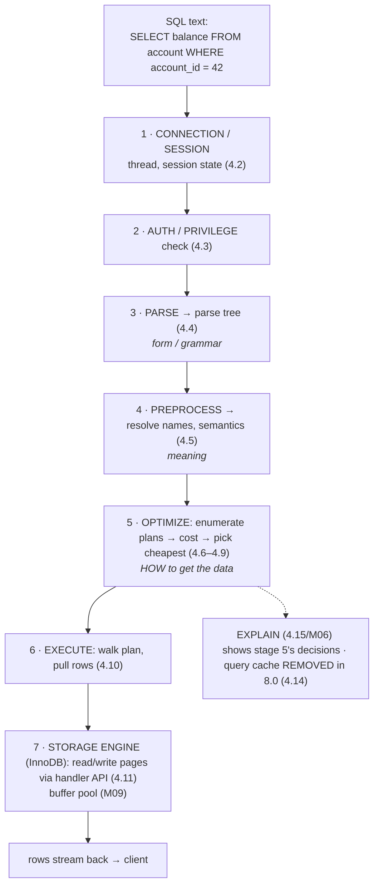
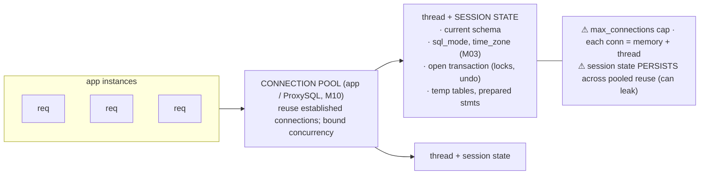
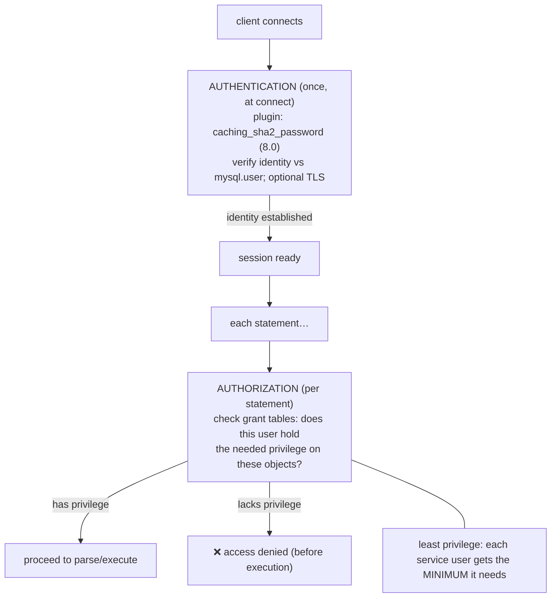
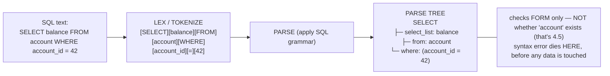
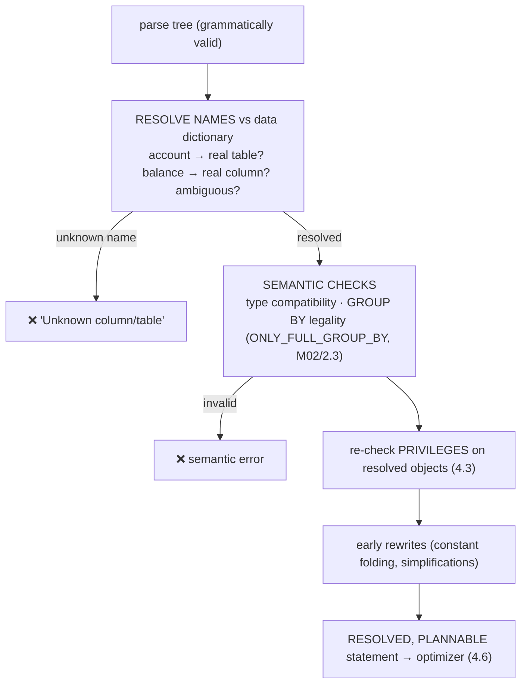

# M04 · Pass C — Diagrams & Worked Examples · Concepts 4.1–4.5

> **Pass C scope:** content-contract items **#12 Diagram(s)** and **#8 Worked example** (narrated, no code in prose). Pairs with `01-pipeline-frontend.md`. Includes the **★ master pipeline** (4.1, reused throughout). Domain: payments/wallet, M03 typed schema. Trace query: "get account 42's balance / recent entries."

---

## 4.1 · The big picture: query in, rows out ★

**★ Diagram — the master end-to-end pipeline (reused all module):**

**Worked example — tracing "get account 42's balance" through every stage.**
Follow one simple query down the pipeline. The text `SELECT balance FROM account WHERE account_id = 42` arrives on a **pooled connection** (4.2) whose session is already authenticated; MySQL **checks** the user holds `SELECT` on `account` (4.3). The **parser** confirms it's grammatically valid SQL and builds a parse tree (4.4) — a typo like `SELCT` would die right here. The **preprocessor** resolves `account` and `balance` against the data dictionary (4.5) — they're real columns from M03/3.17, so it proceeds; `blance` would fail here as "unknown column." Now the **optimizer** (4.6) asks the central question: *how* to fetch this? Since `account_id` is the primary key, the cheapest access path is a **PK lookup** (`const`/`eq_ref`, 4.8) — one row, no scan. The **executor** (4.10) runs that plan, calling **InnoDB** through the handler API (4.11) to fetch the row — served straight from the **buffer pool** (4.14) if the page is hot, else one disk read. The single `balance` value streams back. The whole point of the trace: *the same declarative query passed through a fixed assembly line, and the only "smart" decision (PK lookup vs scan) happened at the optimizer stage* — which is exactly the stage every later tuning technique (M05/M06) targets. (Note what's **absent**: no query-cache lookup — that's gone in 8.0; the speed of a repeat comes from the buffer pool holding the page, not a result cache.)

---

## 4.2 · The connection layer & a session's lifecycle

**Diagram — client → pool → thread → session state:**

**Worked example — the connection storm, and the leaked session setting.**
A payments service without pooling opens a fresh connection per request. Under a traffic spike, thousands of requests each pay the TCP + auth-handshake cost and each consumes a thread and per-connection memory — until the server hits `max_connections` and starts rejecting with "Too many connections," an outage *caused by connection management, not query load*. The fix is a **connection pool** (app-side, often behind ProxySQL, M10): a bounded set of established connections handed out and returned, eliminating per-request connect cost and capping concurrency. But pooling introduces its own subtle bug the example warns about: **session state persists across reuse.** Suppose one request does `SET time_zone = '+09:00'` (M03) and returns the connection without resetting it; the next borrower inherits that time zone and its `TIMESTAMP` reads come back shifted — a silent correctness bug that only appears under pooling. Likewise a left-open transaction (autocommit off, never committed) poisons the next borrower with stale locks. The lesson: connections are **finite, costly, stateful** — pool them to survive load, but **reset session state between borrows** so one request's settings don't leak into another's. (Pool too small → requests queue; too large → the DB drowns in concurrency, M08.)

---

## 4.3 · Authentication, authorization & the grant check

**Diagram — auth once, authorize per statement:**

**Worked example — least privilege stops the reporting service cold.**
Two services share the database. The **payments service** needs to write the ledger; the **reporting service** only needs to read. Following least privilege (4.3), reporting's DB user is granted `SELECT` on the reporting tables and replicas (M10) — and *not* `INSERT`/`UPDATE`/`DELETE` on `ledger_entry`. One day a buggy deploy points reporting code at a write path that tries to `UPDATE ledger_entry`. MySQL authenticated the reporting user fine at connect (4.3), but on *that statement* the **authorization check** consults the grant tables, sees the user lacks `UPDATE` on `ledger_entry`, and **rejects it before execution** — "access denied." The least-privilege grant turned a potential ledger-corruption incident into a harmless, logged error. The example shows the two-question model in action: authentication (*who are you?*) succeeded at connect, but authorization (*what may you touch?*) is checked **per statement** and is what actually contained the blast radius. For fintech this is a core control, not an afterthought — money systems are high-value targets, so each service runs as a minimal-privilege user, no shared superuser, TLS required, audit on (M13). The database-level grant is the *un-bypassable* floor beneath whatever the application layer also enforces.

---

## 4.4 · Parsing & the parse tree

**Diagram — text → tokens → parse tree (form only):**

**Worked example — the typo that dies at the front door.**
A developer ships `SELCT balance FROM account WHERE account_id = 42` (misspelled keyword). The **lexer** tokenizes the text and the **parser** tries to apply the SQL grammar — but `SELCT` isn't a valid keyword, so the grammar doesn't match and MySQL returns a **syntax error** ("You have an error in your SQL syntax... near 'SELCT...'") with the position. Crucially, this happens **before any table is opened or any privilege is checked for the objects** — parsing only validates *form*, so it doesn't even get as far as caring whether `account` exists. Contrast the *next* stage: `SELECT blance FROM account WHERE account_id = 42` (misspelled *column*) parses *fine* — it's grammatically valid SQL — and only fails later at preprocessing (4.5) as "unknown column 'blance'." The example makes the form-vs-meaning split tangible: the parser is a grammar checker that turns text into a structured tree and rejects malformed SQL cheaply, but it knows nothing about your schema. (And the practical aside: **prepared statements** parse once and execute many — and by treating parameters as *values*, not parseable SQL, they prevent injection; the parser never sees user data as code.)

---

## 4.5 · Preprocessing & semantic resolution

**Diagram — parse tree → resolved tree (meaning):**

**Worked example — "unknown column" caught here, not at parse.**
Recall the misspelled-column query `SELECT blance FROM account WHERE account_id = 42`. It sailed through parsing (4.4) because it's grammatically perfect. At **preprocessing**, MySQL resolves each identifier against the **data dictionary** (the transactional, InnoDB-stored catalog in 8.0): `account` → found, but `blance` → *no such column* → the statement is rejected with "Unknown column 'blance' in 'field list'." The error is *semantic*, located at exactly the right stage. The diagram also shows the other things this stage catches: an **ambiguous** column (say `created_at` selected from a join of `account` and `ledger_entry` without qualifying which table) fails as "ambiguous"; an illegal `GROUP BY` triggers the `ONLY_FULL_GROUP_BY` check (which, as M02/2.3 noted, is literally functional-dependency reasoning); a privilege gap re-surfaces here on the now-resolved objects (4.3). Once everything resolves, `account.balance` is *bound to the real typed column* from M03/3.17, and the statement — now fully resolved and validated — is handed to the optimizer to answer the performance question (4.6). The example crystallizes the pipeline's form→meaning progression: the parser guarantees the query is *shaped* like SQL; the preprocessor guarantees it *refers to real things and means something*; only then does the optimizer decide *how* to run it.

---

*Diagrams + worked examples for 4.1–4.5 complete. Next Pass C file: 4.6–4.9 (the optimizer — candidate plans, statistics, access-path ladder, joins).*
