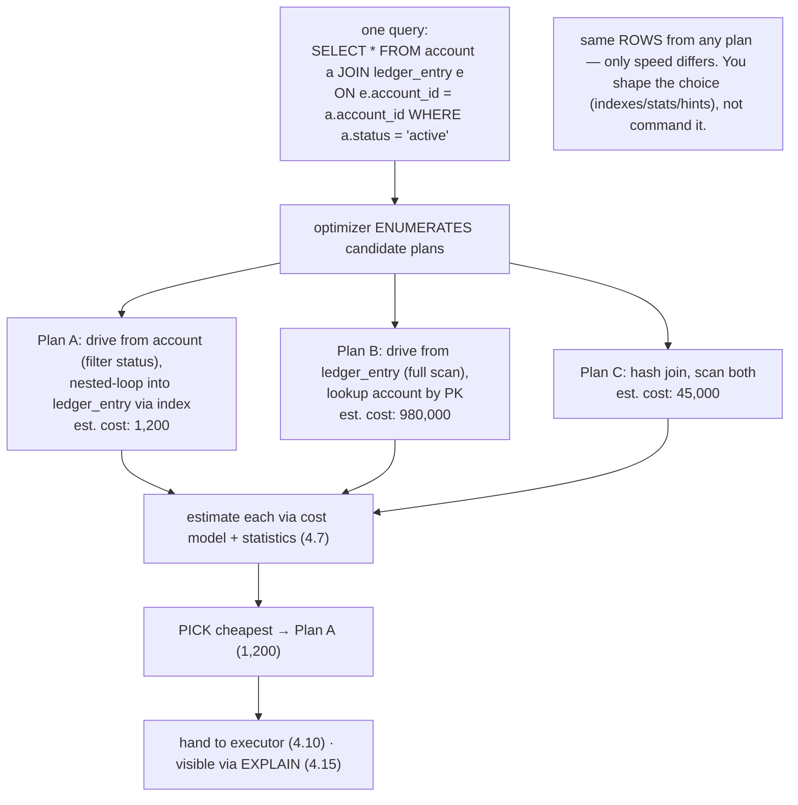
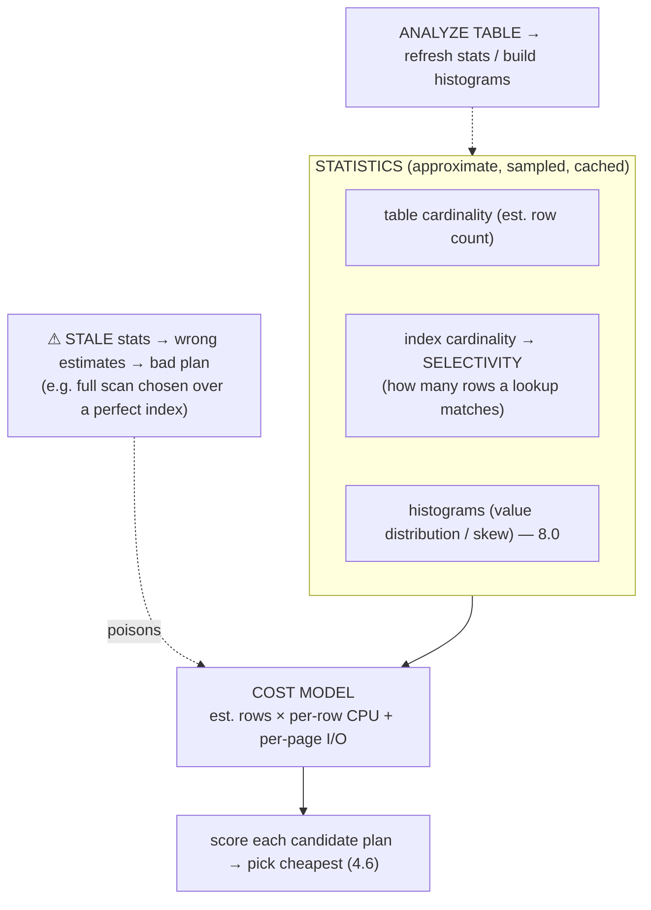
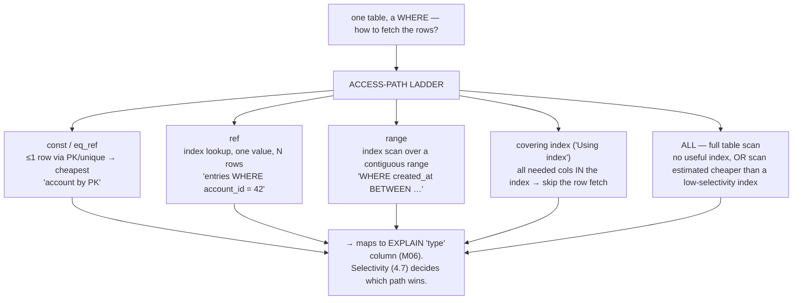
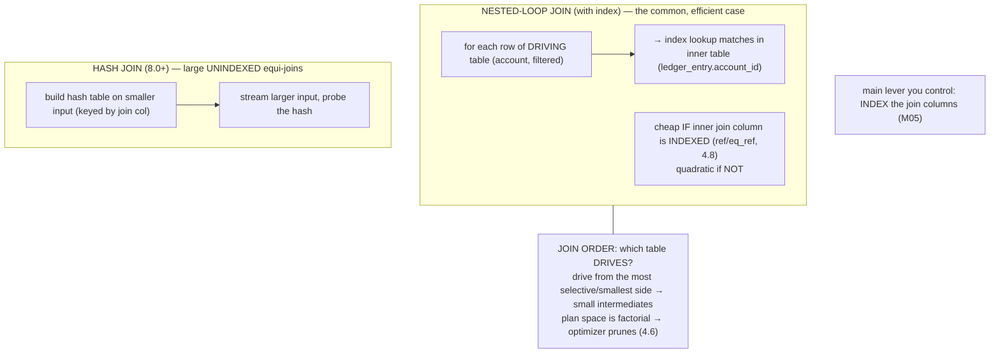

# M04 · Pass C — Diagrams & Worked Examples · Concepts 4.6–4.9

> Pass C scope: **#12 Diagram(s)** + **#8 Worked example** (narrated). Pairs with `02-the-optimizer.md`. Includes the **★ candidate-plans→cost→chosen** (4.6) and **★ access-path ladder** (4.8). Domain: payments/wallet. Access paths/joins introduced here; deep-dived in M05/M06.

---

## 4.6 · The query optimizer: choosing among plans ★

**★ Diagram — many candidate plans → cost estimate → chosen plan:**

**Worked example — one query, three plans, orders-of-magnitude apart.**
Take "all entries for active accounts" — a join of `account` (filtered to `status='active'`) and `ledger_entry`. The optimizer doesn't run the query to compare; it **enumerates plans and estimates costs**. *Plan A:* start from `account`, filter to active ones (say a few thousand), then for each, nested-loop into `ledger_entry` using an index on `account_id` — cheap per lookup, small driving set → low cost. *Plan B:* start from `ledger_entry` (a billion rows) with a full scan, looking up the account for each — astronomically expensive because it drives from the huge table. *Plan C:* hash join, scanning both — middling. All three produce **identical rows**; they differ in cost by orders of magnitude. The optimizer estimates each using statistics (4.7) and picks **Plan A**. The example makes the optimizer's nature concrete: it's a *search over equivalent strategies guided by estimated cost*, and the dramatic spread between plans is *why* it exists and why getting it right matters. The actionable insight that carries into M05/M06: you don't write Plan A by hand — you make Plan A *available and cheap* (an index on `ledger_entry.account_id`) and *estimable* (fresh stats), and the optimizer chooses it. When it chooses badly, you fix the inputs (indexes, statistics) or, rarely, override with a hint — you **shape the decision**, you don't command the plan.

---

## 4.7 · The cost model & statistics

**Diagram — statistics feed the cost model feed the plan:**

**Worked example — the query that got slow without changing.**
A reconciliation query — "sum entries for account 42 this month" — ran fast for months using the `(account_id, created_at)` index. Then, with no code or index change, it suddenly does a **full table scan** and stalls. Nothing about the query is different; what changed is the **statistics**. The `ledger_entry` table grew enormously, but its cardinality stats weren't refreshed, so the optimizer is reasoning from a **stale picture** — it underestimates how selective the index lookup is (or misjudges row counts) and its cost model now scores a full scan as cheaper than the index. The estimate is wrong, so the plan is wrong. The fix isn't to rewrite the query or rebuild the index — it's `ANALYZE TABLE ledger_entry` to **refresh the statistics** (and, for skewed columns, build a histogram), after which the optimizer's estimates match reality and it goes back to the index. The example teaches the concept's core lesson and its diagnostic instinct: **the optimizer is only as smart as its statistics**, and *when a cost-based system makes a surprising choice, suspect its inputs (stats) before its logic.* For a forever-growing table like the ledger, keeping statistics fresh is what keeps plans stable — a stale-stats full scan on a billion-row ledger can stall reconciliation and cascade into a performance incident (a money-never-lies-adjacent stability concern).

---

## 4.8 · Access paths: how a single table is read ★

**★ Diagram — the access-path ladder (best → worst for a selective query):**

**Worked example — the same WHERE, three access paths.**
Take "account 42's recent entries": `WHERE account_id = 42 AND created_at >= '2025-06-01'`. How MySQL fetches the rows depends entirely on what indexes exist — the *access path*:
- **No index on `account_id`:** the only path is **`ALL`, a full table scan** — read every one of a billion `ledger_entry` rows and filter. Catastrophic, and it gets worse as the ledger grows.
- **Index on `(account_id)`:** a **`ref`** lookup jumps straight to account 42's rows, then filters those by date — vastly fewer rows touched.
- **Index on `(account_id, created_at)`:** a **`range`** scan reads *exactly* account 42's rows from June onward, in order — the rows are physically adjacent (M01/1.14 clustering), so it's a tight sequential read.
- **If the query only needs columns in that index** (say just `amount`), add it to the index and it becomes a **covering index** ("Using index") — answered from the index alone, *skipping the clustered-row fetch entirely* (which matters because a secondary-index lookup otherwise costs an extra clustered-index access per row, M01/1.3).

Same `WHERE`, wildly different cost — decided by which access paths the indexes make available and which the optimizer picks by selectivity (4.7). The example *is* the conceptual seed of M05 (build indexes that create good access paths) and M06 (read which path EXPLAIN's `type` column shows). And it explains the occasional surprise that an index *isn't* used: if `account 42` somehow matched most of the table, the optimizer might correctly judge a full scan cheaper than an index with millions of row-lookups — the access path is *query-and-data-dependent*, which is why the optimizer chooses rather than always using the index.

---

## 4.9 · Join execution strategies

**Diagram — nested-loop vs hash join, and join order:**

**Worked example — driving table choice makes or breaks the join.**
Join `account` → `ledger_entry` on `account_id` to get "entries for active accounts." Two things the optimizer decides: the **algorithm** and the **order**. If `ledger_entry.account_id` is **indexed**, the optimizer drives from `account` (filtered to a few thousand active rows) and does an **index nested-loop**: for each active account, an indexed `ref` lookup (4.8) fetches its entries — cheap, scales with the *small* driving set. If `ledger_entry.account_id` is **not indexed**, that same nested-loop becomes a disaster — each of thousands of driving rows triggers a *full scan* of a billion-row table (quadratic). MySQL 8.0 would instead reach for a **hash join** (build a hash on the smaller `account` side, scan `ledger_entry` once, probe) — far better than the unindexed nested-loop, but still scanning the whole ledger once, versus the indexed plan that touches only relevant rows. And **join order** matters independently: if the optimizer mistakenly *drove from `ledger_entry`* (the billion-row table) and looked up accounts, it'd scan the huge table as the outer loop — orders of magnitude worse, even with indexes. The example's takeaway, and the bridge to M06: the optimizer chooses both algorithm and order, but **the lever you control is indexing the join columns** (M05) — that's what makes the efficient indexed-nested-loop available and keeps normalization's "pay with joins" cost (M02/2.1) affordable as the ledger grows. (Full join-algorithm mechanics and EXPLAIN reading are M06; here we establish *what* the optimizer is choosing among.)

---

*Diagrams + worked examples for 4.6–4.9 complete. Next Pass C file: 4.10–4.16 (executor, ★ engine API, ★ InnoDB vs MyISAM, filesort/temp, caches, EXPLAIN mapping, ★ money-query lifecycle).*
