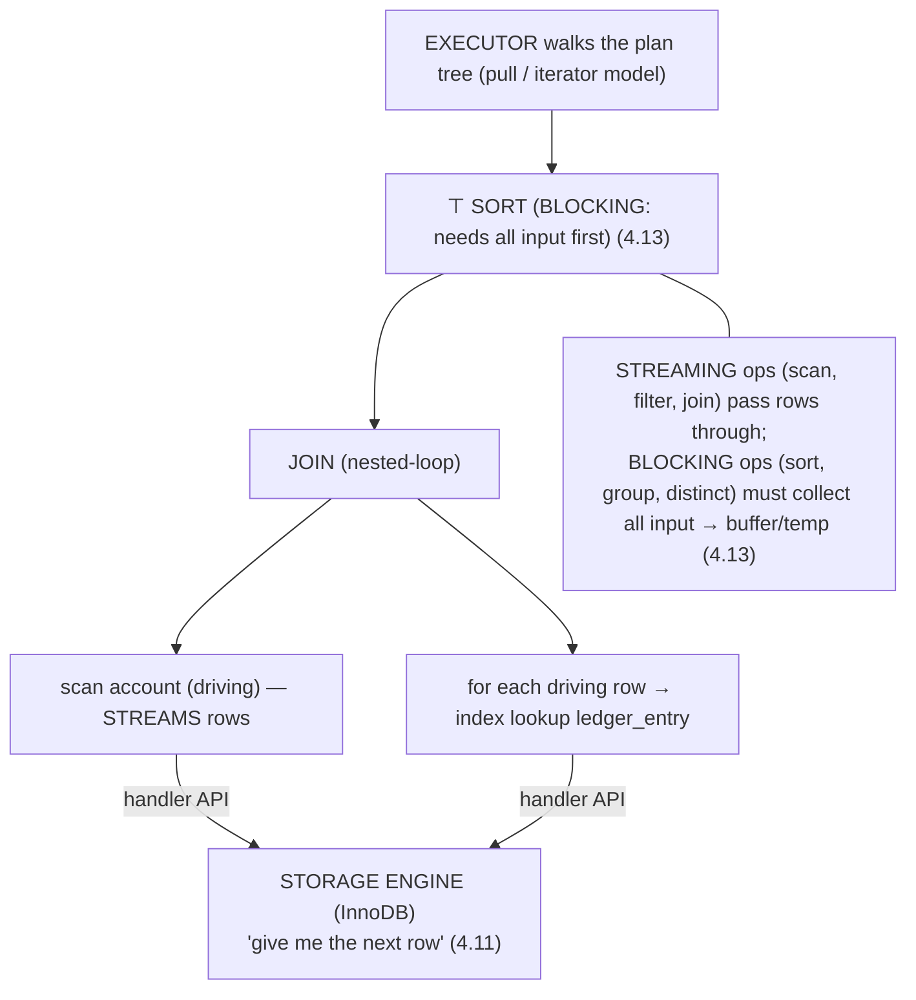
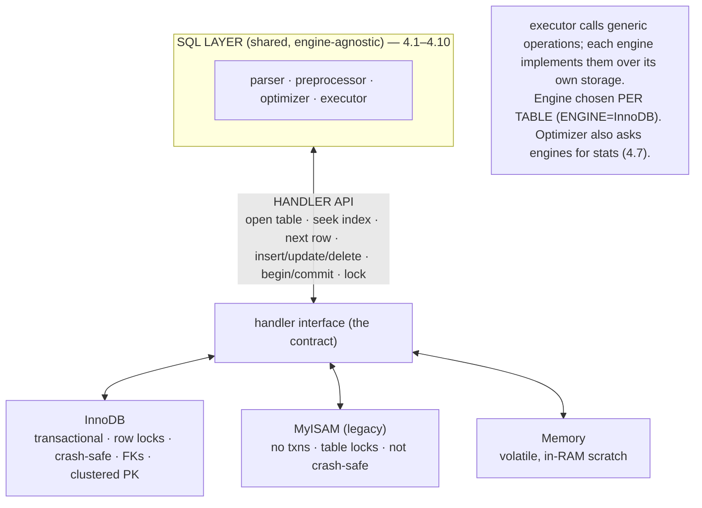
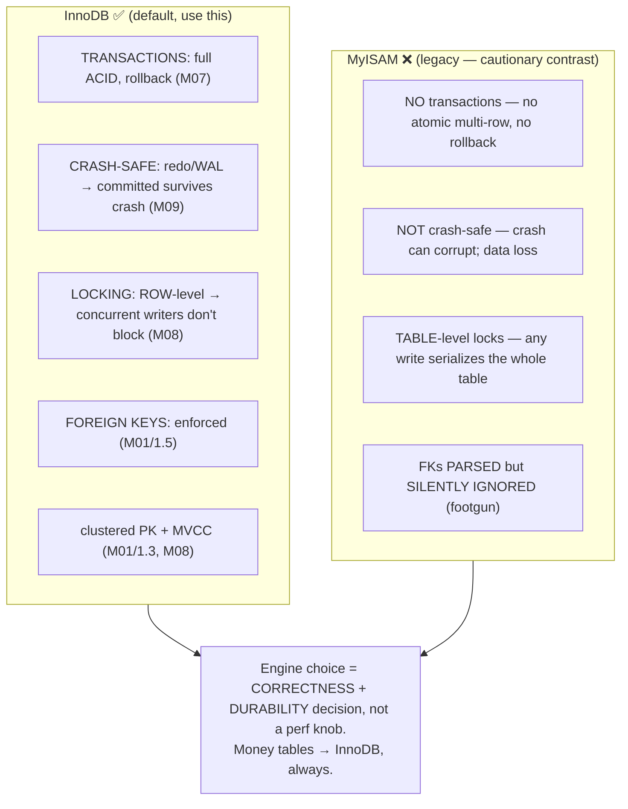
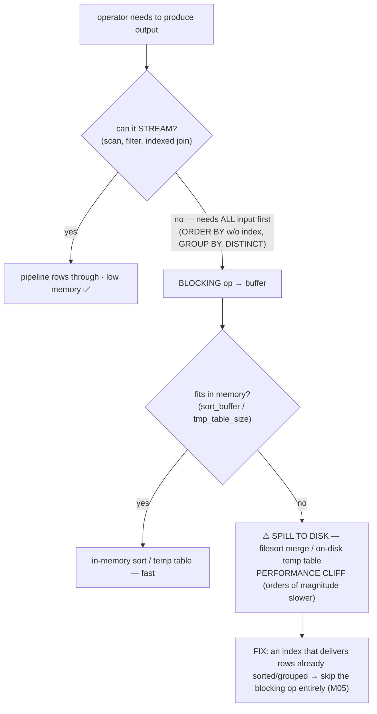
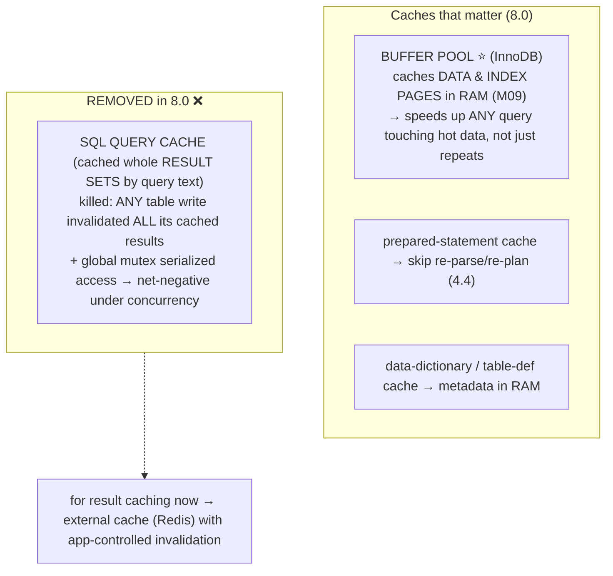
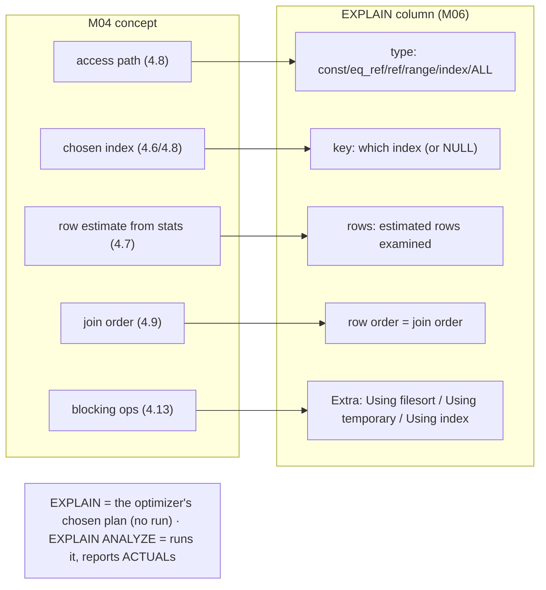
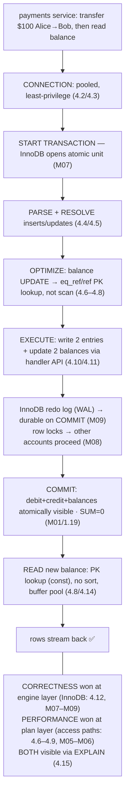

# M04 · Pass C — Diagrams & Worked Examples · Concepts 4.10–4.16

> Pass C scope: **#12 Diagram(s)** + **#8 Worked example** (narrated). Pairs with `03-execution-engine-results-capstone.md`. Includes the **★ storage-engine API** (4.11), **★ InnoDB vs MyISAM** (4.12), and the **★ money-query lifecycle** (4.16). Domain: payments/wallet.

---

## 4.10 · The execution engine: running the plan

**Diagram — executor pulls rows operator-by-operator, calling the engine:**

**Worked example — watch the executor drive a join.**
The optimizer handed over Plan A from 4.6 (drive from `account`, nested-loop into `ledger_entry`). Now watch the **executor** run it as a pull-based pipeline. The top operator asks for "the next row"; that request propagates down. The **join operator** pulls one row from its driving child — a scan of active `account` rows (which **streams**: it hands up one account at a time via the **handler API**, 4.11). For that account, the join operator asks its inner child — an **index lookup on `ledger_entry`** — for matching entries, again through the handler API ("position on account_id=42, give me the next row"). Each matching entry flows up; a **filter** operator drops any not meeting `WHERE`; survivors flow to the client. If the query had `ORDER BY` with no usable index, a **sort** operator would sit on top — and it's **blocking**: it can't emit *anything* until it has pulled *all* its input (you can't return sorted rows before seeing them all, 4.13). The example makes two things concrete: (1) the executor turns the abstract plan into actual **operator-by-operator row movement**, calling the storage engine at the leaves; and (2) the **streaming-vs-blocking** distinction — most operators pipeline rows through cheaply, but sort/group/distinct must materialize all input, which is where memory use spikes and disk spills happen (4.13). `EXPLAIN ANALYZE` (M06) actually runs this and reports per-operator time/rows — a direct window into this stage.

---

## 4.11 · The storage engine API & pluggable engines ★

**★ Diagram — SQL layer ↕ handler API ↕ pluggable engines:**

**Worked example — the same SELECT, two engines, one interface.**
Run the *identical* statement `SELECT * FROM t WHERE id = 5` against two tables — one `ENGINE=InnoDB`, one `ENGINE=Memory`. From the **SQL layer's perspective, nothing differs**: the parser, preprocessor, optimizer, and executor produce and run the same logical plan, issuing the same **handler-API calls** — "open the table, position on the index at id=5, fetch the next row." What differs is entirely *below* the API: InnoDB satisfies those calls by reading a 16 KB page from its buffer pool (or disk), navigating its clustered B-tree, respecting MVCC and row locks; the Memory engine satisfies them from an in-RAM hash/tree with no durability. The executor neither knows nor cares — it just calls "next row" and gets rows. That's the **pluggable-engine architecture**: a stable handler contract separates *query processing* (shared) from *storage* (swappable per table). The example shows both the power (one SQL/optimizer/executor layer over many storage backends — the reason InnoDB could be developed independently and slotted in) and the catch (capabilities like transactions and FKs depend on the *engine* behind the API, not the SQL layer — so the *same* SQL gets wildly different *guarantees* depending on engine, which is exactly the subject of 4.12). The architectural lesson generalizes: a clean interface between layers (like a VFS over filesystems, or JDBC over databases) lets you substitute mechanisms without changing the policy above.

---

## 4.12 · InnoDB vs MyISAM (and why InnoDB) ★

**★ Diagram — guarantee-by-guarantee comparison:**

**Worked example — why a ledger on MyISAM is a disaster waiting to happen.**
Imagine the `ledger_entry` table were `ENGINE=MyISAM`. Walk the failures the comparison predicts, each on real money:
- **No transactions:** a transfer posts a debit and a credit as two statements. With MyISAM there's *no atomic commit and no rollback* — a crash or error *between* the two leaves the debit applied and the credit lost: **money vanishes**, and the double-entry invariant (`SUM=0`, M01/1.19) is silently broken with no way to roll back.
- **Not crash-safe:** a power loss mid-write can **corrupt the table**, requiring a repair and potentially losing committed entries — the durability the ledger absolutely requires simply isn't there.
- **Table-level locking:** every write locks the *entire* `ledger_entry` table, so concurrent transfers to *different* accounts **serialize** — catastrophic throughput under load (vs InnoDB's row locks that let unrelated transfers proceed in parallel, M08).
- **FKs ignored:** the `account_id` foreign key (M01/1.5) is *parsed and silently dropped*, so nothing prevents an entry pointing at a non-existent account — orphaned money.

Every one of these is disqualifying for money. Switch to `ENGINE=InnoDB` and they all vanish: the debit+credit commit atomically (M07), the redo log makes commits durable across crashes (M09), row locks allow concurrency (M08), and the FK prevents orphans (M01/1.5). The example *is* the concept's thesis: **transactionality, crash-safety, isolation, and referential integrity are correctness properties, not performance options** — choosing a non-transactional engine for money data is a category error (like using a cache as a system of record). For fintech the rule is absolute and non-negotiable: **all money tables are InnoDB.** MyISAM's only value here is as the cautionary contrast that makes *why* InnoDB's guarantees matter unmistakable.

---

## 4.13 · Result handling, buffers & sorting (filesort, temp tables)

**Diagram — stream vs buffer/sort/temp, and the disk-spill cliff:**

**Worked example — the ORDER BY that spills, and the index that saves it.**
"Show account 42's entries, newest first": `WHERE account_id = 42 ORDER BY created_at DESC`. With an index on `(account_id)` only, MySQL fetches account 42's rows (good) but then must **sort them by `created_at`** — a **filesort**. If account 42 has a few rows, the sort happens in the in-memory sort buffer (fast, though still extra work). But for a high-volume account with millions of entries, the rows **exceed the sort buffer and spill to disk** — a multi-pass external merge-sort that's orders of magnitude slower, turning a quick query into a stall. EXPLAIN flags it as **"Using filesort"** (M06). The fix isn't a bigger buffer (that just delays the cliff and costs RAM per connection) — it's an **index on `(account_id, created_at)`** that stores the rows *already in `created_at` order*. Now MySQL reads account 42's entries straight from the index **in sorted order** — no sort step at all, the blocking operation *eliminated*, the query streams. The same logic applies to `GROUP BY`/`DISTINCT` spilling into an **on-disk temp table** ("Using temporary"): an index providing the grouping order avoids it. The example teaches the concept's core lesson — *the cheapest sort is the one you avoided by reading data already in order* — and it's a major reason indexes matter beyond lookups (M05). "Using filesort" or "Using temporary" on a hot query is a top tuning target in M06.

---

## 4.14 · Caching layers in the path (and the dead query cache)

**Diagram — caches along the pipeline (buffer pool central; query cache gone):**

**Worked example — why the repeat is fast, and the query-cache myth.**
A dashboard reads "account 42 balance" repeatedly. It's fast — but a common misconception is *why*. People assume an old **SQL query cache** returns the cached result for the identical query text. In MySQL 8.0 that cache **doesn't exist** — it was deprecated in 5.7 and **removed in 8.0**. The real reason the repeat is fast: the **buffer pool** (M09) is holding the relevant `account` page in RAM from the first read, so subsequent reads find the page already cached — *no disk I/O*. Critically, the buffer pool caches **pages, not results**, so it speeds up *any* query touching that hot data (a different query on the same page also benefits), not just byte-identical repeats. The example also explains *why the query cache had to die*: it cached whole result sets keyed by exact query text, but **any write to a table invalidated every cached result for that table**, and a **global mutex** serialized access to the cache — so on write-heavy or high-concurrency workloads (like a payments system constantly writing the ledger) it *hurt* more than it helped (echoing M02/2.15's "invalidation cost can exceed hit benefit"). The practical takeaways (and a frequent interview gotcha): **don't look for or recommend `query_cache_size` in 8.0 — it's gone**; the cache that matters is the **buffer pool** (`innodb_buffer_pool_size`, the primary memory knob, M09), which is *why* keeping rows compact (M03/3.2) to fit more pages in it matters; and for true result caching, use an **external cache (Redis)** where the app controls invalidation granularity.

---

## 4.15 · Reading a plan: from concept to EXPLAIN (bridge to M06)

**Diagram — pipeline stage → EXPLAIN column:**

**Worked example — mapping the trace query to its EXPLAIN row (preview of M06).**
Run `EXPLAIN SELECT amount FROM ledger_entry WHERE account_id = 42 AND created_at >= '2025-06-01'`. Every column is a window into an M04 concept you now understand:
- **`type: range`** → the *access path* (4.8): an index range scan over account 42's June-onward rows (good). If you saw **`ALL`**, that's a full scan — the red flag to fix with an index.
- **`key: ix_acct_created`** → the *index the optimizer chose* (4.6/4.8) — here the `(account_id, created_at)` index from M01/1.14. `NULL` would mean no index used.
- **`rows: 1,240`** → the optimizer's *estimate* (4.7) of rows examined. If this were wildly off from reality (check with EXPLAIN ANALYZE), suspect **stale statistics**.
- **`Extra: Using index condition`** (or `Using index` if covering) → whether it's a covering access (4.8) or needs row fetches; **`Using filesort`** here would flag a sort step (4.13) to eliminate with a better index.

The example closes M04's loop: everything abstract about the pipeline — access paths, index choice, estimates, join order, blocking ops — is **made visible in EXPLAIN's columns**, and reading them is reading the optimizer's decisions. This *is* the bridge to M06, where you learn to read every field, spot the problems (full scans, filesorts, wrong estimates), and run the tuning loop (`write query → EXPLAIN → fix index/stats → re-EXPLAIN`). The instinct it instills is universal: *when something's slow, make the system show you what it's actually doing before you change anything.*

---

## 4.16 · Fintech capstone — the lifecycle of a money query ★

**★ Diagram — the fully-annotated money-query lifecycle:**

**Worked example — "post a transfer + read the new balance," end to end.**
Trace Alice→Bob $100 through the whole pipeline and watch *where each property is won*:
1. The service borrows a **pooled, least-privilege connection** (4.2/4.3) — strict `sql_mode`, UTC `time_zone` (M03).
2. **`START TRANSACTION`** — InnoDB opens an atomic unit (M07); nothing is visible until commit.
3. The transfer's `INSERT`s into `ledger_entry` and `UPDATE`s of `balance` are **parsed and resolved** to the real typed columns (4.4/4.5, M03/3.17).
4. The **optimizer** picks the access path for `UPDATE ... WHERE account_id = ...` — a PK/`(account_id)` **index lookup** (`eq_ref`/`ref`, 4.8), *not* a scan; statistics (4.7) confirm selectivity.
5. The **executor** writes the two entries and updates the two balances via the **handler API** into **InnoDB** (4.10/4.11).
6. **Durability/concurrency:** InnoDB's **redo log (WAL)** ensures that on commit the transfer **survives a crash** (M09); **row locks** let transfers on *other* accounts run concurrently (M08).
7. **`COMMIT`:** debit + credit + both balance updates become atomically visible; the **double-entry invariant** holds (`SUM=0`, M01/1.19).
8. **Read the new balance:** a PK lookup (`const`/`eq_ref`, 4.8), no sort, served from the **buffer pool** (4.14) if hot.

The capstone proves the module's whole thesis on the highest-stakes operation: **correctness is won at the engine layer** (InnoDB's transactionality, durability, isolation, FKs — 4.11/4.12, M07–M09) and **performance is won at the plan layer** (the optimizer choosing index access paths over the M01/1.14-indexed, M03-typed schema — 4.6–4.9, M05–M06) — and **both are observable and tunable via EXPLAIN** (4.15). It ties every thread together: generics-first (this pipeline shape is universal), tradeoff (the optimizer is a cost machine; the engine is a guarantees-vs-speed choice), and durability/money-never-lies (only a transactional crash-safe engine makes a money write trustworthy). The transferable instinct for *any* critical query: ask, separately, *"what guarantees does the storage layer give me?"* and *"what plan will the optimizer use?"* — because they're won at different layers. This single trace is the spine the rest of the resource fleshes out: **M05** makes the paths fast, **M06** makes them visible, **M07** makes the transaction atomic, **M08** handles concurrency, **M09** provides durability, **M16** scales it into a platform. M04 is the map; this is the territory.

---

*Diagrams + worked examples for 4.10–4.16 complete. **M04 Pass C is fully drafted (all 16 concepts).** Remaining for M04: Pass D — code-specifics boxes, failure modes & gotchas, fintech lens, interview/SD angle, and self-check questions.*
