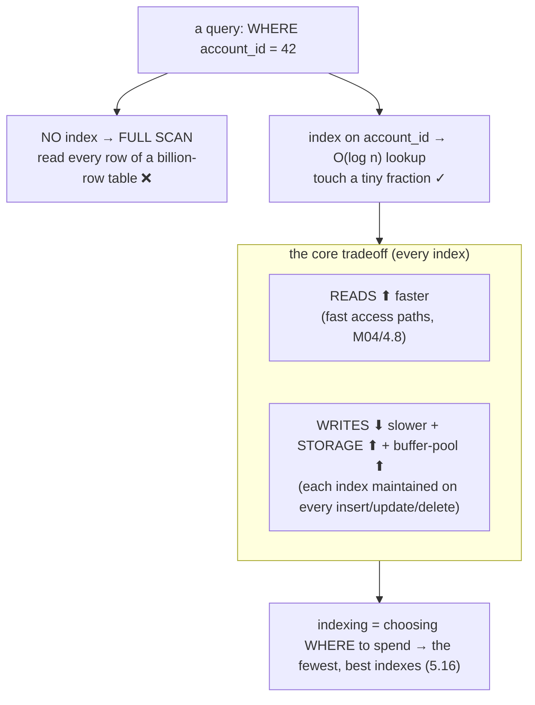
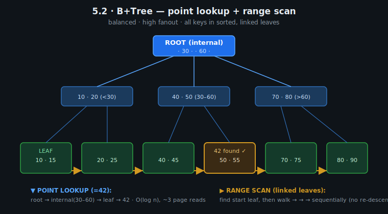
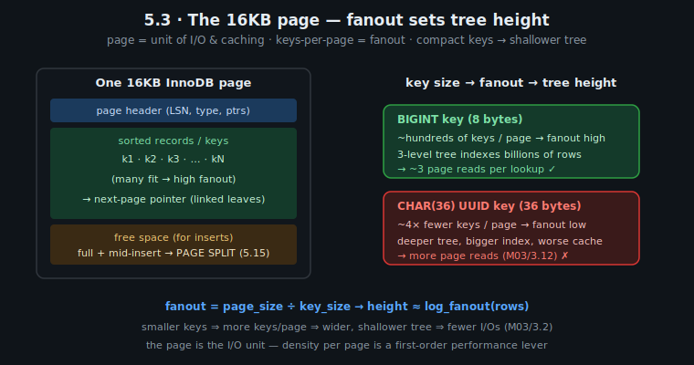
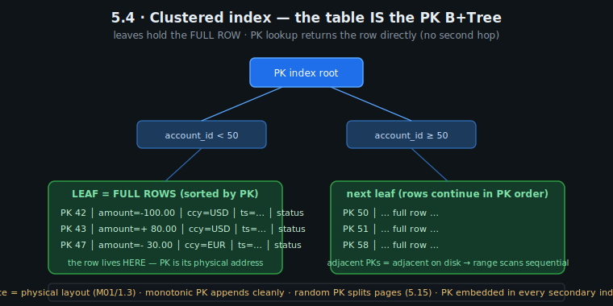
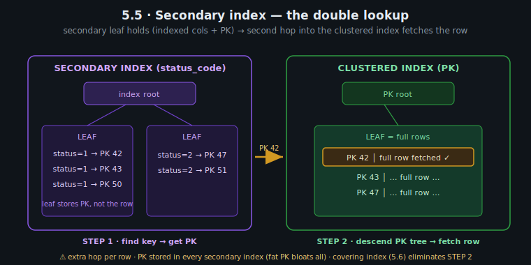
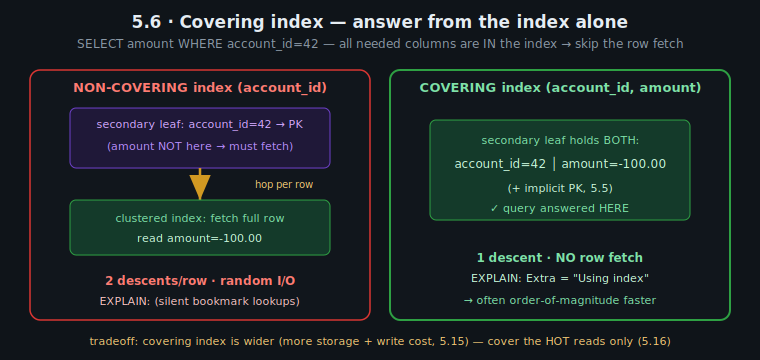

# M05 · Pass C — Diagrams & Worked Examples · Concepts 5.1–5.6

> **Pass C scope:** content-contract items **#12 Diagram(s)** and **#8 Worked example** (narrated, no code in prose). Pairs with `01-structural-foundation.md`. Concepts 5.2–5.6 use **★ bespoke custom SVGs** (in `assets/`, validated to render); 5.1 uses Mermaid. Domain: payments/wallet, M03 typed schema.

---

## 5.1 · What an index is (and the core tradeoff)

**Diagram — the read↑/write↓ seesaw:**

**Worked example — finding "account 42's entries" with vs without an index.**
The `ledger_entry` table has a billion rows. A support tool runs `WHERE account_id = 42`. **Without an index** on `account_id`, MySQL has no choice but a **full table scan** (M04/4.8): read all billion rows, test each one's `account_id`, keep the matches — minutes of I/O, and it gets *worse* every day as the ledger grows. **With an index** on `account_id`, MySQL searches a sorted B+Tree (5.2) in O(log n) — a handful of page reads — to find exactly account 42's entries, then fetches them. Milliseconds, and it stays fast as the table grows (a B+Tree's height barely changes). That's the read win. The cost the seesaw shows: every time the payments service *inserts* a new entry, that index must be updated too — the new `account_id` placed into its correct sorted position in the B+Tree — extra write work on the hottest write path in the system, plus disk and buffer-pool space for the index. So the index isn't free magic; it's a *trade*: dramatically faster reads on `account_id`, paid for on every write. The module's whole discipline follows from this one example — **which** indexes are worth that trade (5.16), and what happens when you over-spend (5.15).

---

## 5.2 · The B+Tree: the structure behind almost every index ★

**★ Diagram (custom SVG):**

**Worked example — one lookup and one range, down the same tree.**
Picture the B+Tree above indexing `account_id`. **Point lookup (`account_id = 42`):** start at the **root**, which routes by separator keys (42 falls in the "30–60" branch) → descend to the **internal** page → which routes to the correct **leaf** page → scan the leaf's sorted keys → find 42. Three page reads for a billion-row table, because the tree is *shallow* (high fanout, 5.3) and *balanced* (every leaf is equidistant from the root, so every lookup costs the same). **Range scan (`created_at BETWEEN 'Jun' AND 'Aug'` within an account):** descend once to the **start** of the range, then — and this is the B+Tree's second superpower — **walk the linked leaf pages sequentially** (the orange arrows), reading each in order without ever re-descending the tree. That linked-leaf structure is *why* ranges, `ORDER BY`, and prefix scans are efficient on a B+Tree but not on a hash index (5.14, no order) — and it's the structural reason a plain B-Tree (data in internal nodes too) is worse for ranges. This single structure delivers *both* fast point lookups *and* efficient range scans, which is exactly the pair of operations an index must serve — and understanding it is what makes every later rule (leftmost-prefix 5.7, why random keys split pages 5.15) obvious rather than memorized. (The deep page-format internals are M09; here the B+Tree is the structure that *explains the index-design rules*.)

---

## 5.3 · Pages: the unit of index (and table) storage ★

**★ Diagram (custom SVG):**

**Worked example — why a compact key gives a shallower, faster tree.**
The B+Tree is really **pages pointing to pages**, and each 16KB page holds as many keys as fit (the SVG's left panel: header + sorted records + free space). The number that fits — the **fanout** — sets the tree's height, and key *size* drives fanout. Compare two PK choices for `ledger_entry` (the SVG's right panels): a **BIGINT** key (8 bytes) packs hundreds of keys per page → high fanout → a 3-level tree indexes *billions* of rows → ~3 page reads per lookup. A **CHAR(36) UUID** key (36 bytes, M03/3.12) packs ~4× *fewer* keys per page → lower fanout → a *deeper* tree → *more* page reads per lookup, a bigger index on disk, and — decisively — far less of the index fits in the buffer pool (M09), so more reads hit disk. Same logical index, materially different speed, decided entirely by key size. This is the structural mechanism *behind* M03/3.2's "footprint → performance" rule and M03/3.12's "store UUIDs as BINARY(16) not CHAR(36)": **the page is the I/O unit, fanout (keys-per-page) sets tree height, and compact keys make everything shallower, smaller, and more cache-resident.** It's the single highest-leverage, lowest-effort index optimization — and it costs nothing but choosing the right type. (The page also has free space for inserts; when it fills and a key must go in the middle, it splits — 5.15.)

---

## 5.4 · Clustered index: the table IS its primary-key B+Tree ★

**★ Diagram (custom SVG):**

**Worked example — the PK lookup that needs no second hop, and the range that's sequential.**
Here's the InnoDB fact that explains a huge amount (the SVG): **the table's rows live *inside* the leaf pages of the primary-key B+Tree** — the clustered index *is* the table. Two consequences play out for `ledger_entry`. **(1) PK lookup = row in hand.** A query by primary key descends the PK tree to the leaf and the **full row is right there** — no second fetch (contrast a secondary index, 5.5, which needs an extra hop). This is why a PK lookup is the cheapest access path (M04/4.8 `const`/`eq_ref`). **(2) Range scans on the PK are sequential.** Because rows are *physically stored in PK order*, clustering `ledger_entry` on `(account_id, created_at)` means account 42's entries sit in *adjacent leaf pages in time order* — so "account 42's June statement" reads physically contiguous pages sequentially (fast), the exact M01/1.14 "design for your queries" payoff. The flip side the SVG's footnote flags: because the PK *defines the physical layout*, PK choice is a layout decision (M01/1.3) — a **monotonic PK** (auto-inc/time-ordered, M03/3.12) appends new rows cleanly to the right edge, while a **random PK** (UUIDv4) scatters inserts across the tree and **splits pages** (5.15); and the **PK is embedded in every secondary index** (5.5), so a fat PK bloats them all. This one structural choice — clustering rows by PK — is the biggest single lever in the whole module, which is why M01, M03, and M05 all keep returning to "choose a compact, monotonic, query-shaped PK."

---

## 5.5 · Secondary indexes: pointers back to the clustered index ★

**★ Diagram (custom SVG):**

**Worked example — the invisible second hop.**
Since the row lives in the clustered (PK) index (5.4), a secondary index on, say, `status_code` can't hold the row — its leaves hold **the indexed value + the PK** (the SVG's left tree). So `WHERE status_code = 1` is a **two-step lookup**: **Step 1** — descend the *secondary* B+Tree to find the matching entries and read their **PK values** (42, 43, 50). **Step 2** — for *each* of those PKs, descend the *clustered* index (the SVG's right tree) to fetch the actual row (the "bookmark lookup"). That second descent, repeated per matching row, is invisible in the SQL but very real in cost — and it explains three things at once: **(a)** the **PK is the "pointer"** stored in every secondary index, so a fat PK bloats all of them (5.4, M03/3.12); **(b)** a secondary index that returns *many* rows can be *slower* than a scan (many random bookmark lookups), which is why the optimizer sometimes correctly ignores it for low-selectivity predicates (5.9); and **(c)** if you could *avoid* Step 2 — by putting the needed columns *in* the secondary index — you'd eliminate the per-row hop entirely. That escape is the **covering index** (5.6), the single biggest read optimization, and it's the natural next concept. (InnoDB uses the *logical* PK rather than a physical pointer as the bookmark precisely so rows can move within the clustered index — page splits, etc. — without invalidating every secondary index.)

---

## 5.6 · Covering indexes: answering from the index alone ★

**★ Diagram (custom SVG):**

**Worked example — `SELECT amount WHERE account_id = 42`, two indexes.**
The SVG contrasts the same hot read under two indexes. **Non-covering — index on `(account_id)`:** Step 1 finds account 42's entries and their PKs in the secondary index, but `amount` isn't there — so Step 2 does a **bookmark lookup into the clustered index for *every* matching row** to fetch `amount` (5.5). For an account with thousands of entries, that's thousands of random row fetches. **Covering — index on `(account_id, amount)`:** the secondary leaf now holds **both** `account_id` *and* `amount` (plus the implicit PK, 5.5), so the query is **answered entirely from the index leaf — Step 2 never happens.** No clustered-index access at all; EXPLAIN shows **`Extra: Using index`**. On a query run millions of times (a balance/statement read on a hot account), eliminating the per-row hop is routinely an *order-of-magnitude* win — you read only the dense index pages and skip all the scattered row fetches. This is *the* highest-leverage "make this specific query fast" tool, and it's *why* you sometimes deliberately make an index **wider** (add a column it doesn't even filter on) — to cover a hot query. The tradeoff the SVG notes: a covering index carries extra columns, so it's bigger (more storage, more buffer-pool space, more write cost, 5.15) — you can't cover *everything* (you'd duplicate the table in indexes), so you cover the **genuinely hot reads** identified by access-pattern analysis (5.16). For the ledger, extending the clustered/composite index to cover the dominant statement and balance reads is a cornerstone of the capstone design (5.18).

---

*Diagrams + worked examples for 5.1–5.6 complete (5 ★ custom SVGs embedded + 1 Mermaid). Next Pass C file: 5.7–5.14 (★ composite sort-order SVG + Mermaid for the design levers and modern toolbox).*
