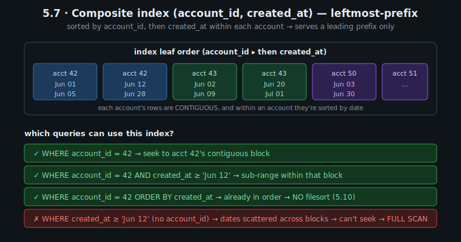
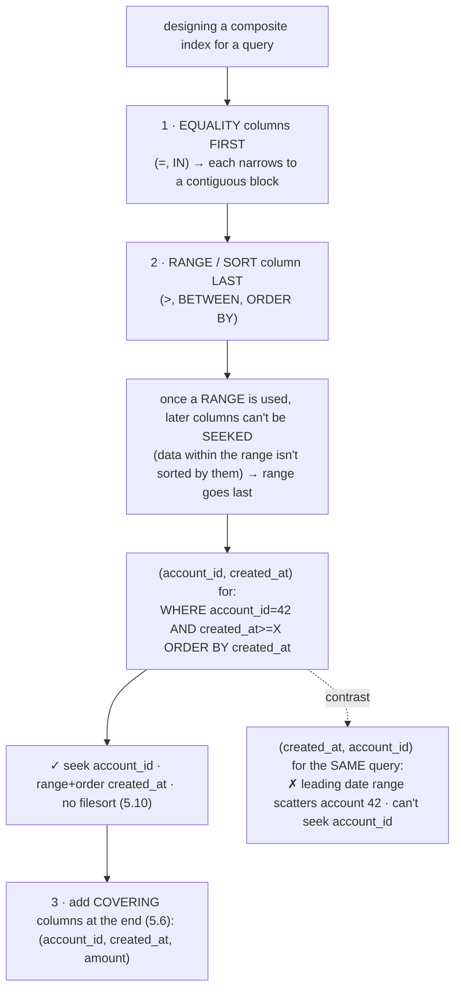
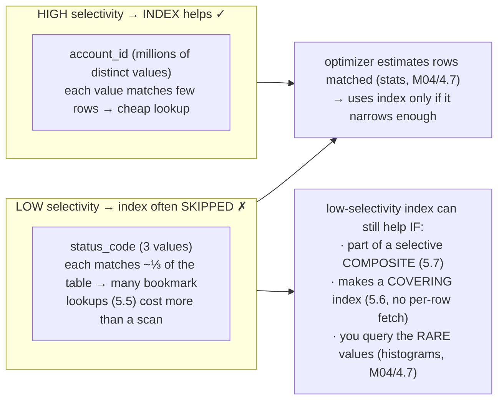
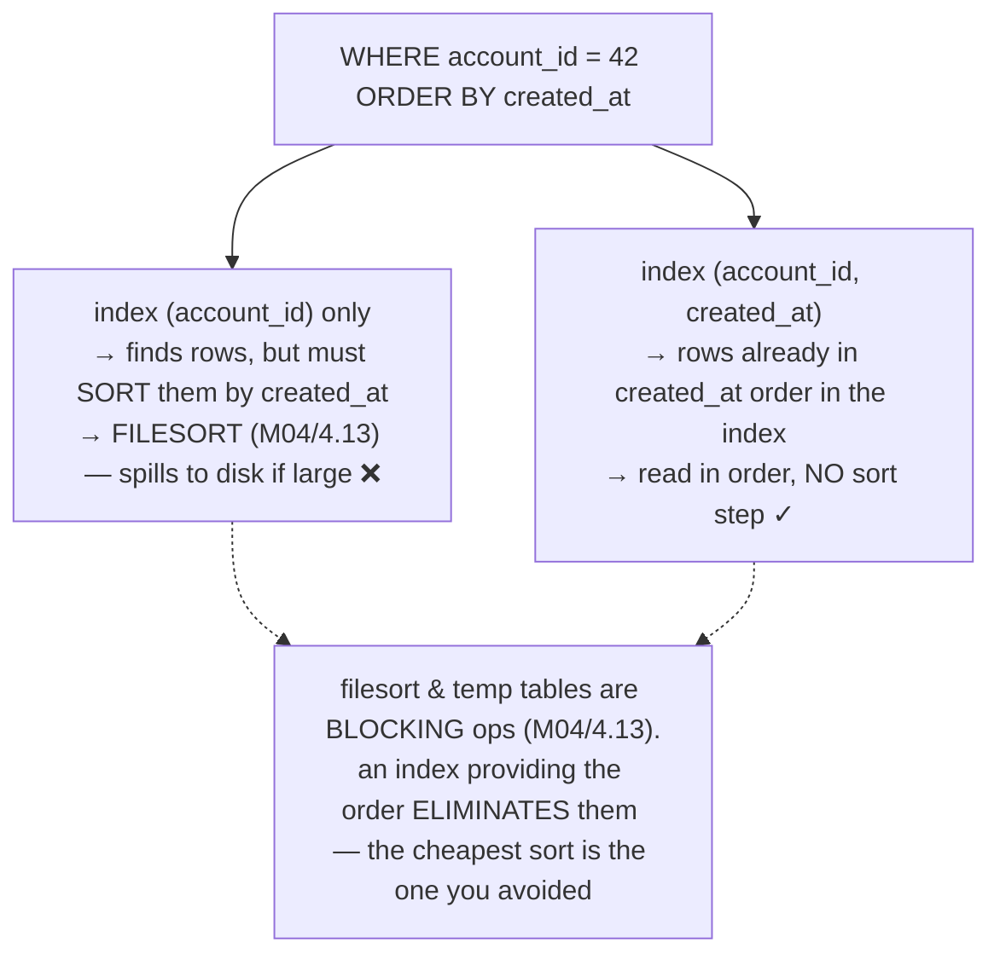
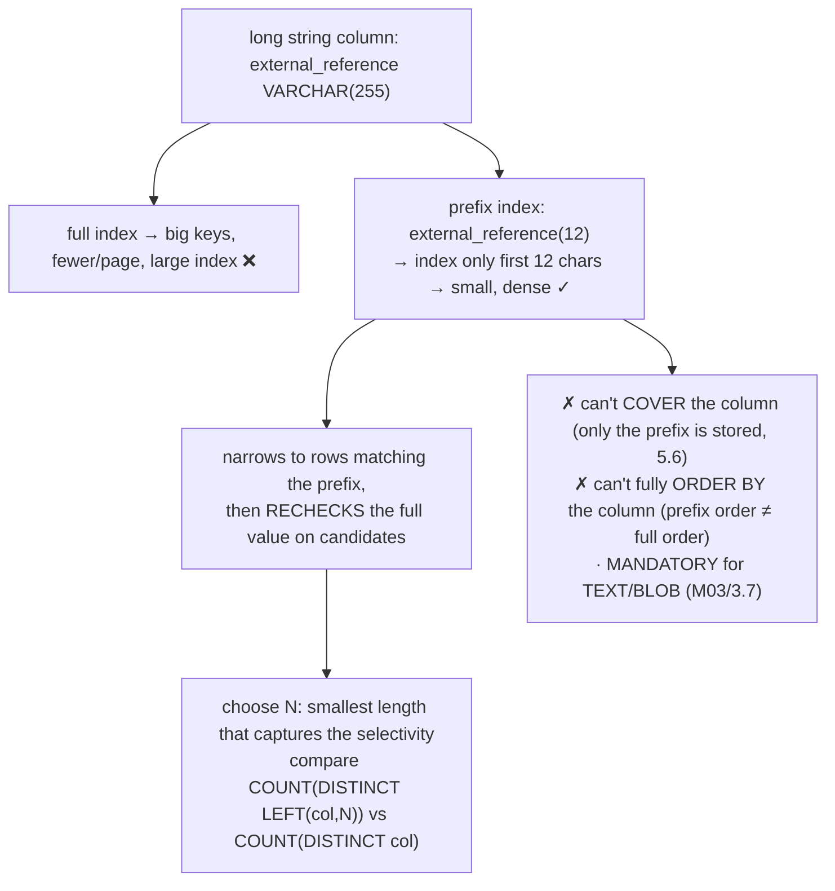
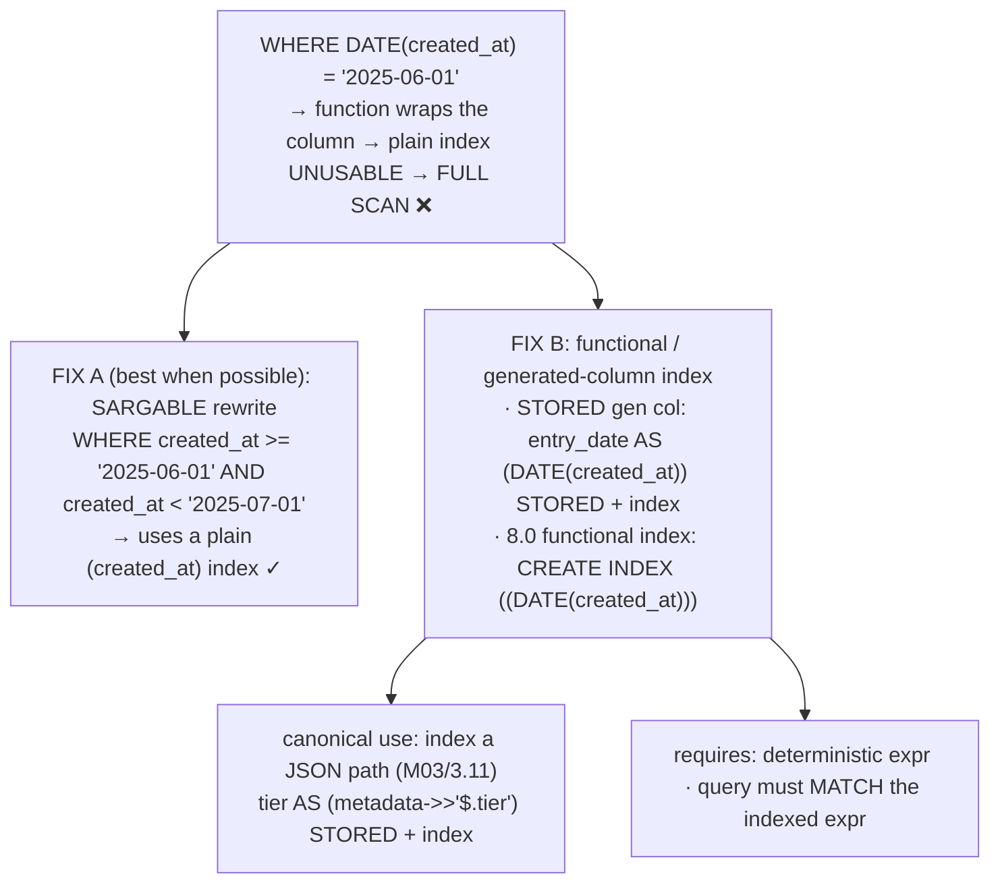
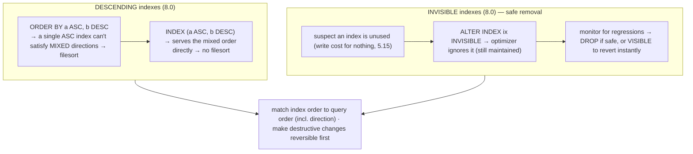
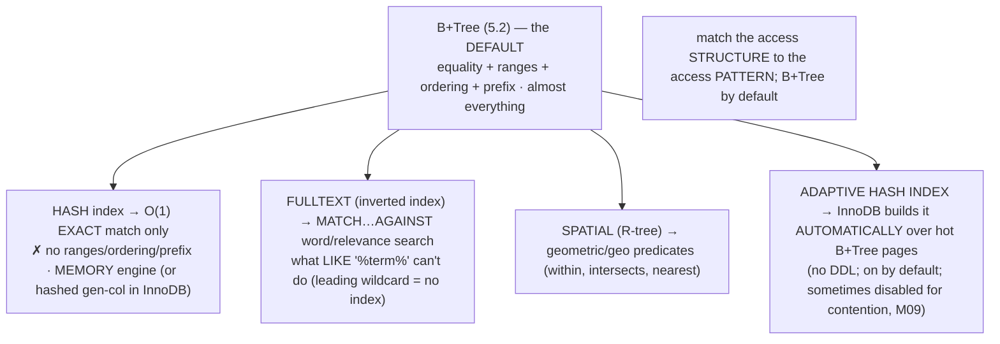

# M05 · Pass C — Diagrams & Worked Examples · Concepts 5.7–5.14

> Pass C scope: **#12 Diagram(s)** + **#8 Worked example** (narrated). Pairs with `02-design-levers-and-toolbox.md`. Concept 5.7 uses a **★ bespoke custom SVG** (`assets/`, validated); 5.8–5.14 use Mermaid. Domain: payments/wallet.

---

## 5.7 · Composite indexes & the leftmost-prefix rule ★

**★ Diagram (custom SVG):**

**Worked example — one index, three queries served and one refused.**
The index `(account_id, created_at)` is **sorted by `account_id` first, then by `created_at` within each account** (the SVG's leaf order: account 42's rows are contiguous and date-ordered, then account 43's, etc.). That single sort order determines exactly which queries the index can serve — the **leftmost-prefix rule**:
- ✓ `WHERE account_id = 42` → seek straight to account 42's **contiguous block**. Served.
- ✓ `WHERE account_id = 42 AND created_at >= 'Jun 12'` → a **sub-range** within that block (the dates are sorted there). Served.
- ✓ `WHERE account_id = 42 ORDER BY created_at` → the rows are **already in date order** within the block → **no filesort** (5.10). Served.
- ✗ `WHERE created_at >= 'Jun 12'` (no `account_id`) → the dates are **scattered across every account's block** (the index isn't sorted by date at the top level), so MySQL can't seek → **full scan**. *Refused.*

The lesson is that the refusal isn't an arbitrary MySQL rule — it's a *property of lexicographic ordering* (like a phone book sorted by (last, first): you can find all "Smith"s or "Smith, John" but not all "John"s). And the *power* is that **one well-ordered composite index serves a whole family of related queries** (the three ✓ cases) — which is why composite indexes, not piles of single-column indexes, are the foundation of an efficient, minimal index set (5.16). The flip side — that the index serves only prefixes *starting from its leading column* — is exactly what makes **column order** the highest-leverage design decision (5.8): the order you pick determines which query family the index can serve.

---

## 5.8 · Column order in composite indexes (the design decision)

**Diagram — equality → range/sort ordering:**

**Worked example — `(account_id, created_at)` vs `(created_at, account_id)`.**
The query: `WHERE account_id = 42 AND created_at >= '2025-06-01' ORDER BY created_at`. Both candidate indexes contain the same two columns — but **order decides everything**. With **`(account_id, created_at)`** (equality column first, range/sort column last): MySQL seeks directly to account 42's contiguous block (equality on the leading column), then range-scans `created_at >= X` *within* that block — and because the block is already in `created_at` order, the `ORDER BY` is satisfied for free (**no filesort**, 5.10). Ideal. With **`(created_at, account_id)`** (range/sort column first): the leading column is a *range* (`created_at >= X`), which scatters account 42's rows across the whole date range — MySQL can't seek to `account_id = 42` (it's the *second* column, only reachable after fixing the first, which a range doesn't fix), so it scans far more than needed and likely still filesorts. Same columns, one order works and one doesn't — because of leftmost-prefix (5.7) and the rule that **once you range on a column, you can't seek on later ones**. The reliable heuristic the diagram captures: **equality columns first, then the single range/sort column last** — and append covering columns (`amount`, 5.6) at the end for a pure index-only read. This per-query column-ordering reasoning is the heart of practical index design and a staple interview exercise; EXPLAIN confirms the good order (`type: range`, no `Using filesort`).

---

## 5.9 · Selectivity & cardinality: when an index helps

**Diagram — the selectivity spectrum:**

**Worked example — why your `status` index is ignored but `account_id` isn't.**
You add an index on `account.status_code` (3 values: active/closed/frozen) and notice EXPLAIN *ignores* it — `type: ALL`, a full scan. Not a bug. `status_code` is **low-cardinality**: `WHERE status_code = 1` (active) matches maybe a third of the table, so using the index means a **third of the table's worth of bookmark lookups** (5.5) — random I/O per row — which the optimizer correctly estimates (via statistics, M04/4.7) is *more* expensive than just sequentially scanning. Contrast `account_id` (millions of distinct values, **high selectivity**): `WHERE account_id = 42` matches a tiny handful of rows, so the index lookup + few fetches is far cheaper than a scan — the optimizer uses it. This explains the common "why isn't my index used?" mystery: **an index only helps in proportion to how much it narrows the search**, and a column that doesn't discriminate isn't worth a standalone index. But the diagram's rescue cases matter for nuance: that same `status_code` *can* earn its place if it rides in a **composite** index that's selective overall (e.g., `(account_id, status_code)`), if it enables a **covering** index (5.6, where there's no per-row fetch so selectivity matters less), or if you specifically query the *rare* value (`status = 'frozen'`, 1% of rows) and a **histogram** (M04/4.7) tells the optimizer it's selective *for that value*. So "don't index low-cardinality columns" is a strong default, not a law — the real question is always whether the index produces a *cheap access path for your actual query*.

---

## 5.10 · Index-only ordering & grouping (killing filesort/temp)

**Diagram — index order → skip the sort step:**

**Worked example — the statement query that stops filesorting.**
"Account 42's entries, newest first": `WHERE account_id = 42 ORDER BY created_at DESC`. With an index on **`(account_id)` only**, MySQL finds account 42's rows efficiently — but then has to **sort them by `created_at`**, a **filesort** (M04/4.13). For a high-volume account with millions of entries, that sort **exceeds the sort buffer and spills to disk** (a multi-pass external merge — the performance cliff from M04/4.13), turning a quick query into a stall; EXPLAIN flags `Using filesort`. The fix isn't a bigger buffer (delays the cliff, costs RAM per connection) — it's an index on **`(account_id, created_at)`** that *stores account 42's rows already in `created_at` order*. Now MySQL reads them straight from the index **in sorted order** — the sort step is **eliminated**, not optimized. (`DESC` is served by reading the same index *backward*, or a descending index, 5.13.) The same logic kills `GROUP BY`/`DISTINCT` temp tables ("Using temporary") when the grouping aligns with index order. This is one of the most impactful and most-*missed* indexing wins — indexes matter not just for *finding* rows but for *delivering them pre-ordered* — and it's a primary reason the sort column belongs in your composite index (5.8). The instinct: *the cheapest sort is the one you never do, because the data was already stored in that order.*

---

## 5.11 · Prefix indexes (indexing part of a long column)

**Diagram — index the first N chars (smaller, less selective):**

**Worked example — choosing the prefix length for a long reference.**
`ledger_entry` (or `transaction_`) has a long `external_reference` string you sometimes look up by. Indexing the **full 255 chars** would create huge index keys — fewer per page, a deep tree, a bloated index that crowds the buffer pool (5.3). But often the **first N characters are already discriminating enough** to locate rows. So you use a **prefix index** on, say, the first 12 chars: the B+Tree stores 12-char keys (small, dense), narrows a lookup to rows whose first 12 chars match, then **rechecks the full value** on those few candidates (the prefix can't distinguish values agreeing in the first 12 chars). You choose N empirically — find the smallest N where `COUNT(DISTINCT LEFT(external_reference, N))` approaches `COUNT(DISTINCT external_reference)` (most of the selectivity captured) — too short wastes the index (low selectivity, many rechecks, optimizer may skip it); too long defeats the size savings. The diagram's limitations are the cost: a prefix index **can't cover** the column (5.6 — it only has the prefix, not the full value) and **can't fully sort** by it (prefix order ≠ full-value order beyond the prefix). It's a targeted tool for *long, low-structure string columns* queried by a selective prefix — and the *only* way to index TEXT/BLOB (M03/3.7), which can't be fully indexed. For a *fixed-length, already-compact* identifier like `idempotency_key` (M01/1.2), you index the **full** value instead — it needs to be a covering UNIQUE index for exact-match dedup (5.17), which a prefix can't be.

---

## 5.12 · Functional & expression indexes

**Diagram — index the result of an expression:**

**Worked example — the `DATE(created_at)` scan, and two fixes.**
A reporting query filters `WHERE DATE(created_at) = '2025-06-01'`. Even with an index on `created_at`, this is a **full scan** — wrapping the column in `DATE()` makes the predicate **non-sargable**: MySQL would have to compute `DATE(created_at)` on *every* row to test it, so the plain `(created_at)` index can't be used. Two fixes. **Fix A (preferred):** rewrite to a **sargable range** — `WHERE created_at >= '2025-06-01' AND created_at < '2025-07-01'` — which expresses the same condition in terms of the *bare* column, so a plain `(created_at)` index works and you need *no* special index. **Fix B (when the transform is genuinely needed):** a **functional/expression index** — either a STORED generated column `entry_date AS (DATE(created_at)) STORED` with an index, or (8.0) a functional index `CREATE INDEX ... ((DATE(created_at)))` — which stores the *computed* values in sorted order so the predicate hits an index. Fix B's headline use case is **JSON** (M03/3.11): you can't index into a JSON blob directly, so you extract the path into a generated column (`tier AS (metadata->>'$.tier') STORED`) and index that — the sanctioned 1NF-escape made queryable. The diagram's requirements are the gotchas: the expression must be **deterministic**, and the **query's expression must match the indexed one** (change the query's transform and the index silently stops being used). The everyday lesson — and a frequent silent performance trap — is *don't wrap an indexed column in a function in your WHERE clause unless you've indexed that function (or, better, rewrite to be sargable).*

---

## 5.13 · Descending & invisible indexes (and other modern options)

**Diagram — direction-aware ordering + reversible index removal:**

**Worked example — a mixed-direction report, and retiring an index safely.**
Two modern tools. **Descending index:** a "latest entries first, then by amount ascending" report needs `ORDER BY created_at DESC, amount ASC`. A single ascending index can serve a *fully*-`DESC` order by scanning backward, but it **can't** satisfy this *mixed* order (one column DESC, one ASC) — so MySQL filesorts (5.10). A **descending index** `(created_at DESC, amount ASC)` stores the keys in exactly that mixed order, so the report streams from the index with **no filesort**. **Invisible index:** during index cleanup (5.16) you suspect an old index on the busy `ledger_entry` table is unused — but *dropping* it is scary (if some query secretly depends on it, you cause instant full scans across production). So you make it **invisible** (`ALTER INDEX ... INVISIBLE`): the optimizer now *pretends it doesn't exist* (so you can watch for regressions), but it's **still maintained** (instant, reversible — flip back to `VISIBLE` if anything breaks). After monitoring confirms nothing slowed down, you drop it for real. The shared principle: **match the index's order to the query's order including direction; and make destructive changes reversible before committing to them** — the same de-risking instinct as feature flags, canaries, and M01/1.6's soft-delete-before-hard-delete. Both are part of MySQL 8's safer index-management toolkit (with M13's online DDL), and invisible-then-drop is the standard way to *safely* prune the ledger's index set on a live system.

---

## 5.14 · Other index types: hash, fulltext, spatial, adaptive hash

**Diagram — index type → use case (match structure to query shape):**

**Worked example — searching transaction notes: fulltext, not `LIKE`.**
The ledger lives on B+Trees, but suppose a support tool needs to **search free-text transaction descriptions** for a word — "find transactions mentioning 'refund'." The naive approach, `WHERE description LIKE '%refund%'`, is a **full scan**: a leading-wildcard `LIKE` *cannot use a normal B+Tree index* (the index is sorted by leading characters, and `%refund%` doesn't anchor on a prefix), and it's substring matching, not real word/relevance search. The right tool is a **fulltext index** (an *inverted* index: word → list of rows containing it) queried with `MATCH(description) AGAINST('refund')` — efficient, and capable of relevance ranking and boolean operators. This is the concept's core lesson — **match the index structure to the query's *shape***: B+Trees for equality/ranges/ordering (almost everything), but **fulltext for text search**, **hash** for pure exact-match (MEMORY engine — no ranges), **spatial (R-tree)** for geo. The diagram also names the **adaptive hash index**: InnoDB *automatically* builds in-memory hash indexes over your hottest B+Tree pages, so repeated lookups of hot keys (a hot account, a hot PK) get hash-fast — *transparently*, no DDL, on by default (occasionally disabled if it causes contention, M09). So for our domain these are mostly niche (the ledger is B+Trees), but the instincts matter: don't do text search with `LIKE` (use fulltext), know the AHI is silently accelerating your hot lookups, and remember the meta-rule — **B+Tree by default, a specialized index only when the query shape genuinely demands it.**

---

*Diagrams + worked examples for 5.7–5.14 complete (1 ★ custom SVG + 7 Mermaid). Next Pass C file: 5.15–5.18 (★ page-split SVG, ★ fully-indexed money-model SVG, + Mermaid for methodology and integrity).*
