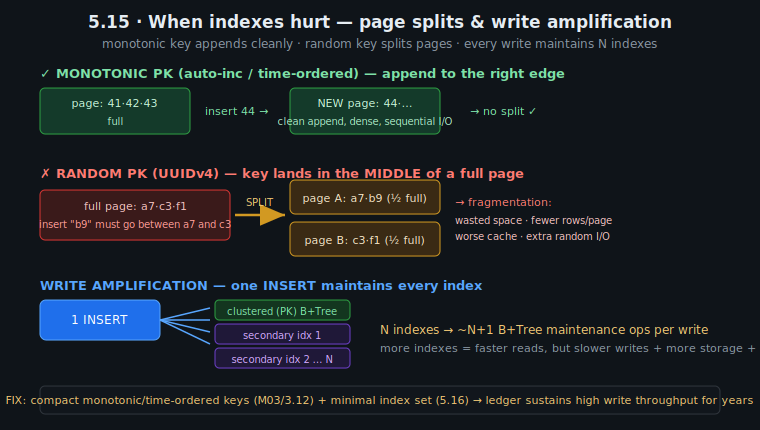
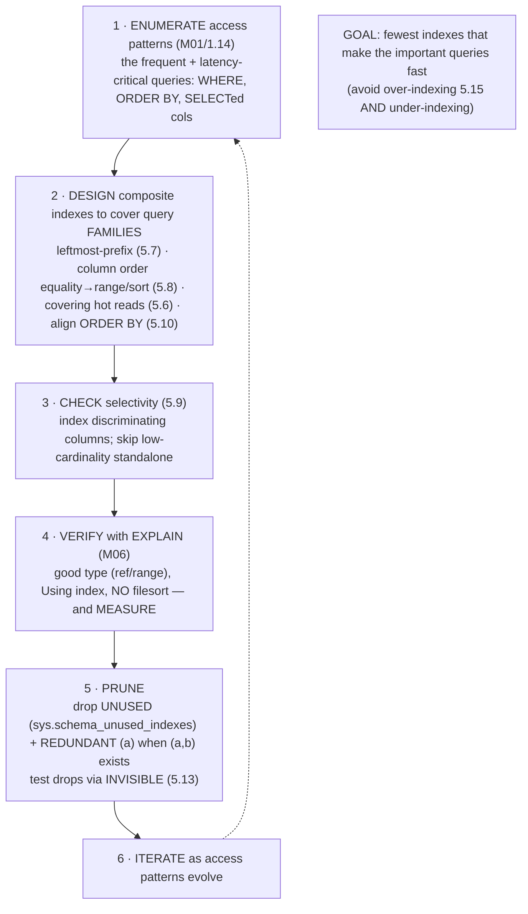
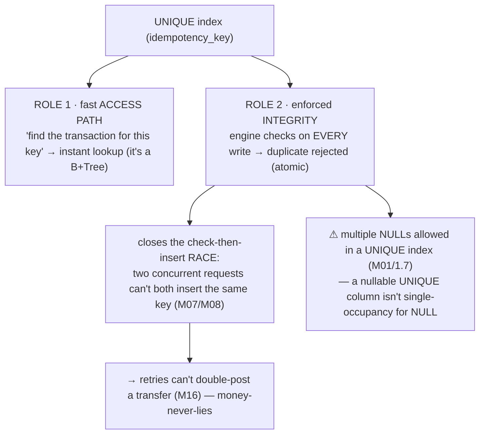
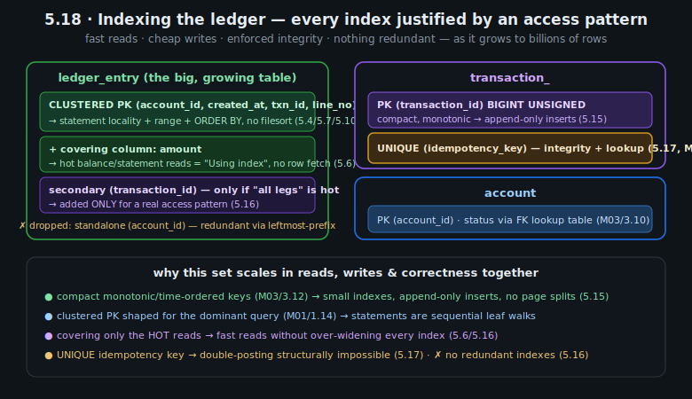

# M05 · Pass C — Diagrams & Worked Examples · Concepts 5.15–5.18

> Pass C scope: **#12 Diagram(s)** + **#8 Worked example** (narrated). Pairs with `03-when-indexes-hurt-methodology-integrity-capstone.md`. Concepts 5.15 and 5.18 use **★ bespoke custom SVGs** (`assets/`, validated); 5.16–5.17 use Mermaid. Domain: payments/wallet. These close out M05 Pass C.

---

## 5.15 · When indexes hurt: write amplification & page splits ★

**★ Diagram (custom SVG):**

**Worked example — UUIDv4 PK vs monotonic PK, and the cost of 8 indexes.**
Two cost mechanisms, both in the SVG. **Page splits (key order):** with a **monotonic PK** (BIGINT auto-inc or time-ordered ULID/UUIDv7, M03/3.12), every new `ledger_entry` has a key *larger* than all existing ones, so it **appends to the rightmost leaf page**; when that page fills, a clean new page is added — dense pages, sequential I/O, no disruption. With a **random PK (UUIDv4)**, a new key (`b9`) often must be inserted into the *middle* of an already-full page (between `a7` and `c3`) — forcing a **page split**: half the page's rows move to a new page, leaving *both* pages ~half-full. The consequences cascade: **fragmentation** (wasted space → fewer rows per page → worse buffer-pool fit, 5.3), extra **random I/O**, and a steadily degrading clustered index. On the ledger — the hottest write target in the system — a random PK progressively chokes write throughput; this is *the* canonical MySQL anti-pattern (M03/3.12). **Write amplification (index count):** the SVG's bottom panel — a *single* `INSERT` doesn't update one structure, it updates the **clustered index plus every secondary index** (each must place the new key in sorted position). Eight indexes → ~9 B+Tree maintenance operations *per insert*. So "more indexes = faster reads but slower writes" (5.1) is *literal*: write cost scales with index count. Together these are the **cost half** of indexing that the whole module's discipline addresses — and they dictate the two ledger rules: **compact monotonic/time-ordered keys** (avoid splits) and a **minimal index set** (avoid write amplification), so the ledger sustains high write throughput for years (5.16/5.18). (`OPTIMIZE TABLE` can defragment split-bloat as maintenance, M13; the change buffer mitigates *secondary*-index write cost, M09, but not clustered-index splits.)

---

## 5.16 · Index design methodology: choosing the fewest, best indexes

**Diagram — the methodology loop:**

**Worked example — designing the ledger's index set, end to end.**
Apply the loop to `ledger_entry`. **(1) Enumerate** the access patterns (M01/1.14): "this account's statement over a date range, newest first" (very hot); "look up a transaction's idempotency key" (hot, on `transaction_`); "all legs of one transaction" (occasional). **(2) Design** composite indexes per family: the clustered PK `(account_id, created_at, transaction_id, line_no)` serves the *entire* statement family via leftmost-prefix (5.7) — account, account+date-range, account+`ORDER BY` date (no filesort, 5.10) — *one* index for three query shapes; extend it to **cover** `amount` (5.6) for the hot balance/statement reads. **(3) Check selectivity** (5.9): `account_id` is highly selective (good leading column); you *don't* add a standalone `status_code` index (low cardinality, optimizer would skip it). **(4) Verify** with EXPLAIN (M06): confirm the statement query shows `type: range`, `Using index`, *no* `Using filesort`. **(5) Prune**: notice a standalone `(account_id)` index is **redundant** — the clustered `(account_id, created_at, …)` already covers it via leftmost-prefix — so drop it (test-drop via invisible, 5.13, since it's a live table); use `sys.schema_unused_indexes` to find any others maintained for no benefit. **(6) Iterate** as new access patterns appear. The result is a *lean, intentional* index set where each index serves a real query family and *nothing is redundant* — which is exactly what keeps write amplification (5.15) low on the high-volume ledger. The methodology is the practical synthesis of the whole module: it manages the central read/write tradeoff (5.1) *deliberately*, avoiding both over-indexing (drowned writes) and under-indexing (scans/filesorts), and it's the bridge into M06's tuning loop.

---

## 5.17 · Indexes as integrity: UNIQUE indexes & constraints

**Diagram — UNIQUE index = access path + enforced invariant:**

**Worked example — the idempotency-key UNIQUE index stops a double-posted transfer.**
A payment request to transfer $100 is, inevitably in a distributed system, **retried** (the client timed out, a queue redelivered, a proxy retried). Without protection, the retry posts the transfer *again* — Alice is debited twice, money is duplicated, the books are wrong. The structural fix is a **UNIQUE index on `transaction_.idempotency_key`** (the request's fingerprint). It does *two jobs at once* (the diagram). **Role 1 — access path:** it's a B+Tree, so "find the transaction for this idempotency key" is an instant lookup. **Role 2 — integrity:** the engine checks it on *every* write, so when the retry tries to insert a row with the *same* idempotency key, it's **rejected** (duplicate-key error) — which the application catches to return the *original* result ("already processed") instead of posting again. Critically, this enforcement is **atomic at the engine level**, which closes a race that application-level checks can't: two concurrent retries both running "SELECT — not present? — INSERT" would *both* see "not present" and *both* insert (M07/M08) — a duplicate slips through. The UNIQUE index makes the check-and-insert one atomic operation, so exactly one wins. This is where indexing and correctness converge: the *same structure* that makes lookups fast also makes double-posting **structurally impossible** — the money-never-lies thread realized in an index, and a top system-design interview point (idempotency, M16). The diagram's gotcha (M01/1.7): MySQL allows *multiple NULLs* in a UNIQUE index, so if the unique column can be NULL, use NOT NULL or a generated-column workaround — otherwise the "uniqueness" silently doesn't hold for NULLs.

---

## 5.18 · Fintech capstone — indexing the ledger ★

**★ Diagram (custom SVG):**

**Worked example — every index on the money model, justified.**
The SVG assembles the whole module into the **complete, justified index set** for the payments schema — each index earning its place by serving a real access pattern (M01/1.14) while keeping write amplification minimal (5.15):
- **`ledger_entry` clustered PK `(account_id, created_at, transaction_id, line_no)`** (5.4): clusters each account's history in time order, so the *entire* statement family — "this account's entries," "in a date range," "ordered by date" — is served by *one* index as **sequential leaf walks with no filesort** (5.7/5.10). The biggest single structural win.
- **Covering extension `amount`** (5.6): the dominant balance/statement reads are answered **from the index alone** (`Using index`, no bookmark hop, 5.5/5.6).
- **`transaction_` UNIQUE on `idempotency_key`** (5.17): makes double-posting **structurally impossible** *and* provides instant "find by idempotency key" lookups — integrity *and* performance from one index.
- **Secondary `(transaction_id)` on `ledger_entry`** — added **only** because "all legs of a transaction" is a genuine access pattern (5.16); omitted otherwise.
- **Compact, monotonic/time-ordered keys throughout** (M03/3.12): BIGINT/BINARY(16) → small indexes (5.3), append-only inserts, **no page splits** (5.15).
- **✗ No redundant indexes** (5.16): a standalone `(account_id)` is dropped because the clustered `(account_id, …)` covers it via leftmost-prefix (5.7).

The result proves the module's thesis on the highest-stakes table: a *deliberately designed, minimal* index set keeps the ledger **fast for reads** (statements/reconciliation stay quick as it grows to billions of rows), **cheap for writes** (low write amplification, no splits), and **correct** (UNIQUE enforces idempotency) — *simultaneously*. The failure alternatives are instructive: a random UUID PK chokes writes via splits (5.15/M03·3.12); over-indexing the ledger kills write throughput (write amplification); under-indexing makes statements/reconciliation full-scan billions of rows. The capstone threads between them by **method** (5.16), not luck — and this exact indexed schema is what **M06** will EXPLAIN-and-tune, **M07/M08** will transact-and-lock, **M09** will hold in the buffer pool, and **M16** will scale across shards. Indexing the ledger well is one of the highest-leverage decisions in the entire fintech data design.

---

*Diagrams + worked examples for 5.15–5.18 complete (2 ★ custom SVGs + 2 Mermaid). **M05 Pass C is fully drafted (all 18 concepts: 8 ★ custom SVGs + 10 Mermaid, all validated).** Remaining for M05: Pass D — code-specifics boxes, failure modes & gotchas, fintech lens, interview/SD angle, and self-check questions.*
