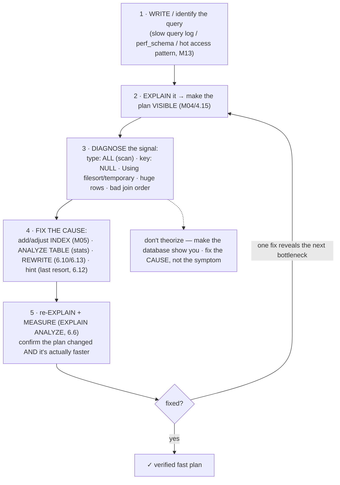
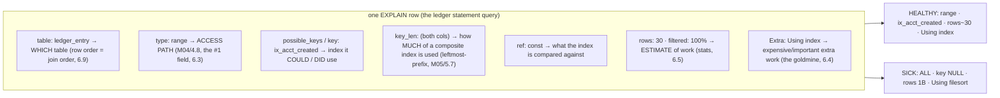
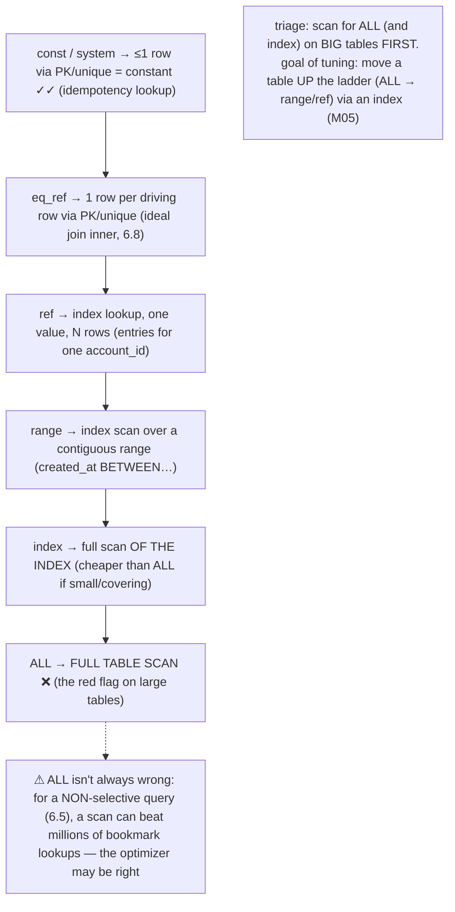
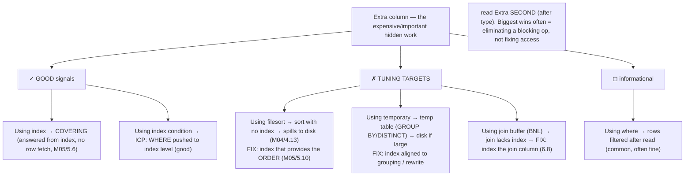
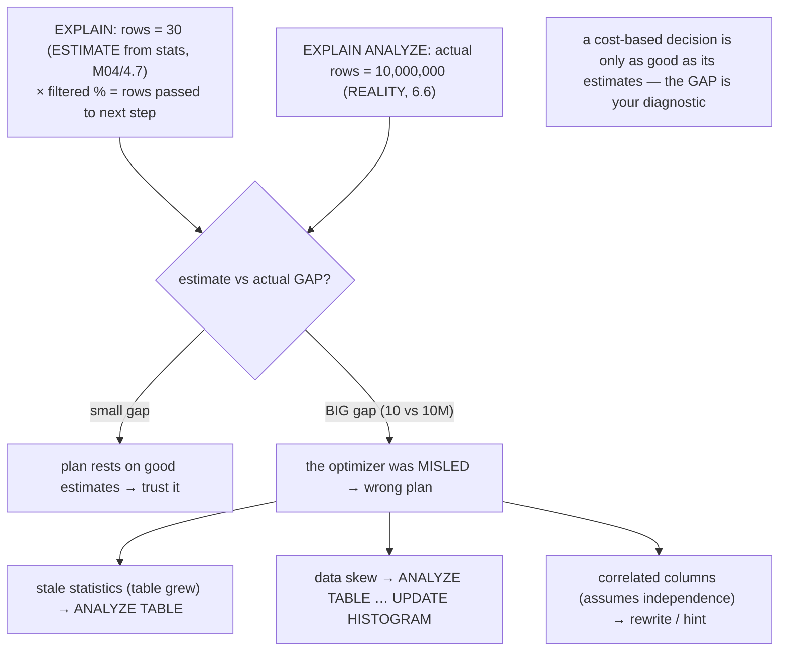
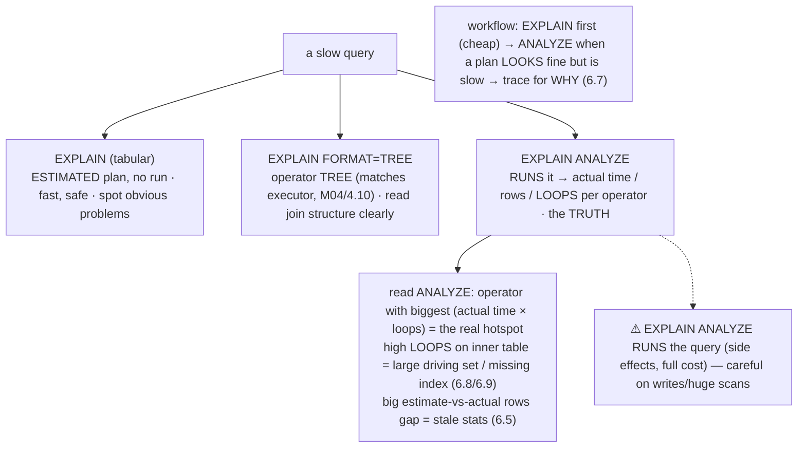
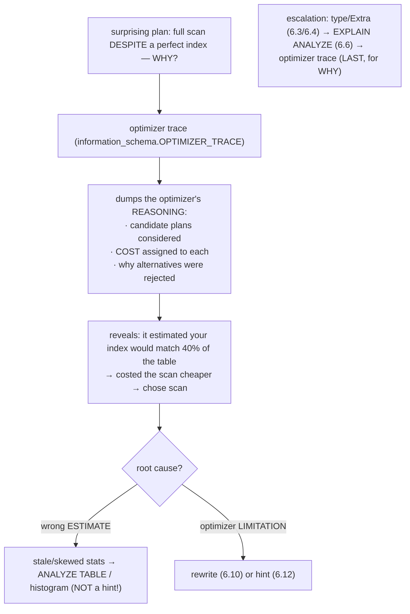

# M06 · Pass C — Diagrams & Worked Examples · Concepts 6.1–6.7

> **Pass C scope:** content-contract items **#12 Diagram(s)** and **#8 Worked example** (narrated, no code in prose — EXPLAIN output shown illustratively in diagrams). Pairs with `01-reading-the-plan.md`. Mermaid throughout. Domain: payments/wallet, M05-indexed ledger.

---

## 6.1 · The tuning loop: write → EXPLAIN → fix → re-EXPLAIN ★

**Diagram — the master tuning loop (reused all module):**

**Worked example — a slow "account 42 statement" once around the loop.**
A support engineer reports the statement screen is slow. Run the loop. **(1) Identify:** the query is `WHERE account_id = 42 ORDER BY created_at DESC LIMIT 20`. **(2) EXPLAIN:** the plan shows `type: ALL` (full table scan of a billion-row ledger) and `Extra: Using filesort` — *two* problems visible at once. **(3) Diagnose:** `ALL` means no usable index for `account_id` (the access path, 6.3); `Using filesort` means the `ORDER BY` has no index to provide the order (6.4). **(4) Fix the cause:** add the M05 composite index `(account_id, created_at)` — its leading `account_id` makes the lookup a `range`, and its second column delivers the rows *already in `created_at` order* (M05/5.10). **(5) Re-EXPLAIN + measure:** now `type: range`, `key: ix_acct_created`, and `Using filesort` is **gone**; `EXPLAIN ANALYZE` (6.6) confirms it dropped from seconds to milliseconds. **(6) Iterate:** if the screen also reads `amount`, extend the index to `(account_id, created_at, amount)` so EXPLAIN shows `Using index` (covering, M05/5.6) — one more turn of the loop. The example *is* the module: the fix wasn't guessed ("add some index"), it was *diagnosed* from the plan (the scan and the filesort each pointed to a specific index design) and *verified* by re-EXPLAIN. That causal, verifiable discipline — not folklore — is what makes a query engineer effective.

---

## 6.2 · Reading EXPLAIN: the columns ★

**Diagram — an annotated EXPLAIN row (each column = one question):**

**Worked example — decoding a real EXPLAIN row, column by column.**
You EXPLAIN the (now-indexed) statement query and read across the row like a sentence. **`table: ledger_entry`** — this row is about the ledger (in a single-table query there's one row; in a join, top-to-bottom order would tell you the join order, 6.9). **`type: range`** — the access path is an index range scan (good — not a full `ALL` scan, 6.3); this is the field you read *first*. **`key: ix_acct_created`** — it actually chose the M05 `(account_id, created_at)` index (vs `possible_keys` listing what it *could* have used). **`key_len`** showing *both* columns' bytes — it's using the full composite, not just the leading column (a quick way to confirm leftmost-prefix is working, M05/5.7; a too-small `key_len` would reveal only `account_id` is used). **`ref: const`** — the index is matched against a constant (`account_id = 42`). **`rows: 30, filtered: 100%`** — the optimizer estimates ~30 rows examined, all surviving the `WHERE` (6.5) — a small, healthy estimate. **`Extra: Using index`** — the covering-index win (M05/5.6): answered from the index alone, no row fetch, no filesort (6.4). Read together, the row *describes the entire strategy*, and you can tell at a glance it's healthy. The same query before tuning read the "sick" sentence — `type: ALL, key: NULL, rows: 1B, Extra: Using filesort` — and each sick column pointed at exactly what to fix. Fluency in this vocabulary turns EXPLAIN from cryptic output into precise diagnosis, which is the whole skill of 6.1's loop.

---

## 6.3 · Access types (the `type` column): const → ALL

**Diagram — the access-type ladder (best → worst):**

**Worked example — the same query climbing the ladder as you add indexes.**
Take `WHERE account_id = 42 AND created_at >= '2025-06-01'` and watch `type` change as the index design improves. **No index on `account_id`:** `type: ALL` — full scan of a billion rows, the red flag. **Add `(account_id)`:** `type: ref` — an index lookup jumps to account 42's rows, then filters by date; vastly fewer rows touched. **Use `(account_id, created_at)`:** `type: range` — an index range scan reads *exactly* account 42's June-onward entries (the date condition now uses the index too, M05/5.7). **If the query only needs columns in that index:** EXPLAIN may show `type: range` with `Extra: Using index` (covering). And the idempotency lookup `WHERE idempotency_key = 'abc'` on the UNIQUE index is **`type: const`** — at most one row, essentially free. Same family of queries, climbing from `ALL` (catastrophic) to `range`/`const` (fast), purely by giving the optimizer better access paths (M05). The diagram's caveat matters for nuance: `ALL` is a *signal to investigate*, not an automatic verdict — if account 42 somehow matched most of the table (or the table were tiny), the optimizer might *correctly* prefer a scan over millions of bookmark lookups (6.5/M05·5.9). So the move is: see `ALL` on a big, selective query → check `possible_keys`/`key` → realize no index serves the predicate → add one → re-EXPLAIN for `ALL`→`range`. This single step is the most common one in the whole tuning loop.

---

## 6.4 · The `Extra` column: the tuning goldmine

**Diagram — Extra flags: good vs bad signals:**

**Worked example — spotting `Using filesort` and the index that removes it.**
A query has a *great* access type but is still slow — exactly the case `Extra` exists to catch. The statement query `WHERE account_id = 42 ORDER BY created_at DESC` with only a `(account_id)` index shows `type: ref` (the access path is fine — it jumps straight to account 42's rows) but `Extra: Using filesort`. That filesort is the real cost: MySQL fetches account 42's rows efficiently, then has to **sort them by `created_at`** — and for a high-volume account with millions of entries, that sort **spills to disk** (M04/4.13), turning a fast lookup into a multi-second stall. Reading *only* `type` would have missed it (the access looked healthy); reading `Extra` reveals the bottleneck is the *post-access sorting*. The fix lives in `Extra` too: extend the index to `(account_id, created_at)` so the rows come out of the index *already in `created_at` order* (M05/5.10) — re-EXPLAIN and `Using filesort` is **gone**, replaced (if `amount` is covered) by the goldmine signal `Using index` (M05/5.6). This is the concept's core lesson: **total cost includes the processing after the access**, and the biggest wins often hide in eliminating a `Using filesort`/`Using temporary` blocking op — which is why `Extra` is the tuning goldmine, read second only to `type`.

---

## 6.5 · Row estimates, `filtered`, and cost

**Diagram — estimate vs actual (the diagnostic gap):**

**Worked example — the query whose estimate says 10 but it scans millions.**
A query that *looks* fine in plain EXPLAIN runs slowly, and the `rows` column is the clue. EXPLAIN estimates `rows: 30` for a step — small, so the chosen plan looks reasonable. But the query is slow, so you run `EXPLAIN ANALYZE` (6.6) and the *actual* rows for that operator is **10,000,000**. That 30-vs-10M gap is the smoking gun: the optimizer is reasoning from a **wrong estimate**, so even though the *plan* looks sensible on paper, it's the wrong plan for the real data. The diagnosis isn't "add an index" (the access path may be fine) — it's "*why is the estimate so wrong?*" The usual causes (the diagram): **stale statistics** (the ledger grew but cardinality wasn't refreshed, M04/4.7) → fix with `ANALYZE TABLE`; **data skew** (the estimate assumes uniform distribution but one value dominates) → fix with a histogram; or **correlated columns** (the optimizer multiplies selectivities assuming independence, but `currency` and `country` are correlated, so the combined estimate is way off) → fix with a rewrite. This is a *different class* of slow query from "missing index" — it's "the optimizer was misled" — and you can only catch it by **reading `rows`/`filtered` and comparing the estimate to reality**. The instinct it builds: when a plan looks right but performs wrong, suspect the *estimates* (the inputs), not the optimizer's *logic*.

---

## 6.6 · EXPLAIN ANALYZE & FORMAT=TREE: plan vs reality

**Diagram — three views, what each gives:**

**Worked example — finding which operator actually dominates a slow join.**
A join of `account` → `ledger_entry` is slow, but plain EXPLAIN shows a plausible plan (indexes in `key`, reasonable `type`s) — so you can't tell *where* the time goes from estimates alone. You run **`EXPLAIN ANALYZE`**, which *executes* the query and annotates each operator in the tree with **actual** stats. The output reveals the truth: the inner `ledger_entry` lookup shows `actual time=0.05..0.05 rows=29 loops=350000` — i.e., it ran **350,000 times** (once per driving row). That high **`loops`** count is the diagnosis: the driving table (`account`) wasn't filtered down enough (or the join order is wrong, 6.9), so the inner table is probed hundreds of thousands of times — and `350,000 × 0.05ms` is where the seconds went, *not* in the access path you might have suspected. The fix follows from the actual hotspot: filter the driving side harder, fix the join order (6.9), or ensure the inner lookup is a tight `eq_ref` (6.8) — and you **re-run ANALYZE to confirm** the loops dropped and the time fell. `FORMAT=TREE` made the join *structure* legible (the nested-loop shape); `ANALYZE` made the *cost* visible (which operator, how many loops). Together they turn "the join is slow" into "this inner operator runs 350k times — reduce the driving set" — the difference between guessing and knowing. (And you used ANALYZE deliberately here because it's a read; on a write you'd be more careful, per the warning.)

---

## 6.7 · The optimizer trace: why it chose this plan

**Diagram — the trace answers "why":**

**Worked example — why the optimizer skipped your perfect index.**
You built what looks like the *perfect* index for a query, but EXPLAIN stubbornly shows `type: ALL` — a full scan — and you can't understand why. Plain EXPLAIN tells you *what* (it's scanning) but not *why* (why did it reject your index?). So you escalate to the **optimizer trace**: enable it, run the query, and read the optimizer's internal cost reasoning. The trace shows it: when costing the access paths, the optimizer estimated your index would match **40% of the table** — so it computed that 40%-of-a-billion bookmark lookups (M05/5.5) would cost *more* than a sequential full scan, and chose the scan. That estimate is the revelation: the index is fine, but the optimizer *believes* it's non-selective. Now you know the **root cause** is a wrong estimate, not an optimizer bug or a bad index — so the fix is **`ANALYZE TABLE`** (refresh stale statistics) or a **histogram** (if the column is skewed and the value you query is actually rare), *not* a hint (6.12) and *not* a different index. After fixing the stats, the trace (and EXPLAIN) show the optimizer now estimates the index matches few rows, costs it cheaper than the scan, and uses it. The example shows the trace's unique value: it's the only tool that exposes *why* — the considered alternatives and their costs — which distinguishes "the optimizer was misled by bad inputs (fix the stats)" from "the optimizer has a genuine limitation (rewrite/hint)." It's the deepest, last rung of the diagnostic ladder, used sparingly but decisively when EXPLAIN's *what* isn't enough.

---

*Diagrams + worked examples for 6.1–6.7 complete (7 Mermaid). Next Pass C file: 6.8–6.11 (join algorithm mechanics, driving table, rewrite map, filesort/temp decision).*
