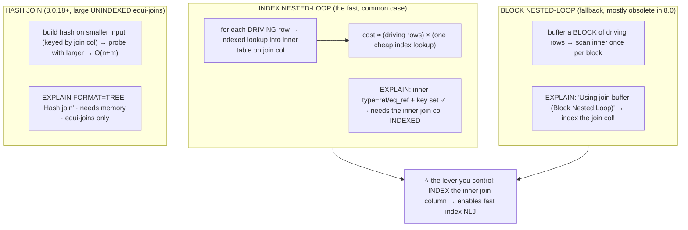
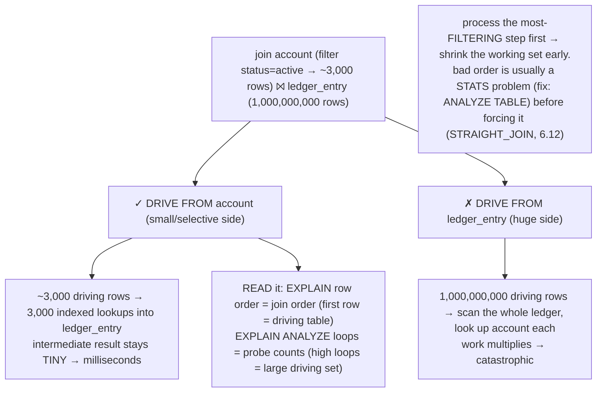
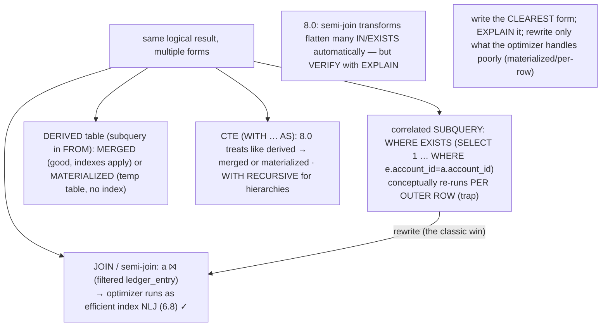
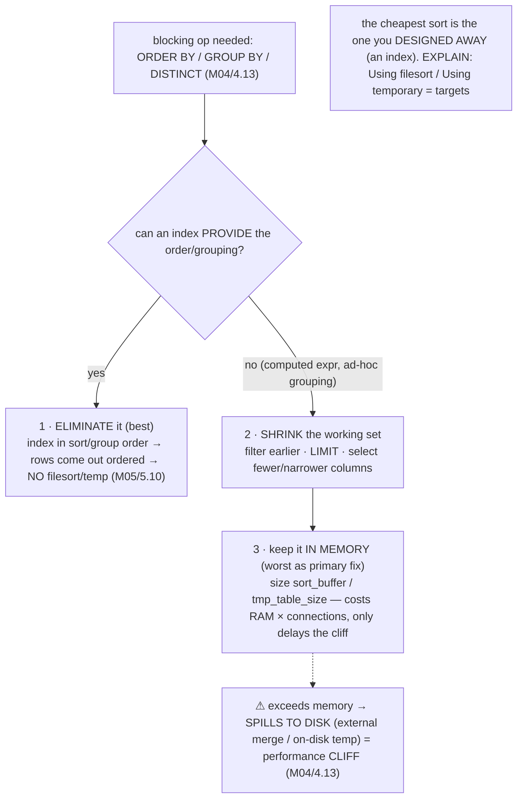

# M06 · Pass C — Diagrams & Worked Examples · Concepts 6.8–6.11

> Pass C scope: **#12 Diagram(s)** + **#8 Worked example** (narrated). Pairs with `02-joins-and-rewrites.md`. Mermaid throughout. Domain: payments/wallet, M05-indexed ledger. (Join strategies introduced M04/4.9; deep mechanics here.)

---

## 6.8 · Join algorithms in depth: nested-loop, BNL, hash

**Diagram — the three algorithms + their EXPLAIN signatures:**

**Worked example — the index that flips a slow join to fast.**
Join `account` (filtered to active) → `ledger_entry` on `account_id`. **Without an index on `ledger_entry.account_id`:** for each driving `account` row, MySQL must find matching entries with *no index to seek by* — so it either scans the billion-row `ledger_entry` per driving row (quadratic catastrophe) or, in 8.0, falls back to a **hash join** (build a hash on the smaller `account` side, scan `ledger_entry` once to probe) — `EXPLAIN FORMAT=TREE` shows `Hash join`. The hash join is far better than the quadratic scan, but it still reads the *entire* ledger once. **With an index on `ledger_entry.account_id` (M05):** the optimizer uses **index nested-loop** — for each of the few active accounts, an indexed `ref` lookup fetches just that account's entries; EXPLAIN shows the inner `ledger_entry` with `type: ref` and `key: ix_account`. Cost drops from "scan a billion rows" to "a few thousand cheap index lookups." Same join, same result — the **index on the inner join column flipped the algorithm** from hash-scan-the-whole-table to seek-only-what's-needed. The lesson and the dominant tuning move: **index your join columns** so the optimizer can use index NLJ (`ref`/`eq_ref` on the inner), and read EXPLAIN to confirm it did. (Hash join is genuinely the right tool when *no* selective index exists — e.g., a large analytical join — so the goal isn't "always NLJ," it's "give the optimizer the index when the join is selective.")

---

## 6.9 · Join order & the driving table

**Diagram — driving-table choice multiplies through the join:**

**Worked example — driving from `account` vs `ledger_entry`.**
The same join — `account` filtered to ~3,000 active accounts, joined to the billion-row `ledger_entry` — has two possible orders, and the choice is decisive. **Driving from `account` (correct):** the optimizer takes the ~3,000 filtered account rows as the outer loop, and for *each* does an indexed lookup into `ledger_entry` (6.8) — ~3,000 cheap lookups, intermediate results stay tiny, milliseconds. **Driving from `ledger_entry` (catastrophic):** the optimizer takes the *billion-row* ledger as the outer loop and looks up the account for each — scanning a billion rows as the driving set, orders of magnitude slower, even though every individual lookup is indexed. The order multiplies through the whole join, so *which table drives* can change cost by 6 orders of magnitude. You **read** the chosen order in EXPLAIN: the top-to-bottom row order *is* the join order (first row = driving table), and `EXPLAIN ANALYZE`'s `loops` count (6.6) reveals how many times the inner table was probed (a billion loops = it drove from the wrong side). The principle the diagram captures — **process the most-filtering step first to shrink the working set early** — is universal ("filter early, drive from the small side"). And the fix discipline: a wrong order is *usually* a **statistics** problem (the optimizer mis-estimated which side was smaller after filtering, 6.5) → try `ANALYZE TABLE` first; only force the order with `STRAIGHT_JOIN`/hints (6.12) when the optimizer genuinely won't correct it. For our domain, the `account`(filtered)→`ledger_entry` join *must* drive from `account`; seeing it drive from the ledger in EXPLAIN is the bug to chase.

---

## 6.10 · Subqueries, derived tables & CTEs

**Diagram — the rewrite map (often interchangeable, sometimes not):**

**Worked example — a correlated subquery rewritten as a join.**
"Find accounts that have *any* entry over $10,000." The intuitive form is a **correlated subquery**: `SELECT * FROM account a WHERE EXISTS (SELECT 1 FROM ledger_entry e WHERE e.account_id = a.account_id AND e.amount > 10000)`. Conceptually, the inner query re-runs *per account row* — historically a performance trap (thousands of inner executions). You EXPLAIN it: modern MySQL 8.0 *may* transform it into a **semi-join** automatically (flattening it to an efficient join), in which case it's already fast — but it *may not*, depending on the shape, and then you see a `DEPENDENT SUBQUERY` re-evaluated per row. When the optimizer doesn't flatten it, the fix is to **rewrite it as a join** explicitly: `SELECT DISTINCT a.* FROM account a JOIN ledger_entry e ON e.account_id = a.account_id WHERE e.amount > 10000` — which the optimizer runs as an **index nested-loop** (6.8) using the `ledger_entry` index, one efficient pass instead of N re-evaluations. The lesson the diagram captures: **logical equivalence doesn't guarantee equal execution** — the same result written four ways (subquery, join, derived table, CTE) *may* plan identically (the optimizer tries to normalize them) but *may not*, so you **write the clearest form, EXPLAIN it, and rewrite only the forms the optimizer demonstrably handles poorly.** Don't pre-emptively contort everything into joins "for performance" — verify first (modern MySQL flattens a lot); but keep the subquery→join rewrite as a tool for the cases it doesn't. (CTEs add readability and `WITH RECURSIVE` enables hierarchy traversal, but watch whether a CTE is materialized when merging would let an index apply.)

---

## 6.11 · Sorting & grouping at scale (filesort/temp deep dive)

**Diagram — the tuning hierarchy for blocking ops:**

**Worked example — a daily-totals GROUP BY spilling to disk.**
A reporting query computes daily settlement totals: `SELECT DATE(created_at) d, SUM(amount) FROM ledger_entry WHERE … GROUP BY d`. EXPLAIN shows `Extra: Using temporary; Using filesort` — *two* blocking ops. Here's what happens: MySQL reads the qualifying entries, builds a **temporary table** to accumulate the `GROUP BY d` aggregates, then **sorts** the result — and for a large date range over a high-volume ledger, that temp table **exceeds `tmp_table_size` and spills to an on-disk temp table** (M04/4.13), the performance cliff, with a filesort on top. Apply the tuning hierarchy. **(1) Eliminate:** can an index provide the grouping order? `GROUP BY DATE(created_at)` wraps the column in a function (non-sargable, 6.13) so a plain `(created_at)` index can't group it directly — but rewriting to group by a sargable range, or maintaining a **summary table** (`settlement_totals`, M02/2.14) updated incrementally, eliminates the live aggregation entirely (the report reads pre-computed rows — no temp table, no sort). **(2) Shrink:** if you must compute live, narrow the date range and select fewer columns so the working set stays in memory. **(3) Keep in memory:** only as a last resort, and knowing it just delays the cliff. The example shows the deep-dive skill: **read *which* blocking op is happening** (temp table *and* filesort), **whether it's spilling** (the cliff), and **choose the right fix from the hierarchy** — here, a summary table (M02/2.14) is the real answer, because an ad-hoc daily aggregation over a growing ledger shouldn't be recomputed live at all. The instinct: blocking ops are a discontinuity in cost; eliminate them via existing structure (an index, a pre-aggregated table) rather than throwing memory at them.

---

*Diagrams + worked examples for 6.8–6.11 complete (4 Mermaid). Next Pass C file: 6.12–6.16 (hint decision flow, ★ anti-pattern catalog, keyset vs OFFSET, plan-regression causes, ★ before→after money-query EXPLAINs).*
