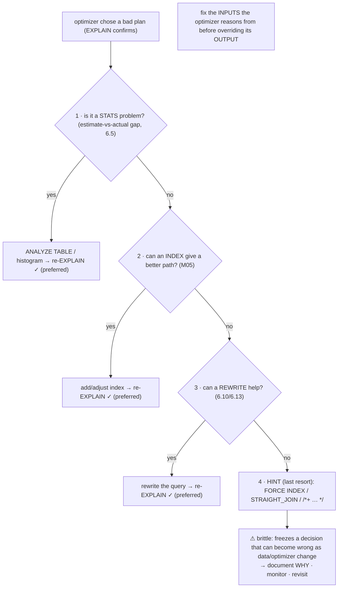
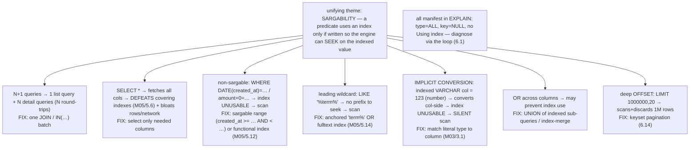
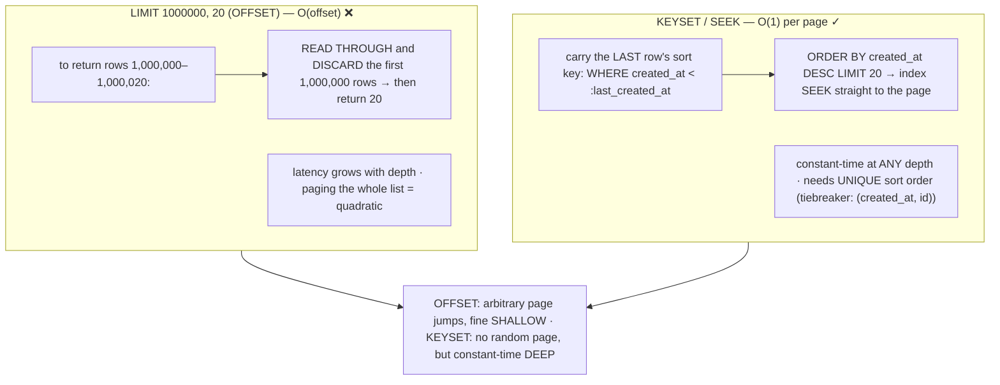
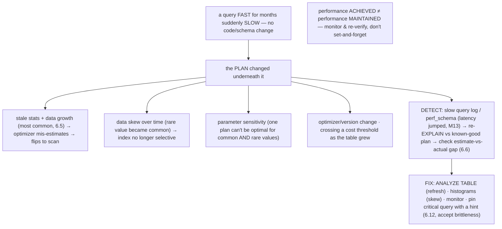

# M06 · Pass C — Diagrams & Worked Examples · Concepts 6.12–6.16

> Pass C scope: **#12 Diagram(s)** + **#8 Worked example** (narrated). Pairs with `03-toolkit-antipatterns-pagination-stability-capstone.md`. Mermaid throughout (incl. ★ anti-pattern catalog 6.13, ★ before→after money-query EXPLAINs 6.16). Domain: payments/wallet. These close out M06 Pass C.

---

## 6.12 · Optimizer & index hints (and when to use them)

**Diagram — the "fix inputs first" decision flow:**

**Worked example — forcing an index the optimizer wrongly skips (and why it's last).**
A critical query keeps choosing a full scan over an index you *know* is right. You don't reach for `FORCE INDEX` first — you walk the decision flow. **(1) Stats?** You check the estimate-vs-actual gap (6.5) and read the optimizer trace (6.7): it estimated the index would match 40% of rows. Is that estimate *stale*? You run `ANALYZE TABLE` — but here the data genuinely *is* skewed in a way the optimizer keeps mis-judging even with fresh stats and a histogram. **(2) Index?** A different index won't help — the right index exists; the optimizer just won't pick it. **(3) Rewrite?** You try sargable rewrites (6.13) and restructuring — no luck, the optimizer still mis-costs it. **(4) Only now, a hint:** `SELECT /*+ INDEX(ledger_entry ix_acct_created) */ …` (or `FORCE INDEX`) to *guarantee* the plan — and you re-EXPLAIN to confirm it took. But you do it *knowing the cost*: the hint **freezes** a decision that was right today and may be wrong tomorrow (the data shifts, a MySQL upgrade changes the cost model, the right index changes) — so you **document why** the hint exists and **monitor** it (a hint that silently becomes wrong is a regression, 6.15). The example embodies the discipline: **fix the inputs the optimizer reasons from (stats, indexes, query shape) before overriding its output** — because the optimizer adapts as conditions change and a hint doesn't. For a fintech money query especially, a hint is a *stability liability*; prefer a design that makes the optimizer *naturally* choose right.

---

## 6.13 · Query anti-patterns & their fixes ★

**★ Diagram — the anti-pattern catalog (why slow → fix):**

**Worked example — the implicit-conversion trap that silently full-scans.**
The most insidious anti-pattern because it's *invisible*. The `idempotency_key` column is `VARCHAR` (M03), indexed UNIQUE (M05/5.17). The application, due to a loose-typed parameter, issues `WHERE idempotency_key = 12345` — comparing the indexed *string* column to a *number*. MySQL resolves the type mismatch by **converting the column side to a number** for every row — which means the index (sorted as strings) **can't be used**, and the query silently degrades to a **full table scan** (`type: ALL`, `key: NULL` in EXPLAIN). Nothing errors; the query returns correct results; it's just suddenly scanning a huge table on what should be an instant `const` lookup — and it only shows up as a slow query in production. The fix is trivial once diagnosed: **match the literal's type to the column** — pass `'12345'` (a string) so the comparison stays string-to-string and the index seeks normally (`type: const`). The example illustrates the catalog's unifying theme — **sargability**: how you *express* a predicate determines whether the engine can use its structure, and a type mismatch (like a function wrapper, or a leading wildcard) silently breaks the seek. The companion lesson for fintech: this exact trap on an idempotency or account lookup turns a money endpoint's instant query into a table scan under load. The catalog is the most *immediately applicable* knowledge in M06 — recognizing these shapes *by sight* (and confirming via EXPLAIN's `ALL`/`key: NULL`) is half of query tuning and a code-review/interview staple. (M14 has the scannable triage version; this is the explained one.)

---

## 6.14 · Pagination & large result sets

**Diagram — OFFSET scan-and-discard vs keyset seek:**

**Worked example — paginating a million-row statement export.**
A user (or an export job) pages through a high-volume account's statement — a million entries, 20 per page. **With `LIMIT/OFFSET`:** page 1 (`OFFSET 0`) is instant, but deep into the export, `OFFSET 1000000` makes MySQL **read through and throw away a million rows** to reach the page — even *with* the `(account_id, created_at)` index providing order, it must *traverse* a million index entries before returning 20. Latency climbs linearly with depth, and paging the *entire* list is quadratic — the export crawls and may time out. EXPLAIN won't flag this as "bad" (it might even show `Using index`); the cost hides in `EXPLAIN ANALYZE` as rows-read ≫ rows-returned. **With keyset pagination:** instead of an offset, you carry the **last row's sort key** and continue *after* it — `WHERE account_id = 42 AND created_at < :last_seen_created_at ORDER BY created_at DESC LIMIT 20` — which the `(account_id, created_at)` index turns into a **direct seek** to the continuation point (M05/5.4 clustering makes this a tight range read). Every page costs the same, no matter how deep — O(1) per page instead of O(offset). The tradeoff the diagram names: keyset can't jump to "page 5000" (only next/prev via the last key) and needs a **unique** sort order (add `id` as a tiebreaker so boundary rows aren't skipped/duplicated) — but for sequential scrolling and exports (the real access pattern), those constraints are fine and the performance is *essential*. The principle: **seek to where you need to be using the ordered index; don't scan-and-discard to get there** — the same instinct as resuming a stream from a checkpoint. This is a high-impact, frequently-overlooked scaling pattern and a common system-design interview topic (scalable feeds/statements).

---

## 6.15 · Plan stability: why a fast query suddenly gets slow

**Diagram — causes of regression → detection → fix:**

**Worked example — the reconciliation query that was fast yesterday.**
The nightly reconciliation job — a `SUM` over `ledger_entry` per account, comparing to stored balances (M02/2.17) — has run in minutes for months. One night it **stalls for hours**, with no deploy, no schema change. You run the regression playbook (the diagram). **Detect:** the slow query log (M13) shows the job's query latency jumped; you re-`EXPLAIN` it and compare to its known-good plan — and it's now `type: ALL`, a **full scan** of the (now much larger) ledger, where it used to be an index-served range. **Root-cause:** `EXPLAIN ANALYZE` (6.6) shows a huge estimate-vs-actual `rows` gap, and the optimizer trace (6.7) reveals the cause — the ledger **grew past a threshold** but its **statistics went stale**, so the optimizer's cardinality estimate is wrong and it now mis-costs the index as worse than a scan (6.5). Nothing about the *query* changed; the *data* grew and the *stats* didn't keep up, so the *plan* flipped. **Fix:** `ANALYZE TABLE ledger_entry` refreshes the statistics → the optimizer re-estimates correctly → the index plan returns → the job is fast again. And the *prevention*: schedule `ANALYZE TABLE` after bulk loads, monitor for latency regressions (M13), and — because this is a *critical money query* — consider pinning its plan or alerting on its runtime. The example teaches the operational truth this concept exists for: **performance achieved is not performance maintained.** A tuned query rests on conditions (data size, distribution, stats freshness) that *will* drift, often silently and suddenly, and *at scale* (it only got slow *because* the data grew). For fintech this is money-never-lies-adjacent — a reconciliation job that silently regresses to a full scan can stall the system and delay the books — so monitoring and re-verifying plans is a first-class operational discipline (bridging to M13/M14), not a one-time tuning task.

---

## 6.16 · Fintech capstone — tuning the ledger's hot queries ★

**★ Diagram — before → after EXPLAINs of the money queries:**

```mermaid
flowchart TB
    subgraph STMT["STATEMENT: WHERE account_id=42 … ORDER BY created_at DESC LIMIT 20"]
        s1["BEFORE: type=ALL · key=NULL · rows=1B · Using filesort ❌"]
        s2["AFTER: type=range · key=ix_acct_created · Using index ✓ · keyset paginated (6.14)"]
        s1 --> s2
    end
    subgraph BAL["BALANCE: WHERE account_id=42 (summary table, M02/2.14)"]
        bl["AFTER: type=const/eq_ref · PK lookup · buffer pool (M04/4.14) ✓"]
    end
    subgraph REC["RECONCILIATION: SUM(amount) … per account"]
        r1["risk: stale stats → flips to ALL (6.15)"]
        r2["AFTER: index-served range · runs on a REPLICA (M10) · ANALYZE TABLE keeps it stable ✓"]
        r1 --> r2
    end
    subgraph IDEM["IDEMPOTENCY: WHERE idempotency_key='abc'"]
        i1["AFTER: type=const on UNIQUE index (M05/5.17) ✓ · verify literal type matches (no implicit conversion, 6.13)"]
    end
    SYNTH["synthesis: M04 (optimizer/plan) + M05 (indexes) + M06 (read & tune) on the highest-stakes queries"]
```

**Worked example — the full set of money queries, tuned and verified.**
Run the payments system's four critical queries through the loop (6.1), each to a fast, stable plan:
- **Statement** (`WHERE account_id=42 AND created_at >= … ORDER BY created_at DESC LIMIT 20`): *before* — `type: ALL` + `Using filesort` (scan + sort a billion rows). *After* — the M05 `(account_id, created_at, amount)` index gives `type: range`, `Using index` (covering, no row fetch, M05/5.6), **no filesort** (the index provides the order, M05/5.10), and **keyset pagination** (6.14) keeps every page fast no matter how deep. Verified by re-EXPLAIN.
- **Balance read** (`WHERE account_id=42` on the `balance` summary table, M02/2.14): a `const`/`eq_ref` PK lookup served from the buffer pool (M04/4.14) — trivial *once you confirm* it's a PK access, not a scan.
- **Reconciliation** (`SUM(amount)` per account): the heavy one and the **plan-stability** risk (6.15) — it must stay index-served as the ledger grows, so you keep stats fresh (`ANALYZE TABLE`) and run it on a **replica** (M10) to spare the primary (M02/2.17). The before→after here is about *stability*: preventing the silent flip to a full scan.
- **Idempotency lookup** (`WHERE idempotency_key='abc'`): a `const` lookup on the UNIQUE index (M05/5.17) — instant, and you verify the parameter is a **string** to avoid the implicit-conversion scan (6.13).

The capstone proves the whole performance arc on the queries that matter most: a payments platform lives or dies by whether its statement/balance/reconciliation/idempotency queries are fast *and stay fast under growth*. It synthesizes **M04** (the optimizer chooses a plan), **M05** (the indexes give it good paths), and **M06** (read and tune the plan) — and adds the operational layer (keyset pagination, fresh stats for stability, replica offload) that keeps it fast in production. The transferable discipline for any high-stakes system: **identify the critical queries, instrument them (EXPLAIN/ANALYZE), tune to the fast paths, and monitor for regression** — performance is *verified and maintained*, not assumed. This is the exact query set **M16** must keep fast across shards, and tuning it well closes the M04→M05→M06 performance arc that the rest of the resource builds on.

---

*Diagrams + worked examples for 6.12–6.16 complete (5 Mermaid). **M06 Pass C is fully drafted (all 16 concepts, 16 Mermaid diagrams).** Remaining for M06: Pass D — code-specifics boxes, failure modes & gotchas, fintech lens, interview/SD angle, and self-check questions.*
