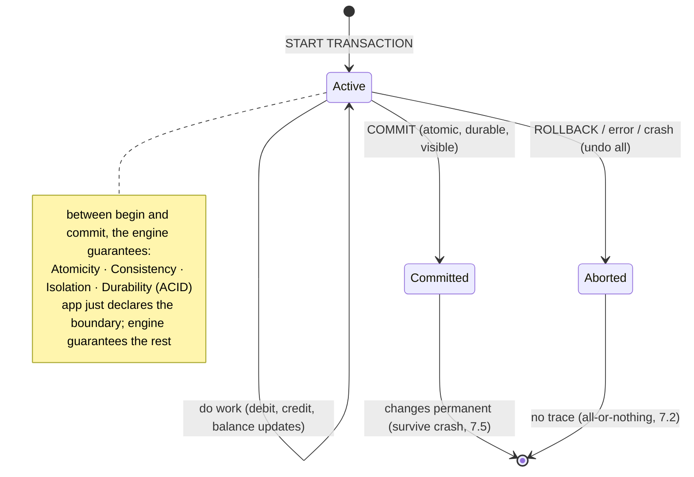
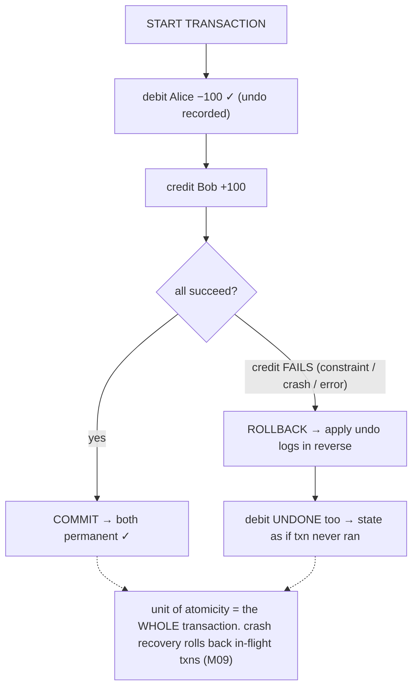
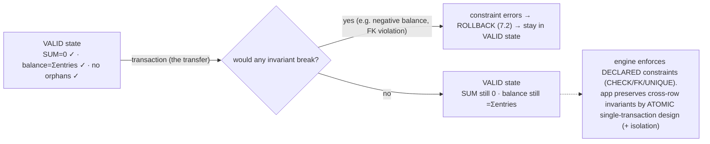
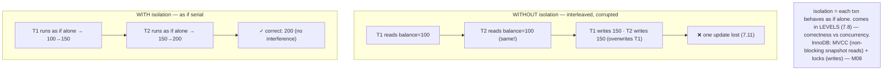
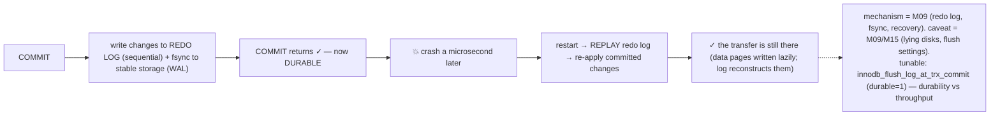
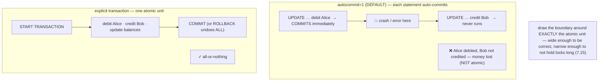
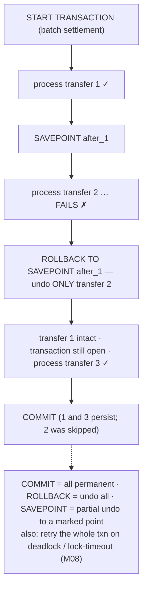

# M07 · Pass C — Diagrams & Worked Examples · Concepts 7.1–7.7

> **Pass C scope:** content-contract items **#12 Diagram(s)** and **#8 Worked example** (narrated, no code in prose). Pairs with `01-acid-and-boundaries.md`. Mermaid (sequence/state) here; the ★ SVGs are in 7.10/7.16. Domain: payments/wallet. Recurring vehicle: the **Alice→Bob transfer**.

---

## 7.1 · What a transaction is & why ★

**Diagram — transaction lifecycle:**

**Worked example — the transfer is one atomic unit, not two writes.**
Alice sends Bob $100. Naively, that's "subtract $100 from Alice, add $100 to Bob" — two operations. The danger: if they're *separate* (each its own auto-committed statement, 7.6), a crash or error *between* them leaves Alice debited but Bob not credited — **$100 vanished**, and the double-entry invariant (SUM=0, M01/1.19) is broken with no way to recover. A transaction fixes this by making the two (really four: debit entry, credit entry, Alice's balance, Bob's balance) into **one indivisible unit**: `START TRANSACTION` … all the operations … `COMMIT`. Between begin and commit, the engine guarantees that either *everything* takes effect on commit, or *nothing* does on failure (atomicity, 7.2), that concurrent transfers can't corrupt the balances (isolation, 7.4), that the books stay balanced (consistency, 7.3), and that once committed it survives a crash (durability, 7.5). The application doesn't *implement* any of this — it just *declares* the boundary, and the four ACID guarantees follow. This is the deepest reason money lives in a transactional database: a transfer has *no safe intermediate state*, so it must be atomic, and only a transaction provides that. Everything in M07 elaborates this contract; M08 (locks/MVCC) and M09 (durability) show how InnoDB delivers it.

---

## 7.2 · Atomicity: all-or-nothing

**Diagram — commit vs rollback (undo on failure):**

**Worked example — the credit fails after the debit.**
Mid-transfer, the debit to Alice has been applied (in the transaction), and then the credit to Bob **fails** — say a CHECK constraint rejects it (M01/1.8), or the server crashes, or an error fires. Without atomicity, you'd be stuck: Alice is down $100, Bob got nothing, money destroyed. **With atomicity**, the engine has been recording *how to undo* every change (undo logs, M09), so on the failure it **rolls back** — applies the undo in reverse, restoring Alice's balance and removing the debit entry — leaving the database *exactly* as if the transfer never started. No half-state, no lost money, the SUM=0 invariant (M01/1.19) never broken. The same protects against crashes: if the server dies mid-transfer, **crash recovery** (M09) rolls back the in-flight (uncommitted) transaction on restart. The example shows atomicity's whole value: it removes the entire category of "inconsistent half-states from partial failure" — and partial failure is *inevitable* (errors, crashes, constraint violations happen). You write the multi-step transfer as if it were one step, trusting the engine to clean up *completely* on any failure path — which hand-rolled application cleanup could never do (it can't undo a crash). (One MySQL gotcha: DDL like `ALTER TABLE` implicitly commits and *can't* be rolled back — a migration-script footgun, 7.6.)

---

## 7.3 · Consistency: invariants preserved

**Diagram — valid state → transaction → valid state:**

**Worked example — the double-entry invariant holds; a CHECK rejects a bad transfer.**
Two ways consistency shows up. **(1) Engine-enforced constraint:** a buggy transfer tries to overdraw a credit-only account, violating `CHECK (balance >= 0)` (M01/1.8). The constraint *errors*, the transaction *rolls back* (7.2), and the database stays in its prior valid state — no committed state ever violates the declared rule. **(2) Application-preserved invariant:** the double-entry rule "every transaction's entries sum to zero" (M01/1.19) isn't something MySQL knows — it holds *because* you post the −100 and +100 entries within *one atomic transaction* (so SUM=0 is never half-applied, 7.2) and update the balance in that *same* transaction (so balance=sum-of-entries stays true, M02/2.17). If you split them, a crash between could leave SUM≠0 — a broken invariant in a committed state. So consistency = (engine enforces what you *declare*: CHECK, FK, UNIQUE) + (your *transaction design* preserves the cross-row invariants that atomicity and isolation protect). It's the "least pure-engine" ACID property: it leans on atomicity (don't half-apply), isolation (don't interleave into an invalid state), *and* correct application logic. The payoff: every *committed* state satisfies the money rules (conservation, attribution, non-negativity), so any reader can trust the data's meaning.

---

## 7.4 · Isolation: concurrent transactions don't interfere

**Diagram — concurrent timelines with vs without isolation:**

**Worked example — two concurrent transfers to the same hot account.**
A popular merchant account receives two $50 payments at the same instant, from two concurrent transactions. **Without isolation**, they interleave catastrophically: both read the current balance ($100), both compute their new balance independently, and the second write *overwrites* the first — one $50 payment silently vanishes (the lost-update problem, 7.11, foreshadowed here). **With isolation**, the engine makes each transaction *behave as if it ran alone* — to the degree the chosen level (7.8) and locking guarantee — so the two payments correctly compose to $200, not $150. This is isolation's whole job: concurrency is unavoidable (a payments system runs thousands of simultaneous transfers), and naive concurrent access to shared data corrupts it, so isolation makes the chaos of simultaneity *look like* an orderly one-at-a-time execution. The crucial nuance the example sets up (and 7.8/7.11 develop): isolation is the *hardest and most expensive* ACID property, and it comes in **levels** — perfect "as-if-serial" (SERIALIZABLE) is costly, so you choose how much you need — *and* even strong read-isolation (InnoDB's default REPEATABLE READ) doesn't automatically fix this lost-update case; the read-modify-write on the balance needs an *atomic update* or a *lock* (7.11). InnoDB delivers isolation via MVCC (non-blocking snapshot reads) + locks (M08) — the mechanism is M08; here the point is *what* isolation guarantees and *that* it's leveled.

---

## 7.5 · Durability: committed survives a crash

**Diagram — commit → durable (WAL preview):**

**Worked example — a committed transfer survives a power loss.**
Alice→Bob commits; `COMMIT` returns success; the application tells Alice "sent." A *microsecond later*, the server loses power. **Durability** is the guarantee that the transfer is *still there* when the server restarts — because "commit returned" means "permanently recorded," not "recorded unless we crash." How (mechanism in M09): the naive approach — writing every changed data page to its final disk location before commit — is too slow (random I/O), so InnoDB uses **write-ahead logging**: at commit, it writes the changes *sequentially* to the **redo log** and **fsyncs** that to stable storage. The data pages themselves can be written lazily later, because on restart, **recovery replays the redo log** to re-apply any committed changes that hadn't reached their final pages (and rolls back in-flight ones, 7.2). So the committed transfer is reconstructed from the log — it survives. The example makes durability's contract concrete: a commit is a *promise you can build on* (tell the user "sent," record it as final). The cost (M09): the `fsync` is the single biggest per-commit expense, exposed as a tunable (`innodb_flush_log_at_trx_commit=1` for full durability vs relaxed settings that batch the sync for speed but can lose the last fraction of a second on crash) — and for money, the durable setting is mandatory (a lost confirmed payment is unacceptable). The honest caveat (M09/M15): durability is only as good as the fsync *actually* reaching disk (lying disks, cloud-storage semantics) — the rare-but-catastrophic territory of M15. Here, the contract: **InnoDB COMMIT means durable.**

---

## 7.6 · Transaction boundaries & autocommit

**Diagram — autocommit (per-statement) vs explicit transaction:**

**Worked example — why the transfer must be one explicit transaction.**
A developer writes the transfer as two plain statements: `UPDATE … debit Alice;` then `UPDATE … credit Bob;`. It works in testing. But MySQL **defaults to autocommit=1**, so *each statement is its own transaction* — the debit **commits immediately**, *then* the credit runs as a separate commit. If anything goes wrong between them — a crash, an error, a deadlock on Bob's row — the debit is *already permanently committed* but the credit never happens: **Alice is down $100, Bob got nothing, money destroyed**, and there's no rollback (the debit's transaction already ended successfully). The fix is to make the boundary **explicit**: `START TRANSACTION; debit Alice; credit Bob; update both balances; COMMIT;` — now all four operations are *one* atomic unit (7.2), so a failure anywhere rolls back *everything*. The example teaches the load-bearing lesson: **autocommit-per-statement is a trap for any multi-step operation** — you must consciously draw the transaction boundary around *exactly* the set of operations that must be atomic together. And the boundary is a *design decision* (7.15): wide enough to include everything that must be consistent (the whole transfer), but narrow enough to not hold locks across slow work (no external API call inside it — that's the long-transaction pitfall, 7.15, M16). Forgetting to wrap a multi-step money operation in an explicit transaction is one of the most dangerous and common transaction bugs. (Gotcha: DDL implicitly commits, ending any open transaction — 7.2.)

---

## 7.7 · COMMIT, ROLLBACK & savepoints

**Diagram — transaction with savepoints + partial rollback:**

**Worked example — rolling back one failed leg of a batch without aborting the whole thing.**
A nightly settlement processes a batch of transfers in *one* transaction (so they're atomic together). Transfer 2 fails — a constraint violation on one account. Without savepoints, the *entire batch* must roll back (all-or-nothing, 7.2) — transfers 1, 3, 4… all discarded because of one bad item, even though they were fine. **Savepoints** give finer control: you `SAVEPOINT after_1` before transfer 2, and when transfer 2 fails, `ROLLBACK TO SAVEPOINT after_1` undoes *only* transfer 2's changes — transfer 1 stays intact, the transaction stays open, and you continue with transfer 3. At the end, `COMMIT` persists the successful transfers (1, 3, …) while the failed one (2) was cleanly skipped. So savepoints let a multi-step transaction *recover from a failed sub-step* without throwing away all progress — approximating nested transactions (which databases don't truly have). The diagram's note flags the practical reality: savepoints add flexibility but also complexity (subtle lock-retention semantics), and the common *alternative* is **separate transactions per item** (each transfer its own transaction, simpler, each commits independently — but then they're not atomic *together*, and you need idempotency for retries, M16). The everyday robust pattern for money is `COMMIT` on success / `ROLLBACK` on error, **plus a retry loop** for transient conflicts (deadlocks/lock-timeouts, M08) — and *because of idempotency* (M16), retrying a money transaction is safe. Savepoints are a targeted tool for batch/nested patterns, not the default.

---

*Diagrams + worked examples for 7.1–7.7 complete (7 Mermaid). Next Pass C file: 7.8–7.13b (level ladder, anomaly sequence timelines, ★ isolation×anomaly matrix SVG, lost update, optimistic/pessimistic, write skew, InnoDB reality).*
