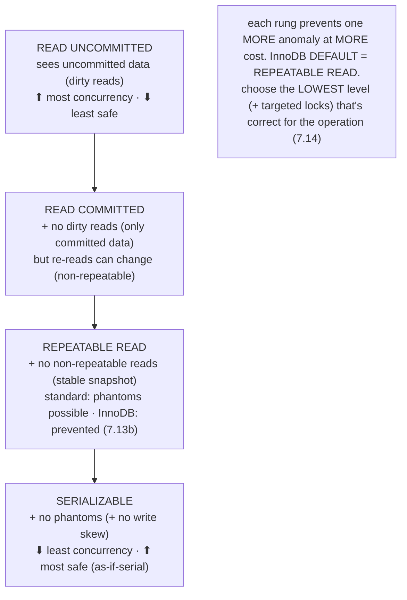
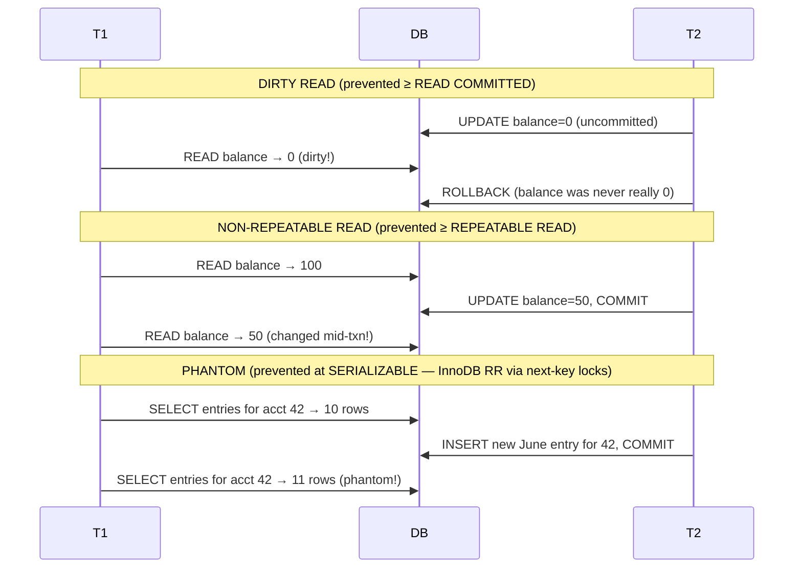
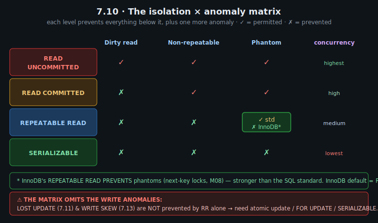
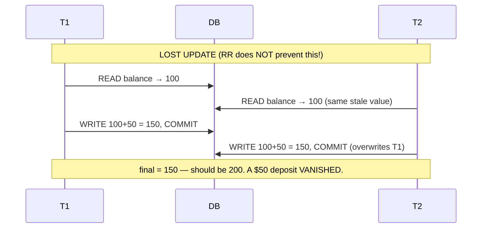
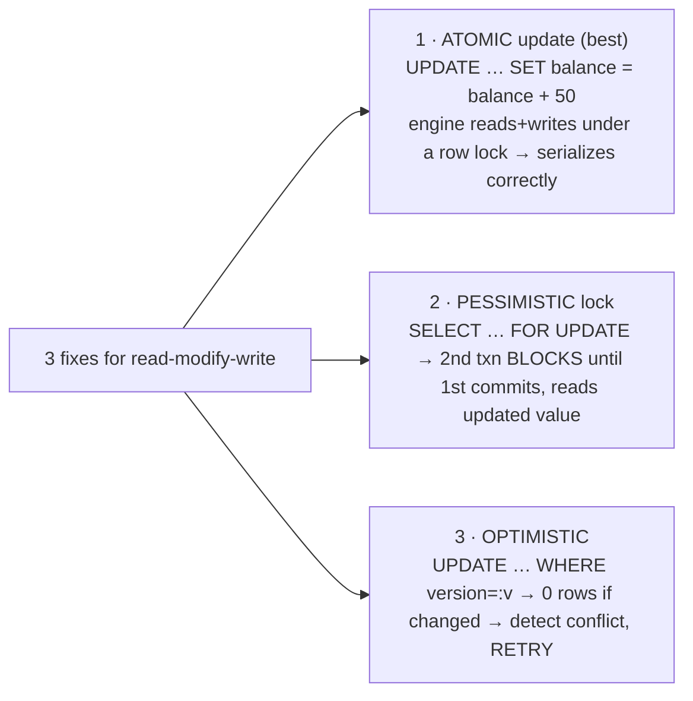
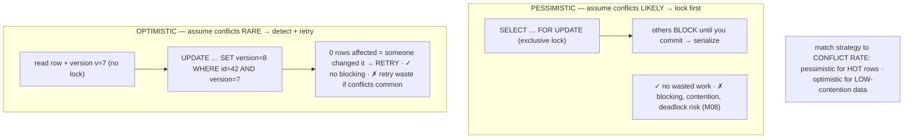
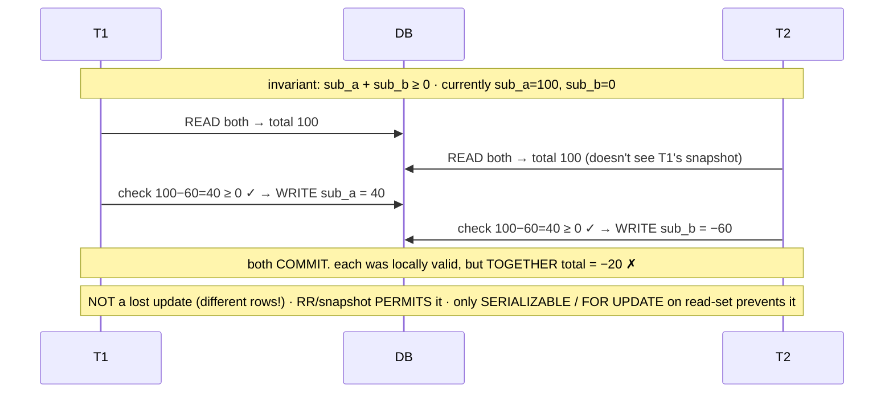
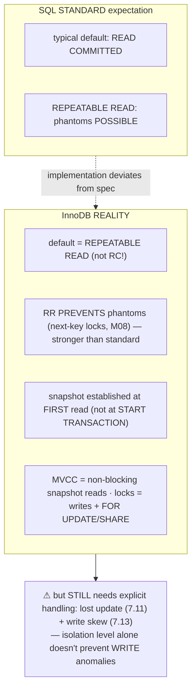

# M07 · Pass C — Diagrams & Worked Examples · Concepts 7.8–7.13b

> Pass C scope: **#12 Diagram(s)** + **#8 Worked example** (narrated). Pairs with `02-isolation-in-depth.md`. Mermaid sequence/timeline diagrams for the anomalies; the **★ isolation×anomaly matrix** is a custom SVG (7.10). Domain: payments/wallet. This is the heart of the module.

---

## 7.8 · The isolation levels (the SQL standard four) ★

**Diagram — the four levels as a ladder:**

**Worked example — the same two transactions climbing the ladder.**
Take two concurrent transactions touching one account and watch anomalies disappear as you raise the level. At **READ UNCOMMITTED**, T1 can read a balance that T2 wrote but hasn't committed (and might roll back) — a *dirty read* of data that may never have really existed. Raise to **READ COMMITTED**: dirty reads vanish (T1 only sees *committed* data), but if T1 reads the balance twice and T2 commits a change in between, T1's two reads *disagree* — a *non-repeatable read*. Raise to **REPEATABLE READ**: T1's reads are now stable (a consistent snapshot — re-reading returns the same value), so non-repeatable reads vanish too; the standard says *phantom* rows (new matching rows appearing) are still possible, though InnoDB prevents even those (7.13b). Raise to **SERIALIZABLE**: phantoms vanish too, and the execution is equivalent to *some* serial order — no read anomalies at all. Each rung removed one more anomaly — but at increasing cost: SERIALIZABLE locks reads, blocking more and aborting more under contention. The example shows *why* isolation is leveled — perfect "as-if-serial" is expensive, so you pick the rung that's *strong enough* for the operation (7.14): a transfer wants RR + locking; a fuzzy dashboard tolerates READ COMMITTED. The crucial thing the ladder *doesn't* show (and 7.10/7.11/7.13 hammer): it's a ladder of *read* anomalies — the *write* anomalies (lost update, write skew) aren't on it and need separate handling.

---

## 7.9 · Read anomalies: dirty, non-repeatable, phantom ★

**Diagram — each anomaly as a two-transaction timeline:**

**Worked example — the three anomalies on money data.**
Each anomaly is a concrete money bug. **Dirty read:** a fraud-check transaction (T1) reads Alice's balance as $0 because another transaction (T2) just set it to $0 *but hasn't committed* — then T2 *rolls back* (the $0 was a mistake), so T1 flagged an account based on a value that *never really existed*. Prevented at READ COMMITTED+ (only committed data is visible). **Non-repeatable read:** a statement-generation transaction (T1) reads Alice's balance as $100 at the top, does some work, and reads it again later as $50 because T2 committed a withdrawal in between — T1's report now contains *two inconsistent values* for the same balance. Prevented at REPEATABLE READ+ (a stable snapshot — T1 sees $100 both times). **Phantom read:** a reconciliation transaction (T1) counts "account 42's June entries" → 10, does work, re-counts → 11 because T2 inserted a new June entry and committed — a row *appeared* mid-transaction, so T1's two counts disagree. Prevented at SERIALIZABLE (and at InnoDB's RR via next-key locks, 7.13b). The example shows *why these anomalies are the vocabulary that defines the levels*: each is a specific way concurrency corrupts your view, and knowing them lets you reason precisely — "my statement logic re-reads the balance, so it can't tolerate non-repeatable reads → I need RR." Without the vocabulary, isolation is abstract; with it, choosing a level (7.14) is concrete. And the caveat that recurs: these are *read* anomalies — the *write* anomalies (7.11/7.13) are a separate, equally-important story the read taxonomy doesn't cover.

---

## 7.10 · The isolation × anomaly matrix ★

**★ Diagram (custom SVG):**

**Worked example — reading the matrix to choose a level.**
You have an operation and need to choose its isolation level — the matrix turns that into a lookup. Suppose it's a **multi-query report** that reads the same balances several times and must see a *consistent* point-in-time view. Walk the matrix: can it tolerate *dirty reads*? No (it must not read uncommitted garbage) → rules out READ UNCOMMITTED. Can it tolerate *non-repeatable reads* (a balance changing between its reads)? No (its numbers must be consistent across the report) → rules out READ COMMITTED. Can it tolerate *phantoms* (a new entry appearing mid-report)? Depends — for most reports the row-set should be stable too. Reading down to the lowest level that prevents the anomalies it can't tolerate, you land on **REPEATABLE READ** (and InnoDB's RR even prevents phantoms, per the green annotation — stronger than the standard's RR). So the matrix gave you the answer: RR. The diagram captures two crucial real-world annotations beyond the textbook: **(1)** the green cell — *InnoDB's RR prevents phantoms* (next-key locks, 7.13b), where the standard permits them, so MySQL's RR is stronger; **(2)** the red caveat at the bottom — *the matrix omits the write anomalies* (lost update 7.11, write skew 7.13), which RR does **not** prevent on its own. That second annotation is the load-bearing one: the matrix is *necessary but not sufficient*. You use it to reason about *read* consistency (and to know InnoDB's RR is strong), but for any *read-modify-write* (a balance update) or *multi-row invariant* under concurrency, you must add an atomic update, a `FOR UPDATE` lock, or SERIALIZABLE — the matrix alone would leave you with a false sense of safety. This is *the* reference artifact for the whole isolation topic, and the gap it shows is exactly why 7.11 and 7.13 exist.

---

## 7.11 · The lost update problem ★

**Diagram — lost-update timeline + the three fixes:**

**Worked example — two concurrent deposits, one vanishes.**
*The* classic money bug. Two $50 deposits hit Alice's $100 balance at the same time, each as a "read the balance, add $50, write it back" sequence. The fatal interleaving (top timeline): T1 reads $100, T2 *also* reads $100 (both saw the pre-update value), T1 writes $150 and commits, then T2 — using the *stale* $100 it read — writes $150 and commits, **overwriting T1's update**. Final balance: $150. It should be $200. **A $50 deposit silently vanished** — money destroyed, no error, invisible until reconciliation. The root cause is the **read-modify-write gap**: T2 decided based on a value that was stale by the time it wrote. The shocking part for newcomers: **REPEATABLE READ does NOT prevent this** — it's a *write* anomaly, not on the read matrix (7.10); each transaction read a consistent snapshot, but they both read the same old value and the last write won. The three fixes (bottom): **(1) atomic update** — `UPDATE … SET balance = balance + 50` does the read-and-write in *one* engine operation under a row lock, so concurrent increments serialize correctly to $200 (the best fix, and exactly why M02/2.17 / M16 balance maintenance uses `balance = balance + :delta`, never read-then-write); **(2) pessimistic lock** — `SELECT … FOR UPDATE` locks the row so the second deposit *blocks* until the first commits, then reads the *updated* value (7.12); **(3) optimistic** — read a version, `UPDATE … WHERE version = :v`, and if it matches zero rows (someone else changed it) detect the conflict and retry (7.12). The universal lesson (same as a non-atomic `counter++` in threads): **any read-modify-write on shared state is a lost-update hazard — make it atomic, lock it, or compare-and-set; consistent reads alone don't fix it.** This is the #1 practical transaction lesson and a guaranteed interview topic.

---

## 7.12 · Optimistic vs pessimistic concurrency control

**Diagram — lock-first vs detect-at-commit:**

**Worked example — updating a hot balance vs a rarely-edited setting.**
Two entities, two right answers. **The hot merchant balance** (thousands of concurrent transfers): conflicts are *frequent*, so **pessimistic** wins — `SELECT … FOR UPDATE` locks the balance row, concurrent transfers *block* and serialize, and each proceeds in turn with no wasted work. Optimistic here would *thrash*: dozens of transactions would read the same version, all but one would fail the version check at commit, and they'd all *retry* repeatedly — burning work. (Better still for a pure increment: the atomic update, 7.11.) **An account's settings row** (edited rarely, maybe once a month): conflicts are *vanishingly rare*, so **optimistic** wins — read the row and its `version`, make the edit, `UPDATE … WHERE version = :v`; almost always it succeeds (1 row affected) with *no lock held* and *no blocking*; on the rare concurrent edit, the version check matches 0 rows and you retry once. Pessimistic locking here would needlessly block and add deadlock risk for conflicts that essentially never happen. The example captures the decision rule: **match the strategy to the actual conflict rate** — pessimistic when contention is high (avoid retry waste), optimistic when contention is low (avoid blocking waste). It's the same dichotomy as lock-based vs lock-free/CAS data structures: *synchronization cost should match conflict probability*. InnoDB gives you the tools for both — `FOR UPDATE`/`FOR SHARE` (+ `SKIP LOCKED`/`NOWAIT` for queues, M08) for pessimistic, a `version` column + `WHERE version=:v` for optimistic — and the hot-account contention case is developed further in M08/M16.

---

## 7.13 · Write skew & SERIALIZABLE's role

**Diagram — write-skew timeline (overlapping reads, disjoint writes, broken invariant):**

**Worked example — two withdrawals, each valid, together overdrawing.**
The subtler anomaly that justifies SERIALIZABLE. An account has two linked sub-balances with the invariant "`sub_a + sub_b ≥ 0`," currently $100 total. Two withdrawals run *concurrently*: T1 withdraws $60 from `sub_a`, T2 withdraws $60 from `sub_b`'s side. Each transaction reads the *current* total ($100 — neither sees the other's concurrent write, because each has its own consistent snapshot under RR), each checks "after my $60 withdrawal, $40 ≥ 0 ✓," and each writes to its *own* row. Both commit. **Individually, each preserved the invariant against the state it read** — but together they withdrew $120 from $100, leaving −$20: the invariant is *jointly* violated. The defining signature: **overlapping reads, disjoint writes, a multi-row invariant** — so it's *not* a lost update (they wrote *different* rows, nothing was overwritten) and *not* a read anomaly (each read was perfectly consistent). This is the anomaly that proves **snapshot isolation (InnoDB's RR) is NOT serializable** — a strong level still lets it through, because each snapshot legitimately excludes the other's concurrent write. Only **SERIALIZABLE** prevents it (the executions can't be serialized — one must abort), or, at a lower level, **explicitly locking the entire read set** (`SELECT … FOR UPDATE` on *both* sub-balances before deciding, so the transactions can't proceed on stale snapshots), or **materializing the conflict** onto one row both must contend on. The example teaches the staff-level distinction most people miss: "I use REPEATABLE READ so I'm safe" is *false* for multi-row invariants — when an invariant spans rows and concurrent actors decide from a shared read, you have a write-skew hazard, and you need true serialization or read-set locking. Real fintech instances: shared spending limits, "total across linked accounts ≥ 0," double-booking a resource. Recognizing write skew (and that RR doesn't stop it) is a strong concurrency-depth and interview signal.

---

## 7.13b · MySQL/InnoDB's actual defaults & behavior

**Diagram — InnoDB reality vs SQL-standard expectation:**

**Worked example — InnoDB's RR avoids phantoms the standard allows.**
The textbook says REPEATABLE READ permits phantom reads (7.9) — so you might expect that under MySQL's RR, a re-run query could return new rows another transaction inserted. But InnoDB's RR *prevents* this, and knowing *why* (and that it does) is using MySQL correctly. The mechanism (detailed in M08): for *locking* reads and writes, InnoDB takes **next-key locks** — it locks not just the matching index records but the **gaps between them**, so another transaction *cannot insert* a new matching row into the range, eliminating the phantom. (And plain non-locking `SELECT`s use the consistent MVCC snapshot, which also doesn't see new rows.) So InnoDB's RR behaves closer to "snapshot isolation *with* phantom protection" than the textbook RR — *stronger* than the standard requires. This is one instance of the broader lesson the concept exists for: **the implementation deviates from the specification, and you must know your specific system's actual behavior.** The three load-bearing InnoDB realities the diagram captures: **(1)** the default is REPEATABLE READ (not READ COMMITTED, the default in Postgres/Oracle/SQL Server — so a developer porting reasoning across databases gets it wrong); **(2)** InnoDB's RR prevents phantoms (next-key locks); **(3)** the snapshot is established at the *first read* in the transaction (not at `START TRANSACTION`). And the red caveat — the part that *survives* all this strength — is the most important: InnoDB's strong RR still does **not** prevent the *write* anomalies (lost update 7.11, write skew 7.13), because those aren't addressed by the isolation level at all; you need atomic updates, `FOR UPDATE`, or SERIALIZABLE. So the takeaway for our domain: InnoDB's default gives money *reads* strong consistency for free, but money *writes* always need explicit care. The *how* — MVCC version chains and next-key lock mechanics — is the entire subject of M08; here the point is *what InnoDB actually guarantees* so you reason correctly.

---

*Diagrams + worked examples for 7.8–7.13b complete (8 Mermaid + 1 ★ SVG). Next Pass C file: 7.14–7.16 (level-decision flow, long-transaction impact, ★ atomic-transfer SVG).*
