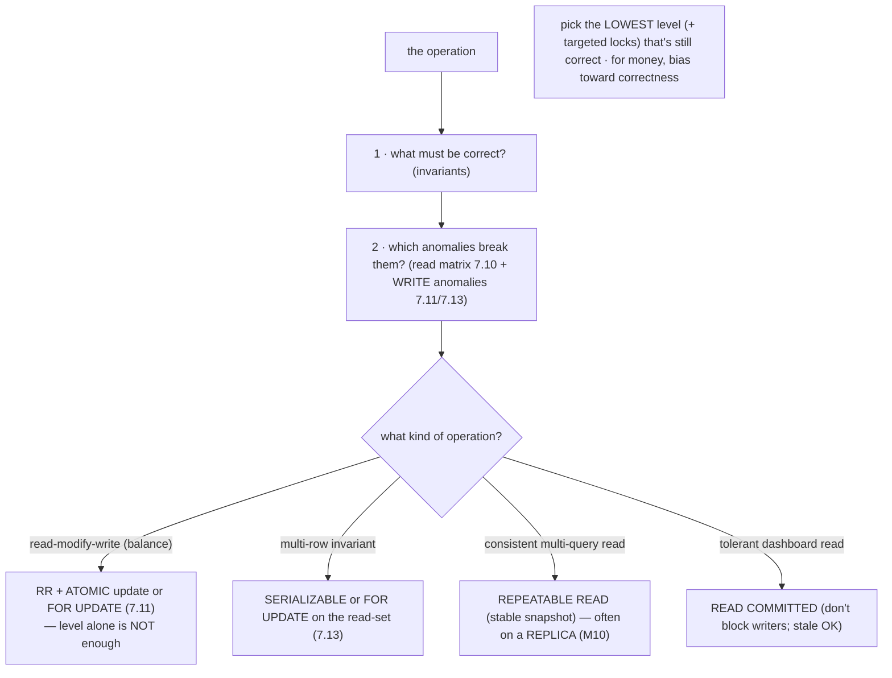
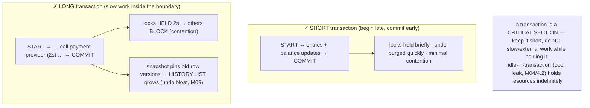

# M07 · Pass C — Diagrams & Worked Examples · Concepts 7.14–7.16

> Pass C scope: **#12 Diagram(s)** + **#8 Worked example** (narrated). Pairs with `03-choosing-pitfalls-capstone.md`. Mermaid + the **★ atomic-transfer capstone** (custom SVG, 7.16). Domain: payments/wallet. These close out M07 Pass C.

---

## 7.14 · Choosing an isolation level (the decision)

**Diagram — operation → required guarantee → level + locks:**

**Worked example — RR + locks for a transfer; RC/snapshot for a dashboard.**
Two operations, two deliberate choices. **The transfer** (money movement, must be correct): its invariants are conservation and non-negative balance; the anomaly that would break it is *lost update* on the balance (7.11) — which is a *write* anomaly the isolation level alone doesn't prevent. So the choice isn't just "raise the level"; it's **InnoDB's default REPEATABLE READ + an atomic balance update** (`balance = balance + :delta`) or `SELECT … FOR UPDATE`. RR gives strong, phantom-protected reads (7.13b); the atomic update/lock handles the write anomaly. (If it involved a multi-row invariant like a shared limit, you'd add `FOR UPDATE` on the whole read-set or use SERIALIZABLE, 7.13.) **The dashboard** ("total deposits today," refreshed live): it can tolerate slightly stale numbers and must *not block* the writers constantly updating the ledger. So it uses **READ COMMITTED** (or a consistent snapshot read) — and runs on a **replica** (M10) so it doesn't load the primary or pin undo (7.15). The example shows the per-operation decision: enumerate the invariants, map to the anomalies (including the *write* anomalies the matrix omits), pick the *lowest* level plus *targeted locks* that's still correct, and weigh the concurrency cost. The two biases: for **money movement**, bias toward correctness (RR + locking, or stronger); for **tolerant reads**, bias toward concurrency (weaker level, replica). The wrong move is one blanket level for everything — SERIALIZABLE everywhere (bottleneck) or READ COMMITTED everywhere (corrupts the money paths). It's right-sizing consistency per operation, a frequent system-design interview question.

---

## 7.15 · Transactions, performance & pitfalls

**Diagram — short vs long transaction impact:**

**Worked example — a long-open transaction poisons the system.**
A developer wraps the *entire* payment flow in one transaction: `START TRANSACTION; debit Alice; ` *call the external card network (takes 2 seconds);* ` credit Bob; COMMIT;`. It's atomic — but it's a disaster under load. For those 2 seconds, the transaction **holds row locks** on Alice's (and related) rows (M08), so every *other* transaction needing those rows **blocks** — contention cascades. Worse, the open transaction's **snapshot pins the old versions** of every row modified since it started, so InnoDB **can't purge that undo history** — the **history list grows** (M09), bloating undo storage and slowing every read that must traverse longer version chains. One slow transaction degrades the *whole database*, not just itself. And if the connection is left idle-in-transaction (a pool leak, a forgotten `COMMIT`, M04/4.2), it holds those resources *indefinitely* — a silent, severe incident. The fix is **transaction hygiene**: make the boundary (7.6) *exactly* the atomic database work — debit, credit, balance updates, commit — and do the slow external call **outside** the transaction (call the card network first, *then* record the result in a short transaction, using idempotency/outbox to bridge the gap, M16). The principle is universal: **a transaction is a critical section, so keep it short and never do I/O or wait on the outside world while holding it** — the cost it imposes on others scales with how long it's held. "Begin late, commit early, no slow work inside" — and one long/forgotten transaction can stall everyone. (Detect with `information_schema.INNODB_TRX` for long-running transactions and the history-list-length metric, M09/M13.)

---

## 7.16 · Fintech capstone — the atomic transfer & money invariants ★

**★ Diagram (custom SVG):**

**Worked example — post a transfer correctly under concurrency and crashes.**
The capstone is the operation a payments platform exists to perform, with *every* M07 guarantee in play (the SVG). Move $100 from Alice to Bob:
1. **Boundary (7.6):** `START TRANSACTION` — one short explicit transaction around *exactly* the transfer; the external card-network call stays *outside* it (7.15).
2. **Idempotency (M16):** insert the `transaction_` row with its UNIQUE `idempotency_key` (M05/5.17) — a retry of the same request hits the duplicate-key constraint and is recognized as already-processed, so it **cannot double-post**, making the transfer exactly-once.
3. **Balanced entries (Atomicity 7.2 + Consistency 7.3):** insert the two `ledger_entry` rows — −100 (Alice), +100 (Bob) — which **sum to zero** (double-entry, M01/1.19); inside the atomic transaction they're all-or-nothing, so the invariant is never half-applied.
4. **Atomic balance updates (Isolation / lost-update fix 7.11):** `UPDATE … SET balance = balance − 100 WHERE id = Alice` and `… + 100 WHERE id = Bob` — *atomic increments* (not read-then-write), so concurrent transfers to the same hot account don't lose updates; InnoDB row locks serialize them correctly.
5. **Commit (Durability 7.5):** `COMMIT` — all of it becomes atomically visible and durable (redo log fsync, M09); a crash an instant later cannot lose it.
6. **Retry (7.7, M08):** on a deadlock or lock-timeout under contention, the application retries the whole transaction — *safe* because of idempotency (step 2).

The result, as the SVG's verdict box states: money is **conserved** (SUM=0), **attributed** (right accounts), **never lost** (atomic + durable), and **never duplicated** (idempotent) — *under concurrency and crashes*. This is "money-never-lies" realized as a single transaction, synthesizing M01 (the ledger model), M02 (normalized ledger + derived balance), M05 (the indexes + UNIQUE idempotency key), and M07 (the transaction that makes it correct). Every failure mode the module described would otherwise manifest here: a non-atomic transfer loses money (half-applied), a lost update mis-counts the hot account, a non-durable commit loses a confirmed payment, a non-idempotent retry double-charges — and the transaction makes each *impossible*. The transferable recipe for any critical state change: **atomic boundary around exactly the consistent unit + atomic updates to shared state + durability + idempotent retry**. And this exact transactional core is what **M08** analyzes under lock contention (the hot-account problem), **M09** makes durable (the redo log mechanism), and **M16** scales across shards (keeping debit + credit on one shard so the transfer stays a single local transaction, M02/2.16, M11). The atomic transfer is the beating heart of the fintech system — and getting its transaction right is the single most important correctness decision in the entire platform.

---

*Diagrams + worked examples for 7.14–7.16 complete (2 Mermaid + 1 ★ SVG). **M07 Pass C is fully drafted (all 16 concepts: 17 Mermaid + 2 ★ custom SVGs).** Remaining for M07: Pass D — code-specifics boxes, failure modes & gotchas, fintech lens, interview/SD angle, and self-check questions.*
