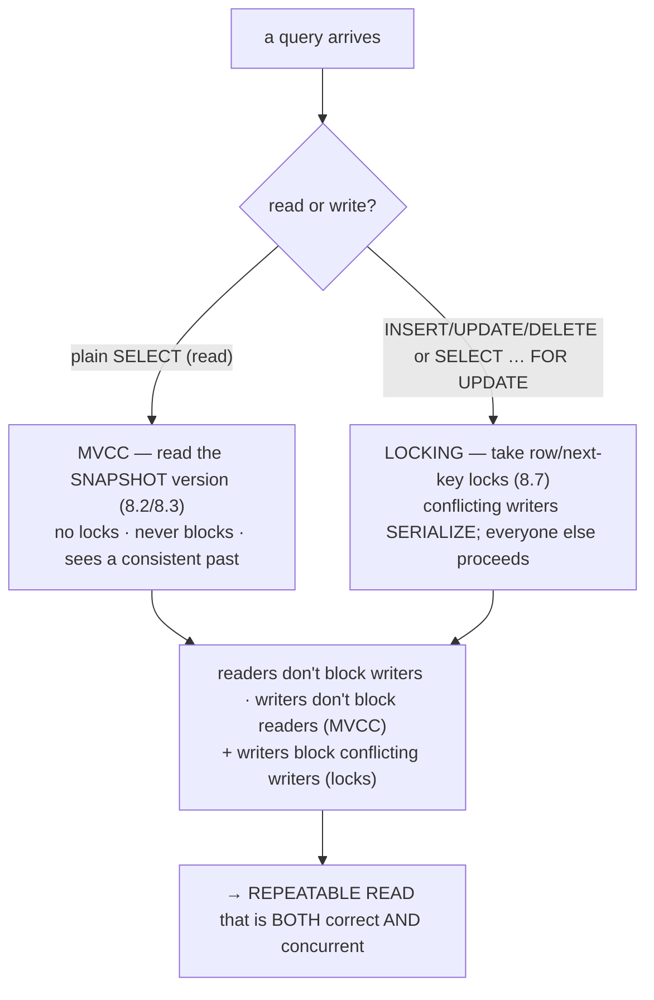
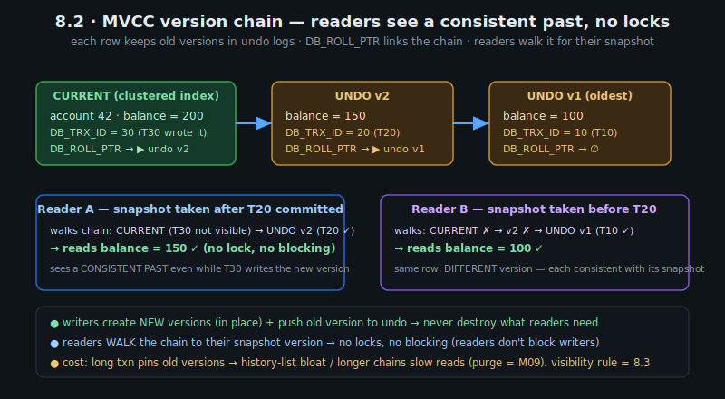
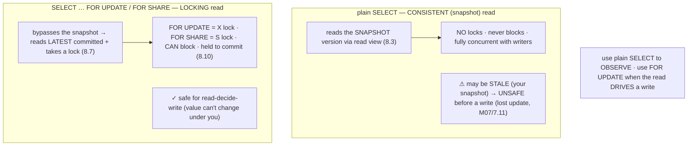

# M08 · Pass C — Diagrams & Worked Examples · Concepts 8.1–8.4

> **Pass C scope:** content-contract items **#12 Diagram(s)** and **#8 Worked example** (narrated, no code in prose). Pairs with `01-mvcc-and-read-modes.md`. Concepts 8.2/8.3 use **★ bespoke custom SVGs** (in `assets/`, render-validated); 8.1/8.4 use Mermaid. Domain: payments/wallet, M05-indexed ledger.

---

## 8.1 · Why two mechanisms: MVCC + locking ★

**Diagram — the two-mechanism split:**

**Worked example — a reconciliation read and a transfer running concurrently.**
A heavy reconciliation query (a plain `SELECT SUM(amount) … ` over the ledger, M02/2.17) runs at the same instant as a stream of transfers writing new entries and updating balances. Without the two-mechanism design — say, a pure-locking system where reads take shared locks — the reconciliation would *lock* every row it reads, blocking the transfers (which need to write those rows), and the transfers would block the reconciliation; the report would freeze all writes for its duration, or vice versa. InnoDB's split avoids this entirely. The reconciliation is a **plain SELECT → MVCC**: it reads each row's *snapshot version* (8.2) from the version chain, takes *no locks*, and *never blocks* — even as transfers concurrently write *newer* versions of those same rows (the read sees the *old*, snapshot-consistent version). The transfers are **writes → locking**: they take row locks on the balance rows they update, serializing only with *other transfers to the same account* (8.5/8.15), not with the read. So the report and the transfers run *fully in parallel* — "readers don't block writers, writers don't block readers." The example shows *why* two mechanisms beat one: MVCC keeps the common case (reads) off the locking path entirely, so the database is *both* strongly isolated (consistent reads, serialized conflicting writes) *and* highly concurrent (reads never wait). This is the engine that makes a payments system handle concurrent reporting and transfers — and the rest of the module zooms into each half.

---

## 8.2 · MVCC: multi-version concurrency control ★

**★ Diagram (custom SVG):**

**Worked example — two transactions read the same row, see different versions.**
The SVG shows account 42's balance as a **version chain**: the current value (200, written by T30) links backward via `DB_ROLL_PTR` to an undo version (150, by T20), which links to an older one (100, by T10) — each tagged with the `DB_TRX_ID` that created it. Now two readers query "account 42's balance." **Reader A** took its snapshot *after T20 committed* (but T30 is still active): it walks the chain from the current version — T30 is not visible (still active), so it follows the roll pointer to the undo version by T20, which *is* visible (committed before A's snapshot) → **A reads 150**. **Reader B** took its snapshot *before T20*: it walks further back, past T30 and T20 (both not visible), to T10's version → **B reads 100**. The *same row*, read at the *same instant*, returns *different values* — and each is *correct* for that reader's snapshot. Crucially, **neither reader took a lock or blocked**, even though T30 is concurrently writing — because the writers *create new versions* rather than destroying old ones, and readers *walk the chain* to find their snapshot-consistent version. This is the mechanism behind M07's "REPEATABLE READ sees a stable snapshot" (re-reads return the same version) and behind the non-blocking reads of 8.1. The cost (the SVG's bottom note): a long-running transaction keeps old versions *pinned* (its snapshot might need them), preventing their purge → the history list bloats and chains lengthen, slowing reads (M07/7.15) — undo *management* is M09. The *visibility rule* deciding which version each reader sees is concept 8.3.

---

## 8.3 · Read views & visibility (how a snapshot is chosen) ★

**★ Diagram (custom SVG):**

**Worked example — how the snapshot decides which version you see.**
The version chain (8.2) is raw material; the **read view** is the *policy* that selects a consistent cut through it. The SVG shows my transaction (T25) taking a snapshot: it records the set of transactions *active (uncommitted)* at that moment — `{T30}` — while T10 and T20 had already committed. Now I read account 42, walking its version chain (8.2) with the **visibility rule**: the *current* version was written by T30, which is in my "active" set (uncommitted at my snapshot) → **not visible** → follow the roll pointer down. The next version was written by T20, which *committed before my snapshot* → **visible** → I read it (150) and stop. So the read view turned "many versions" into "the one consistent version for *my* snapshot." The deep payoff the SVG's right panel shows: ***when* the read view is created *is* the isolation level.** At **REPEATABLE READ**, one read view is created at the transaction's *first read* and *reused* for every subsequent read → a *stable, repeatable* snapshot (re-reads see the same versions — no non-repeatable reads, M07/7.9). At **READ COMMITTED**, a *fresh* read view is created for *each statement* → each statement sees the *latest committed* data (hence non-repeatable reads). So RR and RC are *the same versioning machinery* with *different read-view timing* — which makes M07's anomaly behavior concrete rather than magic. And the final note: *plain SELECT uses the read view (snapshot/MVCC); a locking read (`FOR UPDATE`) bypasses it* — reads the latest committed version and locks it (8.4). This visibility mechanism is the precise answer to "why does RR see a stable snapshot but RC sees fresh data?"

---

## 8.4 · Consistent reads vs locking reads

**Diagram — plain SELECT (snapshot) vs locking SELECT (current + lock):**

**Worked example — when the transfer must use a locking read.**
A transfer must "read Alice's balance, check it's ≥ $100, then debit $100." Consider the two read modes. If it uses a **plain `SELECT balance …`** (consistent/snapshot read), it reads Alice's *snapshot* balance — which may be **stale** by the time it writes (another transfer could have debited her in between, but the snapshot doesn't see it). So checking "≥ $100" against a stale read, then debiting, is the **lost-update / write-skew hazard** (M07/7.11/7.13): two concurrent transfers both read $100, both check "sufficient ✓," both debit — overdrawing the account. The plain read is *unsafe because it drives a write*. The fix is a **locking read**: `SELECT balance … FOR UPDATE` takes an **exclusive lock** on Alice's row and reads the **latest** committed value — so no other transaction can modify (or lock) that row between the check and the debit; the second transfer *blocks* until the first commits, then reads the *updated* balance and correctly sees it's insufficient. (Even better for a pure debit: the **atomic `UPDATE … SET balance = balance - 100 WHERE balance >= 100`**, M07/7.11, which combines the check-and-write into one locked operation — no separate read needed.) The example crystallizes the distinction: **a read that just *observes* (a report, a display) uses a plain non-blocking snapshot read; a read that *drives a write* must lock it (`FOR UPDATE`) or use an atomic update** — because a snapshot read can be stale, and acting on stale data is the lost-update bug. Knowing which mode a query needs — "is this read going to drive a write?" — is core to correct concurrent money code, and it's the mechanism behind M07's "isolation level alone doesn't prevent write anomalies; the locking read is how you do."

---

*Diagrams + worked examples for 8.1–8.4 complete (2 ★ custom SVGs + 2 Mermaid). Next Pass C file: 8.5–8.10 (lock hierarchy, S/X matrix, ★ record/gap/next-key SVG, index→lockset, insert-intention, 2PL).*
