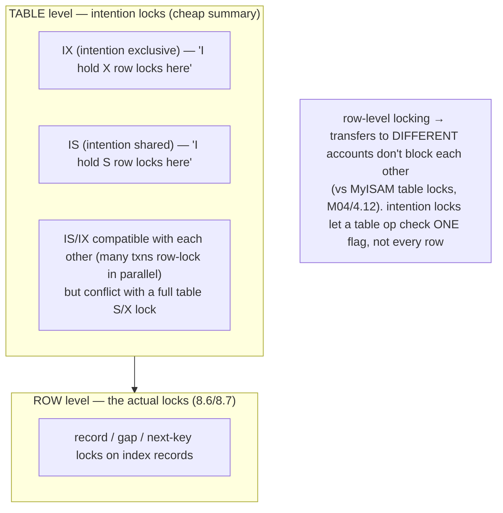
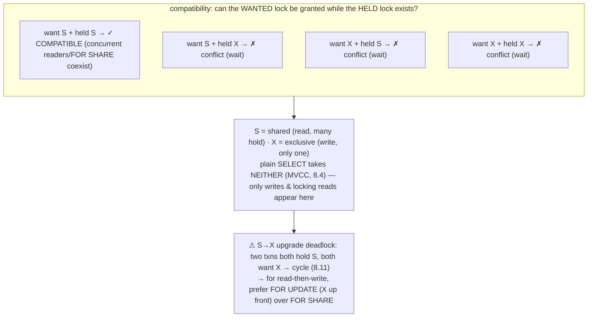
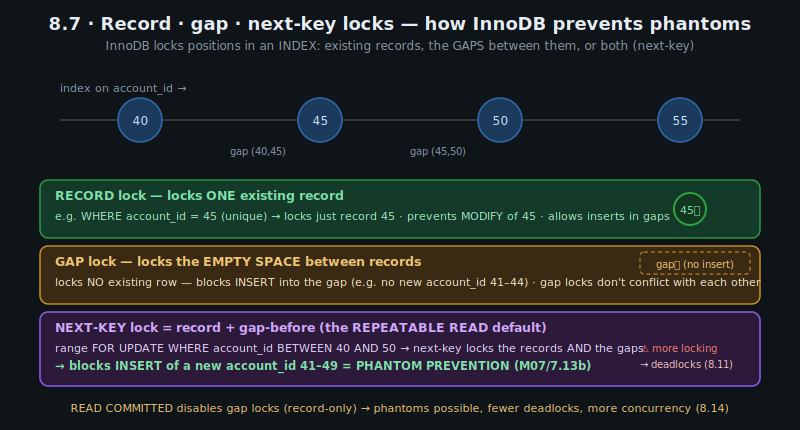
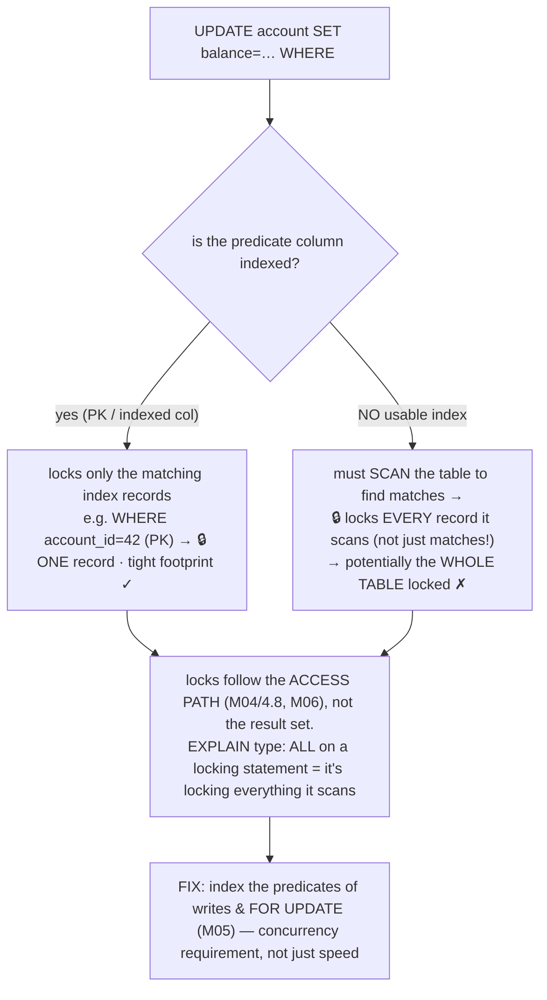
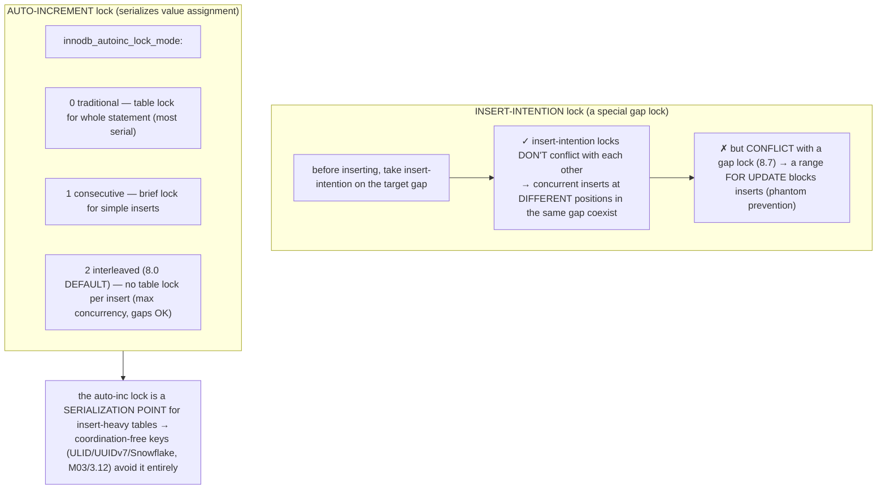
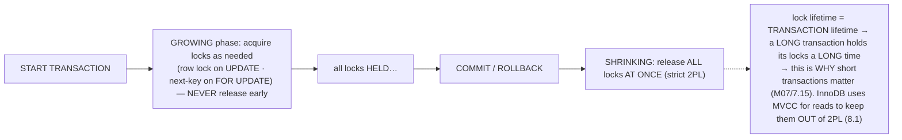

# M08 · Pass C — Diagrams & Worked Examples · Concepts 8.5–8.10

> Pass C scope: **#12 Diagram(s)** + **#8 Worked example** (narrated). Pairs with `02-the-lock-taxonomy.md`. Concept 8.7 uses the **★ record/gap/next-key custom SVG**; the rest use Mermaid. Domain: payments/wallet.

---

## 8.5 · Lock granularity: row vs table (and intention locks)

**Diagram — the lock hierarchy:**

**Worked example — why transfers to different accounts run in parallel.**
Three transfers happen at once: Alice→Bob, Carol→Dave, Eve→Frank — six *different* accounts. Under InnoDB's **row-level locking**, each transfer takes exclusive locks on *its own* accounts' rows (different rows), so all three proceed **fully in parallel** — no blocking, because they don't touch the same rows. (Each also takes a cheap table-level **IX intention lock** on `account`, but those are compatible with each other — multiple transactions can hold IX simultaneously, they're just declaring "I have row locks here.") Contrast MyISAM (M04/4.12), which only has **table-level locking**: the *first* transfer would lock the *entire* `account` table, and the other two would *wait* — serializing all writes to the table regardless of which accounts they touch. That's catastrophic for a payments system (every transfer blocks every other). The intention locks make the row/table hierarchy efficient: when something wants a *table-wide* lock (some DDL, 8.13), it checks the *intention* locks — "is anyone row-locking this table?" — in O(1), instead of scanning every row's locks. The example shows the foundational win of InnoDB's design: **fine-grained row locks give concurrency across different rows; the intention-lock hierarchy keeps coarse operations efficient.** Only transfers to the *same* account serialize (hot-row contention, 8.15) — which is exactly the case worth optimizing. This is *why* a payments system can sustain high concurrent write throughput across many accounts.

---

## 8.6 · Shared vs exclusive locks (the compatibility matrix) ★

**Diagram — the S/X compatibility matrix:**

**Worked example — two FOR SHARE reads coexist; a FOR UPDATE blocks them.**
Two reconciliation jobs each do `SELECT balance … FOR SHARE` on account 42 — both take a **shared (S) lock**, and the matrix says **S + S is compatible**, so they *coexist* (both read-lock the row simultaneously, neither blocks). Now a transfer does `SELECT … FOR UPDATE` (or an UPDATE) on account 42 — it wants an **exclusive (X) lock**, which conflicts with the held S locks (X + S = conflict), so the transfer **waits** until both reconciliation jobs release (at commit, 8.10). Conversely, if the transfer's X lock were granted *first*, both `FOR SHARE` reads would block on it. This is the S/X matrix deciding exactly who waits for whom — the foundation of all contention. The example also surfaces the classic hazard the diagram flags: the **S→X upgrade deadlock**. Suppose *both* reconciliation jobs hold S on account 42 and *then* each tries to `UPDATE` it (upgrade S→X): job 1's X-upgrade waits for job 2's S to release, and job 2's X-upgrade waits for job 1's S — a **cycle** (8.11), and InnoDB kills one. This is why, for a **read-then-write** pattern, you should take `FOR UPDATE` (an X lock) *up front* rather than `FOR SHARE` then upgrade — acquiring X immediately avoids the upgrade deadlock. The takeaway: the two-mode matrix (S shares, X excludes everything) is the primitive under every lock interaction, and recognizing its hazards (S+X conflict, the S→X upgrade cycle) is how you reason about who blocks whom and why.

---

## 8.7 · Record, gap & next-key locks ★

**★ Diagram (custom SVG):**

**Worked example — a range FOR UPDATE locks the gap, blocking a phantom insert.**
The SVG shows an index on `account_id` with records 40, 45, 50, 55 and the *gaps* between them. A transaction runs `SELECT … WHERE account_id BETWEEN 40 AND 50 FOR UPDATE` at REPEATABLE READ. InnoDB takes **next-key locks** across that range — locking the existing records (40, 45, 50) *and* the gaps around them (the empty space between consecutive keys). Now another transaction tries to `INSERT` a new account with `account_id = 43` — which would fall *in the gap* between 40 and 45. Because that gap is **gap-locked**, the insert **blocks** (its insert-intention lock, 8.9, conflicts with the gap lock) until the first transaction commits. And *that is exactly phantom prevention* (M07/7.13b): if the insert had been allowed, the first transaction re-running its range query would see a *new* row (43) that wasn't there before — a phantom. By locking the *gaps* (the empty ranges where new rows could appear), not just the existing rows, InnoDB prevents the inserts that would create phantoms — which is *how* its REPEATABLE READ is stronger than the SQL standard's (the standard permits phantoms at RR). The crucial insight the SVG drives home: a **gap lock locks *nothing that exists* — it locks the *possibility* of a new row** in a range. The cost (the SVG's note): next-key/gap locks lock *ranges*, so they block more inserts than strictly necessary and are a major source of **deadlocks** (8.11) — which is why **READ COMMITTED disables gap locks** (record-only → phantoms possible but fewer deadlocks, more concurrency, 8.14). This concept is the concrete mechanism behind every "InnoDB RR prevents phantoms via next-key locks" reference in M07 — *here's exactly how.*

---

## 8.8 · Locks are on index records (which index matters)

**Diagram — same query, different index → different locked set:**

**Worked example — an unindexed WHERE locks every row scanned.**
Two updates, same logical size (each affects one row), wildly different lock footprints. **(1) Indexed:** `UPDATE account SET balance = balance - 100 WHERE account_id = 42` — `account_id` is the PK, so InnoDB does a tight index lookup and takes an **exclusive lock on exactly one record** (account 42's row). Minimal footprint; other accounts unaffected. **(2) Unindexed:** `UPDATE ledger_entry SET flag = 1 WHERE some_unindexed_column = 'x'` — there's no index on that column, so InnoDB must **scan the table** to find matching rows, and it **locks every record it scans** (because it locks each row to evaluate the condition), *not just the one that matches*. On a billion-row ledger, this can lock **vast swaths of the table** — even though it updates one row — turning a tiny logical update into a table-wide lock that blocks countless other transactions (and invites deadlocks). The shocking part: the two statements look equally small, but the unindexed one is a **contention bomb** that gets worse as the table grows. The lesson — *locks follow the access path (M04/4.8), not the result set* — connects indexing (M05) directly to concurrency: **an index on a locking predicate isn't just for read speed, it's for minimizing the lock footprint.** The diagnostic: `EXPLAIN` the locking statement — if it shows `type: ALL` (full scan, M06), it's *also* locking everything it scans. The fix is unambiguous: **index the predicate columns of `UPDATE`/`DELETE`/`FOR UPDATE`** — a concurrency requirement as much as a performance one. For our domain, the transfer's PK-based balance updates have a tight footprint (good); a poorly-written unindexed maintenance update on the ledger would be a contention disaster.

---

## 8.9 · Insert-intention & auto-increment locks

**Diagram — insert-intention in a gap; auto-inc lock modes:**

**Worked example — concurrent inserts contend on the auto-inc lock.**
The ever-growing `ledger_entry` table is insert-heavy — thousands of new entries per second from concurrent transfers. Two things govern this insert concurrency. **(1) Insert-intention locks:** when two transfers each insert a new entry, they take *insert-intention* locks on the index gaps where their new rows go. Because insert-intention locks **don't conflict with each other** (they're inserting at *different* positions), both inserts **proceed concurrently** — InnoDB doesn't needlessly serialize inserts into the same gap. (They *would* block if another transaction held a *gap lock* on that range, e.g., a range `FOR UPDATE` for phantom prevention, 8.7 — which is the mechanism behind "a range lock blocks new rows.") **(2) The auto-inc lock:** if `ledger_entry` uses an `AUTO_INCREMENT` PK, every insert needs the *next* auto-inc value, and InnoDB must serialize that assignment so two inserts don't get the same ID. This is a **serialization point**: all inserts to the table contend on the auto-inc mechanism. The `innodb_autoinc_lock_mode` controls how much: mode 0 (traditional) holds a table-level lock for the whole insert statement (most serial); **mode 2 (interleaved, the 8.0 default)** doesn't hold a table lock per insert (maximum concurrency, but auto-inc values can be non-consecutive across concurrent inserts — fine for surrogate keys, M01/1.4). The example surfaces the scaling insight: a **central auto-inc sequence is a concurrency bottleneck under high insert rates** — which is one reason high-insert-rate distributed systems use **coordination-free keys** (ULID/UUIDv7/Snowflake, M03/3.12) that need *no* central sequence (each node mints IDs independently), eliminating the auto-inc contention entirely. For our domain, the ledger's extreme insert rate makes auto-inc behavior (or a time-ordered key) a real throughput consideration at scale — connecting M03/3.12's key choice to M08's insert concurrency and M11/M16's sharding (each shard with its own sequence).

---

## 8.10 · Two-phase locking & lock lifetime

**Diagram — locks acquired during the txn, all released at commit:**

**Worked example — a long transaction blocks every transfer to one account.**
A transaction takes an exclusive lock on account 42's balance row when it updates it — and under **strict two-phase locking**, it **holds that lock until it commits** (it *cannot* release the lock early; locks grow during the transaction and are all released together at the end). Now suppose this transaction is *long* — it updated account 42, then made a slow external API call (a mistake, M07/7.15), and won't commit for 2 seconds. For those entire 2 seconds, **every other transfer to account 42 is blocked**, queued on that row's lock, unable to proceed until this transaction commits. One slow transaction freezes that account's throughput entirely. This is the mechanism behind M07/7.15's "keep transactions short": because **lock lifetime = transaction lifetime** (strict 2PL holds locks to commit), the *only* lever to reduce lock-holding time is to *reduce transaction duration* — you can't release the lock early (that would break correctness — another transaction could act on data this one might still roll back). The example makes the 2PL rule concrete and shows why it's *the* reason transaction hygiene matters: a transaction is a critical section, and its locks are held for its *whole* duration, so slow/external work inside it directly translates to contention for everyone needing those rows. (InnoDB mitigates this for *reads* by using MVCC — reads take no locks, so they don't participate in 2PL at all, 8.1 — but *writes* are firmly under strict 2PL.) For our domain, this is exactly why the transfer transaction must be short (the external payment call goes *outside* it, M07/7.16) and why hot-account contention (8.15) is so sensitive to transaction duration: every extra millisecond of lock-hold multiplies across the queue of waiting transfers.

---

*Diagrams + worked examples for 8.5–8.10 complete (1 ★ custom SVG + 5 Mermaid). Next Pass C file: 8.11–8.16 (★ deadlock-cycle, hot-account, transfer-footprint SVGs + Mermaid for SKIP LOCKED, MDL, mechanism-per-level).*
