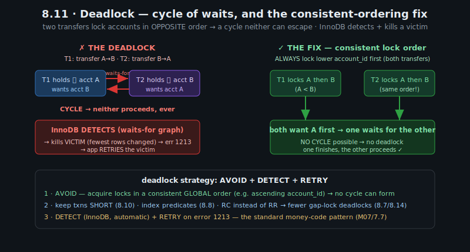
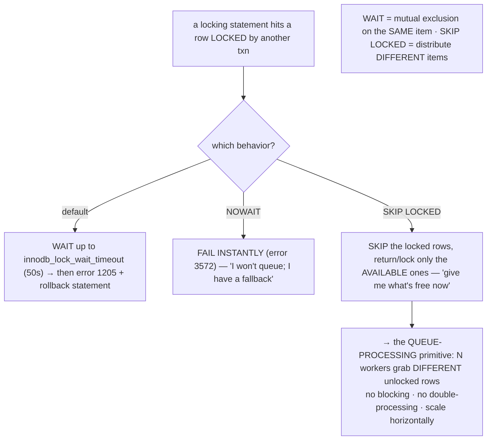
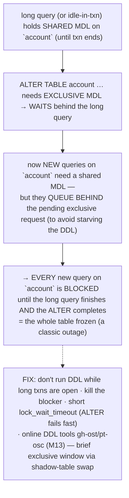
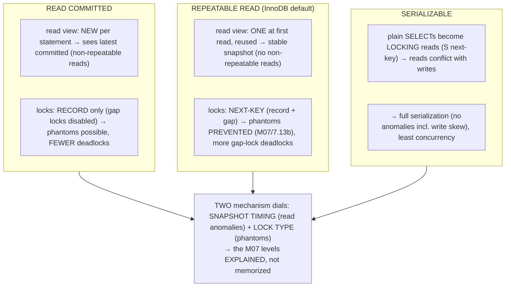

# M08 · Pass C — Diagrams & Worked Examples · Concepts 8.11–8.16

> Pass C scope: **#12 Diagram(s)** + **#8 Worked example** (narrated). Pairs with `03-contention-failures-capstone.md`. Concepts 8.11/8.15/8.16 use **★ bespoke custom SVGs**; 8.12/8.13/8.14 use Mermaid. Domain: payments/wallet. These close out M08 Pass C.

---

## 8.11 · Deadlocks: detection, victim selection, avoidance ★

**★ Diagram (custom SVG):**

**Worked example — two transfers in opposite order deadlock; consistent ordering fixes it.**
The SVG shows the canonical money deadlock. Transfer T1 moves money A→B; transfer T2 moves money B→A — running concurrently. If each locks its *from* account first: **T1 locks A** (then wants B), **T2 locks B** (then wants A). Now T1 waits for T2 to release B, and T2 waits for T1 to release A — a **cycle in the waits-for graph**, and neither can ever proceed (unlike a normal lock-wait, which resolves when the holder commits — here *both* are holders *and* waiters). InnoDB **detects** the cycle (it maintains the waits-for graph and checks for cycles when a transaction would wait), **picks a victim** (the transaction that has modified the fewest rows — cheapest to roll back), **rolls it back** (releasing its locks so the other proceeds), and returns **error 1213** to the victim's application — which must **retry** (usually succeeding, since the conflict has cleared). But detection is *recovery*, not *prevention* — the victim still paid (a rollback + retry). The real fix the SVG shows is **avoidance via consistent lock ordering**: have *both* transfers acquire account locks in a **fixed global order** — e.g., always lock the *lower* `account_id` first, regardless of transfer direction. Then T1 (A→B) locks A then B, and T2 (B→A) *also* locks A then B (same order!) — so they both want A first, one simply waits for the other (a normal lock-wait, no cycle), and there's **no deadlock possible**. The example teaches the universal rule: **acquiring multiple locks in a consistent global order makes deadlock cycles impossible** (the dining-philosophers fix). The complete strategy: **AVOID** (consistent ordering — and keep transactions short, index predicates, consider RC to reduce gap-lock deadlocks) + **DETECT** (InnoDB does it automatically) + **RETRY** (on 1213). This consistent-ordering + retry pattern is the canonical deadlock defense for money movement and a guaranteed interview topic.

---

## 8.12 · Lock waits, timeouts & SKIP LOCKED / NOWAIT

**Diagram — wait / timeout / SKIP LOCKED / NOWAIT behaviors:**

**Worked example — workers pull jobs with FOR UPDATE SKIP LOCKED.**
A settlement system has many worker processes pulling pending transfers from a queue table to process them. Naively, each worker runs `SELECT … FROM settlement_queue WHERE status='pending' LIMIT 10 FOR UPDATE` — but this is a disaster: worker 1 locks the first 10 pending rows, and workers 2, 3, … all **block** waiting for *those same rows* (they all match the same `WHERE`), so the workers serialize and only one makes progress at a time. The fix is **`FOR UPDATE SKIP LOCKED`**: each worker runs `SELECT … WHERE status='pending' LIMIT 10 FOR UPDATE SKIP LOCKED` — which **skips** any rows already locked by other workers and locks only the *available* ones. So worker 1 grabs rows 1–10, worker 2 *skips* those (they're locked) and grabs rows 11–20, worker 3 grabs 21–30, and so on — each worker claims *different* pending rows with **no blocking and no double-processing** (no two workers get the same job, because the lock *is* the "claimed" marker). The workers scale horizontally — add more workers, process more throughput, no contention. The example shows how `SKIP LOCKED` transforms row locks from "wait your turn" into a **work-distribution primitive**: the table *is* the queue, the row lock *is* the claim, and "skip locked" lets N consumers concurrently pull distinct items. (And the claim + processing + status-update can be in *one transaction* — transactional queue semantics, a big advantage over a separate message broker for moderate scale.) `NOWAIT` serves a different need — "I need *these specific* rows now or I'll do something else" (fail fast instead of waiting). The key design distinction: **WAIT when you need mutual exclusion on the *same* item (two transfers to one account); SKIP LOCKED when you want to distribute *different* items (workers on a queue).** This pattern powers settlement queues, outbox processing (M12/M16), and job tables — making InnoDB a competent transactional queue without a separate broker.

---

## 8.13 · Metadata locks (MDL): the DDL-blocks-everything trap

**Diagram — the MDL queue stall:**

**Worked example — a reporting query + an ALTER freezes the whole table.**
A classic, baffling outage. A long-running reporting query (or worse, an *idle-in-transaction* connection from a pool leak, M07/7.15) holds a **shared metadata lock** on the `account` table — automatically taken by any query, held until the transaction ends, guaranteeing the schema won't change mid-query. Then someone runs a "quick" `ALTER TABLE account ADD COLUMN …`. The `ALTER` needs an **exclusive MDL**, which conflicts with the held shared MDL — so the `ALTER` **waits** for the long query to finish. So far, just the ALTER is stuck. But here's the trap: now *new* queries on `account` arrive — a simple `SELECT balance WHERE account_id = 42` that should take microseconds. It needs a *shared* MDL — but MySQL **queues it behind the pending exclusive (ALTER) request** (to avoid starving the DDL forever under a stream of readers). So the simple SELECT **blocks** too. And so does every *other* new query on `account`. Result: **the entire table is frozen** — no query on `account` can run — until the long reporting query finishes *and* the ALTER completes. One slow query + one DDL = a table-wide outage, and it looks mysterious ("why did every query on this table suddenly hang when I ran a quick ALTER?"). The answer is the **MDL queue**, not the data. This is an instance of the universal **reader-writer starvation** pattern: a long-held shared lock + a pending exclusive request blocks all *new* shared requests (because granting them would starve the writer). The fixes the diagram lists: don't run DDL while long transactions are open; **kill the blocking query/transaction**; set a short `lock_wait_timeout` so the ALTER *fails fast* rather than holding the table hostage; and use **online schema-change tools** (gh-ost, pt-osc, M13) that minimize the exclusive-MDL window to a brief atomic rename. For our domain: an `ALTER TABLE ledger_entry` run while a long reconciliation query holds a shared MDL would freeze *all* ledger queries — which is exactly why ledger schema changes use online tools and are coordinated against long transactions. M07's skeleton flagged this as a critical internal — here's the mechanism, and it's a top operational gotcha and interview topic.

---

## 8.14 · How MVCC + locks deliver each isolation level

**Diagram — mechanism per level (snapshot timing + lock types):**

**Worked example — why InnoDB RR prevents phantoms but RC doesn't.**
This concept *explains* M07's anomaly matrix in mechanism terms. Take a transaction that runs a range query twice — `SELECT … WHERE account_id BETWEEN 40 AND 50` — while another transaction inserts a new `account_id = 43`. **At REPEATABLE READ:** the first read takes **next-key locks** (record + gap, 8.7) across [40, 50], *and* the transaction's single read view (8.3) is reused — so (a) the gap locks **block the insert of 43** (it can't acquire its insert-intention lock in the locked gap, 8.9), and (b) even if an insert had slipped in elsewhere, the reused read view wouldn't see it. Either way: **no phantom** — the second read returns the same set. **At READ COMMITTED:** gap locks are **disabled** (record-only locks, 8.7), so the insert of 43 is *not* blocked, and a *fresh read view per statement* means the second read sees the *latest committed* data — so the second read **includes the new 43**: a phantom appears. So the *same query*, *same concurrent insert*, gives different results purely because of the *mechanism dials*: RR (next-key locks + reused read view) prevents the phantom; RC (record-only locks + per-statement read view) permits it. The deep insight the diagram captures: each isolation level decomposes into **two orthogonal mechanism dials** — *read-view timing* (controls dirty/non-repeatable reads) and *lock type* (controls phantoms) — and SERIALIZABLE adds *read locking* for full serialization. Once you see this, the M07 anomaly matrix (7.10) stops being something to memorize and becomes something you can *derive*: "RR prevents phantoms because next-key locks; RC has fewer deadlocks because no gap locks" (M07/7.13b — which is why some high-write shops run RC to escape gap-lock deadlocks, accepting phantoms). This is the synthesis that makes M07's *contract* and M08's *mechanism* one coherent picture.

---

## 8.15 · Hot-row & hot-account contention (the fintech problem) ★

**★ Diagram (custom SVG):**

**Worked example — thousands of transfers to one merchant account.**
A popular merchant takes thousands of payments per second — all transfers crediting *one* account. Every transfer takes an **exclusive lock on that account's balance row** to update it, and holds it **until commit** (strict 2PL, 8.10). So the transfers **queue on that single row's lock**: transfer 2 waits for transfer 1, transfer 3 for 2, etc. Throughput on that account = **1 / lock-hold-time-per-transfer** — and crucially, **adding hardware doesn't help**: more cores, more memory, more replicas can't parallelize what *must* serialize on one lock. The hot account is a **serialization ceiling** (whereas transfers to *different* accounts run fully in parallel, 8.5 — only the *same* hot account serializes). This is *the* fintech concurrency bottleneck, and the SVG shows the mitigations: **(1) Short transactions + atomic updates** — `balance = balance + :delta` (M07/7.11) holds the lock for the minimal window (just the update, no read round-trip, no external call inside, M07/7.15), so the queue drains as fast as possible (the cheapest, first fix). **(2) Shard the counter** — split the hot account's balance into N sub-balance rows; transfers hash to *different* sub-rows, so contention spreads across N locks instead of 1 (Nx throughput); the true balance is the *sum* of the shards (reconciled, M02/2.17). **(3) Append-only ledger + async/batched balance** (M02/2.17) — entries *append* to the immutable ledger (different rows → *no* hot-row contention, 8.9), and the balance is updated *off the hot path* (in batches, or via a queue with `SKIP LOCKED`, 8.12) — so the synchronous transfer path never contends on one balance row at all. The example teaches the universal principle: **a single shared mutable location is a serialization ceiling regardless of parallelism** — the same as a contended cache line, a global mutex, or a hot partition key. You relieve a hot-spot by **spreading** it (shard the counter), **removing it from the hot path** (append + async aggregate), or **shortening the critical section** (short atomic transactions). The tradeoff (M02/2.17): synchronous single-balance is simplest and strongly consistent but doesn't scale; sharded/async scales but makes the balance a *reconciled projection* (the ledger is the source of truth). This is the concurrency problem M16 (payments at scale) must solve — and where M08's mechanism meets fintech reality.

---

## 8.16 · Fintech capstone — concurrency-correct money movement at scale ★

**★ Diagram (custom SVG):**

**Worked example — the transfer's full concurrency profile.**
The capstone re-examines the atomic transfer (M07/7.16) through its **lock footprint** — the synthesis of the whole module (the SVG annotates all of it). **The locks it takes:** a **record lock on the UNIQUE idempotency key** (the dedup mechanism — prevents a duplicate insert, M05/5.17); **insert-intention + X record locks** on the two new `ledger_entry` rows (appends to different rows, 8.9 — don't contend with other accounts' entries); and **two X record locks** on the balance rows of accounts A and B — *tight, single-record* locks **because the predicates are PK lookups** (8.8 — an unindexed predicate would explode the footprint to a table scan's worth of locks). All held to commit (strict 2PL, 8.10), all released together at COMMIT. **The concurrency profile** (the SVG's right panel): **(1) Deadlock risk** — two transfers between the same accounts in opposite directions can cycle (8.11) → **fix: lock accounts in ascending `account_id` order + retry on 1213**. **(2) Hot-account contention** — a popular account's balance row serializes transfers (8.15) → **fix: short transaction + atomic update; at scale, append-only ledger + sharded/async balance** (M02/2.17). **(3) Non-blocking reads** — a concurrent reconciliation `SELECT` reads a consistent snapshot via MVCC (8.1) without blocking the transfers or being blocked. **(4) Isolation level** — default RR gives phantom-free reads (8.14), but the read-modify-write safety comes from the **atomic update** (M07/7.11), *not* the level alone. The example proves the module's thesis: M07 made the transfer *correct* (ACID + idempotency); M08 makes it *concurrent and scalable* — precise locks, deadlock avoidance, hot-account mitigation, non-blocking reads. The universal recipe the SVG distills: **lock precisely and minimally (index predicates), in a consistent order (no cycles), for a short time (held to commit), with non-blocking reads (MVCC), avoiding hot-spots (spread/append/batch)** — the same whether it's a database transaction, a concurrent data structure, or a distributed system. This is the exact concurrency design **M16** scales across shards (keeping a transfer's two accounts on *one* shard so it stays a single local transaction with local locks, M02/2.16, M11). The atomic transfer, now concurrency-correct at scale, is the beating heart of the fintech system — and getting the locking right (precise, ordered, short, hot-spot-aware) is what makes a payments platform both correct *and* able to handle real concurrent load.

---

*Diagrams + worked examples for 8.11–8.16 complete (3 ★ custom SVGs + 3 Mermaid). **M08 Pass C is fully drafted (all 16 concepts: 10 Mermaid + 6 ★ custom SVGs).** Remaining for M08: Pass D — code-specifics boxes, failure modes & gotchas, fintech lens, interview/SD angle, and self-check questions.*
