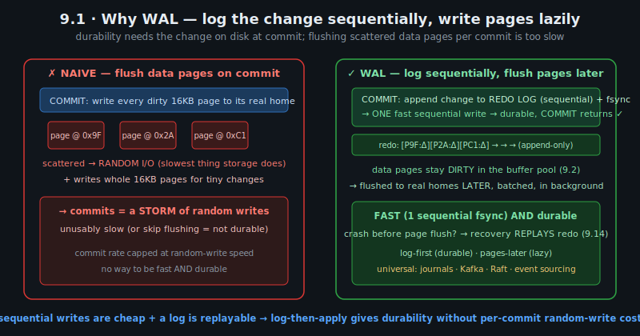
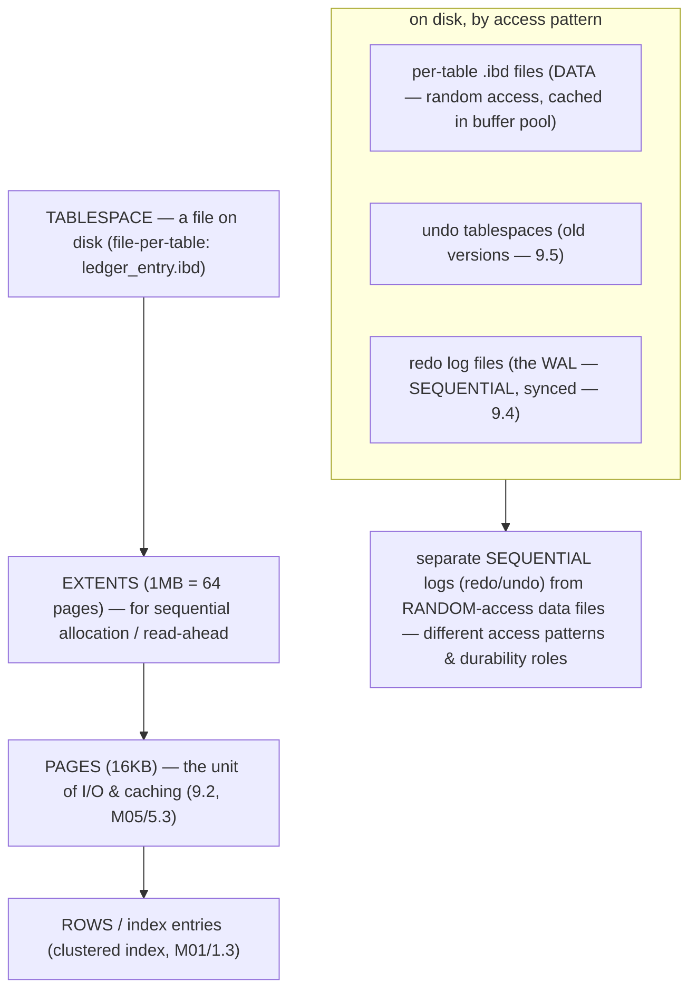
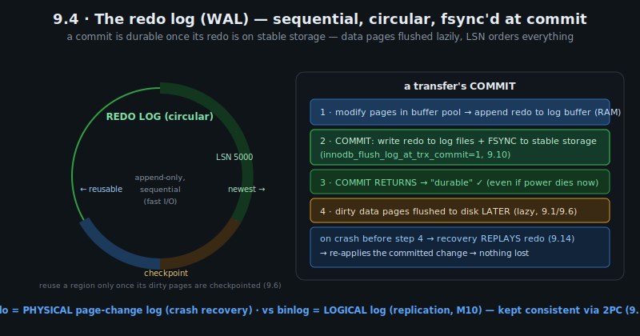
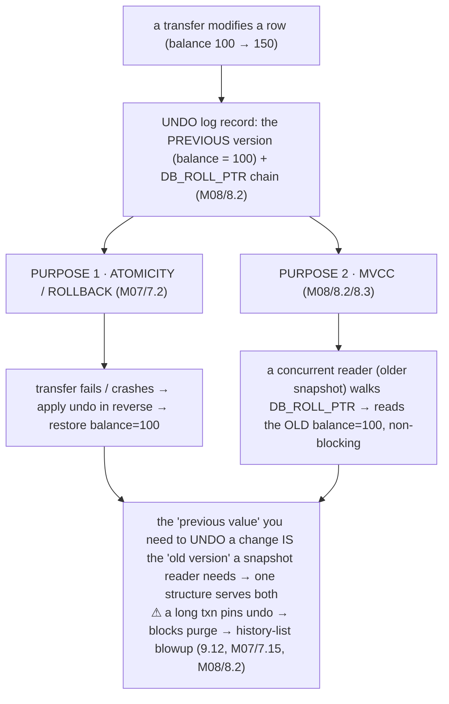
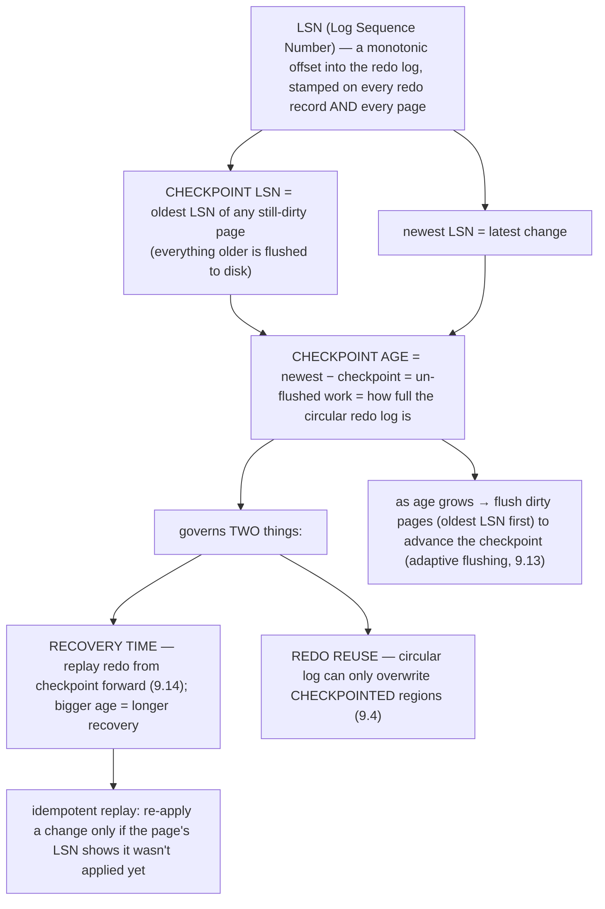

# M09 · Pass C — Diagrams & Worked Examples · Concepts 9.1–9.6

> **Pass C scope:** content-contract items **#12 Diagram(s)** and **#8 Worked example** (narrated, no code in prose). Pairs with `01-wal-foundation.md`. Concepts 9.1/9.2/9.4 use **★ bespoke custom SVGs** (in `assets/`, render-validated); 9.3/9.5/9.6 use Mermaid. Domain: payments/wallet, the ledger. The recurring question: *is this committed payment really durable?*

---

## 9.1 · The fast-and-durable problem (why WAL exists) ★

**★ Diagram (custom SVG):**

**Worked example — a commit durable in one sequential write instead of a write storm.**
A transfer dirties several pages: the two `account` balance rows, the new `ledger_entry` rows, secondary-index pages — scattered all over the disk. The **naive** approach (the SVG's left panel) makes COMMIT write *every* one of those dirty 16KB pages to its *real home* — and those homes are at random locations (the clustered index, secondary indexes, all over the tablespace), so it's a **storm of random writes** (the slowest thing storage does), and it writes whole 16KB pages even for tiny changes. At that rate, commits would be capped at random-write speed — unusably slow for a payments system. **WAL** (the right panel) inverts it: COMMIT appends a compact *description of the changes* to the **redo log** — a *sequential, append-only* file — and **fsyncs just that** (one fast sequential write); then COMMIT returns "durable." The actual data pages stay *dirty in the buffer pool* (9.2) and are flushed to their real homes *later*, batched, in the background (9.1/9.6). The transfer is durable the instant the redo is fsync'd — because if the server crashes before those dirty pages reach disk, **recovery replays the redo log** (9.14) to re-apply the change. So: **log-first (durable), pages-later (lazy)** — fast *and* crash-safe. The example shows *the* foundational trick of the whole module: sequential writes are cheap and a log is replayable, so logging the change and applying it lazily gives durability *without* paying random-write cost per commit. This is why InnoDB commits thousands of durable transfers per second — and it's the same pattern as filesystem journals, Kafka, Raft, and the append-only ledger itself (M01/1.17).

---

## 9.2 · The buffer pool: caching pages in RAM ★

**★ Diagram (custom SVG):**

**Worked example — the hot account stays in RAM; a scan doesn't pollute it.**
Two access patterns show the buffer pool's design at work. **(1) A hot account:** account 42 takes constant traffic, so its `account` page and the relevant `ledger_entry` and index pages are accessed repeatedly — they get promoted to the **young sublist** (the hot working set) and **stay resident in RAM**, so every balance read and statement query for account 42 runs at *memory speed* (no disk I/O). When a transfer updates account 42's balance, the change goes to the *buffer-pool copy* (marked **dirty**) and is flushed to disk lazily (9.1) — the update doesn't wait for disk. **(2) A nightly full-ledger reconciliation scan:** this reads *millions* of `ledger_entry` pages, but **each only once**. The crucial design feature — the **young/old LRU split** — protects the hot set here: newly-read scan pages enter the **old sublist** (not the front of young), and because they're not re-accessed (a one-time scan), they're **evicted from the old sublist without ever displacing the genuinely-hot young pages.** So the giant scan doesn't *pollute* the cache and evict account 42's hot pages (which would tank performance for everyone). This is **scan resistance** — the answer to the classic "a big scan blew out my cache" problem (which plain LRU suffers). The example illustrates *why* the buffer pool is the single most important performance structure: it serves most accesses from RAM (the **hit rate** — the #1 InnoDB health metric — *is* your performance), and its scan-resistant LRU keeps the working set hot under mixed traffic. It's also *why* compact rows/keys matter (M03/3.2): smaller data → more of the working set fits in the buffer pool → higher hit rate. (And note it caches *pages*, reused by many queries — not results; it's the cache the removed query cache never was, M04/4.14.)

---

## 9.3 · Pages, tablespaces & the on-disk layout

**Diagram — the physical layering:**

**Worked example — where `ledger_entry` physically lives.**
With `innodb_file_per_table` on (the modern default), the `ledger_entry` table lives in its own file, `ledger_entry.ibd` — a **tablespace** containing the table as a tree of **16KB pages** (the clustered index, M01/1.3/M05/5.4): a root page, internal pages, and leaf pages holding the actual rows, all organized into 1MB **extents** (for efficient sequential allocation and read-ahead — reading a whole extent at once). The **buffer pool** (9.2) caches the *hot* pages of this file in RAM; the rest sit on disk until read. Separately, the **undo tablespaces** hold the old row versions MVCC reads (9.5, M08/8.2), and the **redo log files** (a separate, fixed circular set — *not* a tablespace, 9.4) hold the WAL. The example grounds the whole module's physical picture: the buffer pool caches *these* `ledger_entry.ibd` pages, the redo log records changes *to these pages*, undo holds the *old versions of these rows*, and crash recovery re-applies redo *to these pages*. File-per-table also gives operational wins: drop `ledger_entry` → reclaim its file; back up or move just that table; per-table compression/encryption. The key design principle the diagram captures: **separate the sequential append-only logs (redo, undo) from the random-access data files** — they have different access patterns (sequential-synced vs random-cached) and different durability roles, which is exactly what WAL (9.1) requires. This layout is the ground truth under everything in the module.

---

## 9.4 · The redo log (WAL): how commits become durable ★

**★ Diagram (custom SVG):**

**Worked example — a committed transfer's change is in the redo log before COMMIT returns.**
Trace a transfer's durability (the SVG's right panel). **(1)** The transfer modifies pages in the buffer pool (9.2) and appends **redo records** ("page P, this byte range became this") to the in-memory log buffer. **(2)** At **COMMIT**, InnoDB writes those redo records to the **redo log files** and **fsyncs** them to stable storage (with `innodb_flush_log_at_trx_commit=1`, 9.10). **(3)** *Then* COMMIT returns — "durable" — and the application tells the user "sent." Critically, at this moment the transfer is durable **even though its dirty `account`/`ledger_entry` pages are still only in the buffer pool, not yet on disk.** **(4)** Those dirty pages are flushed to their real homes *later*, lazily (9.1/9.6). Now the payoff: if the server **crashes between steps 3 and 4** (power loss a microsecond after COMMIT returned), **recovery replays the redo log** (9.14) and re-applies the committed change — so the transfer **survives**. That's M07/7.5's "COMMIT means durable" *delivered by mechanism*. The SVG's left panel shows *why* this is fast: the redo log is **circular and sequential** (append-only, fast I/O), with each change stamped by an **LSN** (9.6), and a region is reused only once its dirty pages are checkpointed (9.6). The example crystallizes the redo log's role: it makes commits durable *cheaply* (one sequential fsync, not random page writes — 9.1) and *recoverable* (replay to reconstruct un-flushed committed changes). And it distinguishes the redo log (a *physical* page-change log, for crash recovery) from the *binlog* (a *logical* log, for replication, M10) — two different logs with different jobs, kept consistent via 2PC (9.11). For a payments system, keeping `flush_log_at_trx_commit=1` (durable) and sizing the redo log generously (no write stalls, 9.13) is the spine of the durability posture (9.16).

---

## 9.5 · The undo log: old versions for rollback & MVCC

**Diagram — one structure, two purposes:**

**Worked example — the same undo rolls back a failed transfer and feeds a concurrent reader.**
A transfer updates account 42's balance from 100 to 150. InnoDB writes the *old* version (100) to the **undo log**, and account 42's row points back to it via `DB_ROLL_PTR` (M08/8.2). Now watch that *single* undo record serve *both* of InnoDB's needs at once. **(1) Atomicity (rollback):** the transfer then hits a constraint violation on the *other* leg and must roll back — InnoDB applies the undo record in reverse, restoring account 42's balance to 100 (M07/7.2). The undo is "how to un-do the change." **(2) MVCC (isolation):** *simultaneously*, a concurrent reconciliation read whose snapshot predates the update walks account 42's `DB_ROLL_PTR` chain into the undo log and finds the *old* version (100) visible to its read view (M08/8.2/8.3) — so it sees the pre-transfer balance, *non-blocking*. The undo is "the old version a snapshot reader needs." The elegant unification the diagram captures: **the "previous value" you need to undo a change is *exactly* the "old version" a snapshot reader needs** — so one structure (the undo log) powers *two* ACID properties (Atomicity, and Isolation-via-MVCC). This is why InnoDB's rollback (M07) and MVCC (M08) share machinery, and why the *same* villain — a **long transaction** — harms both: it holds an old snapshot that **pins** undo versions, blocking the purge thread (9.12) from cleaning them up → the **history list blows up** (undo storage balloons, version chains lengthen, reads slow). That's the storage-level mechanism behind M07/7.15 ("keep transactions short") and M08/8.2 ("long txn pins versions"), and its management (purge) is concept 9.12. The deep principle: *keeping enough to undo a change also keeps enough to show the state before it* — reversibility and point-in-time reads are the same information.

---

## 9.6 · The LSN, checkpointing & flushing

**Diagram — LSN orders changes; checkpoint bounds recovery & redo reuse:**

**Worked example — why checkpoint age governs recovery time and write smoothness.**
Every change a transfer makes advances the **LSN**, and each page stores the LSN of its last change ("this page reflects changes up to here"). The **checkpoint LSN** marks "everything up to here is safely flushed to data files"; the gap between the newest LSN and the checkpoint — the **checkpoint age** — is *how much un-flushed work exists* (and how full the circular redo log is, 9.4). This one number governs two critical things. **(1) Recovery time:** on a crash, recovery replays redo *from the checkpoint LSN forward* (9.14) — so a *large* checkpoint age (lots of un-flushed redo) means *longer* recovery (more to replay); a small one recovers fast. **(2) Redo reuse:** the circular redo log can only overwrite regions whose changes are *checkpointed* (flushed) — so if dirty pages aren't flushed, the redo log can't be reused and *fills up*. InnoDB watches the checkpoint age: as it grows (a burst of transfers generating redo faster than pages flush), InnoDB **flushes the oldest-modified dirty pages first** to advance the checkpoint and free redo space (adaptive flushing, 9.13) — and if the age approaches the redo log's capacity, it must flush hard and *throttle writes* (a checkpoint-age stall, 9.13). The replay is **idempotent** via the LSN: recovery re-applies a redo record to a page only if the page's LSN shows it wasn't applied yet (a page already flushed past that change is skipped) — so replay is safe even if some pages reached disk and others didn't. The example shows LSN + checkpointing as the *connective tissue* between the redo log (9.4), flushing (9.13), and crash recovery (9.14): the LSN orders and makes replay idempotent; the checkpoint bounds recovery and enables the circular log; the checkpoint age is the control variable for the write path. The universal pattern: *a monotonic sequence + a checkpoint position makes a log replayable, bounded, and idempotent* — the foundation of crash recovery and log-based replication (M10) alike. For our domain, sizing the redo log for the transfer write rate (so bursts don't cause checkpoint-age stalls) is core tuning (9.15).

---

*Diagrams + worked examples for 9.1–9.6 complete (3 ★ custom SVGs + 3 Mermaid). Next Pass C file: 9.7–9.10 (★ durability chain, ★ torn-page/doublewrite, ★ durability matrix + Mermaid for fsync/fdatasync/O_DIRECT).*
