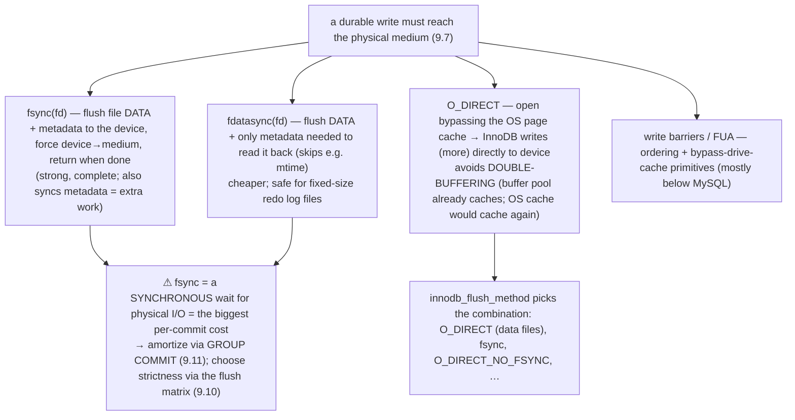

# M09 · Pass C — Diagrams & Worked Examples · Concepts 9.7–9.10

> Pass C scope: **#12 Diagram(s)** + **#8 Worked example** (narrated). Pairs with `02-disk-sync-deep-dive.md`. **This is the heart of the module** — the disk-sync / data-loss material. Concepts 9.7/9.9/9.10 use **★ bespoke custom SVGs**; 9.8 uses Mermaid. Domain: payments/wallet. The catastrophic *failures* of these mechanisms are M15.

---

## 9.7 · The durability chain (disk sync, in depth) ★

**★ Diagram (custom SVG):**

**Worked example — tracing a write down the chain, and where a "durable" write is lost.**
A transfer commits, and we want to know: is that payment *really* on disk? Trace the redo write down the chain (the SVG). **(1) App (InnoDB log buffer, RAM):** the redo records start in InnoDB's in-process log buffer — purely volatile; a crash here loses them. **(2) `write()` → OS page cache (kernel RAM):** writing the log buffer to the file copies it into the **kernel page cache** — *still RAM, still volatile.* `write()` returning means "the kernel has it," **not** "it's on disk"; a power loss here loses the data. **(3) `fsync()` → drive cache:** fsync tells the kernel "flush this to the device" — pushing data to the **disk controller / drive**. But the drive may have its *own* volatile **write cache** (DRAM on the SSD). **(4) → platter/NAND:** an *honest* drive, on fsync's flush command, writes *through* its cache to the **physical medium** (the only non-volatile layer) and *then* acks. **A *lying* drive acks fsync while the data is still in its volatile cache** — to look faster. And here's the catastrophe: with a lying drive, the transfer's COMMIT returned "durable" (fsync came back), the user was told "sent" — but the data was still in volatile drive cache, so a **power loss a moment later loses the confirmed payment.** The example demolishes the dangerous assumption "*I called fsync, it returned, therefore it's durable*" — that's true *only if every layer in the chain honored the sync.* Durability is a chain, and an acknowledgment is **only as trustworthy as the weakest, most-volatile layer that lied.** For true durability you need: a drive whose write cache is disabled or *non-volatile* (battery/capacitor-backed), honest fsync semantics, and — on cloud/network storage (EBS and friends, which add *more* layers and their own fsync semantics — "fast" ≠ durable) — *verified* durability guarantees. This is *the* disk-sync reality, the foundation for the flush matrix (9.10), and exactly *how* a "confirmed" payment is silently lost on power loss — the money-never-lies catastrophe that M15 explores in depth. The universal lesson: *trace the full path from your write to non-volatile storage, and trust durability only as far as the last layer that honestly confirmed persistence* — OS caches, drive caches, RAID caches, network-storage caches, and replication acks all sit between "I wrote it" and "it survives power loss."

---

## 9.8 · fsync, fdatasync, O_DIRECT & write barriers

**Diagram — the primitives: what each forces or bypasses:**

**Worked example — why fsync is the biggest per-commit cost, and what O_DIRECT saves.**
These are the actual tools InnoDB uses to make "durable" real (9.7). The dominant fact: **every fsync is a synchronous wait for physical I/O** — the thread *blocks* until the data is forced to the device (and, on honest hardware, the medium). That's milliseconds on spinning disk, sub-millisecond on good SSD, but *always* vastly slower than a memory write — so **the fsync is the single biggest per-commit cost**, and it's *why* durability has a throughput cost (and why the flush matrix, 9.10, and group commit, 9.11, exist). The variants tune the cost: **`fdatasync`** is cheaper than `fsync` (skips non-essential metadata like mtime) and is safe for InnoDB's *fixed-size* redo log files (the size never changes, so metadata sync is unnecessary). **`O_DIRECT`** solves a different waste — **double-buffering**: InnoDB already caches pages in its buffer pool (9.2); without `O_DIRECT`, the OS *also* caches them in the page cache (a second copy, wasting RAM and adding a memory copy). `innodb_flush_method=O_DIRECT` opens the *data files* bypassing the OS cache, so InnoDB's writes go more directly to the device (saving RAM and a copy) — a common production setting. The example shows the durability stack's bottom layer: these syscalls are how software *requests* durability from the OS and hardware, their *cost* (synchronous physical I/O) explains the whole durability/throughput tradeoff (9.10), and the optimizations around them (group commit batching fsyncs, 9.11; O_DIRECT avoiding double-buffering) are how InnoDB keeps throughput high *despite* the fsync cost. The universal truth: *durability bottoms out in a slow synchronous physical-write primitive — so batch it, don't double-buffer, and recognize that durability latency is fundamental, not a bug to optimize away.* For a payments workload: `innodb_flush_method=O_DIRECT` (no double-buffering the large data files) + `flush_log_at_trx_commit=1` (fsync the redo every commit) + group commit (9.11) + fast honest SSD = durable *and* high-throughput.

---

## 9.9 · Torn / partial page writes & the doublewrite buffer ★

**★ Diagram (custom SVG):**

**Worked example — a crash during a page flush, recovered from the doublewrite buffer.**
InnoDB flushes a dirty `ledger_entry` page (9.1/9.6) to its location on disk. But a 16KB page write is **not atomic at the hardware level** — the device writes it as several smaller sector writes (512B or 4KB). Now the crash: the server loses power **after some sectors are written but not others.** The on-disk page is now **torn** — half the new version, half the old, internally inconsistent (a broken checksum). And critically (the SVG's left panel), **the redo log can't fix this:** redo records say "apply change Δ to page P," but page P is now *garbage*, not the valid pre-change page the redo expects — so replay would corrupt further. A torn page is **silent corruption**, which is *worse* than data *loss* (it can go undetected, spreading bad data). The **doublewrite buffer** (right panel) prevents it: *before* writing the page to its real (scattered) home, InnoDB **first writes it (batched, sequentially) to a dedicated doublewrite area and fsyncs that**, *then* writes it to its real location. So an *intact* copy always exists somewhere. On **recovery**, InnoDB checks each page's **checksum**; finding the torn `ledger_entry` page (bad checksum), it **reads the good copy from the doublewrite buffer and rewrites it** — repairing the corruption. So a crash during a page flush *cannot* corrupt the ledger. The example teaches the crucial distinction the module hammers: **durability (replay a log) and torn-write protection (write twice) are *different* guarantees needing *different* mechanisms.** WAL gives durability but *assumes atomic page writes* — it has no way to reconstruct a half-written page. The doublewrite buffer fills exactly that gap. Many people conflate "I have a WAL" with "I'm safe from all crash corruption" — the doublewrite buffer is the reminder that torn pages are a *distinct* hazard. The cost is modest (data pages written twice, but the doublewrite area is *sequential* — cheap), so keep `innodb_doublewrite=ON` (the safe default); disable it *only* with verified atomic-write storage (some NVMe/ZFS guarantee 16KB atomic writes — then it's redundant). For money, the modest write-I/O cost is cheap insurance against ledger corruption — it's part of the durability posture (9.16), and the answer to "what about a crash *during* a page write?" that redo logging alone doesn't address. The universal pattern: *a log re-applies changes but can't fix a half-written block; protecting against torn writes needs a separate "intact copy exists" mechanism* (the same as filesystem data journaling, copy-on-write).

---

## 9.10 · The durability tradeoff matrix (flush_log_at_trx_commit × sync_binlog) ★

**★ Diagram (custom SVG):**

**Worked example — for each setting, exactly what a crash loses.**
Durability is a *tunable dial*, and the matrix (the SVG) makes each setting's **loss window** precise — so you choose *knowingly*, not by hoping. Walk **`innodb_flush_log_at_trx_commit`** (the redo log, 9.4): at **`=1`** (default, durable), every commit **writes + fsyncs** the redo before returning — a crash, *even power loss*, loses **nothing committed** (cost: one fsync per commit, amortized by group commit, 9.11). At **`=2`**, commit **writes to the OS cache** and returns (no per-commit fsync; fsync ~once/sec) — a *mysqld process crash* loses nothing (the OS still has it), but a ***power loss / OS crash* loses ~1 second of committed transactions** (what was in the volatile OS cache, un-fsync'd). At **`=0`**, fsync happens ~once/sec, not at commit — so *any* crash (even just mysqld) loses ~1 second. And **`sync_binlog`** (the binlog, M10): at **`=1`** the binlog is fsync'd every commit (replicas/PITR never miss a committed transaction); at **`=0`/N** the binlog syncs rarely (faster, but a crash can lose recent binlog → replicas or point-in-time backups could *miss* transactions the primary committed — a divergence). The **matrix** combines them: **(1, 1)** = fully durable (redo + binlog both fsync'd per commit) → nothing lost, consistent replicas; relaxing either opens a specific, known loss window. The example shows the discipline: **the loss window is *precisely defined* for each cell — you're not gambling, you're choosing a known tradeoff** matched to your data's value. For **money**, the answer is unambiguous: **(1, 1) is mandatory** — a committed payment cannot be lost on a crash, and replicas/backups must stay consistent. The fsync cost is affordable because **group commit** (9.11) lets many concurrent commits share one fsync (so strict durability doesn't cap throughput at scale). Relax to (2, 0) *only* for loss-tolerant, reconstructible data (analytics ingest, caches) where ~1s of loss on a rare crash is acceptable. The crucial caveat: **(1,1) only delivers durability if the disk chain is *honest*** (9.7) — a lying disk undermines it. The universal lesson: *durability is not binary; it's a dial with a known loss window at each setting, and you set it by asking "what can I afford to lose on a crash?"* — pay the fsync for money, relax for reconstructible data. This (1,1) durable posture is the spine of the capstone (9.16) and the line between a money-safe config and an M15 data-loss waiting to happen.

---

*Diagrams + worked examples for 9.7–9.10 complete (3 ★ custom SVGs + 1 Mermaid). Next Pass C file: 9.11–9.16 (group commit/2PC, purge/history-list, adaptive flushing, ★ crash recovery, tuning knobs, durability-posture capstone).*
