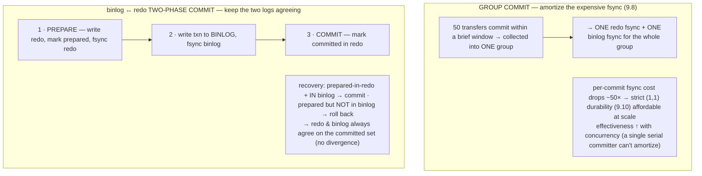
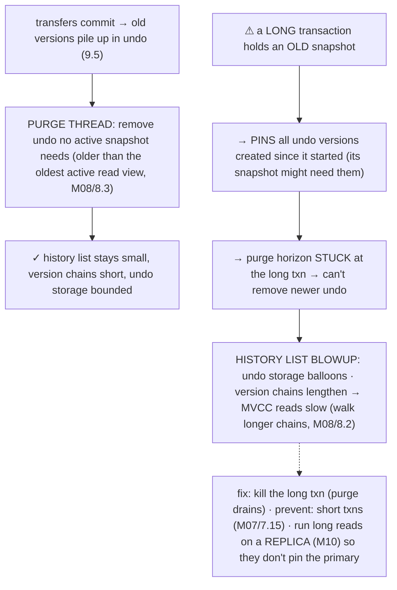
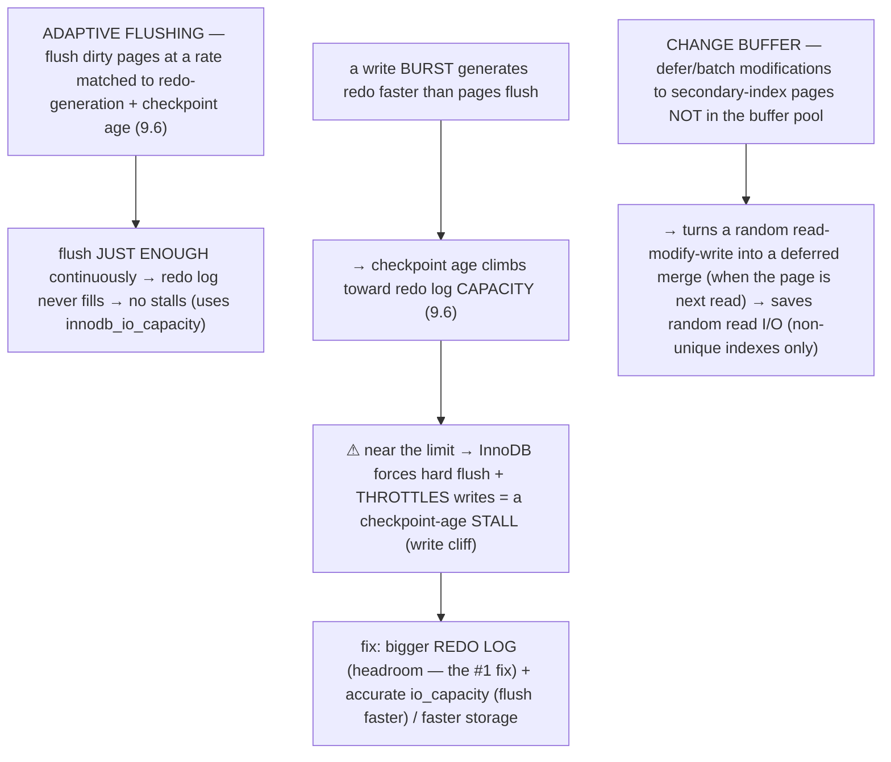
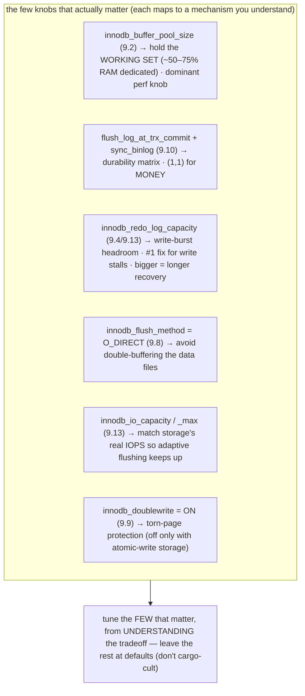
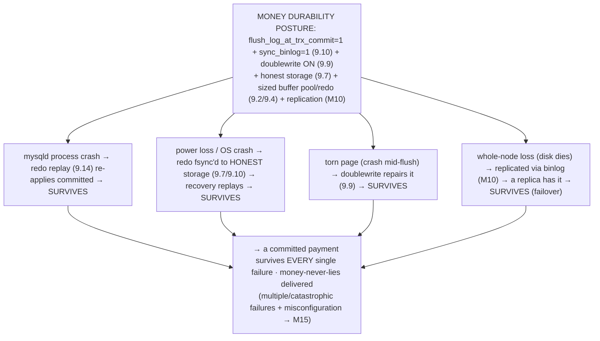

# M09 · Pass C — Diagrams & Worked Examples · Concepts 9.11–9.16

> Pass C scope: **#12 Diagram(s)** + **#8 Worked example** (narrated). Pairs with `03-writepath-recovery-capstone.md`. Concept 9.14 uses a **★ bespoke custom SVG** (crash recovery); the rest use Mermaid (the durability-posture capstone reuses the matrix SVG from 9.10). Domain: payments/wallet. These close out M09 Pass C and Track C.

---

## 9.11 · Group commit & the binlog↔redo two-phase commit

**Diagram — batch the fsync; keep two logs consistent:**

**Worked example — group commit makes strict durability affordable; 2PC keeps the logs agreeing.**
Two write-path mechanisms solving two problems. **Group commit:** under a burst of, say, 50 concurrent transfers all committing within a brief window, InnoDB doesn't make each do its *own* fsync (9.8 — the biggest per-commit cost) — it **collects them into one group and does a single redo fsync + single binlog fsync for all 50.** So the per-transfer fsync cost drops ~50×. This is *why* the strict durable setting (1,1) (9.10) is affordable at scale: without group commit, fsync-per-commit would cap commit throughput at "1 / fsync-latency"; with it, high concurrency means big groups means heavy amortization. (The catch: it can't help a *single serial* committer — one transfer at a time pays a full fsync each; group commit's win *grows with concurrency*.) **The binlog↔redo 2PC:** InnoDB has *two* durable logs that must agree — the **redo log** (crash recovery) and the **binlog** (replication/PITR, M10). A crash must never leave a transfer in one but not the other. So InnoDB uses a two-phase commit across them: **prepare** (write redo, mark prepared, fsync) → **write the binlog** (fsync) → **commit** (mark committed in redo). On recovery (9.14), it reconciles: a transfer *prepared in redo and present in the binlog* is committed (rolled forward); *prepared but absent from the binlog* is rolled back — so the two logs **always end up reflecting the same committed set.** The example shows why both matter for a payments platform: group commit lets it sustain thousands of *durable* transfers/sec (strict (1,1) without a throughput ceiling), and the 2PC guarantees that after a crash, *every transfer durable in the redo is also in the binlog* — so replicas (M10) and PITR backups (M13) have **exactly** the committed transfers, never a divergence where a transfer was applied locally but never replicated (or vice versa — a money-never-lies catastrophe). The universal patterns: *batch an expensive synchronous operation across concurrent requests* (group commit) and *coordinate two durable resources with prepare-then-commit so a crash leaves them consistent* (2PC — the same idea as distributed transactions, M12, applied to two local logs).

---

## 9.12 · The purge thread & history-list blowup

**Diagram — purge cleans old versions; a long txn blocks it:**

**Worked example — a forgotten long transaction blows up the history list.**
This is the storage-level mechanism behind M07/7.15 ("keep transactions short") and M08/8.2 ("a long transaction pins old versions") — finally explained. Normally, the **purge thread** continuously cleans up old undo versions (9.5) once *no active snapshot could need them* — keeping the history list small, version chains short, and undo storage bounded. But now a **forgotten long reconciliation transaction** (or an idle-in-transaction connection from a pool leak, M04/4.2) stays open for an hour, holding an **old snapshot**. Because MVCC might need any version that existed since that snapshot (M08/8.3), purge **can't advance past it** — every old version created by the thousands of transfers committing in that hour is **pinned** (un-purgeable). So as transfers keep creating new balance versions, the **history list blows up**: undo tablespace storage balloons (disk fills), and the version chains for hot accounts grow *long* (a hot account updated thousands of times now has a thousand-link chain). The consequence: **MVCC reads of those hot accounts get progressively slower** — each read must walk further back down the chain to find its visible version (M08/8.2) — and the whole database degrades. One forgotten transaction tanks performance *globally*. The example reveals *why* long transactions are so harmful beyond lock-holding (M08/8.10): a long transaction *also blocks purge*, bloating undo for the *entire database*. The fix: **kill the long transaction** (purge immediately drains, the history list shrinks); the *prevention*: keep transactions short (M07/7.15) and **run long reconciliation reads on a replica** (M10) so they don't pin the *primary's* purge horizon. This is the universal **MVCC garbage-collection / oldest-reader-pins-the-horizon** problem (Postgres has the *identical* issue with VACUUM and long transactions) — *the oldest active reader determines how much history you must keep, and a single long-lived reader bloats retention for everyone.* Monitoring **history list length** (`SHOW ENGINE INNODB STATUS`) is a core fintech-database health practice (M13) — a growing value is the early warning of a long transaction blocking purge.

---

## 9.13 · Adaptive flushing, checkpoint-age stalls & the change buffer

**Diagram — smooth the write path, avoid the cliff:**

**Worked example — a write burst fills the redo log; a stall, and how to prevent it.**
The write-heavy ledger generates a lot of redo (every transfer) and lots of dirty pages. Normally **adaptive flushing** keeps up: InnoDB estimates how fast it *needs* to flush dirty pages to keep the **checkpoint age** (9.6, the un-flushed redo) in a safe band, and flushes *just enough* continuously (at the configured `innodb_io_capacity` ceiling) — so the redo log never fills and writes stay *smooth*. But now a **burst** of transfers (a flash sale, a settlement run) generates redo *faster than pages can flush* — perhaps because the redo log is **undersized** (too little headroom) or IO capacity is set too low. The checkpoint age climbs toward the redo log's capacity, and as it nears the limit, InnoDB has no choice: it **forces hard flushing and *throttles incoming writes*** (commits slow or stall) to keep the redo log from overflowing — a sharp, visible **checkpoint-age stall** (a "write cliff"). The ledger's write throughput suddenly tanks under the very burst it most needs to handle. The fix the diagram shows: a **generously-sized redo log** (`innodb_redo_log_capacity` — *the #1 fix for write-stall complaints*, giving more headroom to absorb bursts) plus accurate **IO capacity** (so adaptive flushing flushes at the rate the storage can sustain) and fast storage. Separately, the **change buffer** helps the write path: a modification to a *secondary-index* page *not currently in the buffer pool* is **deferred and batched** in the change buffer (instead of reading that page from disk *just* to modify it — a random read), then merged when the page is later read for another reason — saving random read I/O on secondary-index maintenance (a big win for write-heavy + indexed tables, M05/5.15; non-unique indexes only, since uniqueness must be checked immediately). The example teaches the universal write-path patterns: **pace continuous work to avoid cliffs** (adaptive flushing), **apply backpressure before a buffer overflows** (the checkpoint-age throttle), and **defer/batch expensive random I/O** (the change buffer) — the same patterns as OS writeback, network flow control, and LSM-tree memtables. For our ledger, an under-sized redo log is the classic cause of mysterious write stalls under transfer bursts (9.15).

---

## 9.14 · Crash recovery: redo apply → undo rollback → binlog reconcile ★

**★ Diagram (custom SVG):**

**Worked example — the server crashed mid-transfer; exactly what's recovered and rolled back.**
The payoff of the entire module: the server **crashes (power loss) mid-transfer** and restarts. InnoDB recovers automatically in a defined sequence (the SVG). **(0) Doublewrite check (9.9):** scan for torn pages (bad checksums) and restore intact copies from the doublewrite area — so recovery operates on *valid* pages (a torn `ledger_entry` page from a crash mid-flush is repaired here). **(1) Redo apply / roll forward (9.4):** read the checkpoint LSN (9.6), replay the redo log forward, re-applying each committed change *if the page's LSN shows it wasn't applied yet* (idempotent, 9.6) — so **every committed transfer that was durable in the redo log but hadn't been flushed to its data pages is re-applied** → *nothing committed is lost* (M07/7.5 delivered). **(2) Undo rollback / roll back (9.5):** for transactions that were *in-flight* (uncommitted) at the crash — like the transfer that was *halfway through* when power died — apply their undo to reverse their partial changes (atomicity, M07/7.2) → *the half-done transfer is fully undone, no half-applied money.* **(3) Binlog reconcile (9.11):** for transactions *prepared* in redo but uncertain, consult the binlog (the 2PC arbiter) — in the binlog → commit (roll forward); not in binlog → roll back → *the redo log and binlog end up agreeing on the same committed set* → replicas/PITR consistent (M10). **The result:** the database opens **consistent and durable** — containing *exactly* the committed transfers and *none* of the in-flight ones. "The server died mid-transfer, and on restart it's all correct" — the confirmed payments are there, the half-done one is cleanly gone, the replicas agree. The example is the culmination of every mechanism: buffer pool (held dirty pages, now recovered from redo), redo log (the roll-forward source), undo (the roll-back source), doublewrite (torn-page repair), LSN/checkpoint (bounds + idempotency), 2PC (binlog consistency). This *is* the **ARIES algorithm** (the classic database-recovery algorithm: redo-then-undo with LSNs) — and the universal **log-based recovery** principle: *the durable log is the source of truth, and recovery replays it to reconstruct state, using sequence numbers for idempotency and undo for atomicity* (the same shape as replicated state machines, M10, and event-sourcing replays, M01/1.17). Recovery *time* scales with redo to replay (checkpoint age, 9.6 — why redo size trades durability-smoothness against recovery time). When recovery *can't* recover — corruption the doublewrite missed, a lying disk that lost committed redo, `innodb_force_recovery` for damaged data — that's the *catastrophic* case, the subject of **M15** (here, recovery just *works*). This delivered guarantee — *the server crashed, and the committed money survived* — is the storage-layer foundation of the entire fintech system.

---

## 9.15 · Tuning the internals (the key knobs that matter)

**Diagram — the key-knobs cheat-sheet:**

**Worked example — sizing the internals for a payments workload.**
Of InnoDB's hundreds of settings, a *handful* dominate — and because you now understand the mechanisms (9.1–9.14), you can tune them by *reasoning about the tradeoff*, not copying values. For a payments platform: **buffer pool** — size it to hold the hot accounts + recent-ledger working set (the dominant perf knob, 9.2; often 50–75% of RAM on a dedicated DB server) so balance reads and statement queries run at memory speed (high hit rate). **Durability matrix** — `flush_log_at_trx_commit=1` + `sync_binlog=1` (9.10): the single most important *correctness* setting — a committed transfer is durable and replicas/backups stay consistent (non-negotiable for money). **Redo log** — size it *generously* (`innodb_redo_log_capacity`, 9.4/9.13) for the transfer write rate, so bursts don't cause checkpoint-age stalls (the #1 fix for write stalls) — accepting that a bigger redo log means longer crash recovery (9.6/9.14). **Flush method** — `O_DIRECT` (9.8) to avoid double-buffering the large data files. **IO capacity** — set to the (fast, honest) SSD's real sustained/burst IOPS (9.13) so adaptive flushing flushes at the right rate. **Doublewrite** — ON (9.9) for torn-page protection. The example shows the *meta-skill*: each knob maps to a mechanism and a tradeoff you understand, so you configure deliberately for *your* workload (write rate → redo size; working set → buffer pool; loss tolerance → flush settings) rather than cargo-culting. The danger is *wrong* tuning — relaxed flush on money (data loss, M15), an undersized redo log on a write-heavy ledger (stalls, 9.13), a buffer pool so big it starves the OS (swapping). The universal discipline: *know which few parameters dominate, understand what each trades, tune those from first principles, leave the rest at sensible defaults* — the same as profiling-before-optimizing (M06/6.1). This config is the operational expression of the durability posture (9.16).

---

## 9.16 · Fintech capstone — the durability posture of a money system ★

**★ Diagram:** *reuses the durability matrix SVG from 9.10* — `assets/9.10-durability-matrix.svg` (the (1,1) corner is the money posture) — plus the per-failure-mode survival summary below.

**Worked example — a transfer's journey to durable storage, and what survives each failure.**
The capstone assembles the whole module into the complete durability posture — and answers, failure mode by failure mode, *is this committed payment really durable?* **The journey:** the transfer modifies pages in the buffer pool (9.2); at COMMIT, its redo records are written + **fsync'd** to the redo log (9.4/9.10) and (via 2PC, 9.11) recorded + fsync'd in the binlog — *then* COMMIT returns "durable"; the dirty `account`/`ledger_entry` pages are flushed lazily (9.1), protected by the doublewrite buffer (9.9). Now, with the money posture (`flush_log_at_trx_commit=1` + `sync_binlog=1` + doublewrite ON + honest storage + replication), what survives each failure? **Process crash** (mysqld dies): restart → redo replay (9.14) re-applies the committed transfer → **survives**; in-flight transfers rolled back. **Power loss / OS crash:** the redo was fsync'd to *stable, honest storage* (9.7), so recovery replays it → **survives** (this is *why* `=1` + honest storage matters — `=2`/`=0` or a lying disk would lose it, an M15 case). **Torn page** (crash mid-flush): recovery repairs it from the doublewrite buffer (9.9) → no corruption → **survives**. **Whole-node loss** (disk dies): local durability is gone, but the transfer was replicated (binlog → replica, M10) → a replica has it → **survives** (failover, M16). So under the right posture, **a committed payment survives every *single* failure.** The example proves the module's thesis: **durability isn't a single setting — it's a *posture*** that closes each failure mode with a specific mechanism (strict flush for power loss, doublewrite for torn writes, honest storage for lying disks, replication for node loss). It's money-never-lies realized at the storage layer, and the synthesis of M07 (the durability *contract*), M08 (MVCC from undo), and M09 (the *mechanism*). It sets up M15 by making explicit *what the posture protects against* — so M15 can explore what happens when a protection is *missing or fails* (a relaxed flush setting losing committed payments, a lying disk, corruption recovery couldn't fix). The universal instinct for *any* system that must not lose acknowledged data: **enumerate the failure modes, close each with the appropriate mechanism, and be able to state exactly what survives each** — durability you can't articulate failure-mode-by-failure-mode is durability you don't actually have. This posture is what **M16** assumes for the platform, **M13** backs up (PITR from the binlog), and **M15** examines the failure of — and the guarantee that a confirmed payment is never lost is the storage-layer foundation of the entire fintech system.

---

*Diagrams + worked examples for 9.11–9.16 complete (1 ★ custom SVG + 4 Mermaid; 9.16 reuses the 9.10 matrix SVG). **M09 Pass C is fully drafted (all 16 concepts: 7 ★ custom SVGs + 9 Mermaid).** Remaining for M09: Pass D — code-specifics boxes, failure modes & gotchas, fintech lens, interview/SD angle, and self-check questions. **This completes Track C through Pass C.***
