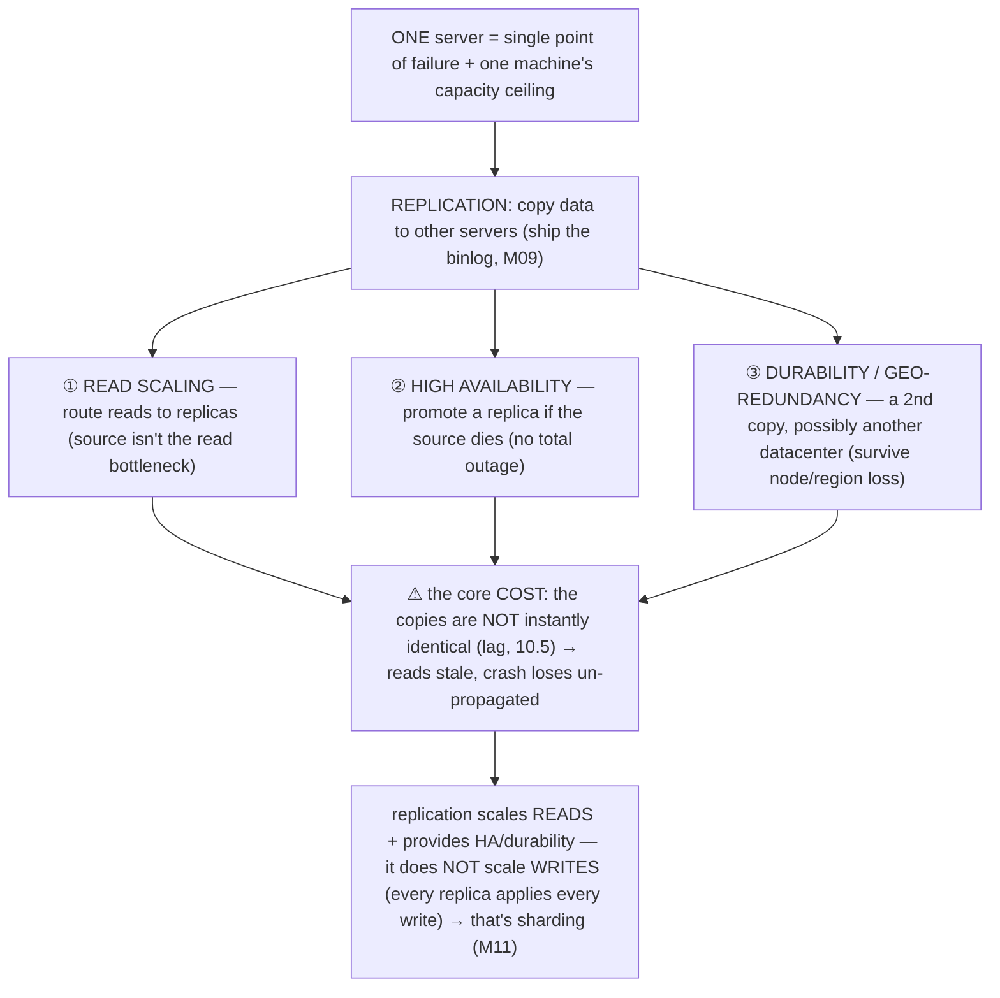
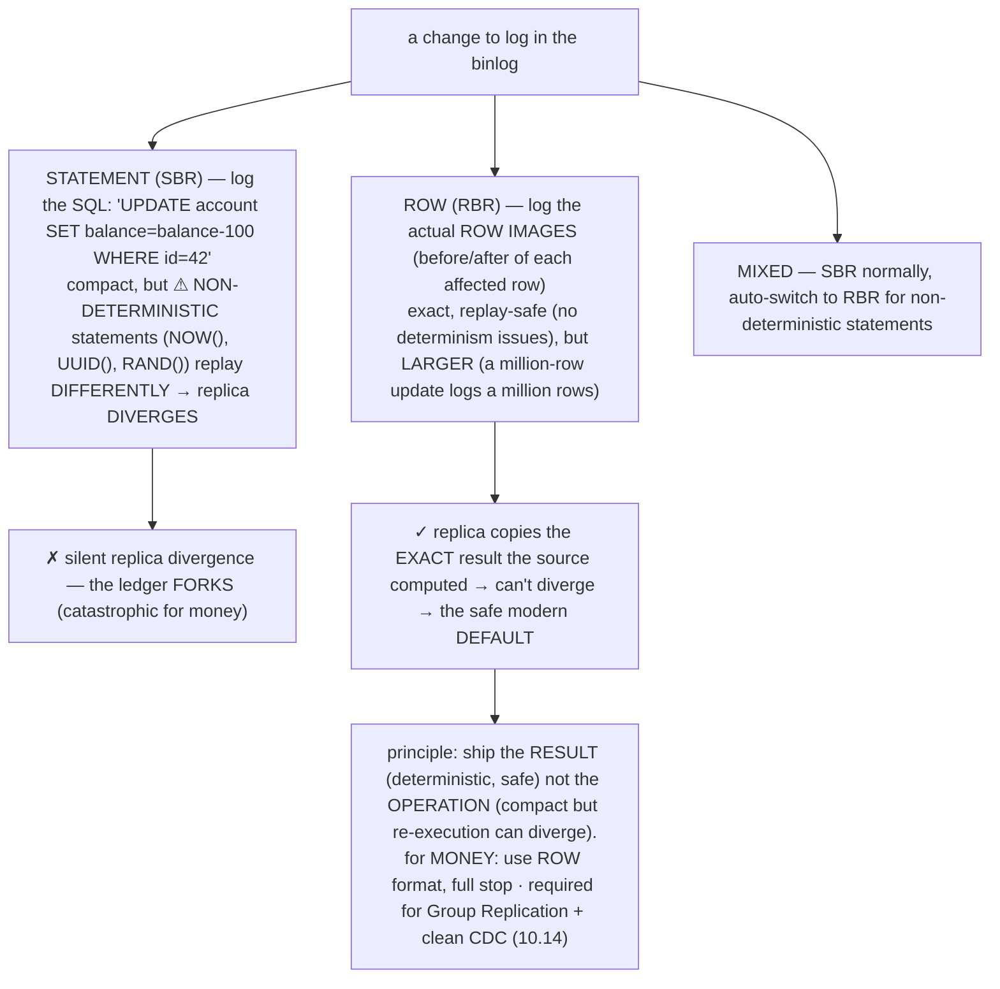

# M10 · Pass C — Diagrams & Worked Examples · Concepts 10.1–10.4

> **Pass C scope:** content-contract items **#12 Diagram(s)** and **#8 Worked example** (narrated, no code in prose). Pairs with `01-foundations-mechanism-sync.md`. Concepts 10.2/10.4 use **★ bespoke custom SVGs** (in `assets/`, render-validated); 10.1/10.3 use Mermaid. Domain: payments/wallet, the ledger. The recurring question: *did money survive node loss / get read stale?*

---

## 10.1 · Why replicate? read scaling, HA, durability ★

**Diagram — the three reasons + the core cost:**

**Worked example — why a payments system needs replicas.**
A single payments server has three problems, and replication solves each. **(1) Read capacity:** heavy reporting and **reconciliation** (M02/2.17 — summing the ledger, checking balance=Σentries) would overload the transactional primary if run on it — so you offload them to **read replicas** (the primary handles transfers; replicas handle the read fan-out). **(2) Availability:** a single server is a single point of failure — if it dies, payments stop entirely. With a **standby replica** ready to be promoted (HA/failover, 10.10), a node death is a brief blip, not a total outage. **(3) Durability/locality:** a single machine in one datacenter means a confirmed payment is only as safe as that one node (and one region) — a **cross-region replica** provides a second copy that survives total loss of the primary's node or region. So replication buys read scaling + HA + geo-redundancy. The unavoidable cost (the diagram's core point): **the copies aren't instantly identical** — replicas lag (10.5), so reads can be stale (10.6) and a crash can lose what hadn't propagated (10.10). And the crucial limit: replication scales *reads* and provides *HA/durability*, but it does **not** scale *writes* (every replica still applies *every* write — they're copies, not partitions) — scaling writes is **sharding** (M11), and real systems *combine* them. The example frames the whole module: replication is the first step from "one box" to "a distributed system," with all the consistency subtlety that implies — and for money, getting that subtlety right (no lost/stale/forked money) is what the rest of the module is about.

---

## 10.2 · The mechanism: binlog → relay log → apply ★

**★ Diagram (custom SVG):**

**Worked example — tracing a committed transfer from source to replica.**
Follow a transfer through the replication pipeline (the SVG). **On the source:** the transfer commits (durable locally via the redo log, M09) and is recorded in the **binary log** (M09 — the authoritative, ordered stream of all committed changes). **Step ① (replica IO thread):** the replica's IO/receiver thread is continuously connected to the source, **streaming the binlog** as it's written — it pulls the transfer's binlog event and writes it to a local **relay log** (just network transfer + local logging — fast; this is how far the replica has *received*). **Step ② (relay log):** the relay log is the replica's local copy of the received binlog stream — it **decouples receiving from applying** (the replica can receive ahead of applying, buffering in the relay log). **Step ③ (replica SQL/applier thread):** the applier reads the relay log and **executes** the transfer's changes against the replica's data — now the replica's ledger reflects the transfer too (this is how far the replica has *applied*). The key insight the SVG highlights: a replica has **two positions** — how much it has *received* (relay log written) and how much it has *applied* (executed) — and the gap between the source's latest and the replica's *applied* position is **replication lag** (10.5). The example makes the universal pattern concrete: this is **state-machine replication via log shipping** — replay an ordered, durable log and you reconstruct identical state on any node (the *same* idea as crash recovery replaying the redo log to reconstruct state, M09/9.14, and event sourcing replaying events to rebuild state, M01/1.17 — "the log is primary, state derives"). Every later concept operates on *this* pipeline: its format (10.3), its sync point (10.4 — semi-sync waits for the replica's *receipt* at step ①/②), its lag (10.5), its failover (10.10), its silent failures (10.12). For our domain, this is how a transfer reaches the reporting replicas (after lag), the standby (for failover), and the DR replica (for region survival).

---

## 10.3 · Binary log formats: statement, row, mixed

**Diagram — statement vs row vs mixed:**

**Worked example — why a non-deterministic statement breaks SBR, and why ROW is the safe default.**
Consider logging `INSERT INTO transaction_ (idempotency_key, created_at) VALUES (UUID(), NOW())`. Under **statement-based replication (SBR)**, the binlog stores that literal SQL, and the replica **re-executes** it — but `UUID()` generates a *different* UUID on the replica, and `NOW()` could differ — so the replica's row has *different values* than the source's: **the data has diverged.** For a ledger, this is catastrophic — the source and replica now disagree about what's recorded (a forked ledger). Other SBR hazards: `UPDATE … LIMIT 10` without `ORDER BY` (may affect *different* rows on the replica), `RAND()`, auto-inc with interleaved mode (M08/8.9). Under **row-based replication (RBR)** — the safe default — the binlog instead stores the **actual resulting row images** (the exact UUID and timestamp the source generated, the precise balance values) — and the replica just **copies those exact values** (no re-execution, no recomputation). So the replica is *guaranteed identical* to the source — it **can't diverge** from non-determinism, because the source already computed the result and the replica just applies it. The principle the diagram captures: **ship the *result* (deterministic, safe) rather than the *operation* (compact but re-execution can diverge)** — the same issue in any state-machine replication (Raft/Paxos *require* deterministic state machines precisely because command-replay must converge), in event sourcing (record *what happened*, not *what to do*, to avoid replay divergence, M01/1.17). For our domain, the ledger and accounts replicate with **ROW format** — so a transfer's *exact* row changes (precise balances, exact entry rows, the actual idempotency key) are copied to every replica *identically*, with *zero* chance of non-deterministic divergence. RBR's correctness guarantee (replicas can't drift from the source) is non-negotiable for money — a forked source/replica ledger is a money-never-lies catastrophe. Use ROW format for fintech, full stop. (It's also *required* for Group Replication and clean CDC, 10.14.)

---

## 10.4 · Async, semi-sync & sync replication ★

**★ Diagram (custom SVG):**

**Worked example — the transfer's commit under each sync mode.**
The single most important replication decision is *how long the source waits for replicas before COMMIT returns* — and the transfer behaves differently under each (the SVG). **Async (default):** the transfer commits locally (durable on the source's disk, M09), writes the binlog, and **returns immediately** — replicas stream and apply it *in the background*. Fastest, but the danger: if the source crashes *after* telling the client "committed" but *before* a replica received the transfer, and that replica is promoted (10.10), **the transfer is lost** (the promote-before-apply window — loss = the replica's lag). **Semi-sync:** the transfer commits, writes the binlog, and **waits for ≥1 replica to acknowledge it *received* the binlog event** (wrote it to its relay log) *before* returning "committed" to the client. So when the client is told "committed," *at least one other node has the transfer* → it survives **total loss of the source's node** (not just a process crash, M09 — an entire node/disk/datacenter loss). This **extends M09's durability** from "durable on the source's disk" to "durable on another node too." The cost: one network round-trip added to *every* commit (latency). **Sync / Group Replication:** the transfer must be **certified by a majority** of nodes (consensus, Paxos-based) before commit — strongest consistency (no divergence, structural split-brain prevention, 10.11, automatic failover), but the most coordination/latency (throughput capped by majority agreement). The example shows the universal **replication-acknowledgment dial**: *how many nodes must confirm before you call a write "done" determines its durability/consistency vs its latency* — the same as Kafka's `acks` (0/1/all), quorum W, Raft majority-commit, Postgres `synchronous_commit`. It's the same "what does 'acknowledged' mean" question as M09's fsync (durable to *which layer*), now lifted to *how many nodes*. For our domain: **semi-sync is the typical fintech choice** — replica-confirmed durability (a confirmed transfer survives node loss) at acceptable latency — *with* monitoring so it doesn't silently degrade to async (10.12, the critical gotcha shown in the SVG's amber box) and leave you *believing* you have replica durability when you don't. This sync-mode choice is the most consequential replication decision for money durability (10.15/10.16).

---

*Diagrams + worked examples for 10.1–10.4 complete (2 ★ custom SVGs + 2 Mermaid). Next Pass C file: 10.5–10.8 (★ lag SVG + Mermaid for read routing/RAW, GTID, parallel replication).*
