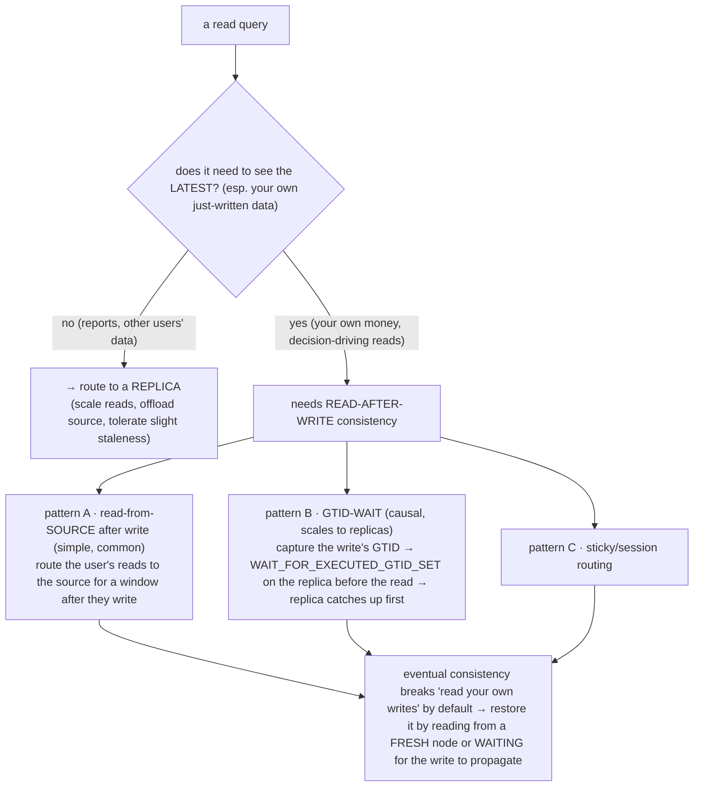
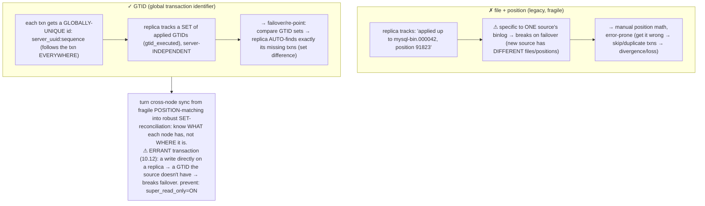
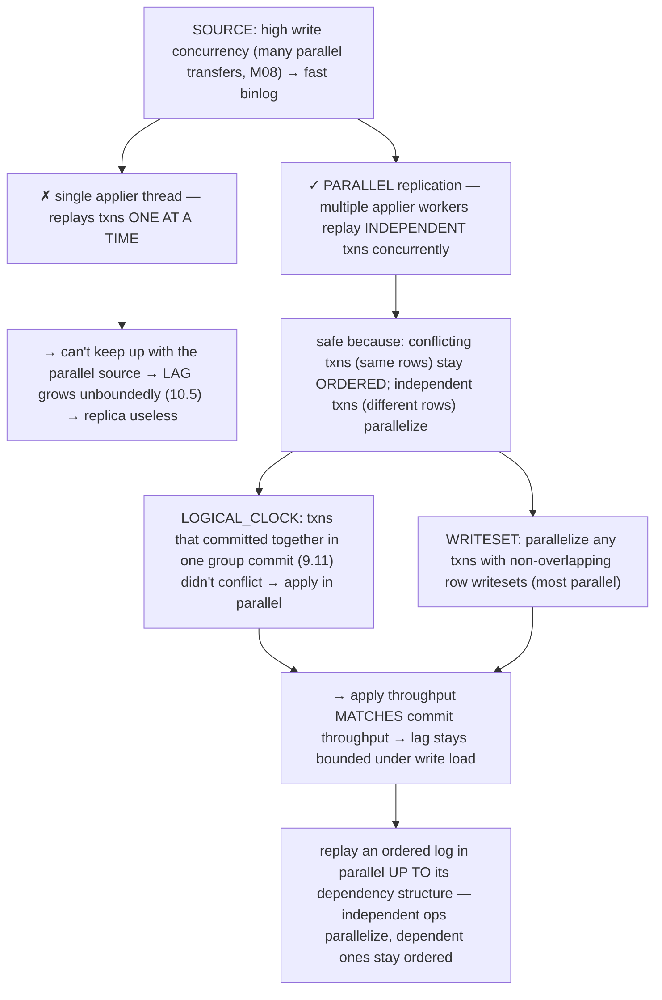

# M10 · Pass C — Diagrams & Worked Examples · Concepts 10.5–10.8

> Pass C scope: **#12 Diagram(s)** + **#8 Worked example** (narrated). Pairs with `02-lag-consistency-gtid-parallel.md`. Concept 10.5 uses a **★ bespoke custom SVG**; 10.6/10.7/10.8 use Mermaid. Domain: payments/wallet.

---

## 10.5 · Replication lag: causes, measurement, consequences ★

**★ Diagram (custom SVG):**

**Worked example — a balance read off a lagging replica causes a double charge.**
The SVG's money bug, narrated. A user has a $50 balance and makes a $50 payment. **On the source**, the transfer commits: balance $50 → $0 (the source has applied up to txn 1000). But the source's replicas **lag** (10.5) — the reporting/read replica has only applied up to txn 950, *5 seconds behind* (it received the binlog promptly but its applier is behind, the SVG's causes). The user, immediately after paying, **checks their balance** — and if that read is routed to the **lagging replica** (the naive "all reads to replicas" default), it returns the balance the replica has applied: **$50** (the *pre-transfer* balance — the replica hasn't applied the transfer yet). The user sees $50, concludes *"my payment didn't go through"*, and **pays again** → **double charge.** A read from a lagging replica is *a read of the past* — and acting on that stale money state is a real bug. The SVG's causes show *why* lag happens (a single-threaded applier can't keep up with a parallel source — fix: parallel replication, 10.8; a long transaction stalls the applier — fix: short transactions, M07/7.15; weak/loaded replica; slow network) and its measurement (`Seconds_Behind_Source` is *rough and imperfect* — can read 0 during stalls; **GTID gaps** are exact; a **heartbeat table** is robust). The crucial distinction: **reconciliation/reporting on a lagging replica is *fine*** (M02/2.17 — reconciliation tolerates slight staleness; a report a few seconds old is acceptable) — but a **money-decision read** (your own balance after a payment) is **not** fine on a lagging replica. The example crystallizes the universal **replica staleness / eventual consistency** reality: a read from an async-replicated copy reflects *some past state*, and you must decide whether your operation can tolerate that staleness (most reads yes; your own just-written money, no). The fix — making sure money-decision reads see the latest — is **read-after-write consistency** (10.6). For our domain, monitor lag (alert on spikes, M13) and route money-decision reads away from lagging replicas.

---

## 10.6 · Read-after-write consistency & read routing

**Diagram — read routing + read-after-write patterns:**

**Worked example — "paid but balance unchanged → pay again," and the fix.**
This is the double-charge bug (10.5) at the routing level. The naive design routes *all* reads to replicas (to scale, 10.1) — but a user who just paid and immediately reads their balance hits a **lagging replica** that hasn't applied their payment → sees the *old* balance → panics → pays again (double charge). The problem: **read routing to replicas breaks the most intuitive expectation — *seeing your own writes* (read-after-write).** The fixes (the diagram): **(A) Read-from-source after write (simple, common):** after a user makes a payment, route *their* reads to the **source** (for a window, or for that session) — so they always see their own just-written balance. Gives up the read-scaling *for those reads* (they hit the source), but guarantees freshness for the user who needs it. **(B) GTID-wait (causal, scales to replicas):** after the payment, capture the write's **GTID** (10.7); before the user's balance read on a replica, tell the replica "**wait until you've applied this GTID**" (`WAIT_FOR_EXECUTED_GTID_SET`) — the replica catches up to the payment *before* serving the read → read-after-write *from a replica* (scaled). More complex (track GTIDs, add the wait), and the read waits for the replica to catch up. **(C) Sticky routing:** pin the user's session to a caught-up node. The key skill the example teaches: **classify reads by freshness need** — *other users' data, reports, search → replicas* (scaled, staleness OK); *your own money, decision-driving reads → fresh* (source or GTID-wait). The blunt alternative — *all reads to the source* — is always consistent but doesn't scale reads (defeating replicas). The universal principle: **eventual consistency breaks "read your own writes"; restore it by reading from a fresh source or waiting for the write's version to propagate** — the same as a write-through cache with read-after-write handling, a CDN with cache-busting, or causal-consistency tokens. For our domain: a user's own balance read after paying → **source** (or GTID-wait); other reads, reports, reconciliation (M02/2.17) → **replicas** (scaled). Avoiding the double-charge bug is a core fintech replication concern and a frequent system-design interview topic.

---

## 10.7 · GTIDs: global transaction identifiers

**Diagram — GTID vs file+position:**

**Worked example — why GTIDs make promoting a replica safe.**
Imagine the source dies and you must promote a replica and re-point the other replicas at it. **With file+position (legacy):** each replica tracked its position as "binlog file X, byte position Y" — *specific to the dead source's binlog*. The newly-promoted source has *entirely different* binlog files/positions, so to re-point the other replicas you must **manually compute** where in the *new* source's binlog each replica should resume — error-prone position arithmetic, and getting it wrong means a replica **skips** transactions (data loss) or **re-applies** them (corruption/divergence). This made failover a dangerous, manual operation. **With GTIDs:** every transaction has a **globally-unique ID** (`server_uuid:sequence`) that *propagated* with it — so each replica knows the exact *set* of transaction IDs it has applied (`gtid_executed`). To re-point a replica at the new source, you just say "replicate from the new source" — and the replica **compares its GTID set to the new source's and automatically streams exactly the transactions it's missing** (the set difference). No position math, no skip/duplicate risk — *robust and automatic*. This is what makes modern **automated failover** (10.10/10.13) practical: the orchestrator promotes the freshest replica and re-points the others, and GTIDs make each find exactly what it needs. The example shows the universal **global, server-independent operation identity** principle: instead of tracking position in *one* node's log (fragile across nodes), give each operation a global ID, so synchronization becomes "compute the set difference of applied IDs" (robust — the same idea as globally-unique event IDs in event sourcing M01/1.17, Lamport/vector clocks, idempotency keys M01/1.2 making re-application safe). The hazard GTIDs introduce (the diagram's note): **errant transactions** — a write committed *directly on a replica* (not from the source) creates a GTID only that replica has, which breaks clean failover (the topology has a GTID that "shouldn't exist") — *prevent with `super_read_only=ON` on replicas* (block all writes, even by admins, 10.11/10.12). For our domain, GTIDs are **mandatory** for a safe, automated-failover payments topology (robust promotion/re-pointing, precise lag/divergence detection, read-after-write via GTID-wait, 10.6), with `super_read_only=ON` to prevent errant transactions.

---

## 10.8 · Replication threads & parallel replication

**Diagram — single vs parallel applier:**

**Worked example — a single-threaded applier lags; parallel replication catches up.**
The payments primary has **high write concurrency** — many transfers commit *in parallel* (M08 — concurrent writers to different accounts). Its binlog therefore fills *fast*. Now consider the replica's applier. **Single-threaded (historical):** one applier thread replays the binlog **one transaction at a time, serially** — but the source committed them *concurrently*, so the serial applier **can't keep up**: it falls progressively behind, and **lag grows unboundedly** (10.5) — eventually the reporting replica is uselessly stale (reports hours old) and the failover window (10.10) is huge. **Parallel replication:** multiple applier worker threads replay *independent* transactions *concurrently*, so apply throughput matches the source's commit throughput. The challenge — replays must produce the *same* result, so *conflicting* transactions (touching the same rows) must stay *ordered*, but *independent* ones (different rows) can be applied in any order. The solutions: **LOGICAL_CLOCK** — the source tags transactions that **committed together in the same group commit** (9.11) with the same logical-clock value; committing together means they *didn't conflict* (they were concurrently committable on the source), so the replica can apply that group **in parallel** (known-independent) — *the more concurrency the source had, the more parallelism the replica gets.* **WRITESET** (newer, more parallel) — track the actual rows each transaction modified and parallelize any with *non-overlapping* writesets (e.g., two transfers to entirely different accounts → fully parallel). The example shows the universal **parallel log replay / dependency-aware parallelism** principle: *an ordered log can be replayed faster than serially if you identify independent (commuting) operations and parallelize those while ordering the dependent ones* — the same as instruction-level parallelism (reorder independent instructions), partitioned stream processing, deterministic parallel replay. The transferable insight: *the original's concurrency tells you how much parallelism is safe* (the logical-clock insight: what committed together didn't conflict). For our domain, the write-heavy ledger's replicas **must** use parallel replication (LOGICAL_CLOCK or WRITESET, enough workers) — otherwise they fall hopelessly behind (stale reports, huge failover window). WRITESET gives the best parallelism for a write-heavy ledger (parallelize any non-row-overlapping transfers). Parallel replication is what makes replicas *viable* under fintech write load.

---

*Diagrams + worked examples for 10.5–10.8 complete (1 ★ custom SVG + 3 Mermaid). Next Pass C file: 10.9–10.16 (★ topologies, failover, split-brain, capstone SVGs + Mermaid for silent failures, HA stack, binlog→PITR/CDC, decision flow).*
