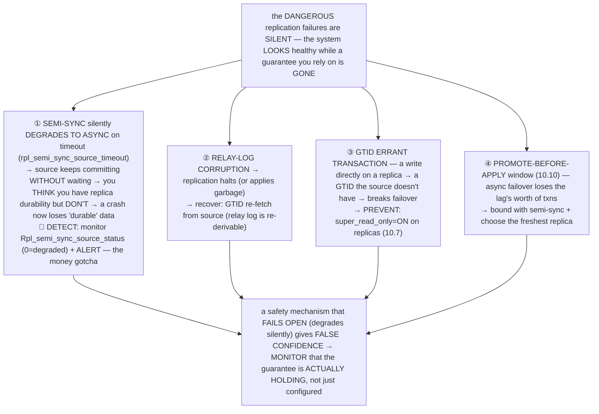
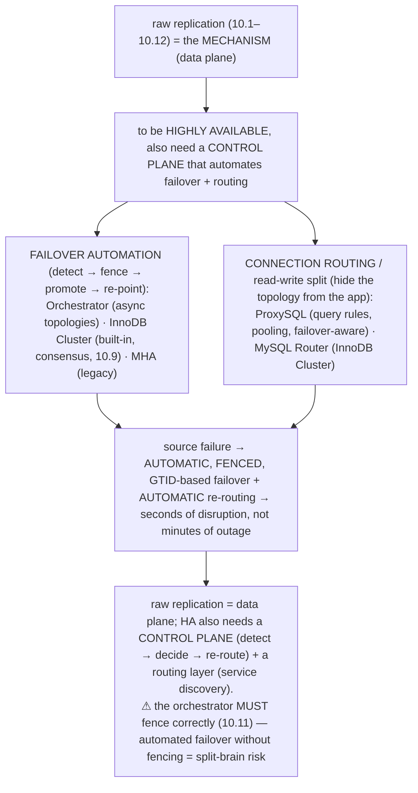
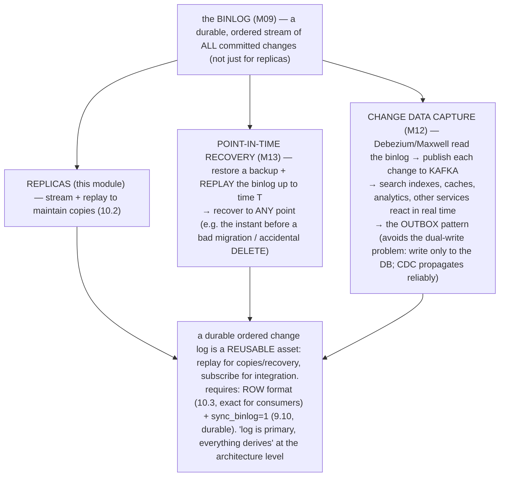
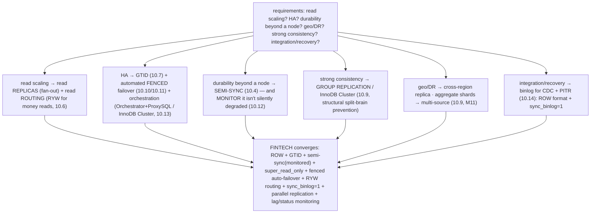

# M10 · Pass C — Diagrams & Worked Examples · Concepts 10.9–10.16

> Pass C scope: **#12 Diagram(s)** + **#8 Worked example** (narrated). Pairs with `03-topologies-failure-bridge-capstone.md`. Concepts 10.9/10.10/10.11/10.16 use **★ bespoke custom SVGs**; 10.12/10.13/10.14/10.15 use Mermaid. Domain: payments/wallet. These close out M10 Pass C.

---

## 10.9 · Replication topologies ★

**★ Diagram (custom SVG):**

**Worked example — which topology for which need.**
The SVG shows the four shapes, each for a different requirement. **Read scaling → fan-out:** one source, many replicas, reads fanned out across them — the payments primary handles transfers, and N read-replicas share the reporting/reconciliation load (M02/2.17). Multiple replicas also give multiple failover targets (HA). The workhorse. Constraint: the source is still the single write point (replication doesn't scale writes — that's M11). **Reducing source load / geo-bridging → chained:** a replica replicates from *another* replica (not directly from the source) — so the source serves its binlog to *fewer* direct replicas (less load), and you can place one replica per region then chain local replicas off it (geo). Cost: *additive lag* (each hop adds lag) and a longer failure chain. **Aggregating multiple write sources → multi-source:** one replica streams binlogs from *several* sources — used to **combine sharded ledgers** (M11 — shard A, B, C each have their own primary; a multi-source replica merges them into *one* combined view) for **global reporting** (M02/2.17 — reconcile across all shards). Requires non-overlapping data (or conflict handling). **Strong consistency + automatic HA → group replication:** a cluster of nodes runs consensus (Paxos-based) — each transaction is *certified by a majority* before commit, giving no divergence, automatic failover, and **structural split-brain prevention** (10.11 — a partitioned minority *can't* commit). The basis of InnoDB Cluster (10.13). Cost: coordination latency, ≥3 nodes. The example shows topologies as a **composable design space** — you pick the shape per requirement and *compose* shapes for complex needs (these are universal distributed-system patterns: leader-follower fan-out = read replicas; relay/cascade = CDN tiers; fan-in = aggregation collectors; consensus group = Raft/Paxos clusters). For our domain, a payments platform composes them: **per-region fan-out** (primary + read-replicas + standby per region), **cross-region replicas** for DR, **multi-source aggregation** to combine sharded ledgers (M11) for global reporting, and optionally **InnoDB Cluster** (group replication) for strong-consistency HA. The big divide: *async fan-out* (fast, available, lag + failover loss window) vs *group replication* (consistent, auto-HA, but slower) — most read-scaling + HA needs use async fan-out + GTID + automated fenced failover (10.10/10.13); group replication when strong consistency + hands-off HA justify the cost. Sharding (M11) is *orthogonal* — combined with replication (each shard is itself replicated).

---

## 10.10 · Failover & promotion (and the data-loss window) ★

**★ Diagram (custom SVG):**

**Worked example — a source crashes; the promoted replica was 2 transactions behind.**
The source dies, and the system must promote a replica to resume writes (the SVG's sequence: detect → **fence** → choose freshest → promote → re-point via GTID → re-route). The danger is the **data-loss window**. **Under async:** suppose the source had committed transfers 998, 999, and 1000 (and told the clients "committed"), but the promoted replica had only *received* up to transfer 997 when the source died. Promoting it makes 997 the new reality — **transfers 998, 999, 1000 are lost** (gone — three confirmed transfers vanished). The loss window = the promoted replica's **lag** at failure time (10.5) — which could be *seconds of transfers* under load (or a huge window if parallel replication, 10.8, wasn't keeping up). For money, three lost confirmed transfers is a catastrophe. **Under semi-sync (10.4):** the source had *waited for ≥1 replica to receive each commit* before acknowledging — so the committed transfers were *guaranteed received by a replica*; promoting that replica (or one caught up to it) loses **zero** confirmed transfers. This is *why* semi-sync matters for money: it **bounds the failover loss window to zero**. The other loss-minimizers (the sequence): **choose the freshest replica** (largest `gtid_executed` — minimizes loss in async), and **GTID** (10.7) makes re-pointing the other replicas *automatic and correct* (each finds exactly its missing transactions). And **fencing** (step 2) is *non-negotiable* — failover without fencing the old source risks **split-brain** (10.11, worse than data loss). The example shows the universal **leader-failover data-loss-window** problem: *promoting a follower after leader death loses whatever hadn't replicated to it — synchronous replication bounds it to zero, async doesn't — and you must fence the old leader* (the same in Raft: committed-by-majority survives, uncommitted can be lost; Kafka: unclean leader election loses un-replicated messages). This *is* the **CAP tradeoff** (M12) made concrete: when the leader dies mid-replication, you *can't* have instant **availability** (promote and continue) *and* **zero data loss** (wait for all replicas — but the source is dead). Failover chooses availability and *minimizes* loss (semi-sync + freshest + fence). For our domain, a payments platform fails over with **semi-sync + GTID + fencing + freshest-replica + automated orchestration** — so a source death is a brief blip with *no lost money*, not a data-loss incident. (The catastrophic version — lost transfers, split-brain — is M15.)

---

## 10.11 · Split-brain & the danger of two sources ★

**★ Diagram (custom SVG):**

**Worked example — a botched failover forks the ledger.**
The *worst* replication failure (the SVG). A failover happens: the orchestrator thinks the source is dead (it was just *unreachable* — a network blip) and promotes a replica to be the new source (source B). But the old source (source A) **isn't actually dead** — it comes back (or never left) — and now **both** A and B are accepting writes. They **diverge irreconcilably**: source A accepts transfer X (GTID A:501), source B accepts transfer Y (GTID B:501 — an *errant* transaction from B's perspective, 10.12), and *neither has the other's transfer.* The **ledger has forked into two conflicting truths** — and the catastrophe is that *both have real, committed money*: customers on A made real transfers, customers on B made real transfers, and there's **no clean way to merge** them (which fork is "right"? both are). Reconciliation is brutal — manual, transaction-by-transaction analysis, often with real financial loss or duplication. Unlike data *loss* (you lose *some* transactions — bad but bounded, 10.10), split-brain *corrupts the entire dataset's consistency* (two contradictory versions) and is *barely recoverable*. The only good answer is **prevention** (the SVG's right side): **(1) Fencing / STONITH** — forcibly kill/isolate the old source (via power management / network ACLs) *before* promoting, so it *can't* take writes (+ `super_read_only=ON` on all replicas so none accidentally becomes a second source). This is *why fencing is non-negotiable in failover* (10.10). **(2) Quorum / consensus** (Group Replication, 10.9) — only a *majority* can commit, so a partitioned *minority can't accept writes* → split-brain is **impossible by design**. The example shows the universal **dual-leader / partition** problem — the canonical distributed-systems failure, why consensus algorithms exist (Raft/Paxos safely elect *one* leader despite partitions via majority-quorum) and why "fence before promote" is sacred. The **CAP connection** (M12): during a partition, you *must* sacrifice availability on the minority side (refuse writes) to preserve consistency (no split-brain) — split-brain is what happens when you wrongly choose availability on *both* sides. For our domain, a payments platform *must* prevent split-brain — **rigorous fencing** in orchestrated failover *or* **InnoDB Cluster** (quorum, structural prevention). A forked ledger is an unrecoverable money-never-lies catastrophe, so prevention is the *only* acceptable strategy and the central HA-safety requirement. (The catastrophic split-brain *incident/reconciliation* is M15.)

---

## 10.12 · Critical internals: the silent failures

**Diagram — the silent-failure catalog:**

**Worked example — semi-sync silently degrades, and "durable" transfers are lost.**
The most dangerous silent failure (the diagram's ①). The payments platform runs **semi-sync** (10.4) — so every transfer's commit waits for a replica's receipt ack before returning, giving replica-confirmed durability (a confirmed transfer survives node loss, the M09/9.16 posture extended). You've configured it; you *believe* you're safe. Then a replica goes down for maintenance (or gets slow, or a network issue). Semi-sync waits for an ack up to `rpl_semi_sync_source_timeout` (default ~10s) — and when no replica acks in time, it **logs a warning and silently switches to async**: the source **keeps committing transfers *without* waiting for any replica.** It auto-switches *back* to semi-sync when a replica catches up. **The catastrophe:** during that async window, transfers commit and return "confirmed" to clients — but they're *only on the source* (no replica has them). If the source's node now dies (the very failure semi-sync was protecting against), those "durable" confirmed transfers are **lost** — *despite your config saying semi-sync.* You believed you had replica durability; you didn't; and it failed *silently* (just a log warning you weren't watching). This is the **fail-open / fail-silent hazard**: a protection that *quietly stops protecting* gives false confidence, which is *more* dangerous than failing loudly (you keep relying on a guarantee that's gone). The fix: **monitor `Rpl_semi_sync_source_status`** (1 = semi-sync active, 0 = degraded to async) and **alert on degradation** — so you *know* when you've lost the guarantee (and can react: investigate the replica, or stop accepting writes if durability is mandatory). The other silent failures: **relay-log corruption** (replication halts — recover via GTID re-fetch, since the relay log is just a re-derivable copy of the source's binlog), **errant transactions** (a write directly on a replica creates a GTID that breaks failover — prevent with `super_read_only=ON`, 10.7), and the **promote-before-apply window** (10.10). The universal lesson the diagram drives: **a configured guarantee is only real if you monitor that it's *actually holding* — especially mechanisms that degrade gracefully (fail open), because graceful degradation *hides* the loss of the guarantee.** "It's configured for X" ≠ "X is currently true." For money, you **verify** durability (alert on semi-sync status, lag, errant GTIDs, replica errors), you don't *assume* it — the same "tested backups, verified durability" discipline as M09/9.7 (a fsync that lied) and M15. These silent failures are the bridge to M15 (the catastrophic incidents they cause).

---

## 10.13 · High-availability solutions (the orchestration layer)

**Diagram — the HA stack:**

**Worked example — InnoDB Cluster + ProxySQL handle a source failure automatically.**
Raw replication gives the *mechanism* (10.1–10.12), but turning it into an *always-on* system needs the **orchestration layer** (the diagram). Trace an automated failover. The **source fails** (hardware death). **Failover automation** (InnoDB Cluster's built-in consensus-based automation, *or* Orchestrator for an async topology) **detects** the failure (health checks fail), **fences** the old source (10.11 — ensures it can't come back as a second source; with InnoDB Cluster's quorum, the failed node simply can't reach majority so *can't* commit — structural), **chooses** the freshest replica, **promotes** it (makes it writable), and **re-points** the other replicas at the new primary (via GTID, 10.7 — each auto-finds its missing transactions). Meanwhile, the **routing layer** (ProxySQL or MySQL Router) — which sits between the application and the database, routing writes to the current primary and reads to replicas (10.6) — *detects the topology change and automatically updates*: the application's writes now flow to the *new* primary (the app didn't change anything — it connects to the proxy, which handles "which server"). Total disruption: *seconds* (automatic detection + failover + re-route), not *minutes* of outage requiring a human to correctly execute the failover sequence under pressure. The example shows the universal **control plane / orchestration** layer of any HA system: **raw replication is the *data plane*; HA also needs a *control plane* (detect → decide/promote with fencing → re-route) and a *routing layer* (service discovery to the current leader)** — the same pattern as Kubernetes (controllers + service routing), Raft-based systems (built-in leader election + client redirection), every managed datastore's HA. The orchestrator is the control plane; the proxy is service discovery/routing. The critical caveat (the diagram's note): **the orchestrator MUST fence correctly** (10.11) — automated failover *without* fencing risks split-brain (fast, but catastrophic). For our domain, a payments platform uses **InnoDB Cluster + MySQL Router** (consensus HA, structural split-brain prevention, integrated) *or* **semi-sync + Orchestrator + ProxySQL** (async with orchestrated fenced failover + smart routing) — so a source failure is *automatically* handled (no lost money with semi-sync, no split-brain) with seconds of disruption. This orchestration layer is what makes the platform *always-on* (10.15/10.16, M16). Choosing and operating it correctly (esp. fencing) is the operational HA decision.

---

## 10.14 · Replication for backups, PITR & CDC (bridge)

**Diagram — one binlog, three consumers:**

**Worked example — the same binlog feeds a replica, a PITR backup, and a CDC pipeline.**
The binlog isn't *just* for replicas — it's the database's authoritative, ordered, durable stream of *everything that changed*, and that's reusable three ways (the diagram). For the payments ledger: **(1) Replicas (this module)** stream and replay the binlog to maintain reporting/standby/DR copies (10.2). **(2) PITR (M13):** you take periodic full backups *and retain the binlogs since each backup*. To recover the ledger to a precise moment — say, the instant *before* a bad migration corrupted some data — you restore the last backup before that moment, then **replay the binlog up to that exact point** (the binlog "rolls the backup forward" to any chosen time). This is how you recover to *any* point in time, not just to the last backup. **(3) CDC (M12):** a connector (**Debezium**) *reads the binlog* (acting like a replica — streaming it) and publishes each ledger change as an *event* to **Kafka** — so the rest of the platform (fraud detection, notifications, analytics, reconciliation feeds, other microservices) **reacts to ledger changes in real time**. This is the basis of the **outbox pattern** (M12): instead of the app writing to *both* the database *and* a message queue (the **dual-write problem** — the two writes can partially fail, leaving them inconsistent), the app writes *only* to the database, and **CDC reliably propagates** the change from the binlog — so nothing is missed and there's no dual-write inconsistency. The example reveals the binlog as a **foundational asset, not just a replication detail** — it's the system's source of truth for *what changed*, enabling precise recovery (PITR) and reliable integration (CDC). The universal principle: **a durable, ordered change log is reusable — replay it to copy state (replication), roll a backup forward (PITR), or stream it to integrate (CDC)** — the same "log is primary, everything derives" theme as M01/1.17, M08/8.2, M09/9.14, now at the *architecture* level (Kafka-as-central-log, event sourcing). For our domain, the ledger's binlog feeds reporting/DR replicas, PITR backups (recover before any incident, M13/M15), and a CDC stream (fraud/notifications/analytics + reliable cross-service propagation via outbox, M12) — *one* binlog, three uses (requires ROW format, 10.3, and `sync_binlog=1`, 9.10). This bridges M10 (replication) → M12 (distributed/CDC/outbox) → M13 (PITR).

---

## 10.15 · Choosing a replication strategy (the decision)

**Diagram — requirements → design:**

**Worked example — designing the replication for a payments platform.**
There's no one-size replication config — you reason from *requirements* to *design* (the diagram), and for fintech the choices converge. **Read scaling?** Yes (offload reporting/reconciliation from the transactional primary) → **read replicas** + **read routing** with **read-after-write for money reads** (10.6 — user's own balance after paying → source; reports → replicas). **HA/failover?** Yes (always-on payments) → **GTID** (10.7, robust promotion/re-pointing) + **automated, fenced failover** (10.10/10.11) + an **orchestration layer** (InnoDB Cluster *or* Orchestrator + ProxySQL, 10.13). **Durability beyond one node?** Yes (a confirmed transfer must survive total primary-node loss) → **semi-sync** (10.4) — *and* **monitor `Rpl_semi_sync_source_status`** so it doesn't silently degrade to async (10.12, the money gotcha). **Strong consistency required on the core?** Optionally → **InnoDB Cluster** (group replication, structural split-brain prevention, 10.9) — at latency cost. **Geo/DR?** → **cross-region replica** (accept cross-region lag, 10.5). **Aggregating sharded ledgers** (M11)? → **multi-source** reporting replica. **Integration/recovery?** → **binlog for CDC + PITR** (10.14) with **ROW format** (10.3, no divergence) and **`sync_binlog=1`** (9.10, durable binlog). The output: the fintech-convergent strategy — **ROW + GTID + semi-sync(monitored) + super_read_only + fenced auto-failover + RYW routing + sync_binlog=1 + parallel replication + lag/status monitoring**. The example shows **requirements-driven distributed-systems design**: you don't pick a topology/consistency level in the abstract — you enumerate the guarantees you need (what must survive node/region loss? what can be stale — reports yes, your own money no? what latency can you afford?) and design to meet them, biasing toward *stronger* guarantees as the cost of failure rises (for money: durability, no divergence, no stale-money-reads — and *verify* they hold, 10.12). It's the same right-size-your-guarantees discipline as M07/7.14 (isolation level) and M09/9.10 (durability matrix), at the distribution layer. This design is the platform's replication architecture (10.16).

---

## 10.16 · Fintech capstone — the replicated payments platform ★

**★ Diagram (custom SVG):**

![The replicated payments platform: a primary region (primary + semi-sync standby + read replicas, ROW/GTID/sync_binlog=1, read-after-write routing, automated fenced failover, super_read_only on replicas), a DR region (cross-region replica + multi-source shard aggregation), the binlog feeding PITR and CDC — with a per-failure-mode survival summary showing a confirmed transfer survives process crash, power loss, torn page, total node loss, and region loss, the ledger never forks, and users never read stale balances](assets/10.16-replicated-platform.svg)

**Worked example — the platform's replication design and how money stays safe across node loss/lag.**
The capstone assembles the module into the complete replicated topology for money (the SVG) and answers, at the distribution layer, the question M09 answered locally: ***is a committed payment safe even when a whole node — or region — dies?*** plus *is it ever read stale?* and *can the ledger fork?* The design: a **primary** handles all writes (the atomic transfer, M07/M08); **semi-sync** (10.4) makes each commit wait for a **standby replica's** receipt → a confirmed transfer is durable *beyond the primary's node* (survives total node/disk/datacenter loss — extending M09's single-node durability, 9.16). **Read replicas** serve reporting and **reconciliation** (M02/2.17, tolerate lag). **Read-after-write routing** (10.6): a user's own balance read after paying → the **primary** (or a GTID-caught-up replica) so they see their new balance (no double-charge bug, 10.5). **Automated fenced failover** (InnoDB Cluster or Orchestrator+ProxySQL, 10.13) with **GTID** (10.7) → a primary failure triggers fast, fenced, GTID-based promotion (**no lost transfers** with semi-sync, **no split-brain** with fencing/quorum, 10.10/10.11) + automatic re-routing. **ROW format** (10.3) → replicas never diverge. **`super_read_only=ON`** on replicas → no errant transactions (10.12). A **cross-region replica** → survives a region outage (DR). **Multi-source aggregation** → combines sharded ledgers (M11) for global reporting. **Monitoring** (M13) of lag and `Rpl_semi_sync_source_status` (alert on degrade-to-async, 10.12) → *verify* the guarantees hold, don't assume. The **binlog** also feeds **PITR** (recover the ledger to any point, M13) and **CDC** (propagate changes reliably via outbox, M12). **What survives** (the SVG's summary): a confirmed transfer survives primary process crash (M09 redo), power loss (M09 fsync to honest storage), torn page (M09 doublewrite), **total primary node/disk loss** (semi-sync replica has it), *and* region loss (DR replica); failover loses *no* confirmed money; the ledger *never forks*; users *never read stale balances*. The example proves the module's thesis: **durability isn't just a single-node property (M09) — it extends across the distribution** (semi-sync → node-loss survival; fencing/quorum → no fork; RYW → no stale-money-reads; monitoring → verified). The universal instinct for any high-value distributed data: **durable beyond one node (sync replication), exactly one leader (fencing/consensus, no split-brain), read-your-writes where it matters, and monitored (verify, don't assume) — the cost of these guarantees is justified by the cost of their failure.** This is the distributed-systems realization of money-never-lies, and the foundation **M11** (shards the *writes* this topology replicates), **M12** (generalizes the binlog integration — CDC/outbox/distributed transactions), **M15** (the catastrophic failures when these protections fail), and **M16** (the full platform) build on.

---

*Diagrams + worked examples for 10.9–10.16 complete (4 ★ custom SVGs + 4 Mermaid). **M10 Pass C is fully drafted (all 16 concepts: 7 ★ custom SVGs + 9 Mermaid).** Remaining for M10: Pass D — code-specifics boxes, failure modes & gotchas, fintech lens, interview/SD angle, and self-check questions.*
