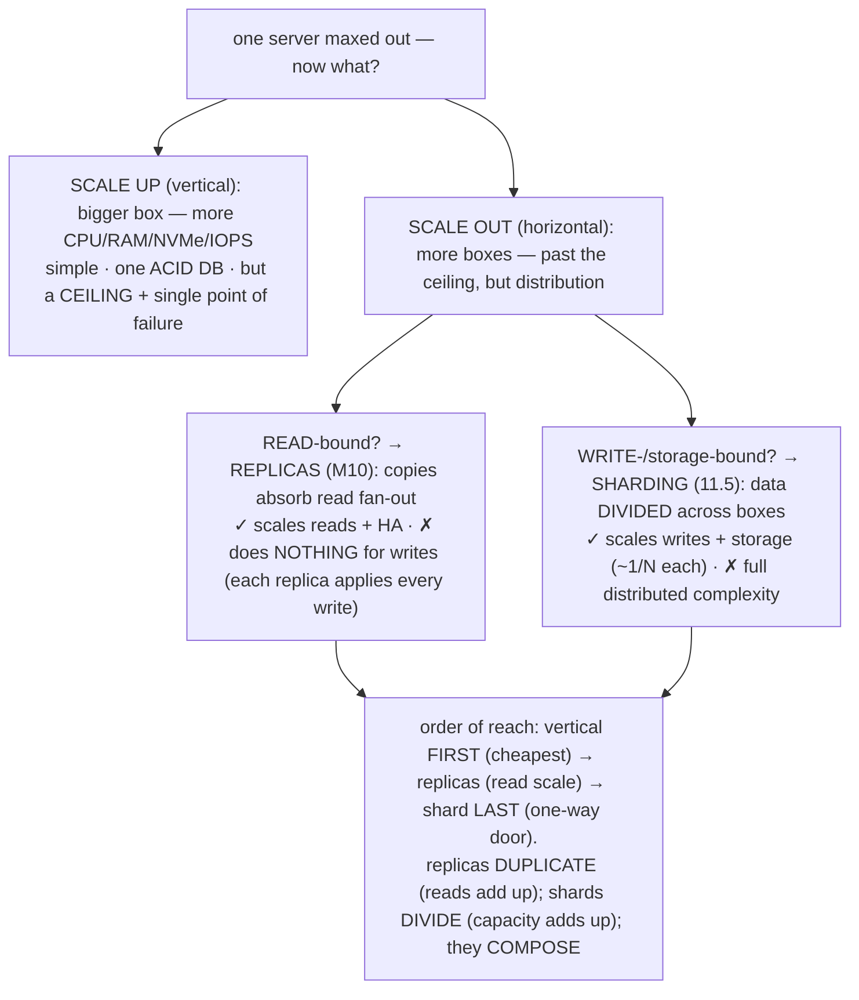
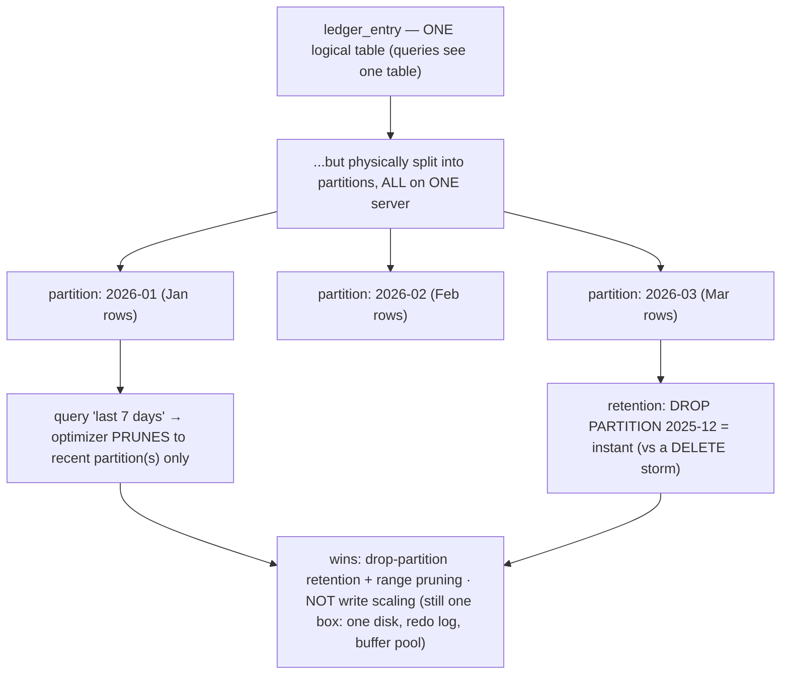
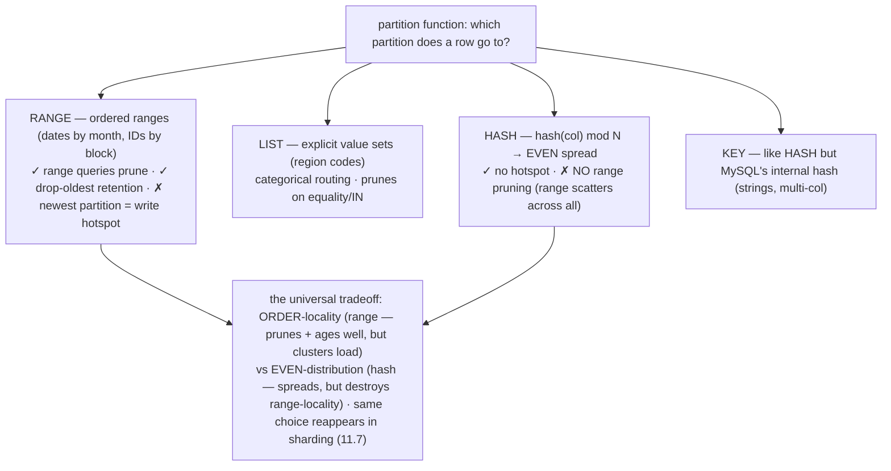
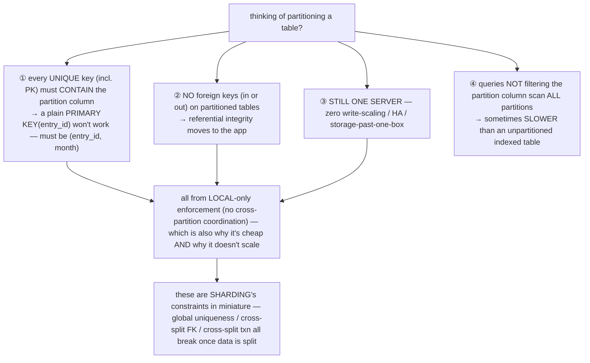

# M11 · Pass C — Diagrams & Worked Examples · Concepts 11.1–11.5

> **Pass C scope:** content-contract items **#12 Diagram(s)** and **#8 Worked example** (narrated, no code in prose). Pairs with `01-scaling-partitioning-sharding-intro.md`. Concept 11.5 uses a **★ bespoke custom SVG** (in `assets/`, render-validated); 11.1–11.4 use Mermaid. Domain: payments/wallet, the ledger. The recurring question: *did the transfer stay single-shard/atomic, and did money survive?*

---

## 11.1 · Scaling up vs out; read vs write scaling

**Diagram — the scaling map (up/out × read/write):**

**Worked example — the payments platform that out-scaled its replicas but still has a write bottleneck.**
A growing payments platform follows the natural path. First it **scales up** — a bigger primary (huge buffer pool, fast NVMe, M09) — and rides it a long way. Then reads start to saturate: reporting, dashboards, and **reconciliation** (M02/2.17 — summing the ledger) compete with live transfers. So it adds **read-replicas** (M10) and routes those read-heavy workloads to them — read capacity multiplies, the primary breathes. The platform keeps growing, adds more replicas, and reads scale beautifully. But then it hits a wall that *more replicas can't fix*: **write throughput**. Every transfer is a write, and writes *all* go to the single primary — and worse, *each replica also applies every write*, so replicas don't relieve write load, they *duplicate* it. The primary's redo log, disks, and buffer-pool dirty-page flushing (M09) are saturated by the write rate; adding a tenth replica does nothing (the bottleneck is the *one* write node). This is the diagnostic moment the map clarifies: the platform is **write-bound**, and the *only* tool that scales writes is **sharding** (11.5) — dividing the ledger across multiple write nodes so each absorbs a fraction. The lesson: replicas and sharding solve *opposite* problems (reads vs writes); reaching for replicas when write-bound (or sharding when read-bound) wastes effort. Diagnose the bottleneck first, then apply the matching tool — and shard *last*, because its complexity is permanent.

---

## 11.2 · Partitioning: splitting a table within one server

**Diagram — one logical table → N partitions on one node:**

**Worked example — range-partitioning the ledger history by month.**
The immutable **ledger-entry history** grows forever (append-only, M01/1.17) and has two needs partitioning serves perfectly. **Retention:** regulation requires keeping entries for, say, 7 years, then purging older ones. On a huge unpartitioned table, deleting a year of old entries means `DELETE … WHERE created_at < …` — a catastrophic **DELETE storm**: millions of rows removed one-by-one, generating mountains of undo/redo (M09), holding locks, bloating the history list (M08), and leaving fragmentation. With the table **range-partitioned by month**, purging old data is `DROP PARTITION 2018-06` — **instant** (deallocate the whole segment, no row-by-row work, no undo/redo storm). **Pruning:** queries like "this account's activity in the last 30 days" filter on the entry timestamp, so the optimizer **prunes** to the recent monthly partitions and skips the other 80 — a large-table query stays fast. Crucially, all of this is on **one server** — partitioning gives *zero* write-scaling (the partitions share the same CPU, disks, redo log, and buffer pool); a transfer's write rate is unchanged. The catch (11.4): the table's PK must now include the partition column (e.g., `(entry_id, created_month)`), and it can't have foreign keys. So partitioning is the right tool *here* — an append-only, time-queried, FK-free history with retention needs — but it's a **manageability** tool, not a scaling one. If the platform were write-bound, partitioning would do nothing; that requires sharding (11.5).

---

## 11.3 · Partitioning types & pruning (range/list/hash/key)

**Diagram — the four partition functions + pruning:**

**Worked example — why range-by-time prunes but hash-by-time can't.**
Take the ledger history and two ways to partition it. **Range by month** (on the entry timestamp): January's rows are physically in the January partition, February's in February's, and so on — *ordered*. A query "entries between Feb 10 and Feb 20" tells the optimizer exactly which partition(s) can hold matching rows (February's), so it **prunes** to that one partition and skips the rest — fast, and `EXPLAIN` confirms only one partition is touched. Retention is a clean `DROP PARTITION`. The cost: all *new* entries (today's) land in the *current* month's partition — a mild write **hotspot** on one partition (and across shards this becomes the serious sequential-key hotspot, 11.7). Now **hash by month-or-timestamp**: rows are scattered *evenly* across N partitions by a hash — so January's rows are spread across all partitions, February's too. The same "Feb 10–20" query now **can't prune** — the matching rows could be in *any* partition (hashing destroyed the order), so it scans the relevant index in *every* partition. Hash gave even distribution but **killed range pruning**. This is the universal **order-vs-spread** tradeoff (the diagram's point): ordered ranges prune and age well but cluster load; hashing spreads load but destroys range-locality — *you can't have both*. For time-queried, age-purged history, RANGE-by-time wins despite the newest-partition hotspot. The exact same choice reappears one level up as range-vs-hash *sharding* (11.7) — learn it here.

---

## 11.4 · Partitioning limits & gotchas

**Diagram — the limits that disqualify partitioning:**

**Worked example — the trap: partitioning the hot table expecting write-scaling.**
A team sees the accounts/balances table is the write hotspot (every transfer updates balances) and reaches for partitioning, expecting it to "spread the writes." It backfires on every limit. **First**, partitioning the accounts table by, say, `HASH(account_id)` to "spread writes" gives **no write-scaling at all** — the partitions are all on the *same server*, sharing one set of disks, one redo log, one buffer pool (M09); the write throughput ceiling is unchanged (limit ③). **Second**, the accounts table has a natural `PRIMARY KEY(account_id)` and is referenced by foreign keys (ledger entries → accounts) — but a partitioned table **can't have those FKs** (limit ②) and its **unique keys must include the partition column** (limit ①), forcing an unnatural PK and breaking referential integrity. **Third**, most balance queries filter by `account_id` — which, if the table were partitioned by *month* instead, *can't prune* (account_id isn't the partition key) → every `WHERE account_id=?` scans *all* partitions, **slower** than the unpartitioned indexed table (limit ④). The team gained nothing and broke FKs. The diagnosis: partitioning is a **single-server manageability tool** (good for the append-only, time-queried, FK-free *history*, 11.2), *not* a write-scaling tool — the accounts table is write-bound, which only **sharding** (11.5) fixes. The deeper lesson the diagram draws: these limits (global uniqueness, cross-split FKs, all-partition scans) are *exactly* the constraints sharding imposes — partitioning is the gentle, single-node preview of the same problem. Learn the shape here; it's the whole story of sharding.

---

## 11.5 · Sharding: splitting data across servers ★

**★ Diagram (custom SVG):**

![Replication vs partitioning vs sharding: replication copies the same data to many nodes (scales reads, each node holds the whole dataset, but writes are not scaled); partitioning splits one table across partitions within one server (retention + pruning, but still one box, no write scaling); sharding divides different rows across many independent servers (scales writes and storage ~1/N each, but loses cross-shard ACID, requires scatter-gather for non-key queries, and resharding is brutal). Replication duplicates so reads add up; sharding divides so capacity adds up; they compose.](assets/11.5-shard-vs-partition-vs-replica.svg)

**Worked example — splitting the ledger across 8 shards by account.**
The platform is write-bound (11.1) — vertical scaling and read-replicas are exhausted — so it **shards** the ledger. It picks a **shard key** (11.6) — say, a hash of `account_id` (or `tenant_id`, 11.9) — and stands up **8 independent MySQL servers** (shards), each running the *same schema* but holding only its **slice** of the data: ~⅛ of the accounts and their ledger entries. Now a write to account 1,234,567 is routed (11.13) to whichever shard owns that key and committed there as a **completely normal single-node ACID transaction** — within that shard, *everything* from M07–M09 still holds (atomicity, isolation, durability, the buffer pool, the redo log). Crucially, a write to a *different* account on a *different* shard proceeds **fully in parallel** (independent server, independent disks and redo log) — so total write throughput scales ~8× and total storage capacity is 8× one box. That's the win the SVG contrasts: where replicas *duplicate* (every node holds the whole dataset and applies every write — reads add up, writes don't), sharding *divides* (each node holds a disjoint slice — capacity adds up). But the SVG also shows the price, which is steep and permanent: **no single-node ACID across shards** (a transfer between accounts on different shards is no longer one atomic commit, 11.11), **cross-shard queries become scatter-gather** (a query not filtered by the shard key fans out to all 8, 11.10), the **shard-key choice is a near-irreversible bet** (resharding is brutal, 11.14), and **operational complexity multiplies** (8 servers × their replicas to back up, monitor, migrate). And each shard is *itself* usually a replicated set (M10) for HA + read offload — so the real topology is *sharded × replicated-per-shard* (the tools compose). This is the line where "a database" becomes "a distributed data system"; the rest of the module is *how to shard money safely* — choose the key (11.6), the scheme (11.7/11.8), co-locate transfers (11.9), handle the cross-shard cases (11.10/11.11), generate IDs (11.12), route (11.13), and reshard (11.14).

---

*Diagrams + worked examples for 11.1–11.5 complete (1 ★ custom SVG + 4 Mermaid). Next Pass C file: 11.6–11.10 (★ shard-key, schemes, consistent-hash-ring, co-location SVGs + Mermaid scatter-gather).*
