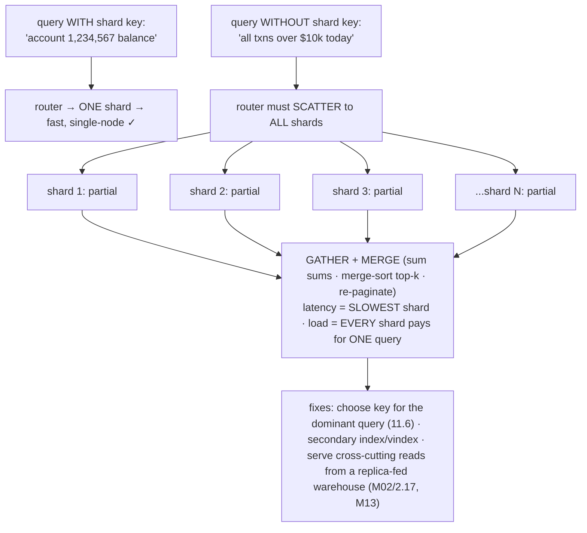

# M11 · Pass C — Diagrams & Worked Examples · Concepts 11.6–11.10

> **Pass C scope:** content-contract items **#12 Diagram(s)** and **#8 Worked example** (narrated, no code in prose). Pairs with `02-shard-key-schemes-colocation.md`. Concepts 11.6/11.7/11.8/11.9 use **★ bespoke custom SVGs** (in `assets/`, render-validated); 11.10 uses Mermaid. Domain: payments/wallet, the ledger. The recurring question: *did the transfer stay single-shard/atomic, and did money survive?*

---

## 11.6 · The shard key: the most important decision ★

**★ Diagram (custom SVG):**

![The shard key governs four things at once: co-location (which rows end up together — both legs of a transfer on one shard?), routing (filter by the shard key → one shard, else scatter-gather), even load (a skewed key creates a hotspot — a hot account becomes a hot shard), and cardinality (enough distinct values to split finely and reshard later). For payments: account_id co-locates an account's entries and spreads evenly but a transfer touches two accounts; customer_id/tenant_id co-locates all of a customer's accounts (intra-customer transfers single-shard) but whale customers hotspot; transaction_id spreads perfectly but co-locates nothing so every read scatters and is almost always wrong. Changing the shard key on a live system means re-distributing every row, so treat it as permanent.](assets/11.6-shard-key.svg)

**Worked example — choosing the payments shard key: account_id vs customer_id vs transaction_id.**
The shard-key choice is made by studying the *access pattern* (what's queried and transacted together), not the data in isolation — and the SVG lays out three candidates with their tradeoffs. **`transaction_id`:** it spreads load *perfectly* (each transaction independent, even hashing), so it's tempting — but it **co-locates nothing**: an account's entries scatter across all shards, so reading a balance or an account's history is a scatter-gather (11.10) to *every* shard, and a transfer (which touches two accounts, not a transaction-id) routes nowhere sensible. Almost always **wrong** — even distribution alone is worthless if nothing useful is co-located. **`account_id`:** now an account's balance and all its entries **co-locate** on one shard (a single-account read/update is single-shard and fast), and with many uniform accounts load spreads evenly. The catch: a **transfer touches two account_ids**, which may hash to two different shards → cross-shard (11.11) unless you arrange for them to share a shard (11.9). Good for account-centric workloads. **`customer_id` / `tenant_id`:** this **co-locates all of a customer's accounts** on one shard — so an *intra-customer* transfer (between that customer's own accounts) is **single-shard ACID** (the win, 11.9), and so is "show all of customer X's accounts." The cost: a **whale customer** (one customer doing 30% of volume) concentrates that load on one shard — a **hotspot** (M08's hot row lifted to a hot shard) — and *cross-customer* transfers are cross-shard. This is usually the fintech choice *because* co-locating transfers (keeping debit+credit atomic, 11.9) matters more than perfect even-ness, and whales are handled separately (dedicated shards via a directory, 11.7). The meta-lesson the SVG drives home: there's rarely a perfect key (the four properties trade against each other), you pick the *least-bad for your dominant operation*, and — because changing it later means re-distributing *every* row (11.14) — you treat the choice as **permanent**. It deserves more design effort than almost anything else in the system.

---

## 11.7 · Sharding schemes: range, hash, directory ★

**★ Diagram (custom SVG):**

![Three schemes mapping shard key to shard. Range: shards own ordered ranges (accounts 0-1M on shard 1, etc.) — range queries route and splitting is local, but sequential keys all land on the newest shard (a hotspot) and shard sizes go uneven. Hash: shard = hash(key) — even distribution regardless of key shape, no sequential hotspot, but range queries can't route (they scatter) and naive mod-N reshards badly (use consistent hashing). Directory: an explicit key-to-shard lookup table — move any key anytime, rebalance hotspots, incremental resharding, but the lookup is an indirection and the directory is a critical component. Most large systems hash the key then range-partition the hash space (Vitess).](assets/11.7-schemes.svg)

**Worked example — range hotspots the newest shard; hash spreads but kills range scans; directory buys flexibility.**
Three ways to map `account_id` → shard, each with the tradeoff the SVG shows. **Range:** shard 1 owns accounts 0–1M, shard 2 owns 1M–2M, etc. Clean and range-queryable — but account IDs are *assigned sequentially*, so *all newly-created accounts* (and the freshest, most-active data) land in the *highest range* → the **newest shard takes a disproportionate share of writes** (the sequential-key hotspot — the same insert-hotspot as a monotonic clustered key, M05/M09, now at shard scale), and shards fill unevenly. Range-by-monotonic-id is usually a hotspot trap. **Hash:** `shard = hash(account_id) mod 8` (conceptually) scatters accounts *evenly* regardless of ID order — account 1,000,001 and 1,000,002 land on different shards → **no sequential hotspot**, uniform load and sizes. The price: **range queries can't route** ("accounts 1000–2000" now scatter across all shards, 11.10) and **naive `mod N` reshards catastrophically** (changing N remaps ~everything, 11.8 — fixed by consistent hashing). **Directory:** a lookup table maps each account (or bucket) → shard explicitly — so you can **move a whale account to its own dedicated shard**, rebalance a hotspot by reassigning buckets, or reshard incrementally; the cost is the **lookup indirection** on every route and the directory becoming a critical, must-be-HA component. The practical resolution most large systems (and Vitess) use, per the SVG's footer: **hash the key first** (to destroy skew and sequential hotspots) **then range-partition the *hash space* into shards** — so you get even spread *and* reshardable range-splits (11.8/11.13). For the ledger: hash the shard key for even load — but because hashing scatters a transfer's two accounts, you must then *deliberately engineer co-location* of the two legs (11.9), since the scheme alone won't keep them together.

---

## 11.8 · Consistent hashing & minimizing reshuffle ★

**★ Diagram (custom SVG):**

![Naive hash(key) mod N: going from 8 to 9 shards, key 100 moves from shard 4 to shard 1, key 101 from 5 to 2, and so on — roughly 8/9 of all keys move, which means re-copying nearly the whole dataset under live load, making resharding almost impossible. Consistent hashing: place both shards and keys on a hash ring (0 to 2^32, wrapping); a key belongs to the next shard clockwise. Adding a shard inserts one point and steals only its arc from the next shard — only about 1/N of keys move and everything else stays put. Virtual nodes place each shard at many ring points for even load and gentle rebalancing. Cassandra and Dynamo use token rings; Vitess achieves the same with keyspace-range splits.](assets/11.8-consistent-hash-ring.svg)

**Worked example — adding a 9th shard: mod-N reshuffles everything, the ring moves only ~1/9.**
The platform has 8 shards and needs a 9th. The SVG contrasts the two outcomes. With **naive `hash(account_id) mod 8`**, every account's shard is computed *relative to N=8*. Switch to `mod 9` and almost every account moves: an account whose hash gives `mod 8 = 4` now gives `mod 9 = ?` — almost certainly a *different* shard. Concretely, only accounts where `hash mod 8 == hash mod 9` stay put — roughly **1/9 of them**; the other **~8/9 must be physically relocated** to new shards, *while the system is live and accounts keep transacting*. That's re-copying nearly the entire ledger under load — so risky and slow it makes resharding effectively impossible, and the platform is frozen at 8 shards forever. With **consistent hashing**, accounts and shards are placed on a **hash ring**; each account belongs to the *next shard clockwise*. Adding the 9th shard inserts *one new point* on the ring, and it **steals only the arc between it and its predecessor** — so only the accounts in *that one arc* (≈1/9 of accounts) move to the new shard, and **every other account stays exactly where it is** (its next-clockwise shard didn't change). The data movement is the *theoretical minimum* (~1/N) and *localized* (one arc). **Virtual nodes** (each physical shard placed at ~100–200 ring positions) make the arcs fine and interleaved, so load is even *and* adding a shard pulls a little from *many* shards rather than dumping one big arc on a single neighbor. This is what turns resharding (11.14) from impossible into a routine, bounded operation. The transferable principle (the SVG's right column): *mod-N couples every key to N, so changing N moves everything; a ring/keyspace mapping couples each key only to its local region, so membership changes move only that region.* Cassandra/Dynamo use token rings; **Vitess achieves the same** with hash-into-keyspace + **range-splits** (split one keyspace range in two, moving only that range's rows) — the production answer for MySQL. The rule: **never shard money on naive `mod N` if you'll ever change N.**

---

## 11.9 · Co-location: keeping related data together ★

**★ Diagram (custom SVG):**

![Co-location keeps a transfer's two legs on one shard. Left (good): shard by tenant or ledger_group so debit account A and credit account B are both on shard 1 — one BEGIN...COMMIT, atomic, durable, isolated, all of M07-M09 intact: single-shard ACID. Right (bad): naive per-account hashing puts account A on shard 1 and account B on shard 2 — no single commit spans two servers, so it's not atomic; it requires a distributed transaction (2PC blocking or Saga), and a crash between the legs loses or duplicates money. Bottom: when a transfer must cross shards, the clearing-account pattern keeps each physical transaction local — debit A and credit shard-1's clearing account locally, debit shard-2's clearing account and credit B locally, then settle between clearing accounts as a Saga. Design goal: make the dominant transfer single-shard; pay the cross-shard cost only on the rare minority.](assets/11.9-colocation.svg)

**Worked example — sharding so both legs of a transfer land on one shard.**
This is *the* fintech sharding rule, and the SVG shows why. A double-entry transfer is a single atomic operation: debit account A, credit account B, both-or-neither (M07/7.16). On a single server that's free (one ACID transaction). On a sharded system it's free *only if A and B are on the same shard*. **The good case (left):** shard by `tenant_id`/`ledger_group` so that accounts that transact together share the shard key → both legs of an intra-tenant transfer **co-locate on one shard** → the debit + credit + balance update is **one local `BEGIN…COMMIT`**, fully ACID (atomic, isolated via M08 locking, durable via M09) — *every* single-node guarantee preserved, at scale. **The bad case (right):** shard by a naive per-account hash and A and B land on *different* shards → there is **no single commit that spans two independent servers** → the transfer is no longer atomic → you're forced into a **distributed transaction** (2PC — blocking and lock-holding; or Saga — eventually consistent, 11.11), and a crash *between* the two legs risks **money lost or duplicated** (the money-never-lies catastrophe). **The escape hatch (bottom):** when a transfer genuinely *must* cross shards (a cross-tenant payment), don't attempt one cross-shard atomic write — use the **clearing/intermediary-account pattern**: on shard 1, locally and atomically debit A and credit shard-1's *clearing account*; on shard 2, locally and atomically debit shard-2's *clearing account* and credit B; then **settle** between the two clearing accounts as a Saga (M12). Each *physical DB transaction stays single-shard* (ACID), and the cross-shard movement becomes an *application-level* protocol over local transactions — eventually consistent (a brief "in transit" state) but never atomicity-violating, with idempotency keys (no double-apply) and reconciliation (M02/2.17) catching drift. The design goal the SVG states: **make the dominant transfer single-shard (co-located) and pay the cross-shard cost only on the rare minority.** Co-location is how sharding preserves the debit=credit invariant — the single most important application of the shard-key choice (11.6) for money.

---

## 11.10 · Cross-shard queries & scatter-gather

**Diagram — single-shard hit vs scatter-gather fan-out:**

**Worked example — "all of a customer's accounts" fanning out and summing across shards.**
Consider "show customer X's total balance across all their accounts." Whether this is cheap or expensive depends *entirely* on the shard key (11.6) — which is the point. **If sharded by `customer_id`** (11.9): all of X's accounts co-locate on one shard, so the query **routes to that single shard**, sums locally, and returns — fast, single-node, scales. **If sharded by `account_id`** (the accounts spread across shards): the router doesn't know *which* shards hold X's accounts, so it must **scatter** the query to *every* shard, each returns the matching accounts' balances, and the router **gathers and sums** the partials — **scatter-gather**. It works, but the cost is exactly what the diagram warns: **latency = the slowest shard** (one slow shard stalls the whole query) and **load = every shard pays for this one query** (the opposite of scaling — adding shards makes scatter-gather *worse*, not better). And it gets harder for aggregations done naively (`COUNT(DISTINCT)`, median can't be combined from partials trivially), global `ORDER BY … LIMIT` (each shard returns its top-k, then merge-sort), and especially **deep pagination** (`LIMIT … OFFSET 10000` forces every shard to ship a 10,000-row prefix). The fixes the diagram lists: **(1)** choose the shard key so your *frequent/critical* query is single-shard (11.6); **(2)** add a **secondary index / Vitess secondary vindex** mapping the other attribute → shard so the query *routes* instead of scattering; **(3)** for genuinely cross-cutting reads — "all transactions over $10k today," global reports, platform-wide reconciliation — **don't scatter-gather the live ledger shards at all**; serve them from a **replica-fed reporting warehouse / read model** (M02/2.17, M13), fed by CDC off each shard's binlog (M10/10.14). The principle: a sharded system isn't one database — it's *a collection of single-shard databases*, so any query that crosses shards is a distributed query you avoid on the money path, route via a secondary index, or push to a purpose-built read model. Keep the operational shards serving single-shard queries; everything cross-cutting goes elsewhere.

---

*Diagrams + worked examples for 11.6–11.10 complete (4 ★ custom SVGs + 1 Mermaid). Next Pass C file: 11.11–11.16 (★ cross-shard-ACID, routing-Vitess, resharding-flow, sharded-ledger SVGs + Mermaid for IDs and the decision).*
