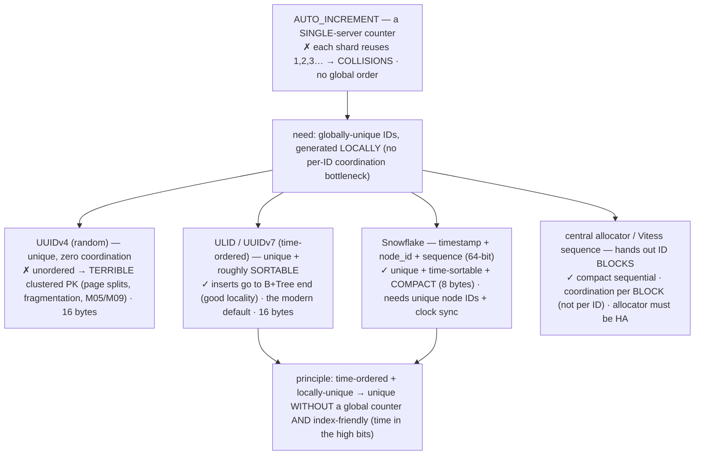
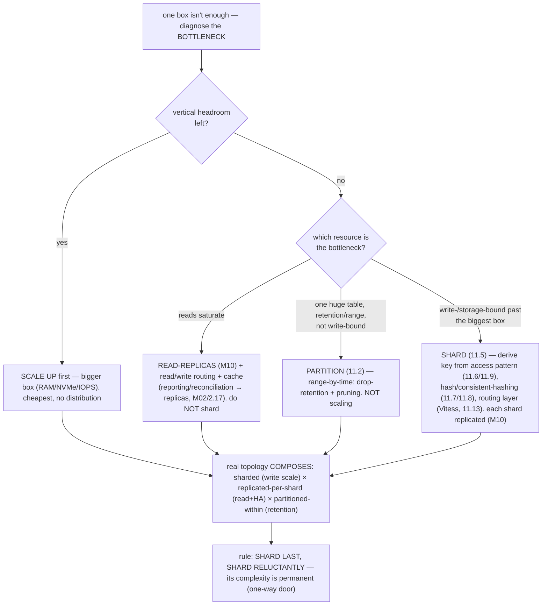

# M11 · Pass C — Diagrams & Worked Examples · Concepts 11.11–11.16

> **Pass C scope:** content-contract items **#12 Diagram(s)** and **#8 Worked example** (narrated, no code in prose). Pairs with `03-crossshard-ids-routing-resharding-capstone.md`. Concepts 11.11/11.13/11.14/11.16 use **★ bespoke custom SVGs** (in `assets/`, render-validated); 11.12/11.15 use Mermaid. Domain: payments/wallet, the ledger. The recurring question: *did the transfer stay single-shard/atomic, and did money survive the cross-shard/reshard?*

---

## 11.11 · Cross-shard transactions (the hard problem) ★

**★ Diagram (custom SVG):**

![Cross-shard transactions: ACID is a single-node guarantee. Single-shard (the goal): one InnoDB server, one BEGIN...COMMIT, one redo log — atomic, durable, isolated, all M07-M09 guarantees free; design via co-location (11.9) so the common transfer is here. 2PC/XA: a coordinator asks both shards to prepare (holding locks), then commit if both vote yes — strict atomicity, but holds locks across the network, is blocking (coordinator crash leaves shards in-doubt), slow, and widely avoided in fintech. Saga (the usual choice): a sequence of local single-shard transactions (debit A on shard 1, credit B on shard 2) with compensations on failure — non-blocking and scalable, but eventually consistent with a brief in-flight state, requiring compensations plus idempotency keys (M16) and reconciliation (M02/2.17). Don't do cross-shard transactions well — design to avoid them; the bridge into M12.](assets/11.11-crossshard-acid.svg)

**Worked example — a transfer between two accounts on different shards: why it's no longer atomic, and the options.**
Within one shard, a transfer is trivially correct: `BEGIN; debit A; credit B; COMMIT` — atomic, durable, isolated (M07–M09), money never lost or duplicated. Now A is on shard 1 and B is on shard 2 (a cross-tenant transfer, say). The SVG shows why this breaks and the three responses. **Why it breaks:** atomicity comes from *one server's* redo log and commit (M09) — there is *no* single commit, redo log, or lock manager spanning two independent servers, so "debit A and credit B, both-or-neither" has **no native atomic path**. If you naively do two separate writes and the process crashes after the debit but before the credit, **$100 vanishes** (debited, never credited) — a money-never-lies catastrophe. **Option 1 — 2PC/XA:** a coordinator drives a two-phase commit — *prepare* on both shards (do the work, hold locks, promise), and if both vote yes, *commit* both. It gives strict atomicity, but it **holds locks across a network round-trip** (contention, M08) and is **blocking**: if the coordinator crashes *after* prepare but *before* commit, both shards are stuck **in-doubt**, holding locks, unable to proceed — the classic 2PC failure. Slow, fragile, **widely avoided** in high-scale fintech (M12 details why). **Option 2 — Saga (the usual choice):** decompose into *local* transactions with compensations — locally debit A on shard 1 (atomic), locally credit B on shard 2 (atomic); if the credit fails, run a **compensating** re-credit on shard 1. Combined with **clearing accounts** (11.9) and **idempotency keys** (M16) so steps are safely retryable, and **reconciliation** (M02/2.17) to catch drift. It's non-blocking and each DB transaction stays single-shard — but it's **eventually consistent** (a brief, visible "in transit" state) and the compensations must themselves be correct ("what does it mean to *undo* a credit?"). **Option 3 — the avoidance path (preferred):** design the shard key (11.9) so the transfer is *single-shard* in the first place → no distributed protocol at all, just a normal ACID transaction. The conclusion the SVG states bluntly: **the goal isn't to do cross-shard transactions *well* — it's to *avoid* them** (co-location), and for the unavoidable minority, use a Saga (never fragile 2PC) with idempotency + reconciliation. This is the concrete face of "sharding trades single-node ACID for scale," and the explicit bridge into M12 (the distributed-transaction chapter).

---

## 11.12 · Distributed ID generation

**Diagram — ID schemes compared:**

**Worked example — why per-shard AUTO_INCREMENT collides, and choosing ULID/Snowflake for the ledger.**
The ledger needs IDs for entries and transactions that are unique *across all shards* (so a transaction is globally identifiable, references resolve, idempotency keys work, M16) *and* index-friendly (the ledger is insert-heavy). **Why AUTO_INCREMENT fails:** it's a *per-server* counter — each of the 8 shards independently generates 1, 2, 3, … → the *same* ID `42` exists on shard 1 *and* shard 3 (**collision**), and there's no global ordering. Unusable across shards. **Why random UUIDv4 is a trap (as a PK):** it's globally unique with zero coordination — but it's *unordered*, so as the InnoDB **clustered PK** it inserts into *random* B+Tree positions → constant **page splits**, poor buffer-pool locality, fragmentation (M05/M09), and every secondary index bloats (it stores the 16-byte PK). Unique, but a performance disaster for an insert-heavy ledger. **The good choices:** **ULID / UUIDv7** put a **timestamp in the high bits** (low bits random) → IDs are *monotonically increasing-ish* → inserts go to the *end* of the B+Tree (like AUTO_INCREMENT — good locality, few splits) *and* are globally unique without coordination — the **modern default** (store as `BINARY(16)`, not a 36-char string, M03/3.12). **Snowflake** packs `timestamp || node_id || sequence` into **64 bits** → unique (each shard embeds its node_id), **time-sortable**, and **compact** (8 bytes — half a UUID, BIGINT-friendly, smaller indexes) — excellent if you can manage unique node IDs and reasonable clock sync (clock skew/rewind is its failure mode). **Vitess sequences** hand out ID *blocks* per shard (coordination per block, not per ID) — the native Vitess answer. The principle the diagram captures: **uniqueness without coordination comes from embedding entropy/identity locally; sortability and index-friendliness come from putting time in the high bits — so the best distributed IDs are time-ordered + locally-unique**, avoiding both the global-counter bottleneck *and* the random-insert penalty. For our ledger: ULID/UUIDv7 (BINARY(16)) or Snowflake (BIGINT) — unique across shards, insert-friendly on the append-heavy ledger (M05/M09), and usable as idempotency-key components (M16). Never a random-UUID PK on a sharded insert-heavy table.

---

## 11.13 · The routing layer (Vitess & app-level) ★

**★ Diagram (custom SVG):**

![The routing layer: the application issues near-normal SQL to vtgate (Vitess's stateless router), which parses each query, consults the VSchema/vindex (the shard-key to shard mapping), and routes — a keyed query (shard key present) goes to one shard (fast, ACID); a non-key query scatters to all shards and merges. Each shard has a vttablet sidecar fronting a MySQL primary plus replicas. Vitess also provides sequences (global IDs, 11.12), reference tables (replicated to every shard, 11.9), and Reshard/VDiff for live resharding (11.14). Alternatives: app-level routing (DIY shard map — full control but owns all complexity including resharding) and ProxySQL (read/write split and routing, but not a full sharding solution).](assets/11.13-routing-vitess.svg)

**Worked example — how Vitess routes a keyed query to one shard and a scatter query to all, transparently.**
A sharded system is *many* databases, but the application wants to talk to *one* — the routing layer bridges that gap, and the SVG traces how Vitess does it transparently. The app connects to **`vtgate`** (Vitess's stateless query router) *as if it were a single MySQL server* and issues near-normal SQL. vtgate **parses** each query and consults the **VSchema/vindex** (which defines keyspaces, shards, and the **shard-key → shard mapping**). Then it routes by the query's shape: **a keyed query** — `SELECT … WHERE tenant_id = 'X'` (the shard key present) — routes to **exactly the one shard** that owns that key → fast, single-node, and if it's a transfer within that tenant, a full **ACID transaction** (11.9); **a non-key query** — `SELECT … WHERE amount > 10000` (no shard key) — **scatters to all shards** and vtgate **merges** the partials (pushing down aggregations, doing the cross-shard sort/limit, 11.10). Under the hood, each shard runs a **`vttablet`** sidecar (connection pooling, query rewriting, the reshard data-movement) in front of a MySQL **primary + replicas** (so each shard is itself a replicated set, M10, for HA + read offload). Beyond routing, Vitess provides the pieces this module needs: **sequences** (global IDs, 11.12), **reference tables** (small shared tables like currencies/account-types *replicated to every shard* so single-shard transactions join them locally, 11.9), and — the decisive capability — **`Reshard`/`MoveTables` + VDiff** for *live, verified* resharding (11.14). The app sees ~one MySQL; Vitess does the distribution. The alternative is **app-level routing** (your code holds the shard map and routes/merges/reshards itself — total control, no extra infrastructure, but every concern is hand-built and duplicated across services, and the *resharding* logic is dangerous to hand-roll) — fine for a *small, stable* shard count, but most large MySQL shops adopt Vitess precisely for the transparent routing and (especially) the safe resharding. **ProxySQL** is a lighter middle ground (read/write split + some routing) but isn't a full sharding/resharding solution. For our payments platform: vtgate routes single-shard transfers (co-located, 11.9) to their owning shard as ACID transactions, scatter-gathers (or rejects → pushes to a reporting replica) the rare cross-cutting query, generates IDs, keeps reference data everywhere, and reshards live — making sharding a mostly-transparent capability instead of a constant application burden.

---

## 11.14 · Resharding: re-splitting live data ★

**★ Diagram (custom SVG):**

![Resharding live, four steps. (1) Backfill/copy: snapshot the rows that belong on each new shard from the source shard (splitting range [0,1) into [0,.5) and [.5,1)); only the split range's rows move (11.8); the old shard keeps serving live traffic. (2) Catch-up/sync: stream the source's binlog via VReplication so the new shards apply changes that happened during and after the snapshot (M10/10.14 — the change log makes "copy while changing" possible). (3) Verify/VDiff: checksum source vs target rows, counts and hashes must match, proving no row lost or duplicated — reconciliation-grade (M02/2.17), non-negotiable for money. (4) Cutover: a brief write pause, then an atomic route switch (SwitchTraffic) so queries go to the new shards — sub-second pause; keep old shards as rollback until verified healthy. Same copy-via-changelog-then-cutover pattern as online schema migration (gh-ost/pt-osc, M13).](assets/11.14-resharding-flow.svg)

**Worked example — going from 8 → 16 shards live, without losing a transfer.**
The platform out-grew 8 shards and must double to 16 — on a *live* system serving transfers every millisecond, where losing or duplicating a single ledger row is unacceptable. The naive approach (stop, dump, re-split, reload, restart) means downtime no payments system can take. The real approach is the **online copy-sync-verify-cutover** the SVG diagrams, automated by Vitess `Reshard`. **① Backfill (copy):** for each shard being split (its keyspace range divided in two), **bulk-copy** the rows belonging to each new sub-range from the source shard — a consistent snapshot — while the **old shards keep serving live traffic**. Because consistent hashing / keyspace-range splits (11.8) bound the move, only the *splitting* range's rows are copied, not the whole dataset. **② Catch-up (sync):** any transfers that committed *during and after* the snapshot are streamed to the new shards via **VReplication** (Vitess's binlog-based catch-up, built on MySQL replication, M10/10.14) — so the new shards converge to live state and *stay caught up*. This is the crucial trick: **the change log (binlog) makes "copy data while it's still changing" possible.** **③ Verify (VDiff):** before trusting the new shards, **VDiff** checksums source vs target — row counts and hashes must match — **proving no transfer was lost or duplicated**. For money this is **reconciliation-grade verification** (M02/2.17) and is *non-negotiable* (the diagram's red emphasis). **④ Cutover (SwitchTraffic):** with the new shards fully caught up and verified, Vitess takes a **brief (sub-second) write pause** on the affected range, then **atomically switches routing** (the VSchema) so queries for that range now go to the new shards, and resumes writes — keeping the **old shards as a rollback** until the new ones are confirmed healthy. No transfer lost, near-zero downtime. The transferable principle: **you move live data by building a synchronized copy via the change stream, proving it's equivalent, and flipping routing atomically** — the *exact same* copy-via-changelog-then-cutover pattern as online *schema* migration (gh-ost/pt-osc, M13), and as datacenter moves. The discipline for money: **make resharding rare and bounded by good upfront choices** (consistent hashing 11.8, a near-permanent shard key 11.6), **automate it** (Vitess), and **verify (reconcile) it like a financial operation** (VDiff). Changing the shard *count* is hard-but-tractable; changing the shard *key* is far worse (a full re-distribution by a new key, no shortcut) — which is *why* 11.6 is treated as permanent. Catastrophic reshard failures (partial cutover, lost/duplicated rows) are the M15 deep-dive.

---

## 11.15 · Choosing partition vs shard vs replica (the decision)

**Diagram — the diagnosis → tool decision tree:**

**Worked example — diagnosing a payments platform: reads→replicas, big-but-one-box→partition, write-bound→shard.**
A payments platform under growing load runs the decision tree rather than reflexively "adding servers." **First, vertical headroom:** is the primary actually maxed, or just under-provisioned? A bigger box (more RAM for the buffer pool, faster NVMe, M09) is the cheapest fix and buys a *lot* of runway — so it scales up first and rides it far. **Then, which resource is constrained?** It measures: **reads are saturating** the box (reporting + reconciliation competing with transfers), but write throughput is fine → the answer is **read-replicas** (M10) + routing those reads off the primary (M02/2.17) + caching — *not* sharding (sharding wouldn't help a read bottleneck, and would add needless complexity). Later, a *different* symptom: the **ledger-history table is enormous** (years of immutable entries) and queries/retention on it are awkward, but the box isn't write-bound → the answer is **partitioning** the history by month (11.2 — drop-partition retention + range pruning), a single-server manageability fix, *not* a scaling step. Finally, the real wall: **write throughput is saturated** (transfer volume exceeds what one primary's redo log/disks can absorb, M09) and vertical scaling + replicas are exhausted → *now* it **shards** (11.5), reluctantly — deriving the shard key from the access pattern (`tenant_id`/`ledger_group` to co-locate transfers, 11.6/11.9), using consistent hashing (11.7/11.8), adopting **Vitess** (11.13) for transparent routing + resharding, and making **each shard itself replicated** (M10). The composed production topology is all three at once: **sharded (write scale) × replicated-per-shard (read scale + HA) × history-partitioned-within-each-shard (retention)**. The discipline the tree encodes: **diagnose before prescribing**, apply the *cheapest* tool that relieves the actual bottleneck, and **shard last / shard reluctantly** — because sharding's complexity (cross-shard transactions 11.11, scatter-gather 11.10, resharding 11.14) is *permanent*. "Don't shard until you must" is the single most important scaling judgment.

---

## 11.16 · Fintech capstone: the sharded ledger ★

**★ Diagram (custom SVG):**

![The sharded ledger: write-scale without losing money. The payments app talks to Vitess (vtgate), which routes by tenant/ledger_group across three shards (tenants A-H, I-P, Q-Z). Each shard: a transfer (debit + credit within one tenant) is single-shard ACID (M07-M09); IDs are ULID/Snowflake (unique across shards, time-ordered, 11.12); each shard is a MySQL primary + replicas with semi-sync (node-loss durable, M10) and fenced auto-failover; reference tables (currencies, types) replicated to every shard (11.9); history partitioned by month within each shard (11.2); each shard absorbs ~1/N of writes; growth via live Reshard + VDiff (11.14). A rare cross-tenant transfer uses a Saga (local debit, local credit, settle) with idempotency keys + reconciliation, never fragile 2PC (11.11). Cross-cutting reporting/reconciliation goes to a replica-fed read model/warehouse (M02/2.17, M13), not scatter-gather on the money path (11.10). Money-never-lies, distributed: a committed transfer is atomic (single-shard ACID), durable beyond node loss (semi-sync), never double-applied (idempotency), never lost cross-shard (Saga + reconciliation), and writes scale (sharding) without forking the ledger.](assets/11.16-sharded-ledger.svg)

**Worked example — the platform sharded by tenant: what's single-shard, what's cross-shard, how money stays safe.**
This capstone composes the whole module (and M09/M10) into one money-safe scaled topology — the SVG is the architecture. **Shard for co-location:** the ledger is sharded by `tenant_id`/`ledger_group` (hashed for even load, 11.7/11.8) so that both accounts of an *intra-tenant* transfer share a shard → the **debit + credit + balance update is one single-shard ACID transaction** (M07/7.16 correct, M08 concurrency-correct, M09 durable) — the *common* money operation keeps *every* single-node guarantee. **Replicate each shard (M10):** each shard is a MySQL primary + replicas with **semi-sync** (a committed transfer survives total loss of the shard's primary node — extending M09's single-node durability to node-loss survival, M10/10.4/9.16), replicas for **reporting/reconciliation** (M02/2.17) and **automated fenced failover** (M10/10.10–10.13). Sharding × replication, composed. **Distributed IDs (11.12):** entry/transaction IDs are **ULID/UUIDv7 (BINARY(16)) or Snowflake** — globally unique across shards, time-ordered (insert-friendly on the append-heavy ledger, M05/M09), and components of **idempotency keys**. **The rare cross-shard transfer (11.11):** a cross-tenant payment uses a **Saga** — local debit (clearing account, shard A) → local credit (clearing account, shard B) → settle — each DB transaction single-shard, with **idempotency keys** (no double-application) and **reconciliation** (M02/2.17) catching drift; *never* fragile 2PC. Eventually consistent there, never lost. **Routing + growth (11.13/11.14):** **Vitess** routes single-shard transfers to their shard, generates IDs, keeps currencies/account-types as **reference tables** (replicated to all shards), and **reshards live** (3→6 shards) via VReplication + **VDiff** verification + atomic cutover — growing capacity without losing a transfer. **Cross-cutting reads (11.10):** global reports, "all transactions over $X," platform reconciliation → a **replica-fed read model/warehouse** (M02/2.17, M13), *not* scatter-gather on the live money path. **The money-never-lies guarantees that survive** (the SVG's green footer): a committed transfer is **atomic** (single-shard ACID, M07–M09), **durable beyond node loss** (semi-sync replication, M10), **never double-applied** (idempotency keys), **never lost across shards** (Saga + reconciliation), and **the platform scales writes** (sharding) **without forking or losing the ledger**. This is the distributed realization of money-never-lies — single-node ACID (M07–M09) → node-loss-durable (M10) → write-scaled (M11) — and the honest meta-lesson: **the art is *minimizing* the distributed surface (co-locate so the common transfer is single-shard), not mastering distributed transactions** — shard only when truly necessary, and when you do, design hard for co-location so money stays ACID. It sets up M12 (the cross-shard protocols — CAP/PACELC, 2PC/Saga, outbox, CDC), M15 (the catastrophic sharding/cross-shard failures), and M16 (the full fintech platform).

---

*Diagrams + worked examples for 11.11–11.16 complete (4 ★ custom SVGs + 2 Mermaid). **M11 Pass C is fully drafted (all 16 concepts): 9 ★ custom SVGs + 7 Mermaid + 16 worked examples.** Next: validate Mermaid, then M11 Pass D (enrichment).*
