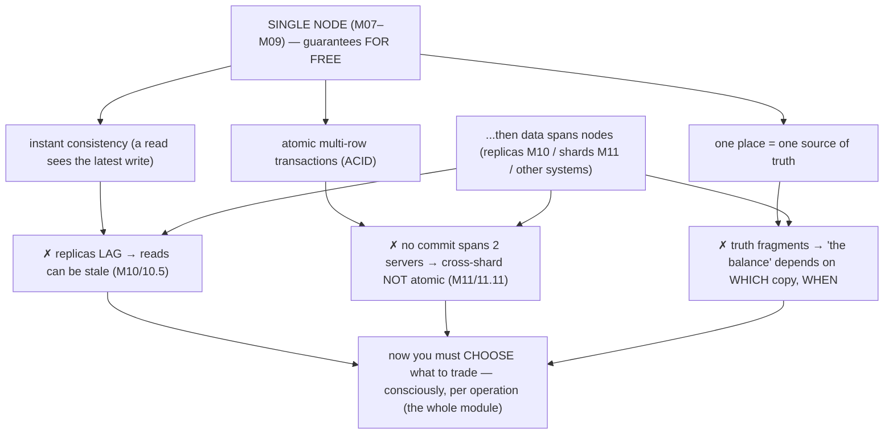
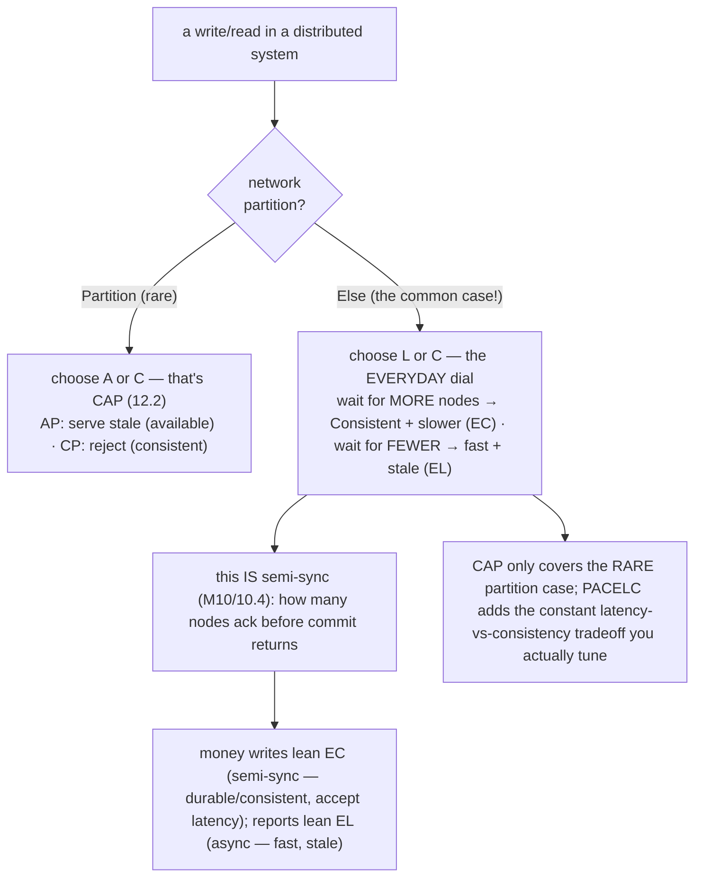
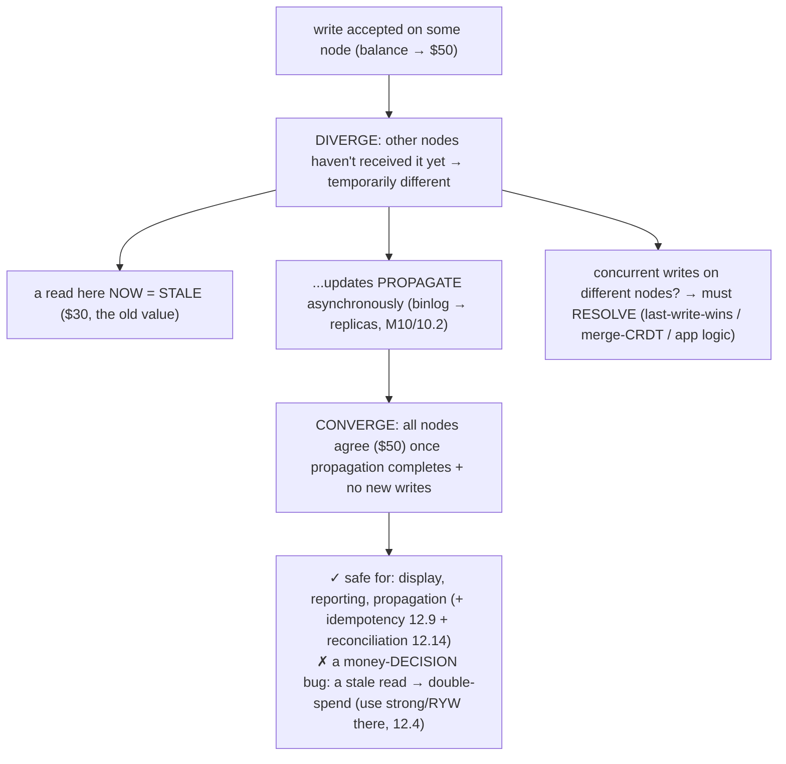

# M12 · Pass C — Diagrams & Worked Examples · Concepts 12.1–12.5

> **Pass C scope:** content-contract items **#12 Diagram(s)** and **#8 Worked example** (narrated, no code in prose). Pairs with `01-cap-pacelc-consistency.md`. Concepts 12.2/12.4 use **★ bespoke custom SVGs** (in `assets/`, render-validated); 12.1/12.3/12.5 use Mermaid. Domain: payments/wallet, the ledger. The recurring question: *is this operation strong-enough, idempotent, and reconciled — so money is never lost or duplicated across the distribution?*

---

## 12.1 · Why distributed data is hard (the shift)

**Diagram — what single-node gave vs what distribution takes away:**

**Worked example — the payments platform after M10 + M11: where its guarantees broke.**
Trace the platform's journey and where each single-node guarantee fell away. **On one server** (M07–M09), everything was free: a balance read always saw the latest committed value (instant consistency); a transfer's debit + credit were atomic (ACID); there was *one* database holding *the* truth. Then the platform **added read-replicas** (M10) to scale reads — and instant consistency broke: a replica *lags* (10.5), so a balance read off a replica reflects a *past* state (fine for a report, a **double-spend bug** for an authorization, 12.4). Then it **sharded** (M11) to scale writes — and cross-node atomicity broke: a transfer between accounts on *different* shards has *no* atomic commit (11.11 — a crash between legs loses money). Then it **integrated** other systems (a search index, fraud detection, a warehouse via CDC) — and the single source of truth fragmented: "what is the balance?" now depends on which copy you ask (primary? replica? warehouse?) and when. The diagram's point: *every* convenience the single node provided became a *decision* once data went multi-node — how stale a read may be (12.4), how to make a cross-node operation safe (12.6/12.8), how to keep systems agreeing (12.10/12.11/12.12), and how to *verify* it all (12.14). This module is the framework (CAP/PACELC, the consistency spectrum) and the patterns (Saga, idempotency, outbox, CDC, reconciliation) for making those decisions *deliberately* — because applying single-node intuitions to distributed money is how systems silently lose or duplicate it. The discipline (from M11/11.15): distribute only what must be, keep money operations single-node/single-shard where possible (M11/11.9), and handle the genuinely-distributed parts with the right patterns.

---

## 12.2 · CAP theorem ★

**★ Diagram (custom SVG):**

![CAP under a network partition that splits the cluster so the two sides can't communicate. A write arrives on side 1 (balance becomes $50); a read arrives on side 2, which hasn't seen the write. The CP choice: side 2 rejects or waits because it can't confirm the latest state — consistency preserved, availability sacrificed; for a balance-for-authorization, choose CP (reject rather than authorize against stale data and risk overdraft/double-spend; group replication's minority side, fencing). The AP choice: side 2 answers with its stale data — availability preserved, consistency sacrificed; for displaying recent activity, choose AP (better slightly-stale than an error; async replica read). P isn't optional because partitions will happen, so the real choice is C-vs-A when partitioned, made per operation.](assets/12.2-cap.svg)

**Worked example — a partition splits the payments cluster: does a balance read fail (CP) or return stale (AP)?**
A network partition splits the payments cluster into two sides that can't communicate — an inevitable event (CAP's "P" isn't optional). A write lands on side 1 (a transfer makes a balance $50); a read for that same account lands on side 2, which hasn't received the write. The system is in CAP's bind, and — crucially — the *right* answer differs by *operation* (the SVG's two rows). For a **balance-for-authorization** (the user is trying to spend, and the system must decide if they have funds): choose **CP** — side 2 should **reject** (or wait) rather than answer, because authorizing against a *stale* balance risks an **overdraft or double-spend** (it might approve a payment the up-to-date balance can't cover). Better to be *unavailable* for that operation during the partition than to be *wrong* (lose money). This is *why* a payments cluster uses **group replication / quorum + fencing** (M10/10.11) for money-critical writes — the partitioned minority becomes unavailable (refuses) rather than diverging (which would fork the ledger, the catastrophe). For a **display of recent activity** (the user just wants to see their transaction list): choose **AP** — side 2 should **answer with its slightly-stale data** rather than erroring, because staleness here is *harmless* (a few seconds out of date is fine) and an error is worse UX. This is an **async-replica read** (M10/10.5). The example shows CAP's true lesson (the SVG's footer): **you can't have both consistency and availability during a partition, so you choose per operation by cost-of-being-wrong** — CP (reject) where being stale loses money, AP (serve stale) where it doesn't. The famous "pick two of CAP" is misleading: P is forced (partitions happen), so the real, per-operation choice is **C vs A when partitioned**.

---

## 12.3 · PACELC: the fuller picture

**Diagram — if-Partition (C/A) else (L/C), the everyday dial:**

**Worked example — semi-sync as the PACELC "else" knob.**
CAP describes only the *rare* partition case; PACELC adds the *common* one — and the platform spends ~all its time in the "else" branch, where the tradeoff is **latency vs consistency**. The concrete realization is exactly the **semi-sync dial** from M10/10.4: when a transfer commits, *how many nodes must acknowledge before COMMIT returns?* **Wait for more** (semi-sync — a replica must confirm it received the transfer): the transfer is durable/consistent *beyond one node* (a subsequent read on a replica will see it; it survives node loss, M10/9.16) — but each commit pays the **latency** of that round-trip (the "EC" — else-consistent — choice). **Wait for fewer** (async — return as soon as the local commit is durable): commits are **fast**, but replicas lag (a read elsewhere may be stale) — the "EL" (else-latency) choice. PACELC's contribution is making this everyday knob *explicit and central*: choosing async vs semi-sync vs group replication *is* choosing the platform's PACELC class, and you make that choice *constantly* (per write/operation), not just during partitions. For our domain (the diagram's bottom): **money-critical commits lean EC** — a transfer uses **semi-sync** (pay the latency to guarantee it's durable/consistent beyond one node — never lose a confirmed transfer to a node failure, M10/10.4); **non-critical reads lean EL** — reports and display read **async replicas** (fast, stale-tolerant). The per-operation split (12.15) is precisely choosing EL vs EC per operation. PACELC is the framework that turns M10's sync-mode setting into a *principled* per-operation decision — and it corrects the common over-focus on CAP's rare partition case by elevating the latency-vs-consistency tradeoff you actually tune every day.

---

## 12.4 · The consistency spectrum ★

**★ Diagram (custom SVG):**

![The consistency spectrum as a ladder from strongest/costliest to weakest/cheapest. Linearizable/strong: acts like one copy, every read sees the latest write in real-time order — for money, the balance-for-authorization (read primary), where any staleness means a double-spend. Causal/sequential: cause-to-effect order preserved, unrelated operations may differ across nodes — cheaper than strong, stronger than eventual. Read-your-writes/monotonic (session): you always see your own writes and never go backward in time — for money, your own transaction history after paying (GTID-wait). Eventual: replicas converge someday with no recency or order guarantee meanwhile — for money, reports and display (async replica), where staleness is harmless. Stronger means more coordination, more latency, less availability; the skill is the weakest-correct level per operation, and for money eventual is safe only with idempotency and reconciliation.](assets/12.4-consistency-ladder.svg)

**Worked example — which level each payments read needs.**
Consistency isn't binary — it's the ladder in the SVG, and the skill is matching each operation to the *weakest level that's still correct* (which directly determines where you read in MySQL, M10). Three payments reads, three levels: **(1) A balance driving an authorization decision** — "does this account have $100 to spend?" — needs **linearizable/strong** (top of the ladder): the decision is *irreversible* (approve the payment) and any staleness → authorizing against an out-of-date balance → **overdraft or double-spend** → money lost. So this read goes to the **primary** (which has the latest committed state), *never* an async replica. Strong consistency, paid for, because being wrong here loses money. **(2) A user viewing their *own* transaction history right after making a payment** — needs **read-your-writes** (M10/10.6, middle of the ladder): they *must* see the payment they just made (or they panic and pay again — the double-charge UX bug, M10/10.6), but slight staleness of *other* data is fine. Achieved by routing their post-write reads to the primary or a **GTID-caught-up replica** (`WAIT_FOR_EXECUTED_GTID_SET`, M10/10.6). A *session* guarantee — about *their* view, cheaper than full strong consistency. **(3) A public dashboard or analytics report** — "total transaction volume today" — tolerates **eventual** (bottom of the ladder): a few seconds stale is harmless, so it reads **async replicas / the warehouse** (M10/10.5, M02/2.17 — fast, offloads the primary). The SVG's lesson: stronger = more coordination = more latency + less availability, so you use the *cheapest sufficient* level per operation (12.15) — **strong where money moves, read-your-writes for users' own data, eventual for reporting** — and for money, eventual is only ever used *with* idempotency (12.9) and reconciliation (12.14) as guardrails. In MySQL you *compose* the level from read-routing (primary / GTID-wait / async replica) + sync-mode (M10/10.4) — there's no single "consistency level" knob; the spectrum is the framework for those routing decisions.

---

## 12.5 · Eventual consistency & convergence

**Diagram — diverge → propagate → converge (+ conflict resolution):**

**Worked example — a balance eventually-consistent across replicas: fine for display, a bug for a decision.**
A transfer makes an account's balance $50 on the primary. Under **eventual consistency** (async replication, M10/10.5), the replicas don't have it *yet* — they still show $30 (the old value) — they've **diverged** temporarily. As the binlog propagates (M10/10.2), the replicas apply the change and **converge** to $50; once propagation completes and no new writes arrive, all copies agree. The skill is knowing *where this staleness is safe* (the diagram's note). **Safe — display:** the user's dashboard reads a replica and shows $30 for a moment, then $50 — slightly stale, but *harmless* (nobody loses money because a balance displayed a few seconds late). Also safe — **reporting** (M02/2.17, staleness irrelevant) and **propagation** (CDC to fraud/search/warehouse — eventually consistent by design, made safe by idempotency 12.9 + reconciliation 12.14). **Unsafe — a money decision:** if an **authorization** reads that stale $30 balance (when the real balance is $50, or worse, when the real balance is $30 but a *concurrent* spend already used it), it can make a *wrong, irreversible* decision → **double-spend / overdraft / lost money**. So a money-decision read *never* uses an eventually-consistent replica — it reads the **primary** (strong, 12.4). Note MySQL's eventual consistency is the *easy* kind: single-primary replication means there's *one writer*, so there are *no concurrent-write conflicts* to resolve — convergence is just "replicas catch up" (no last-write-wins data loss). Only *multi-primary* group replication has conflicts, and it handles them by **certification** (a conflicting concurrent transaction is *rolled back*, not silently merged — optimistic detection). The deep principle (the diagram's note): **convergence guarantees copies *agree*, not that they're *correct*** — so eventual consistency for money is always paired with **idempotency** (12.9 — duplicates during convergence don't double-apply) and **reconciliation** (12.14 — detect/repair any non-convergence or lost write), and *never* trusted for an irreversible decision. Eventual consistency is the read-scaling workhorse (used everywhere staleness is tolerable) — guarded everywhere it isn't.

---

*Diagrams + worked examples for 12.1–12.5 complete (2 ★ custom SVGs + 3 Mermaid). Next Pass C file: 12.6–12.10 (★ 2PC, Saga, idempotency, dual-write SVGs + Mermaid for XA).*
