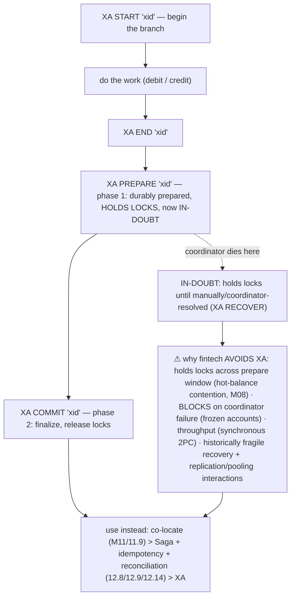

# M12 · Pass C — Diagrams & Worked Examples · Concepts 12.6–12.10

> **Pass C scope:** content-contract items **#12 Diagram(s)** and **#8 Worked example** (narrated, no code in prose). Pairs with `02-2pc-saga-idempotency-dualwrite.md`. Concepts 12.6/12.8/12.9/12.10 use **★ bespoke custom SVGs** (in `assets/`, render-validated); 12.7 uses Mermaid. Domain: payments/wallet, the ledger. The recurring question: *is this operation strong-enough, idempotent, and reconciled — so money is never lost or duplicated?*

---

## 12.6 · Distributed transactions & 2PC ★

**★ Diagram (custom SVG):**

![Two-phase commit driven by a coordinator across two shards (debit A on shard 1, credit B on shard 2). Phase 1 (prepare/vote): the coordinator asks both shards to prepare; each does the work, holds its locks, and votes yes. Phase 2: all voted yes, so the coordinator tells both to commit — atomic across nodes. The killer: if the coordinator crashes after the shards prepared but before sending the decision, both shards are in-doubt — they voted yes so they can't abort, but never heard commit or abort so they can't proceed, leaving them blocked and holding locks on the account balances indefinitely. Blocking on coordinator failure is 2PC's fundamental weakness; for money use a Saga and avoid XA. MySQL's robust 2PC is the internal binlog-redo one.](assets/12.6-2pc.svg)

**Worked example — a cross-shard transfer via 2PC: the coordinator crashes, both shards stuck in-doubt.**
A transfer must move $100 from account A (shard 1) to account B (shard 2) — a cross-shard operation with no native atomic commit (M11/11.11). Try 2PC (the SVG). **Phase 1 (prepare):** a coordinator asks shard 1 "prepare to debit A $100?" and shard 2 "prepare to credit B $100?" Each shard *does the work* (applies the change to a prepared state), *holds the locks* on the balances (M08), writes a durable "prepared" record, and votes **yes**. **Phase 2 (commit):** both voted yes, so the coordinator should tell both "commit" — and if it does, the transfer is atomic across the two shards (the 2PC promise). **But the killer:** suppose the **coordinator crashes** *right after* both shards prepared (voted yes) but *before* it sends the commit decision. Now both shards are **in-doubt**: they *voted yes* (so they've promised to commit and *can't* unilaterally abort), but they *never heard* commit-or-abort (so they *can't* finalize) — they're **stuck, holding locks on A's and B's balances** (M08), indefinitely, until the coordinator recovers and tells them the outcome. Those two accounts are now *frozen* — every other transaction touching A or B blocks behind the held locks. For a payments system, freezing account balances on a coordinator crash is intolerable (a single coordinator failure can cascade into many frozen accounts and timeouts). This **blocking on coordinator failure** is 2PC's fundamental, unavoidable weakness (it's not partition-tolerant; the coordinator is a single point of failure that can freeze resources). The SVG's conclusion: 2PC is *correct* (atomic) but *fragile and slow* (lock-holding + coordinator-blocking) — so for money, the **fintech preference is: avoid (co-locate, M11/11.9) > Saga (12.8) > 2PC**, and MySQL's *robust* 2PC is the *internal* binlog-redo one (M09/9.11 — a local 2PC across two logs on one node, invisible and reliable), not application-level cross-node 2PC (XA, 12.7).

---

## 12.7 · XA in MySQL (and why it's avoided)

**Diagram — XA states + the avoidance reasons:**

**Worked example — why a payments platform doesn't use XA for cross-shard transfers.**
XA is MySQL's implementation of 2PC (12.6) as SQL (`XA START … XA PREPARE … XA COMMIT`), and in *principle* it could make a cross-shard transfer atomic — but a payments platform **deliberately doesn't use it**, for the reasons the diagram lists. **Lock-holding:** between `XA PREPARE` and `XA COMMIT`, the transaction **holds all its locks** — for a transfer, that means locks on the *account balances* (M08), held across the network round-trip to the coordinator and back. Account balances are *hot rows* (M08/M11 — many transactions touch popular accounts), so holding their locks across a distributed round-trip causes **severe contention** (everything touching those accounts blocks). **In-doubt blocking:** if the coordinator dies after `XA PREPARE` (the SVG's dashed path), the prepared transaction is **stuck in-doubt** — holding those balance locks — until someone resolves it (`XA RECOVER` to list in-doubt branches, then manual `XA COMMIT/ROLLBACK`, or coordinator recovery). **Frozen account balances**, possibly for a long time — exactly what a money system can't tolerate. **Throughput:** synchronous two-phase commit per transfer (two round-trips) caps throughput far below single-shard transfers. **Operational fragility:** XA has historically had recovery and replication-interaction bugs (in-doubt transactions not surviving restart cleanly, prepared state not replicating correctly), and it interacts awkwardly with connection pooling (the prepared state is tied to a connection). Add it up: XA gives strict atomicity but at a cost (contention, frozen accounts on coordinator failure, low throughput, fragility) that's *worse than the disease* for most money flows. So the platform uses the diagram's preference order instead: **co-locate** transfers (M11/11.9 — single-shard ACID, no XA needed) for the vast majority, and a **Saga + idempotency + reconciliation** (12.8/12.9/12.14) for the genuinely cross-shard minority — *never* application-level XA. The staff-level understanding is knowing *both* that XA exists and is theoretically correct *and* precisely why it's avoided in practice — and that MySQL's *valuable* 2PC is the internal binlog-redo consistency (M09/9.11), not application XA.

---

## 12.8 · The Saga pattern ★

**★ Diagram (custom SVG):**

![The Saga pattern. Forward steps, each a normal single-node ACID transaction with no distributed locks: T1 on shard A debits the source, T2 on shard B credits the destination; if all succeed, the Saga is complete. On failure: if T2 fails (the credit couldn't apply), run compensations in reverse — C1 compensates T1 by re-crediting the source (a semantic undo, a new transaction, not a rollback). Versus 2PC: no distributed locks (each step is local and fast), non-blocking (no coordinator freeze), but eventually consistent (an in-flight window) and compensations must be correct and idempotent. Orchestration (a central driver runs steps and compensations — clearer, monitorable, preferred for money) versus choreography (each step emits an event triggering the next — decoupled but implicit and harder to debug). Plus idempotency keys, durable Saga state via the outbox so a crashed Saga resumes, and reconciliation as backstop.](assets/12.8-saga.svg)

**Worked example — a cross-shard transfer as a Saga: debit → credit → (on failure) compensate.**
The cross-shard transfer that 2PC handled badly (12.6) is handled well by a **Saga** (the SVG) — the usual fintech choice. Instead of one distributed transaction, the transfer becomes a *sequence of local transactions* with compensations. **Forward path:** **T1** on shard 1 — a normal single-node ACID transaction (M07–M09) that debits the source (in practice: debit source, credit shard-1's clearing account, M11/11.9), commits *immediately* (no distributed locks held, fast). Then **T2** on shard 2 — another local ACID transaction that credits the destination (debit shard-2's clearing account, credit destination), commits. If both succeed, the Saga is **complete** — the money moved, via two fast local transactions, *no* distributed locks, *no* coordinator-blocking. **Failure path:** suppose **T2 fails** (the destination account is frozen, or shard 2 is briefly unavailable). The money is now in limbo — debited from the source (T1 committed) but not credited (T2 failed). The Saga *compensates*: run **C1**, a *new* local transaction on shard 1 that **re-credits the source** — semantically undoing T1 (you can't "un-commit" T1; you issue a compensating transaction that reverses its effect). Now the system is as if the transfer never happened. The SVG's tradeoffs vs 2PC: ✓ no distributed locks (each step local + fast), ✓ non-blocking (no coordinator freeze — a step failure just triggers compensation, it doesn't freeze accounts); ✗ **eventually consistent** (there's an *in-flight window* where the money is "in transit" — debited but not yet credited — visible until the Saga completes or compensates), ✗ **compensations must be correct and idempotent** (what does "undo a credit" mean if the money was already spent? — domain logic, harder than a rollback). The critical supporting details (SVG footer): **each step is idempotent** (12.9 — a Saga retries transient failures, so steps must be safely repeatable, keyed); **Saga state is durable** (persisted, often via the **outbox**, 12.11, in each step's transaction) so a *crashed* Saga **resumes** rather than getting stuck mid-flight (a stuck Saga is an M15 failure mode); and **reconciliation** (12.14) is the backstop catching any Saga that silently half-completed. For money, **orchestration** (a central orchestrator drives steps/compensations — clear, monitorable, ensures compensations run) is preferred over choreography. This is the concrete realization of M11/11.11's "use a Saga for cross-shard transfers" — non-blocking, scalable, and (with idempotency + reconciliation) money-safe.

---

## 12.9 · Idempotency: the load-bearing primitive ★

**★ Diagram (custom SVG):**

![Idempotency. A client pays $100 with idempotency key K7 and, on a timeout, retries with the same key. First request (K7 is new): in one atomic transaction, debit plus credit plus ledger-entry plus INSERT key K7 (unique) — apply once, record key-to-result, return the result; money moves once. The key and effect are atomic so a crash between them can't double-apply. Retry (the same K7 arrives again): the INSERT of K7 fails the unique constraint, recognized as already-processed, so do not re-apply — return the recorded result; no double-charge; the database enforces dedup atomically via the unique index. The principle: you can't prevent duplicate delivery, so make duplicate processing harmless — at-least-once delivery (never lost) plus idempotent processing (duplicates no-op) equals exactly-once effect. It's the primitive under Sagas, CDC consumers, and payment APIs; non-negotiable for money.](assets/12.9-idempotency.svg)

**Worked example — a payment request retried after a timeout: charged once, not twice.**
A user taps "Pay $100." The request reaches the server, the server processes it — but the *response* is lost to a network timeout, so the **client doesn't know if it succeeded**. The client retries. Without idempotency, this retry **double-charges** ($200 leaves the account for one $100 payment) — *the* classic distributed money bug. **Idempotency fixes it** (the SVG). The client generates a unique **idempotency key** (`K7`) for this *logical payment* and attaches it to *both* the original request and the retry (the same key, not a new one per attempt). **First request (K7 new):** the server processes the payment in **one atomic transaction** (M07) — debit, credit, ledger entry, *and* `INSERT` the idempotency key K7 (with a **unique constraint**, M03/M05) — all committing together. Money moves *once*; "K7 → result R" is recorded. The atomicity is critical: because the key-insert and the effect are in the *same* transaction, a crash between them *can't* leave the effect applied without the key recorded (which would let a retry double-apply). **Retry (same K7):** the server tries to `INSERT` K7 again → the **unique constraint fails** → the database *atomically* signals "already processed." The server **does not re-apply** the payment — it returns the *recorded* result R. **The user is charged exactly once**, no matter how many times the request is delivered. The SVG's principle (the load-bearing insight of the whole module): **you cannot prevent duplicate *delivery* in a distributed system (the lost-ack problem is unavoidable), so you make duplicate *processing* harmless** — combine **at-least-once delivery** (never lose the request) with **idempotent processing** (duplicates are no-ops) to get **exactly-once *effect*** (the money moves once). This is *the* primitive that makes everything else safe: Sagas (12.8 — steps are idempotent so they're safely retryable), CDC/outbox consumers (12.12/12.13 — events processed idempotently), and payment APIs (Stripe/PayPal idempotency keys). For money it's **non-negotiable** — every retryable state-changing operation carries an idempotency key. If you learn one pattern from this module, it's this.

---

## 12.10 · The dual-write problem ★

**★ Diagram (custom SVG):**

![The dual-write problem. The naive sequence: (1) commit the transfer to the DB (durable, InnoDB), then a crash, then (2) publish to Kafka never happens. Result: inconsistent — the DB has the transfer but nobody downstream knows, so notifications are never sent, the fraud check never runs, reporting/settlement never sees it, and reconciliation drifts; it's silent (the DB looks correct) and intermittent (only on a crash at the wrong moment), the worst kind of bug. Reversing the order doesn't help: publish first, then crash, then the DB rolls back, and downstream acts on a phantom transfer — no order of two non-transactional writes is safe. The fix: the outbox (write the event into the same DB transaction) or CDC (derive the event from the binlog) — one atomic write, the event can't be lost. The principle: don't have two sources of truth that can disagree; one atomic write, derive everything else from it. Don't reach for XA here.](assets/12.10-dual-write.svg)

**Worked example — "save the transfer, then publish to Kafka" — the publish fails after commit.**
This is the most practically-important — and most under-taught — distributed-data trap, and it *looks* obviously correct. The natural code: **(1)** commit the transfer to the database (InnoDB, durable, M07–M09); **(2)** publish a "TransferCompleted" event to Kafka so downstream systems react (notifications, fraud, reporting, settlement). It works 99.9% of the time — until a **crash** hits the window *between* the two writes (the SVG). If the process crashes *after* the DB commit but *before* the Kafka publish: the transfer is **durably in the database**, but the event was **never published** → downstream systems **never learn the transfer happened** → the confirmation email never sends, the fraud check never runs, the settlement never fires, and reconciliation (12.14) later finds a discrepancy. The insidious part: the **database looks perfectly correct** (the transfer is there), so the inconsistency is *silent* (it's a disagreement with *another* system), and it's *intermittent* (only manifests on a crash at exactly the wrong moment) — the worst kind of bug to diagnose. And **reversing the order doesn't help** (the SVG's middle): if you publish to Kafka *first* and then crash before the DB commits (which rolls back), downstream acts on a **phantom** transfer that never happened. **There is no safe ordering of two non-transactional writes** — whichever you do first, a crash after it and before the second leaves the two systems inconsistent. The root cause: *you cannot atomically write to two systems that don't share a transaction*. The fix (the SVG's right, detailed in 12.11/12.12): **don't dual-write** — either write the event into the **same DB transaction** as the transfer (the **outbox pattern**, 12.11 — so the event commits atomically with the state change and can't be lost), or **derive** the event from the database's change log (**CDC**, 12.12 — the committed change *is* the event). Both make it *one atomic write*. And critically — *don't* reach for XA here (12.7) to make the DB + Kafka atomic; XA's problems (blocking, lock-holding) make it the wrong fix; the outbox is the right one. The deep principle (the SVG's footer, recurring through M01/1.17, M09, 12.11, 12.12): **don't have two sources of truth that can disagree — have one atomic write, and derive everything else from it.** Recognizing the dual-write trap (and reaching for the outbox/CDC instead) is the difference between an event-driven system that reliably propagates money events and one that silently drops them under load and failure.

---

*Diagrams + worked examples for 12.6–12.10 complete (4 ★ custom SVGs + 1 Mermaid). Next Pass C file: 12.11–12.16 (★ outbox, CDC, distributed-capstone SVGs + Mermaid for exactly-once, reconciliation, decision).*
