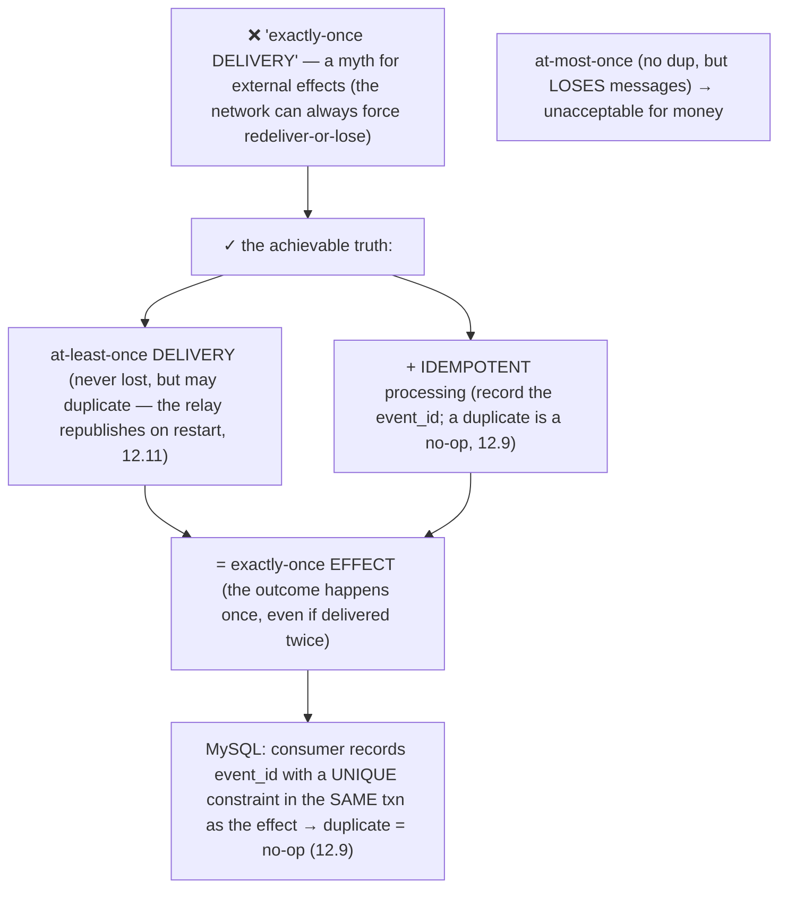
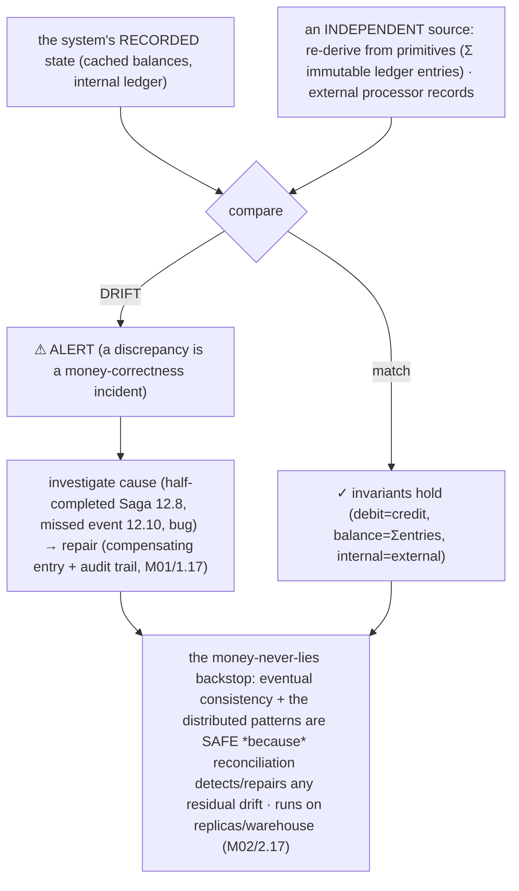
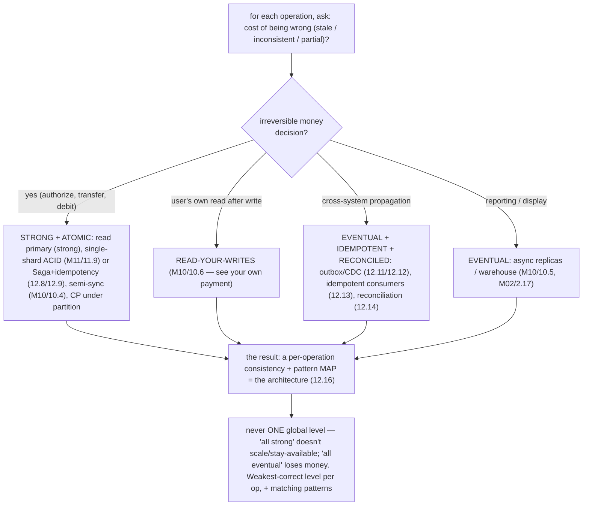

# M12 · Pass C — Diagrams & Worked Examples · Concepts 12.11–12.16

> **Pass C scope:** content-contract items **#12 Diagram(s)** and **#8 Worked example** (narrated, no code in prose). Pairs with `03-outbox-cdc-reconciliation-capstone.md`. Concepts 12.11/12.12/12.16 use **★ bespoke custom SVGs** (in `assets/`, render-validated); 12.13/12.14/12.15 use Mermaid. Domain: payments/wallet, the ledger. The recurring question: *is this operation strong-enough, idempotent, and reconciled — so money is never lost or duplicated across the distribution?*

---

## 12.11 · The outbox pattern ★

**★ Diagram (custom SVG):**

![The outbox pattern. One InnoDB transaction (atomic, M07) writes the transfer (debit A, credit B), the ledger entries, and an outbox row ("TransferCompleted" with payload and event_id) — and COMMITs, so state and event commit together. A separate relay reads the outbox (by polling, or better via CDC on the binlog) and publishes to Kafka, which fans out to consumers. Because the event is in the same atomic commit as the state change: it can't be lost (if the transfer committed, the outbox row committed too) and can't be a phantom (if the transaction rolled back, neither exists). The relay is at-least-once (may republish on restart), so consumers must be idempotent for exactly-once effect. Principle: one atomic write is the source of truth; the event is reliably derived from it — no XA, no dual-write.](assets/12.11-outbox.svg)

**Worked example — the transfer and its event committed atomically, then published.**
The dual-write problem (12.10) — a crash losing the "TransferCompleted" event — is solved by the **outbox pattern** (the SVG). Instead of "commit the transfer, *then* publish to Kafka" (two non-atomic writes), you make the event **part of the transfer's transaction**. **In one atomic InnoDB transaction** (M07–M09): debit A, credit B, `INSERT` the ledger entries, *and* `INSERT` a row into the **`outbox` table** describing the event ("TransferCompleted", the payload, a unique `event_id`) — then `COMMIT`. Now the transfer rows *and* the outbox row are part of *one atomic commit* — they **cannot diverge** (if the transfer committed, the event committed *with* it; if the transaction rolled back, *neither* exists). **Then a separate relay** reads unpublished outbox rows and publishes them to Kafka (the SVG: either *polling* the outbox table, or — better — **CDC** on the binlog, 12.12, capturing outbox inserts with low latency and no polling load), marking them published. Kafka fans the event out to consumers (fraud, notifications, search, the warehouse). The guarantees (the SVG's green box): the event **can't be lost** (it's in the same atomic commit as the transfer — the exact failure the dual-write had) and **can't be a phantom** (rolled-back transactions have no outbox row). The relay is **at-least-once** (if it crashes after publishing but before marking the row sent, it republishes on restart → a possible *duplicate*), so **consumers must be idempotent** (12.9/12.13 — the duplicate is a no-op) → **exactly-once effect**. The outbox guarantees the event is *never lost*; idempotent consumers guarantee it's *never double-applied*. For our domain: every state change that downstream cares about (a "TransferCompleted", "PaymentAuthorized", "TransferReversed") is written to the **outbox in the same single-shard transaction** as the change (M11/11.9) — so a committed transfer *always* reliably produces its event (settlements, notifications, fraud checks, reconciliation never silently miss a transfer). The deep principle (recurring through M01/1.17, M09, 12.10, 12.12): **one atomic write is the source of truth; the event is reliably *derived* from it** — never two independent writes that can disagree, and never XA. The outbox is the backbone of the platform's reliable event propagation (M16).

---

## 12.12 · Change Data Capture (CDC) ★

**★ Diagram (custom SVG):**

![Change Data Capture. A MySQL shard's committed changes go to its binary log (ROW format). Debezium connects as a replica, streams the binlog, parses it into structured change events, and tracks its GTID so it resumes exactly (no loss or skip). It publishes to Kafka (one topic per table, in commit order), which fans out to consumers: fraud detection (real-time), the search index, the reporting warehouse, and the outbox relay. Reusing the existing replication log — already a reliable, ordered, durable record of every change — gives: no dual-writes (the committed change is the event), reliable and ordered and resumable (binlog/GTID), low-latency, decoupled (producers unaware of consumers), and non-intrusive (reads the binlog, no primary load). It needs binlog_format=ROW and sync_binlog=1, and consumers idempotent for exactly-once effect. Principle: the log is primary — replicas, backups/PITR, search, cache, analytics, and services are all derived consumers; one binlog, many uses (also powers resharding VReplication).](assets/12.12-cdc.svg)

**Worked example — the ledger's binlog streamed via CDC to fraud, search, and the warehouse.**
The platform needs the ledger's changes to reach many other systems — fraud detection (inspect each transaction in real-time), a search index (find transactions/accounts), the reporting warehouse (M02/2.17 — analytics in sync without loading the primary) — and doing this with dual-writes (12.10) would silently drop events. **CDC** solves it by reusing the database's *own change log* (the SVG). A **Debezium** connector connects to a ledger shard **as a replica** (M10) and **streams its binary log** — which is already a reliable, ordered, durable record of *every committed change* (the same log replicas consume, M10/10.2). Debezium requires **ROW format** (M10/10.3 — so it gets exact before/after row images, not ambiguous statements) and parses each committed change into a structured **change event** ("ledger_entry inserted: {…}"), publishing to **Kafka** (one topic per table, in commit order). Crucially, Debezium **tracks its binlog position via GTIDs** (M10/10.7), so after a restart it **resumes exactly where it left off** — *no change is lost or skipped* (reliability the dual-write couldn't offer). Consumers subscribe: **fraud detection** inspects each transaction as it streams; the **search indexer** updates Elasticsearch; the **warehouse loader** keeps analytics in sync (M02/2.17, offloading the primary); the **outbox relay** (12.11) publishes semantic events. The SVG's properties: **no dual-writes** (the committed change *is* the event — captured *because* it committed, so nothing is lost or phantom), **reliable + ordered + resumable** (binlog/GTID), **low-latency** (streams as changes commit), **decoupled** (the ledger just commits; producers don't know their consumers), **non-intrusive** (reads the binlog, doesn't query or load the primary). It needs `sync_binlog=1` (M09/9.10 — durable binlog) and **idempotent consumers** (12.13 — for exactly-once effect on the at-least-once stream). Each **shard** has its own binlog, so CDC runs per-shard (M11). The deep principle (the module's recurring theme): **the log is primary — and replicas (M10), backups/PITR (M13), search indexes, caches, analytics, downstream services, *and* CDC consumers are all *derived* consumers of that one ordered log** ("turning the database inside-out"). One binlog, many uses (it also powers resharding via VReplication, M11/11.14, and PITR, M13). For our domain, CDC is the **integration backbone** — reliably propagating the ledger's truth to the entire platform without dual-writes (M16).

---

## 12.13 · Idempotent consumers & exactly-once (the truth)

**Diagram — at-least-once + idempotent consumer = exactly-once effect:**

**Worked example — a CDC consumer that sees a "credit" event twice → idempotency makes the second a no-op.**
A CDC/outbox consumer (12.11/12.12) — say, a service that applies a "credit account" event or updates a denormalized balance read-model (M02/2.17) — *will* sometimes see the **same event twice**. Why? The pipeline guarantees **at-least-once delivery** (never lose an event — the relay republishes on restart, the consumer reprocesses on a rebalance), and "never lose" inherently means "may duplicate" (a lost *acknowledgment* causes redelivery). And "exactly-once *delivery*" — the thing teams wish for — is a **myth** for external effects (the diagram's top): the network can *always* force a choice between redeliver-maybe-twice (at-least-once) or don't-redeliver-maybe-zero (at-most-once), and at-most-once *loses* messages (unacceptable for money). So duplicates are *inevitable*; the fix is to make duplicate *processing* harmless — **idempotent consumers** (12.9 again, in the consumer role). The consumer records each processed event's **unique `event_id`** in a table with a **unique constraint**, *in the same transaction* as the effect (M07): the *first* time it sees the "credit $100" event, it applies the credit and records the event_id; the *second* time the *same* event arrives, the event_id `INSERT` **fails the unique constraint** → the consumer recognizes the duplicate and **skips re-applying** → the account is credited **once**, not twice (no double-credit). The combination — **at-least-once delivery (never lost) + idempotent processing (duplicates no-op)** — yields **exactly-once *effect*** (the diagram's center), which is what you actually wanted all along. The lesson (correcting a pervasive misconception): **don't chase exactly-once delivery (impossible for external effects); engineer for at-least-once delivery + idempotent consumers.** This is *the same primitive* as 12.9 (idempotency), now protecting the entire CDC/outbox propagation layer — every consumer (fraud, notifications, the warehouse, the balance read-model) is idempotent, so the at-least-once pipeline never double-applies a money-relevant event.

---

## 12.14 · Reconciliation as the distributed backstop

**Diagram — independent re-derivation → compare → alert/repair:**

**Worked example — a daily job catching a Saga that silently half-completed.**
No distributed system is perfectly consistent — Sagas can half-complete (12.8), events can be missed (12.10), bugs happen — so for money you need a backstop that *detects* any inconsistency: **reconciliation** (the diagram, building on M02/2.17). It runs as a periodic **independent verification**: **re-derive the truth from a separate source** — sum the **immutable ledger entries** (M01/1.17 — append-only, the independent source) to re-derive each account's balance, and import the **external payment processor's settlement records** — then **compare** against the system's *recorded* values (the cached balances, the internal totals). **On a match:** confidence (the money-never-lies invariants hold — debit=credit, balance=Σentries, internal=external). **On a mismatch (drift):** *alert* (a money discrepancy is an incident) and *repair*. Concretely: suppose a **cross-shard Saga** (12.8) **silently half-completed** — T1 debited the source ($100 left account A), but T2's credit was lost (a bug, an unhandled failure, the Saga state corrupted so it never compensated *or* completed). The system's recorded state now violates an invariant: account A's balance is $100 lower, but no corresponding credit exists → **balance ≠ Σ(ledger entries)** for the affected accounts, *or* internal totals ≠ external records. The **daily reconciliation job re-derives balances from the immutable ledger, finds the drift, alerts**, and the discrepancy is investigated (traced to the half-completed Saga) and **repaired** (a compensating entry restores correctness, with an **audit trail**, M01/1.17). The diagram's deep point (the culmination of the money-never-lies thread): **eventual consistency and the distributed patterns are *acceptable* for money precisely *because* reconciliation is the independent check that catches any residual inconsistency** before it becomes unrecoverable loss. Reconciliation relies on having an **independent source of truth** (the immutable ledger to re-derive from, the external processor's records) and on the system being designed so its invariants are *checkable* (the balance is *derived* from entries, so it's verifiable — M02/2.17). It runs on **replicas/the warehouse** (offloading the primary, fed by CDC, 12.12) so it doesn't load the transactional shards. Reconciliation is the **last line of defense** behind every distributed pattern in the module — and the concrete, final answer to "did money get lost or duplicated?": *reconciliation would catch it.*

---

## 12.15 · Choosing consistency per operation (the decision)

**Diagram — per-operation: strong/atomic vs eventual/idempotent/reconciled:**

**Worked example — mapping each payments operation to its consistency + pattern.**
The synthesis of the whole module: *don't pick one consistency level for the system — pick per operation by cost-of-being-wrong* (the diagram). Walk the platform's operations: **Authorize a payment / commit a transfer** (irreversible, money-moving) → **strong + atomic**: read the balance from the **primary** (strong, 12.4 — never authorize against a stale balance), commit as **single-shard ACID** where co-located (M11/11.9) or a **Saga + idempotency** for cross-shard (12.8/12.9), with **semi-sync** durability (M10/10.4) and **CP** behavior under partition (12.2 — reject rather than authorize wrongly). This path is *bulletproof* — being wrong loses money. **A user viewing their own balance/history right after paying** → **read-your-writes** (M10/10.6 — they must see their own payment; route their post-write reads to the primary or a GTID-caught-up replica). **Propagating the transfer to other systems** (notify, fraud, search, analytics) → **eventual + idempotent + reconciled**: emit an **outbox** event (12.11, atomic with the transfer), stream via **CDC** (12.12), process with **idempotent consumers** (12.13 — exactly-once effect), backed by **reconciliation** (12.14). Staleness and duplicates are *tolerable here because* of idempotency + reconciliation. **Reporting / dashboards** → **eventual**: read **async replicas / the warehouse** (M10/10.5, M02/2.17 — staleness harmless, offloads the primary). The result (the diagram's output) is a **per-operation consistency + pattern map** — *the* architecture (12.16): a heterogeneous design where the money path is strong + atomic (and small, via co-location, M11/11.9), propagation is eventual but reliable (outbox/CDC + idempotency), users' own reads are read-your-writes, reporting is eventual, and everything money-related is reconciled. The diagram's lesson: **never one global level** — "all strong" is needlessly slow/unavailable/expensive (most operations don't need it) and "all eventual" loses money (the authorization path can't tolerate staleness). The skill is *classifying each operation* and attaching the *weakest-correct* consistency level + the matching patterns. This per-operation design is what M16 makes concrete — and it's how the platform gets correctness where it's critical *and* scale/availability where it's affordable.

---

## 12.16 · Fintech capstone: the consistent-enough payments platform ★

**★ Diagram (custom SVG):**

![The consistent-enough payments platform. The money path (strong + atomic): the common co-located transfer is one single-shard ACID transaction (debit + credit + ledger + idempotency-key + outbox-row, M07-M09); the cross-shard minority is a Saga plus idempotency (local transactions, compensations, durable state, never 2PC/XA); reads for authorization go to the primary (strong) and a user's own history uses read-your-writes. Propagation (eventual + idempotent): an outbox event committed atomically with the state (no dual-write) is streamed by CDC to Kafka and processed by idempotent consumers (exactly-once effect) — fraud, notifications, search, the reporting warehouse; reporting and display read async replicas. The substrate: each shard is itself replicated with semi-sync (node-loss durable), primary reads (strong), async replicas (eventual), CP under partition for money via quorum and fencing, single-node ACID within. The backstop: reconciliation independently re-derives balances from the immutable ledger and matches external records daily, detecting and repairing any residual drift. Money-never-lies across the whole distribution: a payment is atomic, durable beyond node loss, never double-applied, never lost in propagation, exactly-once in effect, and independently verified.](assets/12.16-distributed-platform.svg)

**Worked example — how every pattern composes so a payment is never lost or duplicated.**
The capstone composes the entire module (and M07–M11) into one money-safe distributed architecture — "**consistent enough**": strong + atomic exactly where money correctness demands it, eventual-but-reliable everywhere else (the SVG). **The money path:** the *common* transfer is **co-located** (M11/11.9) → **one single-shard ACID transaction** (debit + credit + ledger entry + **idempotency key** + **outbox event**, all atomic, M07–M09, 12.9/12.11) → strong, atomic, never partial, never double-applied; the *cross-shard minority* is a **Saga** (12.8) of local transactions + compensations, each **idempotent** (12.9), with durable state (outbox, 12.11) so it resumes (never stuck) — never fragile 2PC/XA (12.6/12.7); **reads** for authorization hit the **primary** (strong, 12.4 — never stale), users' own reads use **read-your-writes** (M10/10.6). **Propagation:** every state change emits an **outbox event** (atomic, 12.11 — no dual-write, 12.10) → **CDC** (12.12) streams it to Kafka → **idempotent consumers** (12.13 — exactly-once effect) → fraud, notifications, search, the reporting warehouse; reporting/display read **async replicas** (eventual, M10/10.5). **The substrate:** each shard is *itself* **replicated** (M10) — semi-sync (node-loss durable, 10.4/9.16), primary reads (strong), async replicas (eventual reporting), **CP under partition** for money ops (quorum + fencing, M10/10.11 — reject rather than fork the ledger), single-node ACID *within* each shard (M07–M09). **The backstop:** **reconciliation** (12.14) re-derives every balance from the immutable ledger and matches external processor records daily → detects/repairs *any* residual drift (a half-completed Saga, a missed event, a bug). **Per-operation consistency** (12.15) ties it together — strong/atomic money path, eventual/idempotent/reconciled propagation. The money-never-lies guarantees across the *whole* distribution (the SVG's footer): a payment is **atomic** (single-shard ACID or compensated Saga), **durable beyond node loss** (semi-sync, M10), **never double-applied** (idempotency, 12.9), **never lost in propagation** (outbox + CDC, 12.11/12.12), **exactly-once in effect** (idempotent consumers, 12.13), and **independently verified** (reconciliation, 12.14). The deep lesson (the journey's culmination, and the honest meta-point from M11): **distributed money correctness isn't any single mechanism — it's the *composition*: keep the critical path strong + atomic *and small* (co-locate so most operations are single-shard ACID, M11/11.9), handle the distributed minority with compensation + idempotency (Saga, not 2PC), propagate reliably from atomic writes (outbox/CDC, not dual-write), make every consumer idempotent (exactly-once effect), choose consistency per operation, and verify everything with independent reconciliation.** Money never lies across the distribution not because one node guarantees it, but because the composition does. This caps Track D (the scale-and-distribution arc: M09 durable → M10 node-loss-durable → M11 write-scaled → M12 distributed-correct) and is the foundation for M15 (its catastrophic failure modes) and M16 (the full fintech platform).

---

*Diagrams + worked examples for 12.11–12.16 complete (3 ★ custom SVGs + 3 Mermaid). **M12 Pass C is fully drafted (all 16 concepts): 9 ★ custom SVGs + 7 Mermaid + 16 worked examples.** Next: validate Mermaid, then M12 Pass D (enrichment).*
