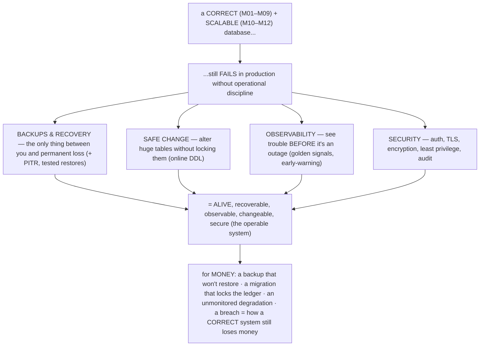
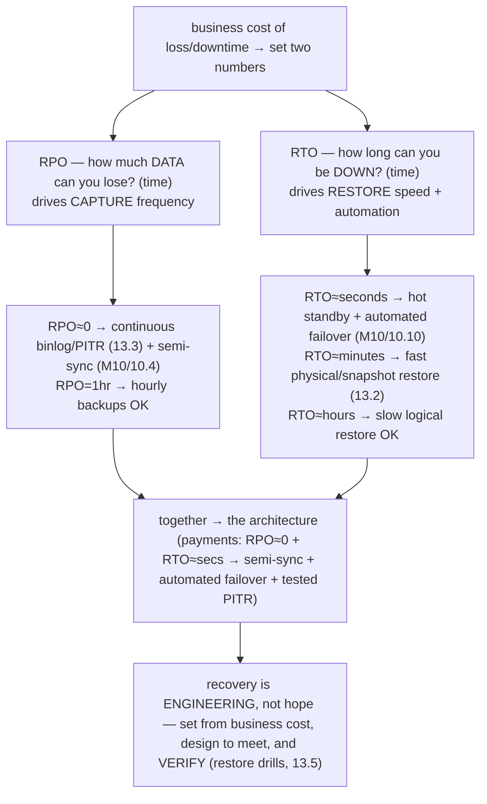

# M13 · Pass C — Diagrams & Worked Examples · Concepts 13.1–13.5

> **Pass C scope:** content-contract items **#12 Diagram(s)** and **#8 Worked example** (narrated, no code in prose). Pairs with `01-why-ops-backups-pitr-rpo-rto.md`. Concepts 13.2/13.3/13.5 use **★ bespoke custom SVGs** (in `assets/`, render-validated); 13.1/13.4 use Mermaid. Domain: payments/wallet, the ledger. The recurring question: *is the platform recoverable, observable, changeable, and secure — so a correct system stays correct in production?*

---

## 13.1 · Why operations matters (the production reality)

**Diagram — the four pillars:**

**Worked example — the ways a "correct" payments DB still dies.**
The platform is *correct* (ACID, durability, M01–M09) and *scalable* (replication, sharding, distribution, M10–M12) — and yet, without operational discipline, it dies in production in ways no amount of correctness prevents (the diagram's four pillars, each a failure mode). **Lost data (no backups/recovery):** a disk fails, or a bad deploy runs a `DELETE` without `WHERE` on the ledger — and if there's no tested backup + PITR (13.3/13.5), the money is *permanently gone*. Correctness didn't help; *recoverability* was missing. **Locked migration (no safe change):** someone runs a naive `ALTER TABLE` on the billion-row ledger to add a column — it **locks the table for hours** (13.6), and *every transfer stops* until it finishes. Correctness didn't help; *safe change* was missing. **Blind degradation (no observability):** a long-running transaction pins undo, the history-list length climbs (M08/M09), reads slow to a crawl — but nobody's watching the early-warning signals (13.11), so it becomes a full outage at 3am. Correctness didn't help; *observability* was missing. **Breach (no security):** a shared superuser credential leaks, or connections are plaintext — and an attacker drains accounts or steals card data. Correctness didn't help; *security* was missing. The diagram's lesson: **a correct, scalable database is necessary but not sufficient** — production demands the four operational pillars (recoverability, safe change, observability, security) to keep the correct system *alive and recoverable*. For money, each missing pillar is a money/trust catastrophe — which is why operations is where "the design is right" becomes "the system is *trustworthy in production*." This module is the discipline that makes the prior eleven modules' work *survive reality*.

---

## 13.2 · Backup types: logical, physical, snapshot ★

**★ Diagram (custom SVG):**

![Three backup types compared. Logical (mysqldump/mydumper): dump SQL/data — portable across any version or engine, selective, small, human-readable, but slow to restore (re-run every INSERT, rebuild every index) and slow to take on a large DB; use for portability, archive, or selective restore; --single-transaction makes it consistent. Physical (Percona XtraBackup): copy the InnoDB files — fast restore (just put files back), efficient for large DBs, supports incrementals (low RPO), hot (runs while live), but less portable (version-tied) and coarser granularity; the typical production base, restore = put files back plus apply redo (M09 crash-recovery); plus binlog for PITR. Snapshot (LVM/cloud EBS): a storage-level point-in-time image — very fast take and restore, storage-integrated, cheap, but storage-dependent, needs consistency care, whole-volume granularity. Payments: physical/snapshot base for fast RTO plus incrementals plus continuous binlog for low RPO via PITR plus periodic logical for portability, taken from a replica, encrypted and restore-tested.](assets/13.2-backup-types.svg)

**Worked example — choosing a backup strategy for the ledger.**
The payments platform needs to choose how to back up the ledger, and the SVG's three types map to different needs. The deciding factor for the *operational* backup is **restore speed (RTO, 13.4)** — when disaster strikes, how fast can you get the ledger back? **Logical** (mysqldump/mydumper) is *portable* (restore to any MySQL version, even migrate engines) and *selective* (restore one table), but its **restore is slow** — it re-executes every `INSERT` and rebuilds every index, which for a huge ledger means *hours* (a bad RTO). So logical alone is wrong for the operational backup of a large ledger; it's kept as a *complement* (periodic dumps for portability, long-term archive, and selective restores). **Physical** (XtraBackup) copies the actual InnoDB files *while the server runs* (hot), so its **restore is fast** (just put the files back + apply captured redo, M09-style) — and it supports **incrementals** (copy only changed pages — small, frequent backups → low RPO cheaply). This is the **typical production base**: fast restore (good RTO) + incrementals (good RPO). **Snapshots** (cloud/LVM) are *very fast* to take and restore where the storage supports it (a good alternative base, with consistency care). The chosen strategy (the SVG's footer): a **physical/snapshot base** (fast RTO) + **incrementals + continuous binlog** (low RPO via PITR, 13.3) + **periodic logical dumps** (portability/archive) — taken from a **replica** (M10, so the primary isn't loaded), **encrypted** (13.14), and crucially **restore-tested** (13.5). The lesson the SVG drives: *a backup's value is dominated by how fast and reliably you can restore it* — so you pick physical/snapshot for the fast operational base, layer the binlog for point-in-time recovery, and keep logical for portability. Never a logical-only strategy for a large ledger (the RTO would be catastrophic).

---

## 13.3 · Point-in-time recovery (PITR) via the binlog ★

**★ Diagram (custom SVG):**

![Point-in-time recovery on a timeline. Step 1: restore the full backup taken at midnight. Step 2: replay the binlog forward (every committed change since midnight). Step 3: stop the replay at 14:29:59 (one second before the disaster), using --stop-datetime. The disaster: at 14:30:01 a bad deploy ran a DELETE without WHERE. Result: the ledger is recovered to 14:29:59 — every legitimate transfer kept, the bad DELETE excluded, losing only one second. It needs a base backup plus the binlog retained (binlog_expire_logs_seconds) and durable (sync_binlog=1), with GTID for precise replay. This is the binlog's third use after replicas and CDC — the log is primary, replay it to reconstruct any past state, done per shard. Frequent base backups limit replay time; PITR gaps are an M15 catastrophe.](assets/13.3-pitr.svg)

**Worked example — recovering the ledger to one second before a bad `DELETE`.**
A bad deploy ships at 14:30 and runs a catastrophic statement on the ledger — say, a `DELETE FROM ledger_entry` whose `WHERE` clause was accidentally omitted, wiping millions of rows at 14:30:01. The last full backup was at midnight. *Without* PITR, your only option is restoring the midnight backup — **losing all 14.5 hours of legitimate transfers since** (a terrible RPO, and unacceptable for money). *With* PITR (the SVG's timeline), you recover *precisely*: **① restore** the midnight full backup (the ledger as of 00:00); **② replay the binlog** (M10 — the ordered record of every committed change since midnight) *forward*, re-applying every legitimate transfer from 00:00 onward; **③ stop the replay at 14:29:59** (`--stop-datetime='2026-06-28 14:29:59'`) — *one second before* the disastrous `DELETE` at 14:30:01. The result (the SVG's green box): the ledger is recovered to **exactly 14:29:59** — *every legitimate transfer* from the whole day is kept (replayed from the binlog), and *only the bad `DELETE`* is excluded (the replay stopped before it). You lost *one second*, not 14.5 hours. This is the difference between coarse recovery (only to backup time) and *fine-grained* recovery (to any moment, especially just before a known-bad change). The requirements (the SVG): a **base backup** + the **binlog retained** long enough to cover the window (`binlog_expire_logs_seconds`) and **durable** (`sync_binlog=1`, M09 — or recent transfers could be lost from the binlog itself); with **GTIDs** (M10/10.7), the replay can target a precise transaction. This is the binlog's *third* major use (after replicas, M10, and CDC, M12 — *one log, many uses*) and the embodiment of "the log is primary; replay it to reconstruct any past state" (the same idea as crash recovery M09, replication M10, CDC M12). PITR is what makes the platform's recovery *precise* — and a **PITR gap** (binlog not retained or not durable) is *the* M15 catastrophe (you *think* you can rewind, but you can't).

---

## 13.4 · RPO & RTO: the recovery objectives

**Diagram — RPO vs RTO → strategy:**

**Worked example — setting RPO≈0 / RTO≈minutes for a payments ledger.**
The platform must decide *how good* its recovery has to be — and the SVG shows this is two numbers derived from *business cost*, which then *drive* the whole strategy. For a payments ledger, the costs are extreme: **losing a committed transfer** is losing real money (and breaking the money-never-lies invariant) → **RPO must be ≈0** (zero acceptable data loss); **being down** stops all payments and breaks trust → **RTO must be ≈seconds-to-minutes**. Now those numbers *dictate* the architecture (the SVG's flow). **RPO≈0** (no committed transfer may be lost) demands **continuous capture**: **semi-sync replication** (M10/10.4 — a committed transfer is durable on a replica *immediately*, so even total loss of the primary loses ~nothing) *plus* **continuous durable binlog** (`sync_binlog=1`, M09) for **PITR** (13.3 — so you can also recover from logical disasters precisely). **RTO≈seconds-to-minutes** (minimal downtime) demands **fast recovery**: **automated fenced failover** to a hot standby (M10/10.10–10.13 — promote a replica in seconds, *no restore needed* for node failure) *plus* **fast physical/snapshot restore** (13.2) for the cases failover can't fix. Crucially, these *combine*: **failover** (M10) handles *node loss* at ~zero RPO/RTO, while **tested backups + PITR** (13.3/13.5) are the *deeper safety net* for *logical disasters and corruption* — which **replicate to the standby too** (a bad `DELETE` propagates, so failover doesn't help; only backup-based PITR recovers it). The lesson the SVG drives: **recovery is engineering, not hope** — you set RPO/RTO from the *business cost* (for money, near-zero), *derive* the strategy (semi-sync + automated failover + tested PITR), and **verify it** with restore drills (13.5 — you can't claim "RTO 15 minutes" without having *measured* a real restore). RPO/RTO are the measurable targets the entire operational posture (13.15/13.16) is designed and tested to meet.

---

## 13.5 · The backup you can't restore (tested restores) ★

**★ Diagram (custom SVG):**

![The tested-restore principle. The trap: a backup that "succeeded" every night for a year but silently is corrupt (bit-rot or a backup bug), incomplete (a table excluded), un-decryptable (lost the key), or missing the binlog (no PITR) — discovered during the disaster, so the data is gone and the recovery is gone too. The antidote: an automated restore drill — restore the backup to a scratch instance, apply binlog PITR to a target, verify (row counts, checksums, reconcile balance = sum of entries), measure restore time vs RTO, and run it nightly with alerting on any failure. The deliverable is recoverability, not backups, and it's only real if you've tested the restore; the drill catches every silent failure before the disaster. "You don't have backups, you have restores." For money, automate the drill plus reconciliation to prove recoverability nightly — the operational embodiment of verify-don't-assume. The backup that ran successfully but couldn't restore when needed is the M15 cautionary tale.](assets/13.5-tested-restore.svg)

**Worked example — the backup that "ran successfully" for a year but couldn't restore.**
This is the most dangerous operational illusion, and the SVG's two halves contrast the trap with the antidote. **The trap:** the payments platform's nightly backup job reports **"success"** every single night for a year — green checkmarks, no errors. Everyone *assumes* they're protected. Then disaster strikes (corruption, a bad deploy, hardware loss), they go to restore — and discover the backup **doesn't work**: it's *corrupt* (silent bit-rot, or a bug in the backup process that the "success" status never caught), or *incomplete* (a table was silently excluded), or *un-decryptable* (the encryption key was rotated and the old one lost, 13.14), or *missing the binlog* (so PITR, 13.3, is impossible — you can only restore to last night, losing today's transfers). The catastrophe: **the data is gone *and* the recovery is gone** — discovered at the *worst possible time*, mid-disaster. The "backup succeeded" status told them *nothing* about whether they could actually *recover*. **The antidote (the SVG's right):** an **automated restore drill** — *regularly* (nightly) restore the backup to a **scratch instance**, apply **binlog PITR** to a target time (13.3), and **verify**: row counts, checksums, and crucially **reconciliation** (re-derive balances from the restored ledger and confirm balance = Σ entries, M02/2.17, M12/12.14 — proving the recovered data is not just present but *correct*), and **measure the restore time against RTO** (13.4). This catches *every* silent failure *before* the real disaster: corruption (the restore or verification fails), incompleteness (reconciliation mismatches), key loss (decryption fails in the drill), missing binlog (PITR fails in the drill), and RTO violations (the restore took too long). The lesson (the SVG's core): **the deliverable is *recoverability*, not *backups* — and recoverability is only real if you've *tested the restore*** ("you don't have backups, you have restores"). For money, you **automate the drill + reconciliation** so you *prove* recoverability *every night* — turning "we think we have backups" into "we *proved* we can recover the ledger, correctly, within RTO, last night." This is the operational embodiment of "verify, don't assume" (the same discipline as monitoring the guarantee, M10/10.12, and reconciliation, M12/12.14) — and the **untested backup that wouldn't restore when it mattered is *the* M15 cautionary tale**.

---

*Diagrams + worked examples for 13.1–13.5 complete (3 ★ custom SVGs + 2 Mermaid). Next Pass C file: 13.6–13.10 (★ online-DDL, observability SVGs + Mermaid for gh-ost/pt-osc, InnoDB DDL, P_S/sys/slow-log).*
