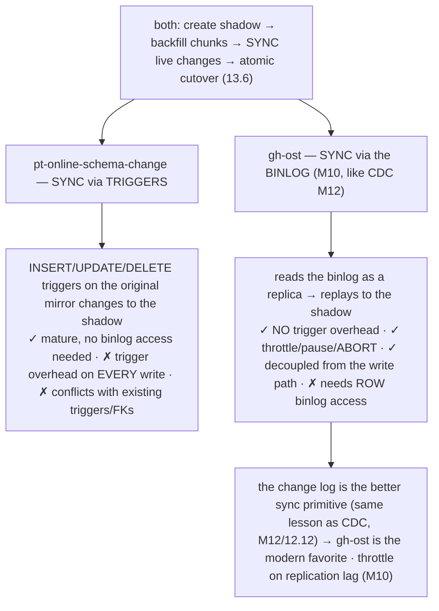
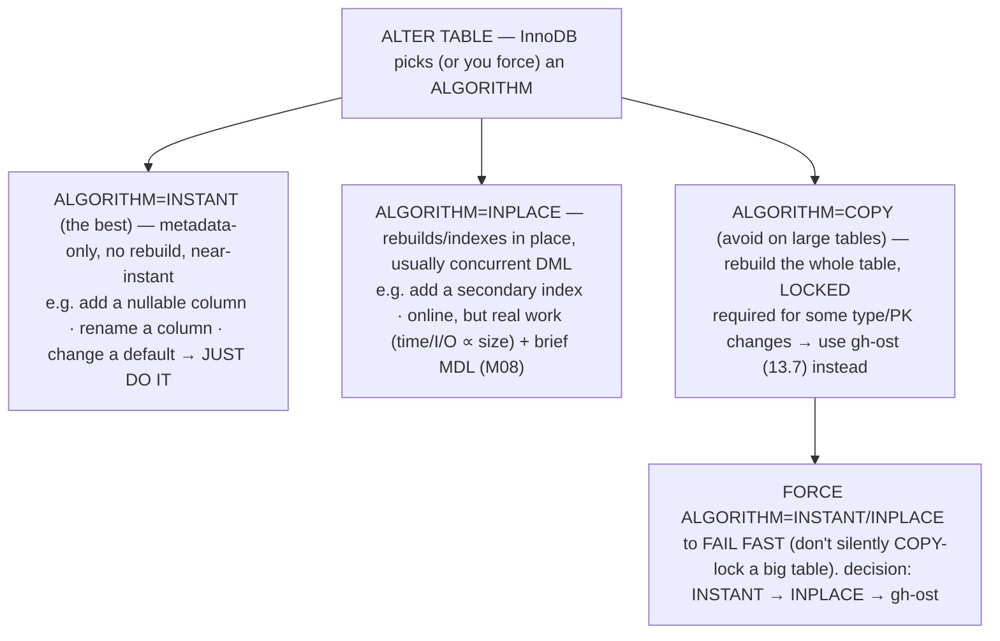
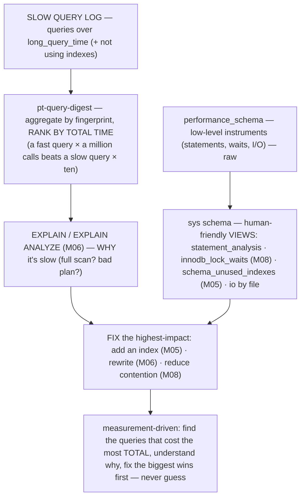

# M13 · Pass C — Diagrams & Worked Examples · Concepts 13.6–13.10

> **Pass C scope:** content-contract items **#12 Diagram(s)** and **#8 Worked example** (narrated, no code in prose). Pairs with `02-online-ddl-observability.md`. Concepts 13.6/13.9 use **★ bespoke custom SVGs** (in `assets/`, render-validated); 13.7/13.8/13.10 use Mermaid. Domain: payments/wallet, the ledger. The recurring question: *is the platform recoverable, observable, changeable, and secure?*

---

## 13.6 · Online schema migrations (the locking problem) ★

**★ Diagram (custom SVG):**

![Online schema change. The naive ALTER TABLE (COPY algorithm) rebuilds the whole table while locked for hours, blocking all reads and writes (or causing a metadata-lock stall) — locking out every transfer, unacceptable for the ledger. Online DDL (gh-ost or native) keeps the original fully available throughout, with only a momentary lock at the cutover rename — near-zero downtime, throttleable, abortable, so you can add a column to a billion-row ledger without lockout. The four-step pattern, with the original staying live: (1) shadow — create an empty table with the new schema alongside; (2) backfill — copy rows in throttled chunks, pausing on lag or load; (3) sync — live changes reach the shadow via triggers (pt-osc) or the binlog (gh-ost); (4) cutover — atomically rename the shadow into place with a brief lock. This is the same build-new-alongside, sync-via-change-log, atomic-cutover pattern as resharding, blue-green, and CDC. The cost is roughly 2x disk during migration and slower than a direct ALTER; use native INSTANT/INPLACE for the easy changes.](assets/13.6-online-ddl.svg)

**Worked example — adding a column to a billion-row ledger table without locking transfers.**
The platform needs to add a column to the ledger table (a billion rows) — and the SVG contrasts the catastrophic naive approach with online DDL. **The naive `ALTER TABLE … ADD COLUMN` (if it triggers the `COPY` algorithm):** InnoDB rebuilds the *entire* billion-row table, **holding a lock** the whole time (or causing a metadata-lock stall, M08) — for a table that size, that's **hours** during which *every read and write blocks* → **every transfer stops** for hours. Utterly unacceptable for a payments ledger (you can't stop taking money to add a column). **Online DDL** solves it (the SVG's four steps), keeping the original ledger table *fully available* throughout: **① Shadow** — create an empty table with the *new* schema (the added column) alongside the original. **② Backfill** — copy the billion rows into the shadow in *throttled chunks* (the tool pauses if replication lag spikes, M10, or load climbs — so reporting/reconciliation replicas don't fall behind, M02). **③ Sync** — while backfilling, the original is *still live* (taking transfers), so changes during the copy must also reach the shadow: **gh-ost reads the binlog** (M10) to capture and replay them (no triggers), or **pt-osc uses triggers** (13.7). The shadow converges to a complete, up-to-date copy with the new schema. **④ Cutover** — once the shadow is fully caught up, **atomically rename** it into the original's place (a brief, near-instant metadata operation). The new schema is now live; only that momentary cutover took a lock. Throughout, *transfers never stopped*. The lesson the SVG drives (its footer): **online change = build-new-alongside + sync-via-change-log + atomic-cutover** — the *exact same* copy → sync → cutover pattern as resharding (M11/11.14), blue-green deployment, and CDC (M12/12.12). The cost: ~2× disk during the migration and it's slower than a direct `ALTER` — but it buys *zero downtime*. (And for the *easy* changes — adding a nullable column at the end — MySQL's native `INSTANT` algorithm, 13.8, does it instantly with no copy at all.) This is how the platform evolves the ledger schema safely at scale, never locking out transfers.

---

## 13.7 · gh-ost & pt-online-schema-change

**Diagram — pt-osc (triggers) vs gh-ost (binlog):**

**Worked example — migrating the ledger schema with gh-ost.**
The platform needs a ledger schema change that MySQL's native online DDL can't do instantly (13.8 — say, changing a column's type), so it reaches for an external online-DDL tool — and the SVG shows the choice is **triggers (pt-osc) vs binlog (gh-ost)**, with gh-ost the modern favorite. Both do the same copy → backfill → sync → cutover (13.6); they differ in *how they sync* the shadow with live transfers. **pt-osc** installs **triggers** on the original ledger table — every `INSERT`/`UPDATE`/`DELETE` (every transfer!) fires a trigger that mirrors the change to the shadow. It works and is mature, but those triggers add overhead to *every transfer* during the migration (write amplification on the hot ledger), and pt-osc struggles if the table already has triggers or tricky foreign keys. **gh-ost** instead **connects as a replica and reads the binlog** (M10 — exactly like CDC, M12/12.12) to capture changes to the ledger and replay them to the shadow — **no triggers**, so *zero added overhead on transfers*. Plus gh-ost offers superior **operational control**: it **throttles** (slows or pauses the backfill if replication lag spikes, M10, so reporting replicas don't fall behind, or if load climbs), can **pause and resume**, and can **abort cleanly** before cutover (back out if something looks wrong) — control a naked `ALTER` or pt-osc's triggers don't give. So the platform migrates the ledger with **gh-ost**: it builds a shadow ledger table, reads the binlog to stay in sync with live transfers (decoupled from the write path), backfills the billion rows *throttled* (pausing if replica lag exceeds a threshold), and **atomically cuts over** — *zero downtime, full control, abortable*. The lesson the SVG drives: **the change log is the better synchronization primitive** (the *same* lesson as CDC, M12/12.12 — log-based capture beats triggers: lower overhead, decoupled) — which is why gh-ost (binlog-based, like Debezium) is preferred over pt-osc (trigger-based). gh-ost reading the binlog to migrate is *CDC applied to schema change*. (For **sharded** platforms, Vitess coordinates schema changes per shard.)

---

## 13.8 · MySQL's own online DDL (and its limits)

**Diagram — INSTANT / INPLACE / COPY:**

**Worked example — which ledger changes are INSTANT vs need gh-ost.**
The skill is classifying each ledger schema change into the SVG's three buckets — because the *same* `ALTER TABLE` syntax can be instant, online-with-work, or a catastrophic lock depending on the change. **`INSTANT` (just do it):** **adding a nullable column** to the ledger (especially at the end) is *metadata-only* — InnoDB records the schema change without touching any of the billion existing rows → **near-instantaneous, no rebuild, no meaningful lock**. Also instant: renaming a column, changing a default. For these, you run the `ALTER` directly (with `ALGORITHM=INSTANT` to be sure) — done in milliseconds. **`INPLACE` (online, but does work):** **adding a secondary index** to the ledger is done *in place* — InnoDB builds the index *within* InnoDB while the table stays available for reads/writes (concurrent DML), with only a brief metadata lock at start/end (the MDL trap, M08 — a long-running query can make even this wait, queuing everything behind it). It's *online* but takes real time/I/O proportional to the billion rows, so you run it carefully (off-peak, watching load). **`COPY` (avoid → gh-ost):** **changing a column's type** on the ledger (or some primary-key changes) *can't* be done in place — it requires `ALGORITHM=COPY`, which **rebuilds the whole table while locked** (hours of locked-out transfers). For these, you *don't* let MySQL `COPY`-lock — you use **gh-ost** (13.7 — online, throttled, abortable). The critical safety practice the SVG highlights: **force the algorithm** (`ALTER … ALGORITHM=INSTANT`) so it **fails fast** if the change can't be done that way — rather than *silently* falling back to a `COPY`-lock that takes down the ledger. The decision is a clean hierarchy: **try `INSTANT` (instant, free) → else `INPLACE` if the table isn't too huge (online, watch load) → else `gh-ost` (for `COPY`-locking changes on large tables)**. The lesson: **metadata-only changes are nearly free; structural rebuilds are expensive** — so know which bucket each change falls in, use the native capability for the cheap ones, and gh-ost for the rest. Design schema changes to be metadata-only where possible (add nullable columns at the end).

---

## 13.9 · Observability: metrics, logs, the golden signals ★

**★ Diagram (custom SVG):**

![Observability: the three pillars plus the four golden signals. Metrics (numeric time-series — QPS, latency, connections, lag, buffer-pool hit ratio): cheap, aggregatable, alertable, from SHOW STATUS, performance_schema, and the OS into Prometheus. Logs (discrete events — slow query log, error log, audit log): detailed, for diagnosis, with pt-query-digest ranking by total time. Traces (a request's path across services): for distributed where-diagnosis. Organized by the four golden signals: Latency (how long queries take, p50/p95/p99), Traffic (how many — QPS/TPS), Errors (failed queries and connections, deadlocks, replication errors), and Saturation (how full — CPU, connections, buffer pool, disk, lag) — the leading indicator that predicts the others, the early-warning signals. Saturation predicts the others, catch trouble during the buildup while preventable, plus reconciliation as the money-correctness watchdog, monitored per shard.](assets/13.9-observability.svg)

**Worked example — what to watch on a payments DB so a problem is caught early.**
"You can't operate what you can't see" — and the SVG shows *what* to watch and *how to organize it* so a payments DB problem surfaces *early* (not as a 3am outage). The **three pillars** provide the data: **metrics** (numeric time-series — query rates, latencies, connections, replication lag, buffer-pool hit ratio — cheap, *alertable*, from `SHOW STATUS`/`performance_schema`/OS into Prometheus/PMM), **logs** (the slow query log, error log, audit log — *detailed, for diagnosis*, with `pt-query-digest` ranking queries by total impact), and **traces** (a request's path across the app → DB → replica → other services, M12 — for diagnosing *where* in a distributed flow latency arises). But raw data is overwhelming — so you *organize* it by the **four golden signals** (the SVG's bottom row), a minimal-complete set covering almost any problem's symptoms: **Latency** (how long queries take — p50/p95/p99, from the slow log/P_S), **Traffic** (how many — QPS/TPS), **Errors** (failed queries/connections, deadlocks, replication errors), and — most importantly — **Saturation** (how full each resource is: CPU, connections vs `max_connections`, buffer-pool pressure, disk, replication lag). **Saturation is the leading indicator** (the SVG emphasizes it ★): it *predicts the others* — a resource climbing toward its limit (connections filling, the disk filling, lag growing) warns you *before* it causes errors/latency/an outage. So the payments DB *alerts on the golden signals* — especially saturation (the **early-warning signals**, 13.11: lag, history-list length, checkpoint age, connection saturation, semi-sync status, disk) — at actionable thresholds, keeps the *logs* (slow log, error log) for diagnosing *what's* wrong, and runs **reconciliation** (M12/12.14) as the *money-correctness watchdog*. The result: a degrading ledger (lag growing, a replica failing, the disk filling, semi-sync silently degraded, M10/10.12) is caught *while it's still preventable* — turning "the database is down, why?" into "saturation is climbing, intervene now." For a sharded platform, this is monitored *per shard* (M11). Observability is the eyes that keep the platform operable.

---

## 13.10 · performance_schema, sys & the slow query log

**Diagram — P_S → sys → slow log → finding the problem:**

**Worked example — finding the query causing replica lag and the table causing lock waits.**
Two production diagnoses, both using MySQL's built-in instrumentation (the SVG's tools). **Diagnosing replica lag (M10):** the monitoring (13.9) alerts that a replica is lagging (a leading indicator, 13.11 — predicting stale reads and a failover risk). *Why?* The replica's applier is struggling with a slow query that the primary runs fine (the primary parallelizes; the replica may apply serially or the query is just expensive). To find it: the **slow query log** on the primary, analyzed with **`pt-query-digest`**, ranks queries by *total time* — surfacing the heavy query (say, a poorly-indexed reporting query, or a huge `UPDATE`). **`EXPLAIN`** (M06) on that query reveals *why* it's slow (a full table scan — a missing index, M05). The fix: add the index (M05) or rewrite the query (M06) → the replica catches up, lag clears. The key insight the SVG highlights: rank by **total time**, not the single slowest query — *a fast query run a million times* (e.g., an N+1 pattern, M06) can dominate total load and cause more lag than one slow query. **Diagnosing lock waits (M08):** the platform sees transfers timing out on hot accounts (contention, M08/M11). *What's blocking what?* The **`sys` schema** view **`sys.innodb_lock_waits`** shows *exactly* which transaction is blocking which (the blocking query, the waiting query, the locked rows) — revealing, say, a long-running reporting transaction holding locks on hot account rows (M08), or a transaction that should have used `SKIP LOCKED` (M08). The fix: reduce the contention (shorten the transaction, M07/7.15; use the right locking pattern, M08). The lesson the SVG drives: **performance work is measurement-driven** — use the slow log + `pt-query-digest` to find the *highest-total-impact* queries, `sys`/P_S to find lock waits (M08)/I/O hotspots/unused indexes (M05), and `EXPLAIN` (M06) to understand *why* — then fix the *biggest wins first*, never optimizing by guessing. These built-in tools (the practical extension of M06 into *production* traffic) are the platform's first-line diagnostics, feeding the early-warning signals (13.11) and the monitoring (13.9).

---

*Diagrams + worked examples for 13.6–13.10 complete (2 ★ custom SVGs + 3 Mermaid). Next Pass C file: 13.11–13.16 (★ early-warning, security, operable-platform SVGs + Mermaid for pooling, config, posture decision).*
