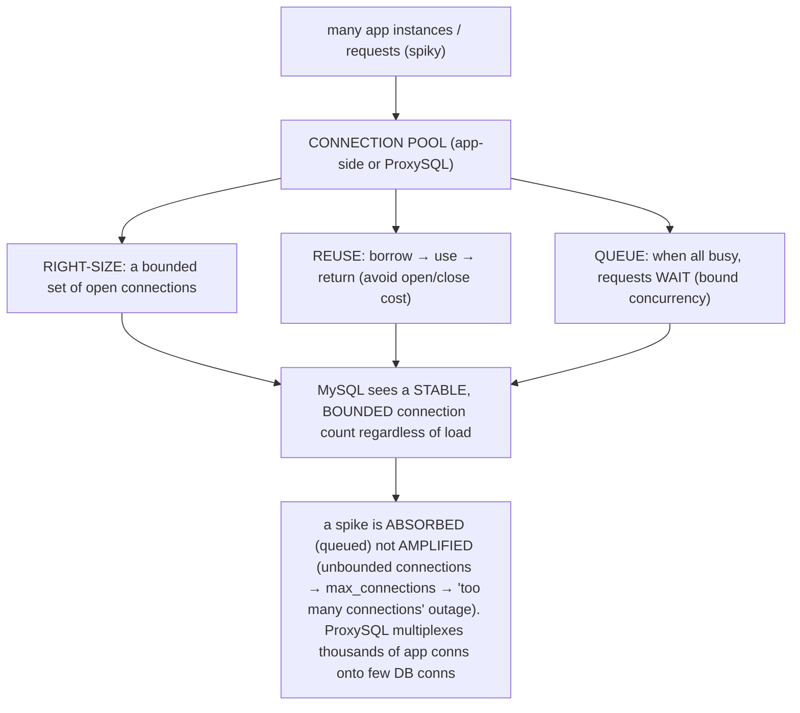
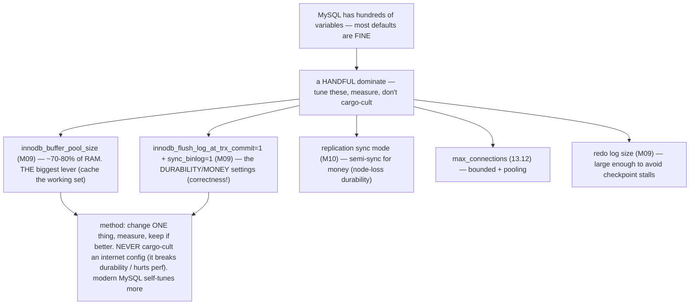
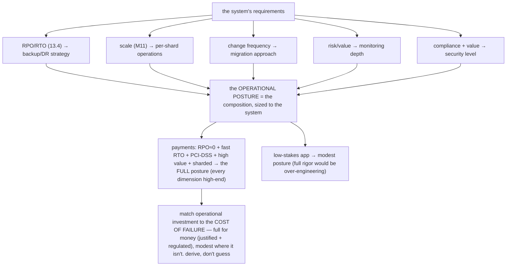

# M13 · Pass C — Diagrams & Worked Examples · Concepts 13.11–13.16

> **Pass C scope:** content-contract items **#12 Diagram(s)** and **#8 Worked example** (narrated, no code in prose). Pairs with `03-earlywarning-pooling-config-security-capstone.md`. Concepts 13.11/13.14/13.16 use **★ bespoke custom SVGs** (in `assets/`, render-validated); 13.12/13.13/13.15 use Mermaid. Domain: payments/wallet, the ledger. The recurring question: *is the platform recoverable, observable, changeable, and secure?*

---

## 13.11 · Early-warning signals (predict, don't react) ★

**★ Diagram (custom SVG):**

![Early-warning signals — the M08/M09/M10 internals are the leading indicators that climb before the failure. Replication lag (growing lag predicts stale reads and a failover data-loss window; act: find the slow query or write spike). History-list length / HLL (growing HLL means a long transaction pins undo, predicting bloat and purge stalls; act: find and kill the long transaction). Checkpoint age (high age predicts a forced flush stall / write freeze; act before the redo log fills). Connection saturation (Threads_connected nearing max_connections predicts a too-many-connections outage; act: pooling plus alert before saturation). Semi-sync status — the money gotcha — (status = 0 reveals it silently degraded to async, meaning lost replica durability; act: alert immediately, you think you're durable but aren't). Disk space / I/O (filling disk predicts a write failure / crash; act: alert well before full). Watch the leading indicators, not just the lagging ones, to intervene while preventable; the best incident is the one you prevented; alert at actionable thresholds with runbooks; these un-watched become the M15 incident.](assets/13.11-early-warning.svg)

**Worked example — the signals that would have caught a long transaction, a degrading replica, a filling disk.**
Three incidents that became outages — each *preventable* if the early-warning signal had been watched (the SVG's whole point: the M08/M09/M10 internals *are* the leading indicators). **A long transaction (history-list length):** a developer's reporting script opens a transaction and forgets to commit it (M07/7.15) — it sits open for hours, *pinning undo logs* that can't be purged (M08/M09), so the **history-list length climbs** (50k → 500k → millions). Old undo accumulating means version chains grow (reads slow, M08) and space bloats — eventually reads grind to a halt (an outage). *Watched:* an alert on HLL climbing past a threshold catches it *early* → find and kill the long transaction → crisis averted. *Unwatched:* it becomes a full outage. **A degrading replica (replication lag):** a heavy query (or a write spike) makes a replica's applier fall behind — **lag grows** (1s → 10s → minutes). Growing lag predicts *stale reads* (a money bug if a balance-for-authorization hits the lagging replica, M10/10.6) and a *widening failover data-loss window* (M10/10.10 — if the primary dies now, more committed transfers are lost). *Watched:* an alert on lag > threshold → diagnose the slow query (13.10) and fix it before it causes a money bug or a bad failover. *Unwatched:* a stale-read double-spend, or a lossy failover. **A filling disk (disk space):** the binlog + data grow, the disk creeps toward full (80% → 95% → 99%). A full disk means the *next write fails* → a crash (M15). *Watched:* an alert at 80% → add space / purge old binlogs → averted. *Unwatched:* the disk fills mid-write and crashes the ledger. The lesson the SVG drives: **watch the *leading* indicators (climbing *before* the failure) — not just the *lagging* ones (the failure itself)** — so you intervene *during* the buildup, while it's still preventable. *The best incident is the one you prevented by acting on the early warning.* This is why M08/M09/M10 emphasized HLL, checkpoint age, lag, and semi-sync status — they're not just internals, they're the platform's *operational leading health indicators*, alerted at actionable thresholds with runbooks (M14). And the same signal — **semi-sync status** (M10/10.12, the money gotcha) — *reveals* (not just predicts) a silent durability loss: if it reads 0, semi-sync degraded to async and you've *lost replica durability without knowing*. Every one of these un-watched is an M15 incident.

---

## 13.12 · Connection management & pooling

**Diagram — app ↔ pool ↔ MySQL:**

**Worked example — a connection storm that took down the payments DB, and how pooling prevents it.**
A traffic spike hits the payments platform (a flash event, or a retry storm from M12's idempotent retries) — and *without* pooling, it cascades into an outage (the SVG shows why, and the fix). **The storm (no pooling):** as traffic spikes, each app instance opens *more and more* connections directly to MySQL to handle the load. With many app instances each opening dozens of connections, the total climbs fast — and MySQL hits **`max_connections`** → new connections get **"Too many connections"** errors → requests fail → the app *retries* (opening *more* connections) → a feedback loop that *amplifies* the spike into a full outage. The connection count *amplified* the load instead of absorbing it; payments stop. **The fix (pooling):** a **connection pool** (app-side, or centralized via **ProxySQL**) sits between the app and MySQL (the SVG): it maintains a **right-sized** bounded set of connections, **reuses** them across requests (borrow → use → return — avoiding the cost of constantly opening/closing), and crucially **queues** excess requests when all pooled connections are busy. So when the spike hits, the pool **absorbs** it by *queuing* (requests wait briefly for a free connection) rather than *amplifying* it (opening unbounded connections) — MySQL sees a **stable, bounded** connection count *regardless* of the spike. The database stays up; requests are served (some with a little queuing latency, bounded, vs an outage). **ProxySQL** specifically *multiplexes* thousands of app connections onto a *small* pool of DB connections — essential for many app instances or serverless. The lesson the SVG drives: **connections are finite and expensive — pool them (reuse a bounded set, queue excess) so load spikes are *absorbed* (queued), not *amplified* (unbounded creation → exhaustion → outage)**. And counterintuitively, a *smaller* pool is often *faster*: a database handles a *bounded* number of concurrent queries best (M04/M08); beyond that, more connections just add contention. For the payments platform, pooling (often ProxySQL, per shard, M11) is the connection-resilience layer that keeps a traffic spike from becoming a "too many connections" outage that stops payments.

---

## 13.13 · Config tuning that actually matters

**Diagram — the few knobs that matter:**

**Worked example — tuning a payments primary, and what to leave alone.**
The platform tunes a payments primary (per shard) — and the SVG's lesson is *tune the few that matter, leave the rest alone, never cargo-cult*. The **few that matter**: **(1) `innodb_buffer_pool_size`** — the single biggest lever (M09): set it to ~70–80% of RAM so the *hot working set* (the active accounts, the recent ledger entries, the indexes) lives *in RAM* → fewer disk reads → dramatically faster transfers. This is the first and most impactful thing to tune. **(2) The durability settings** — `innodb_flush_log_at_trx_commit=1` + `sync_binlog=1` (M09/9.10): these make every committed transfer *fully durable* (fsync the redo + binlog). Crucially, these are **correctness settings, not just performance settings** — for money, they *must* be =1/=1 (the "money settings"): setting them to =2/=0 for "speed" silently risks *losing committed transfers on a crash* (a money-never-lies violation, M09). So you accept the throughput cost (mitigated by group commit, M09/9.11) for full durability. **(3) Semi-sync** (M10/10.4) — node-loss durability (a committed transfer survives total loss of the primary's node). **(4) `max_connections`** — bounded sensibly, paired with pooling (13.12). **(5) Redo log size** — large enough to avoid frequent checkpoint stalls (M09/13.11). **What to leave alone:** *everything else*. The SVG's warning: **never cargo-cult an internet "high-performance my.cnf"** — copying dozens of settings blindly often *breaks durability* (the classic: someone sets `flush_log_at_trx_commit=2` for "speed" and silently risks data loss) or *hurts* performance, and makes the config unmaintainable. Modern MySQL (8.0+) is well-defaulted and self-tunes more (adaptive flushing, M09; the query cache was *removed* because it hurt). The **method** (the SVG): *change one setting, measure (benchmark or production metrics, 13.9), keep it if it helps* — evidence-based, not superstitious. The lesson: **a few settings dominate (memory, durability, replication, connections, redo); tune those with measurement; leave good defaults alone; never trade *correctness* (durability) for *performance* without understanding exactly what you're risking** (M09). For the payments primary: big buffer pool (speed), full durability + semi-sync (the money/correctness settings), bounded connections + pooling, adequate redo — and *nothing else* touched without a measured reason.

---

## 13.14 · Security: auth, TLS, encryption, least privilege, audit ★

**★ Diagram (custom SVG):**

![Security defense in depth, five layers. (1) Authentication: per-service accounts (not a shared superuser), strong auth plugins, rotation, no app uses root. (2) TLS — encryption in transit: require_secure_transport and REQUIRE SSL so credentials and data aren't sniffable on the wire, defeating man-in-the-middle. (3) Encryption at rest: InnoDB tablespace plus binlog plus backup encryption, column encryption for card/PII, with KMS key management — losing the key makes backups un-restorable. (4) Least privilege (the highest-leverage layer): GRANT only what's needed — reporting gets SELECT on replicas, the transfer service gets INSERT/UPDATE on specific tables, no DROP or SUPER — which bounds the blast radius of any compromise. (5) Audit: who did what, for compliance (PCI-DSS/SOX), forensics, and detecting misuse, complementing the immutable ledger. Assume any single control can fail and layer them so the system stays secure anyway; a correct database that's insecure is still a catastrophe; security protects the value the whole platform holds, applied per shard.](assets/13.14-security-layers.svg)

**Worked example — securing a payments DB.**
A payments database is a high-value target, and security is *defense in depth* — the SVG's five layers, each non-negotiable for money, layered so no single failure is a breach. **① Authentication:** every service gets its *own* MySQL account with strong credentials — the transfer service, the reporting service, the reconciliation job each have distinct, least-privileged accounts; credentials are rotated; and *no application uses `root`/superuser* (a leaked root credential would be catastrophic). **② TLS (in transit):** all connections use TLS (`require_secure_transport`) so credentials and ledger data *aren't sniffable on the wire* — defeating network eavesdropping and man-in-the-middle. **③ Encryption at rest:** the InnoDB data files, the binlog, and the **backups** are encrypted (so a stolen disk or backup is useless), with the most sensitive columns (card numbers, PII, M03) *additionally* column-encrypted/tokenized — all with rigorous **KMS key management** (and a critical caveat: *losing the encryption key* makes your own backups *un-restorable*, 13.5 — a self-inflicted M15 disaster, so keys are backed up and managed rigorously). **④ Least privilege (the highest-leverage layer, the SVG ★):** each account is `GRANT`ed *only* what it needs — the reporting service gets `SELECT` on *replicas only*; the transfer service gets `INSERT`/`UPDATE` on the *specific* ledger/account tables (no `DROP`, no `GRANT`, no `SUPER`); the reconciliation job gets read-only access. So if *any* credential leaks, its blast radius is *bounded* — a compromised reporting credential can read some data but *can't* drop the ledger, modify balances, or escalate. **⑤ Audit:** a full audit trail records *who connected and what they did* — for **compliance** (PCI-DSS, SOX *mandate* this), **forensics** (after an incident: what did the attacker touch?), and *detecting misuse* — complementing the immutable ledger's own audit trail (M01/1.17). The lesson the SVG drives: **assume any single control can fail, and layer them so the system stays secure anyway** — and *least privilege especially* (bounding what each identity *can* do) is the highest-leverage control (it limits the damage of *every* compromise). The deep point: **a correct, scalable, well-operated database that's *insecure* is still a catastrophe** — security is the layer that protects the *value* the entire platform holds. For money, it's non-negotiable *and regulated* (PCI-DSS mandates encryption, least privilege, audit). Applied per shard (M11), the friction (TLS overhead, key management, grant management) is *accepted and minimized* (hardware-accelerated crypto, automated KMS, infrastructure-as-code grants) — because the protection is mandatory.

---

## 13.15 · Choosing the operational posture (the decision)

**Diagram — requirements → posture:**

**Worked example — designing the full operational posture for a payments platform.**
The platform's operational posture isn't arbitrary — it's *derived* from requirements (the SVG's flow), and for payments every requirement points to the *full* posture. **From RPO/RTO (13.4):** RPO≈0 (no committed transfer may be lost) → **semi-sync + continuous durable binlog + PITR** (M10/13.3); RTO≈seconds-minutes (downtime stops payments) → **automated fenced failover + fast restore** (M10/13.2); always → **tested restores** (13.5). **From scale (M11):** sharded → **per-shard backups/migrations/monitoring**, coordinated, with Vitess automating reshard/migration. **From change frequency:** the ledger schema evolves (new features) → **online DDL** (gh-ost/native, 13.6–13.8 — never lock the ledger). **From risk/value:** money is high-value → **deep monitoring + early-warning signals** (13.11) + the **reconciliation watchdog** (M12/12.14). **From compliance + value:** PCI-DSS-regulated money → **full security** (least privilege, TLS, encryption, audit, 13.14). Each dimension lands at the *high end* — *because the requirements demand it* (not arbitrarily). The SVG's contrast: a *low-stakes internal app* would derive a *modest* posture (occasional backups, async replication, basic monitoring, simple security) — and full rigor there would be *over-engineering*. The lesson: **match operational investment to the cost of failure** — derive each dimension from measurable requirements (RPO/RTO, scale, risk, compliance), investing *fully* where failure is catastrophic (money) and *modestly* where it isn't. For payments, that derivation lands on the full posture: tested PITR, automated failover, online DDL, deep monitoring with early-warning, reconciliation, and strong security — *each justified by a specific requirement*. This is the same requirements-driven right-sizing as isolation levels (M07), durability config (M09), and consistency choices (M12) — applied to operations. The capstone (13.16) composes the derived full posture.

---

## 13.16 · Fintech capstone: the operable payments platform ★

**★ Diagram (custom SVG):**

![The operable payments platform across five areas, all per shard on the correct (M01-M09) and scaled (M10-M12) ledger. Recoverability (RPO≈0, fast RTO): XtraBackup/snapshot per shard from replicas encrypted, plus continuous durable binlog for PITR, plus automated restore drills with reconciliation, plus automated fenced failover — proven recoverable. Safe change plus resilience: online DDL (gh-ost/native) to evolve the ledger without locking transfers, connection pooling (ProxySQL) to absorb storms, tuned config — buffer pool plus full durability (the money settings flush_log=1, sync_binlog=1, semi-sync). Observability plus verification: metrics/logs/golden signals plus slow log/sys/P_S, early-warning signals (lag, HLL, checkpoint age, connections, semi-sync status, disk), plus the reconciliation watchdog — trouble caught early. Security (defense in depth): per-service least privilege, TLS everywhere, encrypted data and backups (KMS), column encryption, full audit. Derived from requirements (RPO≈0, fast RTO, PCI-DSS, high value, sharded) into the full posture. Correctness and scalability are necessary but not sufficient — a high-value system is trustworthy only if it's operable; money never lies in production because the operations keep it correct, recoverable, and secure; the failures of each topic go to M15.](assets/13.16-operable-platform.svg)

**Worked example — how the platform is backed up, monitored, migrated, and secured.**
The capstone composes the full operational posture (the SVG) that keeps the correct (M01–M09), scaled (M10–M12) ledger *alive, recoverable, observable, changeable, and secure* in production — operations is what makes the prior eleven modules' work *survive contact with reality*. **Backed up & recoverable:** each shard (M11) is backed up with **XtraBackup/snapshots** (from replicas, M10, so the primary isn't loaded; **encrypted**, 13.14) + **continuous durable binlog** → **PITR** to any moment (13.3 — rewind before a bad deploy); **automated nightly restore drills with reconciliation** *prove* recoverability (13.5 — the ledger can be restored, *correctly*, within RTO); and **automated fenced failover** (M10) handles node loss at ~zero RPO/RTO. **Monitored:** **metrics/logs/golden signals** (13.9) + **early-warning signals** (13.11 — lag, HLL, checkpoint age, connection saturation, semi-sync status M10/10.12, disk) alerted at actionable thresholds + **slow log/sys/P_S** (13.10) for diagnosis + the **reconciliation watchdog** (M12/12.14 — the money-correctness check) — so trouble is caught *early*, not as a 3am outage. **Migrated:** the ledger schema evolves via **online DDL** (gh-ost reads the binlog to rebuild without locking transfers, 13.6–13.8; native `INSTANT` for the easy changes) — *zero downtime*. **Resilient:** **ProxySQL connection pooling** (13.12 — absorb connection storms) + **tuned config** (large buffer pool + the full-durability *money settings*, M09/13.13). **Secured:** **per-service least privilege**, **TLS everywhere**, **encrypted data + backups** (rigorous KMS), **column encryption** (M03), and a **full audit trail** (13.14 — compliance + forensics). All *derived from the platform's requirements* (RPO≈0, fast RTO, PCI-DSS, high value, sharded → the full posture, 13.15), all *per shard* and platform-wide coordinated. The deep lesson (the operational culmination of the journey): **correctness (M01–M09) and scalability (M10–M12) are necessary but *not sufficient* — a high-value system is *trustworthy in production* only if it's *operable*: recoverable (and *proven* so), observable (with leading indicators), safely changeable, resilient, secure in depth, and continuously verified.** Money never lies *in production* not just because the design is correct, but because the *operations* keep it correct, recoverable, and secure — through hardware failures, bad deploys, traffic spikes, schema changes, attacks, and growth. This operational posture is the final layer of the platform (M16), and the *catastrophic failures of every operational topic* — the backup that wouldn't restore, the migration that locked the ledger, the unmonitored degradation, the breach — are *exactly* the subject of **M15**.

---

*Diagrams + worked examples for 13.11–13.16 complete (3 ★ custom SVGs + 3 Mermaid). **M13 Pass C is fully drafted (all 16 concepts): 8 ★ custom SVGs + 8 Mermaid + 16 worked examples.** Next: validate Mermaid, then M13 Pass D (enrichment).*
