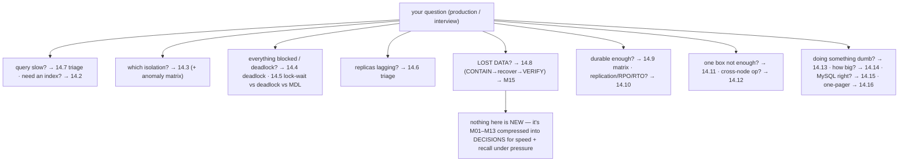
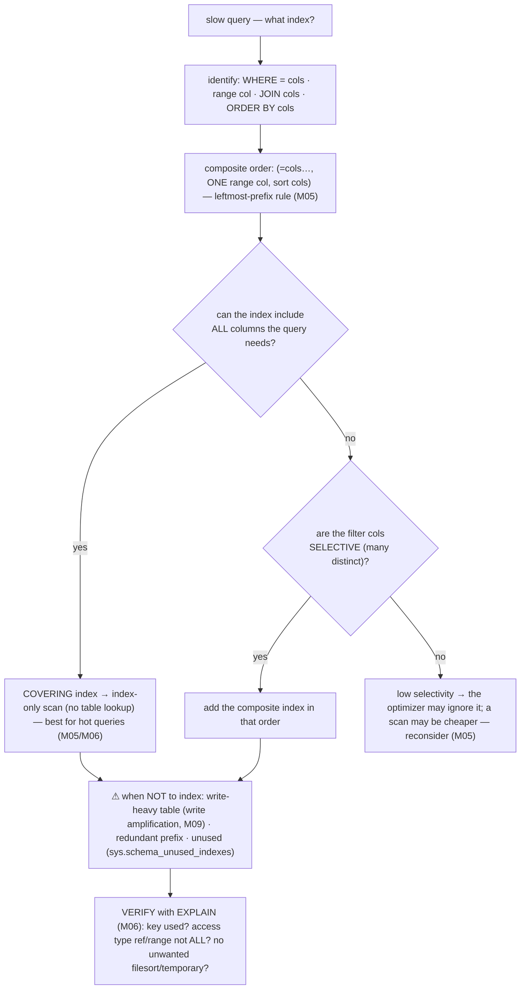
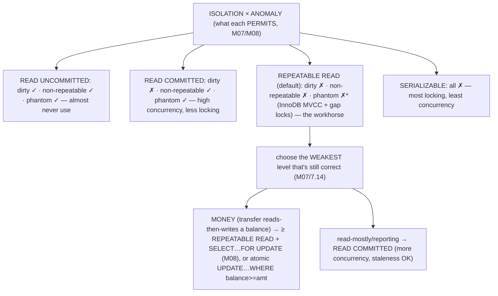
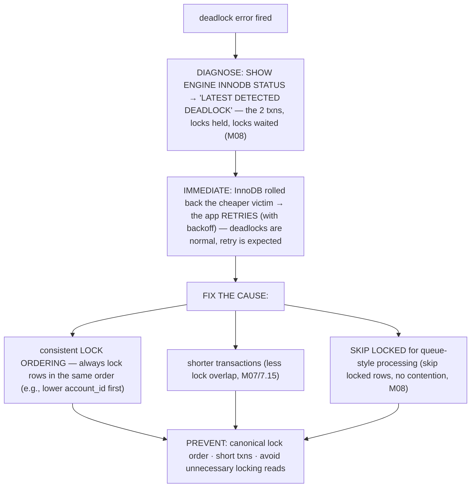
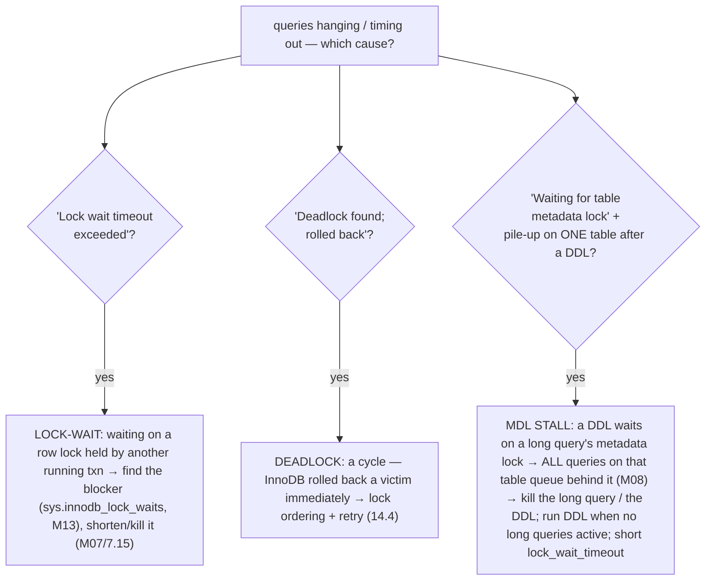
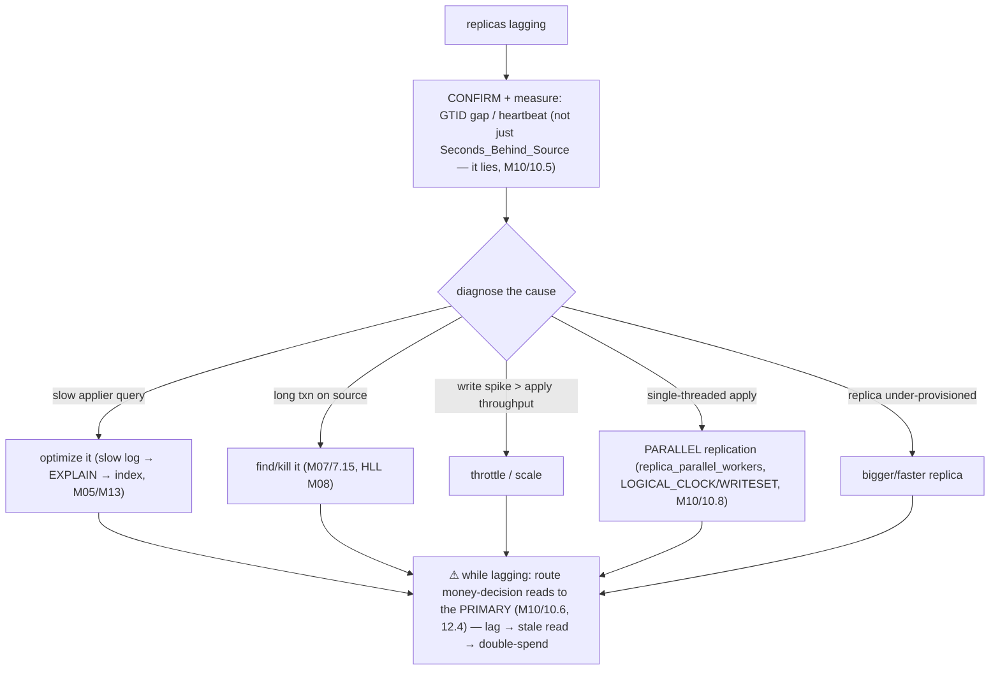
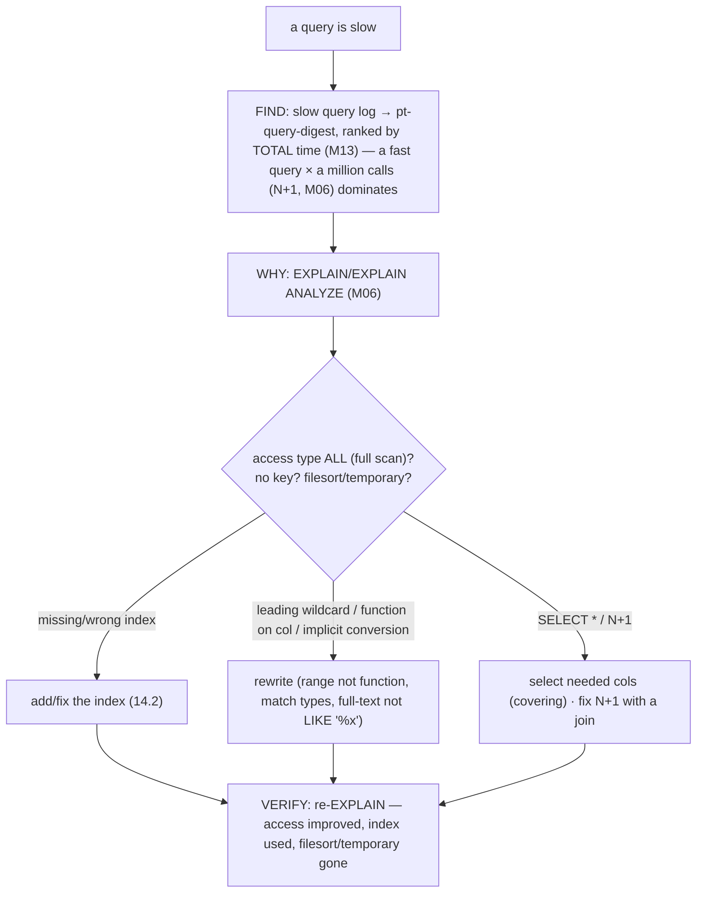

# M14 · Pass C — Decision Trees & Flowcharts · Guides 14.1–14.7

> **Pass C scope:** the actual **decision-trees / triage-flowcharts / matrices** (the reference content itself) + a short applied walkthrough per guide. Mostly Mermaid (the right form for quick-reference). Pairs with `01-guides-…`. Domain: payments/wallet, the ledger.

---

## 14.1 · How to use this cheat-sheet

**The map (question → guide):**

**Applied.** Under incident pressure on the payments platform, you don't re-derive theory — you match the symptom to the guide and follow the runbook. "The replicas are lagging and a balance read looks stale" → 14.6 (lag triage) + route money reads to the primary (12.4). "I think a deploy dropped ledger rows" → 14.8 (contain first!). This map is the front door.

---

## 14.2 · "Which index?" decision tree ★

**The decision tree:**

**Applied.** A slow "transfer history for account X, last 30 days, newest first" query: filters `account_id` (=), ranges `created_at`, sorts `created_at DESC` → index `(account_id, created_at)` (equality first, then the range/sort column) → and if the query selects only a few columns, make it **covering** (index-only). `EXPLAIN` confirms `ref` access on the index, no filesort. The write-heavy ledger means don't add indexes that aren't pulling their weight (M05).

---

## 14.3 · "Which isolation level?" guide + the anomaly matrix

**The anomaly matrix + choose-the-level:**

**Applied.** A transfer must not suffer a *lost update* (two concurrent transfers both reading balance=$100 and each debiting $80 → one overwrites the other → $20 instead of -$60-rejected). Fix: **REPEATABLE READ + `SELECT … FOR UPDATE`** on the balance row (serialize the two, M08), or the single atomic `UPDATE account SET balance_minor = balance_minor - :amt WHERE account_id=:a AND balance_minor >= :amt` (M07/7.16 — no read-then-write gap). Money correctness over concurrency.

---

## 14.4 · Deadlock triage flowchart

**The triage:**

**Applied.** Two transfers — A→B and B→A — each lock their source then destination balance; in opposite order they form a cycle → deadlock. Fix: **always lock the lower account_id first** (both transfers lock A then B → no cycle). InnoDB rolls back the victim; the app retries. *The* classic payments deadlock, fixed by canonical lock ordering.

---

## 14.5 · Lock-wait vs deadlock vs MDL stall

**Which "blocked" is it?**

**Applied.** A "harmless" online migration (13.6) on the ledger table seems to freeze *everything* on that table — the signature: a pile-up of "Waiting for table metadata lock" *after* the `ALTER` started. Cause: a long-running reporting query held the table's MDL, so the `ALTER` waits, and every transfer queues behind the waiting `ALTER` (M08). Fix: kill the long query (or the `ALTER`); run migrations when no long transactions are active. The silent, surprising outage.

---

## 14.6 · Replica-lag triage flowchart

**The triage:**

**Applied.** A payments replica lags 30s. Confirm via GTID gap. Diagnose: a heavy reporting query the applier runs slowly → optimize it; or single-threaded apply under transfer load → enable **parallel replication** (M10/10.8). *Critically*, while lagging, route balance-for-authorization reads to the **primary** (12.4) so a stale replica balance doesn't cause a double-spend, and watch the failover loss window (M10/10.10). Lag is a *money* problem.

---

## 14.7 · Slow-query triage flowchart

**The triage:**

**Applied.** A slow reconciliation query (M02/2.17). Slow log + `pt-query-digest` surfaces it (high *total* time). `EXPLAIN` shows `ALL` (full scan of the ledger) — a missing index on the grouping column. Add it (M05) → `range`/`ref` access → fast. (And note: a slow query *on the source* also causes replica lag, 14.6 — fixing it helps both.)

---

*Decision trees for 14.1–14.7 complete (1 ★ SVG ref in 14.2's companion + 7 Mermaid). Next: 14.8–14.16 (★ lost-data tree, durability/sizing matrices, scale/distributed quick-picks, ★ anti-pattern catalog, ★ master cheat-sheet).*
