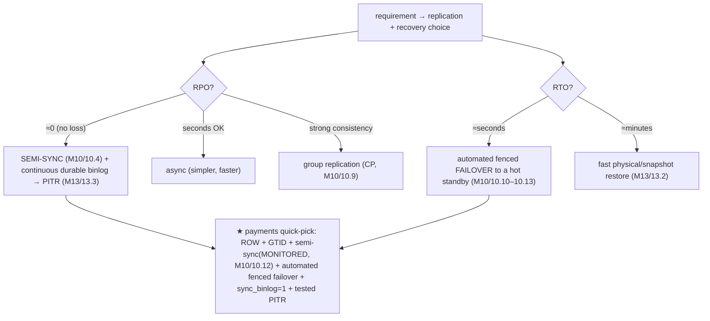
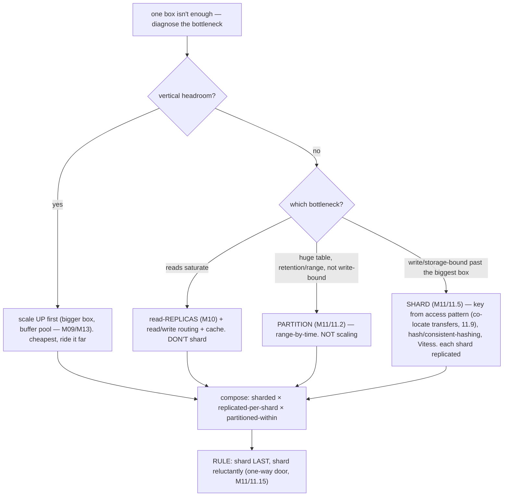
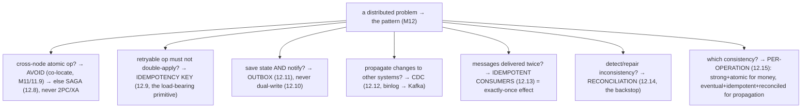
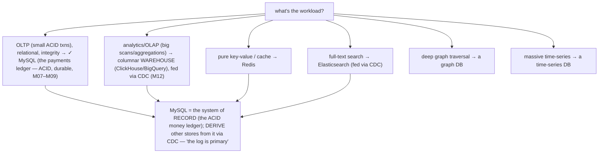

# M14 · Pass C — Decision Trees, Matrices & Catalogs · Guides 14.8–14.16

> **Pass C scope:** the actual **trees / matrices / catalogs** + a short applied walkthrough. Concepts 14.8/14.13/14.16 use **★ bespoke custom SVGs** (in `assets/`, render-validated); the rest use Mermaid + matrix tables. Pairs with `02-guides-…`. Domain: payments/wallet, the ledger.

---

## 14.8 · "I think I lost data" triage tree ★

**★ Diagram (custom SVG):**

![The lost-data incident runbook. Step 1, CONTAIN first (before investigating): halt the bad deploy/script, fence a diverging node (never let a split-brain keep writing), freeze writes to the affected scope — an ongoing incident gets worse while you investigate. Step 2, assess the blast radius: what, how much, since when, still spreading — logical error, corruption, failover loss window, or half-Saga; quantify with reconciliation (balance ≠ sum of entries tells you exactly which accounts). Step 3, choose the recovery path (routes to M15): logical error → PITR to just before; node loss → failover, check the loss window; corruption → restore plus PITR, force-recovery as last resort; distributed inconsistency → compensate/reconcile. Step 4, recover then VERIFY (non-negotiable for money): reconcile the recovered data (balance = sum of entries, internal = external) — recovered without reconciliation is not recovered. Step 5, post-mortem: root cause, prevent recurrence. For money the order is sacred: contain → assess → recover → verify → prevent.](assets/14.8-lost-data-triage.svg)

**Applied — a bad deploy dropped ledger rows.**
An on-call engineer suspects a deploy deleted ledger rows. The SVG's order is *sacred*: **① Contain first** — *before* investigating, stop the bad deploy/script (don't let it delete more) and freeze writes to the affected scope; if a node is diverging, *fence it* (M10/10.11). **② Assess** — use **reconciliation** (M12/12.14) to quantify: which accounts have balance ≠ Σ entries, how much, since when. It's a logical error (a bad `DELETE`). **③ Recover** — **PITR** (13.3): restore the base + replay the binlog to *just before* the bad statement → routes to M15 for the detailed handling. **④ Verify** — *reconcile the recovered ledger* (balance = Σ entries, internal = external) — **"recovered" without reconciliation isn't recovered**. **⑤ Post-mortem** — why did it happen, and what early-warning (13.11) / tested-restore (13.5) would prevent it. This is *the* money-incident runbook, and the entry point to M15.

---

## 14.9 · The durability config matrix

**The matrix (`flush_log_at_trx_commit` × `sync_binlog`):**

| `flush_log_at_trx_commit` | `sync_binlog` | On mysqld crash | On OS/power crash | Throughput | Use |
|---|---|---|---|---|---|
| **1** | **1** | **lose nothing** | **lose nothing** | lowest (group commit amortizes, M09/9.11) | **★ MONEY — full durability** |
| 1 | 0 | lose nothing (data) | recent binlog events lost → PITR/replica gap | higher | ⚠ binlog at risk |
| 2 | 1 | lose nothing | ~1s of commits lost | higher | non-money, OS-crash-tolerant |
| 0 | 0 | ~1s lost | ~1s lost | highest | ⚠ loss-tolerant only |

**Applied.** The payments ledger uses **1/1** — *no committed transfer is ever lost* (redo + binlog both fsync'd every commit), and the binlog is safe for PITR/replication. The throughput cost is mitigated by **group commit** (M09/9.11 — many commits fsync together). The matrix exists so nobody sets `=2`/`=0` for "speed" and silently risks losing transfers — a **money-never-lies violation** (M09). These are *correctness* settings, not performance settings (M13/13.13).

---

## 14.10 · Replication mode + RPO/RTO quick-pick

**The quick-pick:**

**Applied.** The payments platform's choice is fixed by RPO≈0 + fast RTO: **ROW format** (no divergence) + **GTID** (robust failover) + **semi-sync, monitored** (node-loss durability, but watch it doesn't silently degrade, M10/10.12) + **automated fenced failover** (M10) + **`sync_binlog=1`** + **tested PITR** (13.3/13.5). No forked ledger, no lost transfer.

---

## 14.11 · Scale decision: partition vs replica vs shard

**The decision tree:**

**Applied.** The payments platform: read-bound (reporting competes with transfers) → **replicas** + routing (not sharding). Later, the ledger history is huge with retention needs → **partition by month**. Finally, genuinely write-bound past the biggest box → **shard by tenant** (co-locating transfers single-shard, M11/11.9), each shard replicated. Shard *last*.

---

## 14.12 · Distributed-pattern quick-pick

**The quick-pick:**

**Applied.** A cross-tenant transfer: *avoid* if possible (co-locate, M11/11.9); else a **Saga** (12.8) + **idempotency keys** (12.9) + **reconciliation** (12.14). Propagating "TransferCompleted" to fraud/notifications: **outbox** (12.11) + **CDC** (12.12) + **idempotent consumers** (12.13). The money path is strong+atomic; propagation is eventual+idempotent+reconciled (12.15).

---

## 14.13 · The anti-pattern catalog ★

**★ Diagram (custom SVG):**

![The anti-pattern catalog, mistake to fix, grouped by module, with a warning marker on money-never-lies violations. Modeling/types: FLOAT/DOUBLE for money → DECIMAL or integer minor units (warning); UUIDv4 clustered PK → time-ordered ULID/UUIDv7/Snowflake; UUID as CHAR(36) → BINARY(16); reserved word transaction → transaction_. Indexing/queries: SELECT * → only needed columns; N+1 → a join; leading wildcard → restructure; function on column → range; implicit conversion → match types; missing/over-indexing. Transactions/locking: long transactions → keep short; inconsistent lock ordering → canonical order; naive DDL → online DDL; DDL during long queries → MDL stall. Durability/replication: weak durability config for money → 1/1 (warning); STATEMENT binlog → ROW; money read off a lagging replica → primary (warning); failover without fencing → split-brain. Distributed: dual-write → outbox/CDC (warning); no idempotency → idempotency keys (warning); cross-shard 2PC → Saga; eventual consistency for money without reconciliation → reconcile (warning). Operations: untested backups → tested drills (warning); no early-warning monitoring → watch the signals; cargo-cult config → tune and measure; shared superuser → least privilege. The money-critical anti-patterns are the money-never-lies violations — this is the checklist against them.](assets/14.13-antipattern-catalog.svg)

**Applied — the catalog against the payments schema.**
Run the catalog as a review checklist over the payments platform (the SVG groups them by module, ⚠ = money-never-lies violation). The money-critical ones to *never* commit: **FLOAT for money** (→ integer minor units), **a money-decision read off a lagging replica** (→ primary, M10/10.6), **weak durability config** (→ 1/1, M09), **dual-write** (→ outbox, M12), **no idempotency on retryable ops** (→ idempotency keys, M12), **untested backups** (→ restore drills, M13), and **eventual consistency for money without reconciliation** (→ reconcile, M12). Each ⚠ is a *money-never-lies* violation — this catalog is the checklist that catches them in review.

---

## 14.14 · Sizing rules of thumb

**The rules-of-thumb table:**

| Resource | Rule of thumb | Source |
|---|---|---|
| Buffer pool | ~70–80% of RAM (dedicated server) — the biggest lever | M09/M13 |
| Connection pool | *small* (tens, not hundreds, per instance); multiplex via ProxySQL | M04/M08/M13 |
| When to shard | only when write/storage-bound past the biggest replicated box | M11/11.15 |
| Index count | lean on write-heavy tables (write amplification); drop unused | M05/M13 |
| Row/column size | keep rows reasonable; smallest type that fits; off-row big blobs | M03/M09 |
| Redo log | large enough to avoid frequent checkpoint stalls | M09/M13 |
| Replica count | scale reads until write-load/failover-topology limits → then shard | M10/M11 |

**Applied.** The payments primary: **big buffer pool** (fit the hot ledger/accounts working set), **small connection pools** (+ ProxySQL), **lean indexes** on the write-heavy ledger, **full durability**, adequate redo. **Shard reluctantly** (only at genuine write/storage limits).

---

## 14.15 · "Is MySQL the right tool?" decision guide

**The decision tree:**

**Applied.** MySQL is the **system of record for money** (ACID, durable). Heavy analytics → a warehouse (fed from the ledger via CDC, M12 — *never* run them on the OLTP ledger); search → Elasticsearch (CDC-fed); cache → Redis. The ledger is the source of truth; everything else is *derived* via CDC. Never use an eventually-consistent store as the money source of truth.

---

## 14.16 · The master cheat-sheet (one-page recall) ★

**★ Diagram (custom SVG):**

![The master one-page cheat-sheet condensing M01-M13. The money settings box (money-never-lies non-negotiables): DECIMAL or integer minor units never FLOAT; durability flush_log=1 plus sync_binlog=1; semi-sync monitored plus ROW plus GTID; idempotency keys plus outbox/CDC plus reconciliation; transfer = single-shard ACID with atomic debit=credit. Defaults to know: InnoDB, REPEATABLE READ, buffer pool 70-80% RAM, ROW binlog, GTID on, small pool, 16KB page, clustered PK is the table, MVCC, redo = WAL, binlog = replication/PITR/CDC. Decision one-liners: which index, which isolation (money = RR plus FOR UPDATE), scale (up to replicas to partition to shard, shard last), distributed (co-locate to Saga to idempotency to outbox/CDC to reconcile), durability (1/1 for money), is-MySQL-right (ACID OLTP yes, else derive via CDC). Triage entry points: lag, deadlock, blocked, slow query, lost data to M15; matrices isolation-anomaly, durability, force-recovery. The four threads: durability, money-never-lies, generics-first, tradeoff. The journey: model to optimize to ACID/MVCC/durability to replicate/shard/distribute to operate to triage to fail-safely to fintech capstone.](assets/14.16-master-cheatsheet.svg)

**Applied — the page you recall under pressure.**
The master cheat-sheet (the SVG) is the single-page condensation of the whole journey — the recall sheet for an incident or an interview. Its star box is the **money settings** (the *money-never-lies* non-negotiables in one place): `DECIMAL`/minor-units, 1/1 durability, semi-sync, ROW, idempotency, reconciliation, single-shard-ACID transfers. The rest condenses the defaults to know, the decision one-liners (which index / isolation / scale / distributed / durability / tool-fit), the triage entry points (lag/deadlock/slow/lost-data), the matrices (isolation×anomaly, durability, force-recovery), the four threads (durability, money-never-lies, generics-first, tradeoff), and the journey arc (model → optimize → ACID/durability → distribute → operate → triage → fail-safely → fintech). When the pressure is on, this is the page: recall the money settings, match the symptom to its triage entry, and act.

---

*Decision trees, matrices & catalogs for 14.8–14.16 complete (3 ★ custom SVGs + Mermaid + matrices). **M14 Pass C is fully drafted (all 16 guides): 3 ★ custom SVGs + Mermaid decision-trees/flowcharts + matrices.** Next: validate Mermaid, then M14 Pass D (enrichment).*
