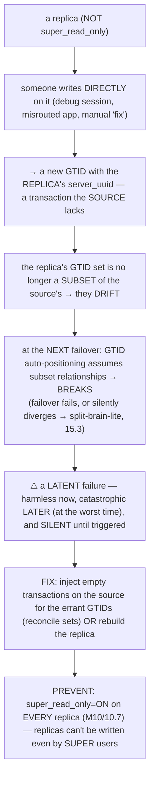

# M15 · Pass C — Diagrams & Worked Catastrophes · Scenarios 15.1–15.6

> **Pass C scope:** content-contract items **#12 Diagram(s)** and **#8 Worked example** (the *catastrophe + its recovery*, narrated, no code in prose). Pairs with `01-…`. Scenarios 15.1/15.2/15.3/15.5/15.6 use **★ bespoke custom SVGs**; matrices inline. Domain: payments/wallet, the ledger. Each ends with the **💰 money verdict**.

---

## 15.1 · How to think about failure (the discipline) ★

**★ Diagram (custom SVG):**

![The failure mindset. The worst failures are silent (the data is wrong but nothing errors — no exception, no alert, just incorrect money: a lost commit, a forked replica, a corrupt page, an app race) and rare (they strike at the worst moment — a power loss, a partition, a bad deploy — when you're least prepared). Silent plus rare plus money is the worst combination — it festers undetected until reconciliation catches it (or a customer complains). The discipline against silent and rare: (1) Know the failure modes in advance (this catalog); (2) Watch the early-warning signals — catastrophes build up; (3) Test recovery — proven to work, the disaster is not the first time; (4) Reconcile — detect what slipped through. It turns "the system is correct" into "and here's exactly what I do when it isn't"; assume failures will happen, design to detect, recover, and prevent.](assets/15.1-failure-mindset.svg)

**Worked example — why a "correct" payments system needs a failure-modes chapter at all.**
A team has built a *correct* payments platform (M01–M14): ACID transfers, durable commits, replicated and sharded, distributed-correct, operable. They might ask: *why a chapter on failure?* The SVG answers: because the platform handles the *expected* — it's the *unexpected catastrophes* (the silent, rare ones) that destroy money, and they're *different in kind* from ordinary bugs. A normal bug *errors* (you see it, you fix it). A silent failure *doesn't* — a flipped bit in a balance (15.5), a lost-but-acknowledged commit (15.2), a forked replica (15.3), an app-level lost update (15.9) — the system keeps running, the data is just *wrong*, and you act on it as truth. And they're *rare* — they correlate with disasters (power loss, partitions, bad deploys), striking when you're least prepared and accumulating latently (an untested backup rots for a year, 15.10; an errant transaction sits until the next failover, 15.4). For *money*, silent + rare is uniquely dangerous: the loss is real, often irreversible, and *undetected* until reconciliation (M12/12.14) catches it — *if* you reconcile. So the discipline (the SVG's four steps): **know** the modes (this catalog — you can't react to a failure you've never heard of), **watch** the early-warning signals (M13/13.11 — most catastrophes build up: HLL climbs, disk fills, lag grows, semi-sync degrades), **test** recovery (M13/13.5 — *proven*, because the disaster is the wrong time to find out it doesn't work), and **reconcile** (M12/12.14 — independently verify, to detect what slipped through). This chapter turns "the system is correct" into "and here's exactly what I do when it isn't" — which, for money, is the difference between a robust platform and one catastrophe away from disaster. **💰 Verdict:** for money, "did it get lost/duplicated?" must be *answerable* — requiring reconciliation as the detector and tested recovery as the remedy. A system that can't answer the question has *already* failed money-never-lies, before any catastrophe.

---

## 15.2 · Lost transactions on crash (the durability window) ★

**★ Diagram (custom SVG):**

![Lost transactions on crash. With flush_log=1 plus sync_binlog=1 (the money settings), fsync every commit before "committed" is returned, so a crash loses nothing (crash recovery replays the redo), and semi-sync survives total primary loss too. With flush_log=2 (write to OS cache, fsync about every second): a mysqld crash loses nothing (the OS still has it), but an OS or power crash loses about 1 second of confirmed commits — confirmed transfers vanish. With flush_log=0 / sync_binlog=0: fsync about every second regardless, so even a mysqld crash loses about 1 second, and sync_binlog=0 also creates a binlog gap (no PITR). Promote-before-apply: an async replica promoted before applying its relay log loses the un-applied transfers, so choose the freshest replica. Why: durability is a chain (app to OS cache to disk cache to platter); durable means fsync'd through to stable storage, and a crash loses whatever was acknowledged but not yet fsync'd — the window size is the config. Verdict: money lost unless 1/1 plus semi-sync; prevention is 1/1 plus semi-sync (group commit amortizes the cost); detection is reconciliation; recovery is re-driving lost transactions idempotently.](assets/15.2-crash-loss-windows.svg)

**Worked example — a power loss with `flush=2`: the last second of confirmed transfers, gone.**
A payments platform runs with `innodb_flush_log_at_trx_commit=2` (someone set it for "throughput"). Transfers commit and the platform tells customers "paid." Then a **power loss** hits the datacenter. On restart, crash recovery (M09) runs — but `flush=2` means commits were written to the *OS page cache* and only fsync'd to disk *~every second* (the SVG). The power loss took the OS cache with it → **the last ~1 second of commits that were acknowledged but not yet fsync'd are *gone*.** Those were *confirmed* transfers — customers were told "paid," money was debited — and now, after recovery, *they don't exist*. Worse, the database *doesn't know it lost them* (it recovered to its last durable state; it has no record of what it lost) — it's *silent*. Without reconciliation, the platform might never know — until customers complain ("I paid but it's not showing") or the external processor's records disagree. **The recovery:** PITR can't help (if `sync_binlog≠1`, the binlog lost them too, 15.7); the recovery is **reconciliation** (M12/12.14 — compare against the external processor's records to find exactly which transfers are missing) + **re-driving** them idempotently (M12/12.9 — re-process from the source-of-truth, so re-processing doesn't double-apply). **The prevention** (the SVG's green box): `flush_log_at_trx_commit=1` + `sync_binlog=1` (the *money settings* — fsync every commit *before* acking, so a crash loses *nothing*, M09) + **semi-sync** (M10/10.4 — the commit is durable on a *replica* too, surviving even total primary-node loss). With 1/1 + semi-sync, the window is *closed* — no confirmed transfer is ever lost. The throughput cost is mitigated by **group commit** (M09/9.11 — many commits fsync together). **💰 Verdict:** **money LOST** (confirmed transfers vanish silently) — *unless* 1/1 + semi-sync (then **nothing lost**). The lesson: **for money, the durability window must be closed** — a weaker config silently loses confirmed money on a crash, and the database won't even tell you.

---

## 15.3 · Source/replica divergence & split-brain ★

**★ Diagram (custom SVG):**

![Split-brain. Cause: a partition where both sides keep serving, or a botched failover that promotes a replica without fencing the old primary — the single-writer assumption violated without enforcement. Node A (thinks it's primary) applies transfer T1 (account 7 to $50) and T2 (account 7 to $30), GTID set 1-2. Node B (also accepting writes, no comms with A) applies T3 (account 7 to $80) and T4 (account 7 to $120, conflicts), GTID set 3-4, disjoint. The ledger forked — two conflicting versions, both with real money movements, no automatic merge; which of two conflicting transfers on account 7 is real? Both debited real money, so manual lossy reconciliation, the worst recovery. Prevention (the only good option): fencing/STONITH (kill or isolate the old primary before promote) or quorum (the minority refuses writes) plus super_read_only. Recovery (slow, manual, lossy): stop both, pick authoritative, GTID set-diff the other, manually reconcile each conflict against external records. Verdict: money duplicated/forked and effectively lost — the worst catastrophe, unrecoverable cleanly; fence before promote, always.](assets/15.3-split-brain.svg)

**Worked example — a failover that didn't fence the old source → two conflicting ledgers.**
The payments primary becomes unresponsive (it's actually just slow/partitioned, not dead). The failover automation promotes a replica to primary — but it *doesn't fence the old primary* (it assumed it was dead). Now the old primary "recovers" (it was never gone) and *keeps accepting writes* — so there are **two primaries**, both taking transfers (the SVG). Transfers route to *both* (depending on which the app reaches): account 7 gets a $50-then-$30 sequence on Node A, and a *conflicting* $80-then-$120 sequence on Node B. The ledger has **forked** into two incompatible versions — both containing *real money movements*, their GTID sets *disjoint* (each has transactions the other lacks). This is *worse than data loss*: with loss, you know what's missing; with a fork, you have *two conflicting truths*, both real, and *no automatic way to merge them* (which of the conflicting account-7 transfers is "the real balance"? both debited real money). **The recovery** (the SVG's purple box — slow, manual, lossy): stop *both* nodes (no more divergence), pick one as authoritative (by business rules — usually more/critical writes), compute the GTID set-difference (M10/10.7 — the transactions the other has that the authoritative lacks), and **manually reconcile each conflicting transaction** against the external processor's records (M12/12.14) to decide which are legitimate and re-apply them. It's the *worst* recovery in the module — slow, manual, and inevitably lossy (some decisions can't be made cleanly). **The prevention** (the SVG's green box, the *only* acceptable strategy): **fencing/STONITH** (on failover, *forcibly* isolate/kill the old primary — power off, network ACL — *before* promoting, so it *can't* keep writing, M10/10.11) OR **quorum/consensus** (group replication — a partitioned minority *refuses* writes, structurally preventing a second writer, M10/10.9) + **`super_read_only`** on replicas. The hard truth: **fencing beats reconciliation** — preventing the fork is the *only* good option, because reconciling one is a manual nightmare. **Never fail over without fencing.** **💰 Verdict:** **money DUPLICATED/FORKED and effectively LOST** — the *worst* money catastrophe, **unrecoverable cleanly**. The lesson: **fence before promote, always** (M10/10.11).

---

## 15.4 · Errant transactions & GTID drift

**Diagram — the errant-transaction path:**

**Worked example — a debugging write on a replica that silently breaks the next failover.**
An engineer debugs an issue by connecting to a *replica* (it's read-only-*ish*, seems safe) and runs a quick `UPDATE` to test something — *not* realizing the replica isn't `super_read_only` (the Mermaid). That write gets a *new GTID* (the replica's own server_uuid) that the *source* and *other replicas* don't have. Nothing breaks *now* — the write is harmless, forgotten. But weeks later, the primary fails and the automation tries to fail over — promoting this replica, or re-pointing others to it. GTID auto-positioning (M10/10.7) assumes every node's transactions are a *subset* of the source's history; the errant GTID *violates* this (the replica has a transaction no one else does) → the **failover breaks** (a node expects transactions it can't find, or has extras the math can't reconcile) — *exactly when you need HA most*. Or worse, it *silently diverges* (the errant transaction's effects spread inconsistently → split-brain-lite, 15.3). **The fix:** detect via GTID-set comparison (the replica's `gtid_executed` has GTIDs the source lacks), then either *inject empty transactions* on the source for the errant GTIDs (so the sets reconcile — the standard repair) or *rebuild the replica* from a fresh backup. **The prevention:** **`super_read_only=ON`** on *every* replica (M10/10.7 — even `SUPER` users can't write; the replica is *truly* read-only, so no errant transaction can ever be created) + GTID-drift monitoring (M10/10.12). `super_read_only` is the single prevention. **💰 Verdict:** **money at RISK indirectly** — the errant write is small, but it *breaks failover* (HA loss) or *seeds divergence* (split-brain, 15.3 — forked ledger). The lesson: **replicas must be *truly* read-only** — a "harmless" replica write is a latent HA/divergence catastrophe.

---

## 15.5 · Silent / phantom corruption (bit rot, lying disks, torn pages) ★

**★ Diagram (custom SVG):**

![Silent corruption: data turns wrong with no error. Three sources: bit rot (a stored bit flips — cosmic rays, failing/aging media, controller bugs — a balance silently changes); lying disks (the disk says fsync'd but the data was in a volatile cache lost on power-fail, so the durable data is missing or old); torn/partial page (a crash mid-write of a 16KB page leaves it half-old, half-new because disks write in 4KB sectors — a corrupt page). The terror: wrong data with no error — you read it as truth (authorize against a corrupt balance), and corruption replicates and gets into backups, undetectable until a checksum mismatch on read, reconciliation, or a customer complaint. The defenses: page checksums (every page has a checksum; a mismatch on read is detected and the page refused, plus CHECK TABLE to scan); the doublewrite buffer (pages written twice, so a torn write is recoverable from the intact copy — torn pages auto-recovered); honest fsync (disable volatile disk caches, ECC RAM, ZFS) plus reconciliation for logical corruption. Verdict: money silently wrong (corrupt balances acted on as truth) — the silent catastrophe; defend and detect because you won't get an error; recover via restore plus PITR.](assets/15.5-corruption.svg)

**Worked example — a flipped bit in a balance page that page checksums catch.**
An account's balance is stored on a 16KB InnoDB page on disk. Over time (or from a cosmic ray, or failing media), **a single bit in that page flips** (the SVG's bit rot) — silently changing the stored balance from, say, $1,000 to $1,512 (a flipped bit in the binary representation). *Nothing errors* — the bit is just *wrong* on disk. This is the *silent* catastrophe: if the page were read and used *as-is*, the platform would authorize against a *corrupt* balance, report corrupt totals, and the corruption would *replicate* (if a write based on it goes to the binlog, M10) and *get into backups* (you'd back up the corruption — "your backup is corrupt too"). **The defense that catches it:** InnoDB's **page checksums** (M09 — every page stores a checksum computed over its contents). On the *next read* of that page, InnoDB *recomputes* the checksum and finds it *doesn't match* (the flipped bit changed the contents but not the stored checksum) → InnoDB **detects the corruption**, *refuses the page* (logs an error, doesn't serve corrupt data), rather than silently returning the wrong balance. **The recovery:** restore the page/table from a *verified-not-corrupt* backup + PITR (M13/13.3), or `CHECK TABLE` + repair, or (if InnoDB won't start) `innodb_force_recovery` to extract + rebuild (15.6) — then **reconcile** (M12/12.14) to confirm correctness. **The torn-page case** the SVG also shows: the **doublewrite buffer** (M09) *prevents* corruption from a crash mid-page-write — InnoDB wrote the page to the doublewrite area *first*, so crash recovery restores the intact copy (torn pages are *automatically* recovered). **The prevention:** page checksums ON, doublewrite buffer ON, honest fsync (M09/9.7 — no lying disks), ECC RAM/ZFS, and **reconciliation** (M12/12.14 — for *logical* corruption that checksums can't catch: a balance that's internally consistent but wrong relative to its entries). **💰 Verdict:** **money silently WRONG** (corrupt balances acted on as truth) — the *silent* catastrophe. The lesson: **corruption is silent — defend (checksums + doublewrite + honest fsync) and detect (reconcile), because you won't get an error** (and checksums are what *give* you the error you otherwise wouldn't get).

---

## 15.6 · innodb_force_recovery: the last resort (levels 1–6) ★

**★ Diagram (custom SVG):**

![innodb_force_recovery, the last-resort salvage when InnoDB won't even start because corruption broke recovery. The six levels coax the server up just to dump the data, each higher one more dangerous: level 1 (ignore some corruption, safest), 2 (don't run purge/background threads), 3 (don't roll back uncommitted transactions), 4 (skip insert-buffer merge; 4 and up force read-only), 5 (don't read the undo logs — inconsistent), 6 (don't even apply the redo log — most dangerous, can corrupt further). The correct procedure (a salvage, not a fix): (1) the lowest level that starts, (2) go read-only, (3) mysqldump to get the ledger out, (4) build a fresh server and reload, (5) reconcile because force_recovery may extract inconsistent data — never run production on a forced server. Verdict: money at risk of being wrong (may extract inconsistent data) so must reconcile before trust; the real prevention is tested backups plus healthy replicas, so you restore-clean instead of salvage and never need force_recovery.](assets/15.6-force-recovery.svg)

**Worked example — a corrupt InnoDB that won't start → force_recovery to dump the ledger → rebuild fresh.**
Severe corruption (bit rot in the system tablespace, a torn write to a critical structure, 15.5) has damaged InnoDB's *own* internals so badly that **crash recovery fails** — InnoDB detects the corruption and *refuses to start* (to avoid making it worse). The ledger is *inside* this dead server, and the platform is down. `innodb_force_recovery` is the emergency salvage (the SVG's ladder). **The correct procedure:** **(1)** Set `innodb_force_recovery=1` (the *lowest* level) and try to start — if it still won't start, increment (2, 3, ...) but **stop at the lowest level that works** (each higher level disables more safety and is *more dangerous* — level 6 doesn't even apply the redo log and can *corrupt further*). Say level 3 gets it up. **(2)** The server is now up but **read-only** (levels ≥4 force this; you go read-only regardless to avoid writing to a corrupt state). **(3)** **`mysqldump`** the ledger — *extract the money* while you can. **(4)** Build a **fresh, clean server** and **reload** the dump. **(5)** **Reconcile** (M12/12.14 — *critically*, because force_recovery may have extracted *inconsistent* data: it skipped some recovery steps, so the dumped ledger might have uncommitted-but-not-rolled-back transactions or other inconsistencies — verify balance = Σ entries against external records before trusting it). **(6)** Resume on the clean server. *Never* run production on the forced server. **The real prevention** (the SVG's bottom): **tested backups + healthy replicas** (M13/13.5, M10) — because if you have a *verified clean backup* or a *healthy replica*, you **restore-clean / fail over** instead of risking force_recovery's salvage (restoring a verified backup is *far* safer than extracting from a corrupt server). force_recovery is the resort *when you have no good backup/replica* — so the prevention is *having* them. **💰 Verdict:** **money at RISK of being WRONG** (force_recovery may extract *inconsistent* data) — so the extracted ledger *must* be reconciled (M12/12.14) before trust. The lesson: **force_recovery is a last-resort salvage — dump, rebuild, reconcile, never run production on it; a tested backup/replica means you never need it.**

---

*Diagrams + worked catastrophes for 15.1–15.6 complete (5 ★ custom SVGs + 1 Mermaid). Next Pass C file: 15.7–15.11 (★ PITR-gap, lost-update, untested-backup SVGs + Mermaid for dropped-table, disk-full).*
