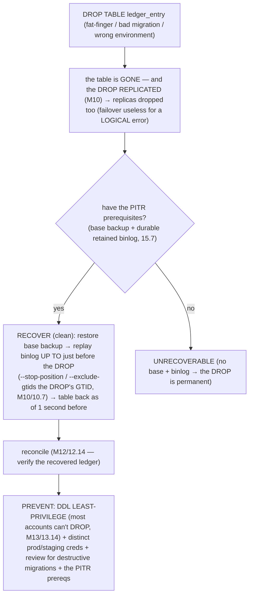
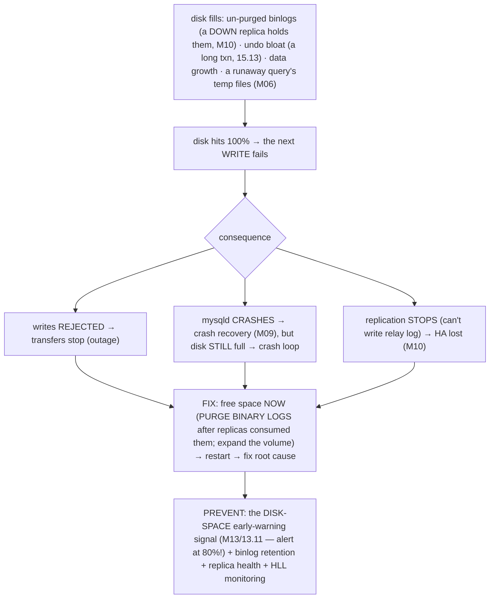

# M15 · Pass C — Diagrams & Worked Catastrophes · Scenarios 15.7–15.11

> **Pass C scope:** **#12 Diagram(s)** + **#8 Worked example** (the catastrophe + recovery). Pairs with `02-…`. Scenarios 15.7/15.9/15.10 use **★ bespoke custom SVGs**; 15.8/15.11 use Mermaid. Domain: payments/wallet, the ledger. Each ends with the **💰 money verdict**.

---

## 15.7 · Binlog / redo loss & PITR gaps ★

**★ Diagram (custom SVG):**

![A PITR gap on a timeline. The base backup, then a stretch of binlog that's OK (replayable), then a gap (missing or corrupt), then more OK binlog, then the disaster. You can only restore to before the gap, losing everything since. How the gap happens: retention too short (binlogs purged before the window), sync_binlog=0 (a crash lost recent binlog events), a corrupt binlog file, or no base backup in the binlog's range. Prevention: sync_binlog=1 (durable, no crash gap — the money setting), retention at least the recovery window plus archive off-host, frequent base backups (short replay distance), and tested PITR drills (reveal the gap before disaster). Verdict: money unrecoverable in the gap (coarse restore loses the window) — a recovery catastrophe; the binlog's durability and retention directly gate recoverability; a tested drill reveals the gap, reconciliation finds what's lost.](assets/15.7-pitr-gap.svg)

**Worked example — a bad `DELETE` you *can't* PITR-recover because the binlog wasn't durable.**
A bad deploy runs a catastrophic `DELETE` on the ledger at 14:30. The on-call engineer reaches for **PITR** (the standard recovery, M13/13.3): restore the base backup, replay the binlog to 14:29:59, done — *except* the platform was running `sync_binlog=0` (someone set it for "throughput"). With `sync_binlog=0`, the binlog events were written to the *OS cache* and only flushed *periodically* — and a *separate* incident earlier (a brief crash) had lost the un-flushed binlog events, leaving a **gap** in the binlog (the SVG's red segment). Now PITR *can't replay across the gap* — the engineer can only restore to *before* the gap, **losing all the transfers between the gap and the disaster** (hours of legitimate money movement), *not* just surgically removing the bad `DELETE`. The recovery they *counted on* (precise PITR) has a *hole* exactly where they need it. This is *the* PITR gap: you *thought* you could rewind to any moment, but a durability/retention failure in the binlog means *that window is gone*. **The recovery** (limited): restore to before the gap (coarse — lose the window) + **reconcile** (M12/12.14 — find what's missing vs the external processor's records) + **re-drive** the lost transfers idempotently (M12/12.9 — if the external source still has them). There's no clean recovery for a true gap. **The prevention** (the SVG's green box): **`sync_binlog=1`** (durable binlog — no crash gap, the *money setting*, M09) + **retention ≥ the recovery window** + **off-host archive** (a host loss doesn't lose binlogs) + **frequent base backups** (short replay distance → good RTO) + **tested PITR drills** (M13/13.5 — *the key*: a drill *attempts the replay* and *reveals the gap* before a real disaster). **💰 Verdict:** **money UNRECOVERABLE in the gap** (coarse restore loses the window) — a *recovery* catastrophe. The lesson: **a PITR gap is the recovery you didn't have — make the binlog durable (`sync_binlog=1`) + retained, and *test* the replay** (a drill finds the gap before disaster does). The binlog's durability (M09) and retention (M13) *directly gate* recoverability.

---

## 15.8 · Recovering a dropped table / database

**Diagram — the dropped-table recovery:**

**Worked example — recovering the accidentally-dropped `ledger_entry` table to one second before the `DROP`.**
A migration script meant for staging runs against *production* and executes `DROP TABLE ledger_entry` (the Mermaid) — instantly removing every ledger record. And because `DROP` is a real DDL, it **replicated** to *all* replicas (M10) — so the standard "node loss → failover" recovery is *useless* (the `DROP` propagated everywhere; every copy is dropped). The *only* recovery is **backup + PITR** — and it's *clean* (the most cleanly-recoverable catastrophe) *if* the prerequisites exist. **The recovery:** restore the most recent base backup (to before the `DROP`), then replay the binlog *up to just before* the `DROP` statement — using `--stop-position` at the `DROP`, or `--exclude-gtids` for the `DROP`'s specific GTID (M10/10.7) — recovering `ledger_entry` as of *one second before* the `DROP`, with every legitimate transfer up to that point intact. Then **reconcile** (M12/12.14) to verify. **The catch:** this *requires* the PITR prerequisites (a base backup + a durable, retained binlog, 15.7) — *without* them, the `DROP` is *permanent* (unrecoverable). **The prevention:** **DDL least-privilege** (M13/13.14 — most accounts, including the app's, *can't* `DROP`; only a tightly-controlled admin role can — so a wrong-environment script *fails on privilege* instead of dropping the ledger) + distinct prod/staging credentials + review gates for destructive migrations + the PITR prerequisites (so even if a `DROP` slips through, it's recoverable). **💰 Verdict:** **money RECOVERABLE** (cleanly, via PITR to just before the `DROP`) — *if* you have the prerequisites; **UNRECOVERABLE** without them. The lesson: **a dropped table is cleanly PITR-recoverable with backups + binlog — which is why the PITR prerequisites (15.7) and DDL least-privilege (M13/13.14) matter.**

---

## 15.9 · App-level loss the DB faithfully persists (lost updates, RMW races) ★

**★ Diagram (custom SVG):**

![The lost-update race: the DB is correct, the app is wrong. Transfer X (debit $80) and Transfer Y (debit $80) interleave. X: (1) SELECT balance reads $100. Y: (2) SELECT balance also reads $100. X: (3) compute 100 minus 80 equals 20. Y: (4) compute 100 minus 80 equals 20. X: (5) UPDATE balance equals 20, commits. Y: (6) UPDATE balance equals 20, overwrites X. Result: balance is $20 after two $80 debits (should be minus $60, i.e. one rejected); X's update is lost — the DB persisted both writes faithfully, the app lost an update, invisible to CHECK TABLE and checksums. Prevention (make it concurrency-safe): atomic conditional UPDATE setting balance equals balance minus amount WHERE balance is at least the amount (no read-then-write gap), or SELECT FOR UPDATE, or an optimistic version column. Detection plus recovery: reconcile (balance not equal to sum of entries reveals it), recover by re-deriving from the immutable ledger (the entries are truth; the derived balance can be wrong). Verdict: money lost by the app — the DB can't save you from app races; use atomic ops plus idempotency, reconcile against the immutable ledger.](assets/15.9-lost-update.svg)

**Worked example — two concurrent transfers losing an update.**
This is the subtlest catastrophe — *the database does exactly what it's told, correctly and durably, but the **application** loses money* (the SVG's race). Two transfers debit $80 each from an account with $100, concurrently, using a *read-modify-write* pattern (the naive app code: `SELECT balance` → compute in the app → `UPDATE balance = computed`). They interleave: **both** `SELECT` the balance and read **$100** (steps ①②); **both** compute `100 − 80 = 20` (③④); **both** `UPDATE balance = 20` (⑤⑥) — and the second `UPDATE` **overwrites** the first. Result: the account shows **$20** after *two* $80 debits — but two $80 debits from $100 should leave the account *overdrawn* (one transfer should have been **rejected** for insufficient funds). **X's update was *lost*** — $80 of money movement vanished. And here's the terror: **the database did *nothing* wrong** — it faithfully serialized the two `UPDATE`s and stored what it was told ($20). The *wrongness* is *logical* (the balance is wrong relative to the transfers) — **invisible to `CHECK TABLE`, page checksums, crash recovery** (all DB-level integrity checks; the DB is internally consistent). It's the catastrophe *the database can't catch for you*. **The prevention** (the SVG's green box — make the app concurrency-safe): an **atomic conditional `UPDATE`** — `UPDATE account SET balance_minor = balance_minor - :amt WHERE account_id=:a AND balance_minor >= :amt` — which does the read-check-write *atomically in one statement* (no read-then-write gap; the second transfer's `UPDATE` sees the *already-debited* balance and its `WHERE balance >= :amt` *fails* → correctly rejected, M07/7.16). OR `SELECT … FOR UPDATE` (lock the row, serialize the transfers, M08). OR an optimistic version column. **The detection + recovery:** **reconciliation** (M12/12.14 — re-derive the balance from the *immutable ledger entries*; a lost update shows as balance ≠ Σ entries) → **recover** by re-deriving the correct balance from the entries (M01/1.17 — the immutable entries are the *truth*; the *derived* balance can be wrong) and re-applying the lost transfer idempotently (M12/12.9). **💰 Verdict:** **money LOST by the app** (a lost update = wrong balance; the DB is correct, the app is wrong) — the *silent application* catastrophe, invisible to DB integrity checks. The lesson: **the DB can't save you from app-level races — use atomic operations (or locking/optimistic concurrency) + idempotency, and reconcile against the immutable source of truth.**

---

## 15.10 · The backup that won't restore ★

**★ Diagram (custom SVG):**

![The backup that won't restore — M13/13.5's warning realized. "Backup succeeded" every night for a year, based on did it run, not can it restore — so silent failures accumulate undetected, discovered only when you try to restore (during the disaster). Disaster: you go to restore and it doesn't work — corrupt (silent bit-rot or a backup bug), incomplete (a table silently excluded), un-decryptable (the key was lost or rotated), or missing the binlog (no PITR) — so data is gone AND recovery is gone. Prevention (the only one): tested restores — automated restore drills to a scratch instance, apply PITR, verify with checksums plus reconciliation, catching every silent failure before the disaster, plus multiple backup types, off-site, key management. You don't have backups, you have restores. Mid-disaster recovery (damage limitation): try other backups, a replica, or a logical dump, salvage via force_recovery, reconstruct from external processor records — there's no clean recovery, which is the point. Verdict: money permanently lost — the operational catastrophe, entirely preventable by tested restores; backup succeeded does not equal restore works.](assets/15.10-untested-backup.svg)

**Worked example — the nightly backup that "succeeded" for a year and couldn't restore.**
This is M13/13.5's catastrophe *realized* (the SVG). The payments platform's nightly backup reports **"success"** every night for a year — green checkmarks, no errors, everyone assumes they're protected. The "success," though, only means the backup *ran* — *not* that it can *restore*. So *silent* failures accumulate undetected: the backup files slowly bit-rot (15.5); a config change silently excluded the `ledger_entry` table; the encryption key was rotated and the old one discarded (so the year's backups can't decrypt, M13/13.14); the binlog wasn't archived alongside (so no PITR, 15.7). *None* of these failed the *backup job* — they fail the *restore*, discovered only when the platform suffers a disaster and *tries to restore* — and finds the backup **doesn't work**. Now the data is gone *and* the recovery is gone — the *worst-timed* failure (mid-disaster, when the backup was the last line of defense). For money, the ledger is *permanently* lost. **The mid-disaster recovery** (the SVG's purple box — damage limitation, not clean recovery): try *other* backups (an older one? a replica? a logical dump alongside the physical?), salvage what's readable (`force_recovery` on the corrupt source, 15.6), and **reconstruct from external records** (M12/12.14 — rebuild as much as possible from the payment processor's settlement data). It's a *scramble* — there's no clean recovery, which is the *point*. **The prevention** (the SVG's green box — *the* prevention): **tested restores** (M13/13.5) — *automated, frequent* restore drills that restore the backup to a scratch instance, apply PITR, and **verify** (checksums + **reconciliation** — the recovered ledger is *correct*). This catches *every* silent failure (corruption → restore fails; incompleteness → reconciliation mismatch; key loss → decryption fails; missing binlog → PITR fails) *before* the disaster. The failure was *latent for a year* — catchable by a single drill. "You don't have backups, you have restores" (M13/13.5). **💰 Verdict:** **money PERMANENTLY LOST** (data gone *and* the backup can't restore it) — the *operational* money catastrophe, and *entirely preventable* by tested restores. The lesson: **"backup succeeded" ≠ "restore works" — test the restore, or discover during the disaster that you have neither.** This is *the* M13/13.5 cautionary tale, realized.

---

## 15.11 · Disk-full / out-of-space mid-write

**Diagram — disk-full → failure → prevention:**

**Worked example — the ledger's disk fills from un-purged binlogs mid-transfer.**
A read-replica goes down (hardware fault) and *stays* down for days. The primary, per replication semantics (M10), **retains its binlogs until the replica catches up** (so the replica won't miss events when it returns) — but with the replica *down for days*, the binlogs **pile up**, and the primary's disk creeps toward full: 80% → 95% → 99% → **100%** (the Mermaid). Now the *next write fails* — a transfer tries to commit, can't write the binlog (disk full), and **errors**; or mysqld *crashes* on the full disk (and on restart, the disk is *still* full → a *crash loop*); or replication to the *other* replicas stops (can't write relay logs). For the payments platform, **transfers stop** (an outage) — and it's a *predictable* failure (the disk didn't fill suddenly; it crept up *un-watched*). **The fix:** free space *immediately* — `PURGE BINARY LOGS` (*after* confirming the surviving replicas/CDC consumed them, M10/M12 — don't purge un-consumed binlogs!), or expand the volume (cloud) — then restart if crashed (crash recovery, M09 — durable *if* config is 1/1, 15.2). Then **fix the root cause**: restart the down replica (so binlogs purge normally). Reconcile (M12/12.14) if any write was lost at the failure point. **The prevention** (the key): **the disk-space early-warning signal** (M13/13.11 — alert at *80%*, well before full → add space / purge proactively / fix the down replica) + binlog retention limits + replica-health monitoring (so a down replica is fixed *before* its held binlogs fill the disk) + HLL/long-transaction monitoring (15.13). A *predictable, gradual* failure should *never* be a surprise outage. **💰 Verdict:** **money movement STOPS (outage), possible corruption** at the failure point — a *predictable, preventable* operational catastrophe. The lesson: **a full disk is a predictable failure — watch disk space (M13/13.11) and it's never a surprise; ignore it and it's an outage.**

---

*Diagrams + worked catastrophes for 15.7–15.11 complete (3 ★ custom SVGs + 2 Mermaid). Next Pass C file: 15.12–15.16 (Mermaid for OOM/HLL-bloat/SBR-break + ★ triage-tree & prevention-checklist SVGs).*
