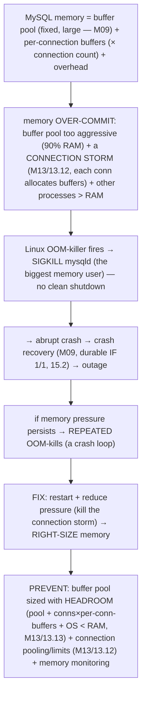
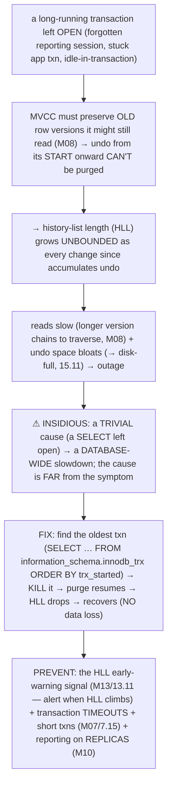
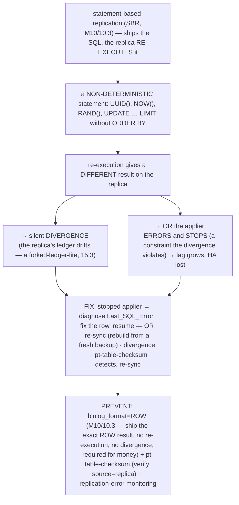

# M15 · Pass C — Diagrams & Worked Catastrophes · Scenarios 15.12–15.16

> **Pass C scope:** **#12 Diagram(s)** + **#8 Worked example** (the catastrophe + recovery). Pairs with `03-…`. Scenarios 15.15/15.16 use **★ bespoke custom SVGs** (the flagship triage tree + prevention checklist); 15.12/15.13/15.14 use Mermaid. Domain: payments/wallet, the ledger. Each ends with the **💰 money verdict**.

---

## 15.12 · OOM-killer victimizing mysqld

**Diagram — the OOM path:**

**Worked example — a connection storm + an over-sized buffer pool → OOM-kill.**
The payments primary is configured with an *aggressive* buffer pool (90% of RAM — someone maximized it for caching). Then a **connection storm** hits (a traffic spike, or a retry storm from M12's idempotent retries, M13/13.12) — hundreds of new connections open, and *each* allocates **per-connection buffers** (sort buffer, join buffer, etc.). Now total memory demand = the 90%-RAM buffer pool + (hundreds of connections × per-connection buffers) + the OS + other processes — which **exceeds RAM** (the Mermaid). Linux over-committed (let the allocations succeed optimistically); when the memory is actually *touched* and runs out, the **OOM-killer fires** and kills **mysqld** (the biggest memory user) with `SIGKILL` — an *abrupt* crash (no clean shutdown). The platform goes down; on restart, crash recovery runs (M09 — durable *if* config is 1/1, 15.2). And if the memory pressure *persists* (the storm continues), mysqld gets OOM-killed *repeatedly* — a **crash loop** (a sustained outage). **The fix:** restart mysqld; reduce memory pressure (kill the connection storm, M13/13.12); then **right-size memory**. **The prevention** (the root cause is mis-sizing): **size the buffer pool with *headroom*** (buffer pool + max-connections × per-connection-buffers + OS should be *comfortably* < RAM — *not* 90%+, M13/13.13) + **bound connections + pool** (M13/13.12 — so per-connection memory is bounded and a storm can't explode it) + memory monitoring (alert on pressure before OOM). It's a *capacity-planning* prevention — fit the memory budget. **💰 Verdict:** **money movement STOPS (outage)**; the crash itself is recoverable if durability is 1/1 (15.2). The lesson: **an OOM-kill is a mis-sizing — fit buffer pool + connections × per-conn-buffers within RAM, with headroom** (this is *why* M13/13.13 warns against a 90%+ buffer pool and M13/13.12 bounds connections).

---

## 15.13 · Undo / history-list bloat from a forgotten long transaction

**Diagram — the HLL-bloat path:**

**Worked example — a reporting transaction left open overnight → HLL in the millions.**
An analyst runs a big reporting query inside a transaction on the *primary* (not a replica) and, at end of day, *leaves the session open* (or an app bug leaves a transaction uncommitted) — a *forgotten* long transaction (the Mermaid). Under REPEATABLE READ (the default, M08), that transaction holds a *consistent snapshot* for its *entire* duration — so InnoDB *can't purge* the undo logs for *any* row version changed *since the transaction started* (it might still read those old versions). Overnight, *every transfer* (every change) *accumulates* undo that can't be reclaimed → the **history-list length (HLL) grows into the millions**. The effects compound *silently*: every read now traverses *huge version chains* (M08 — to find the right version, it walks back through millions of undo records) → reads slow to a crawl; and the undo space *bloats* toward disk-full (15.11). By morning, the *whole platform* is degraded — transfers slow, then stall → an outage. The *insidious* part: a **trivial cause** (one `SELECT` left open) caused a **database-wide catastrophe**, and the *cause* (a forgotten transaction) is *far* from the *symptom* (everything slow) — hard to diagnose without knowing to look at HLL. **The fix** (fast, once you know): `SELECT * FROM information_schema.innodb_trx ORDER BY trx_started` to find the *oldest* transaction (M08), `KILL` it → purge *immediately resumes* → undo reclaims → HLL *drops* → performance *recovers*. **No data is lost** (it's a performance/space problem, not a data problem — fully recoverable). **The prevention** (the key): **the HLL early-warning signal** (M13/13.11 — alert when HLL climbs past a threshold → find and kill the long transaction *before* it bloats) + **transaction timeouts** (don't let transactions stay open indefinitely) + **short transactions** (M07/7.15) + **run reporting on replicas** (M02/2.17, M10 — not the primary). The HLL alert turns a *silent overnight bomb* into a caught-early non-event. **💰 Verdict:** **money movement DEGRADES then STOPS (outage)** — but **no data lost/duplicated** (fully recoverable by killing the transaction). The lesson: **one forgotten transaction can take down the database — watch HLL (M13/13.11), enforce transaction timeouts, keep transactions short** (this is *why* M08/M09 emphasized HLL and M13/13.11 made it an early-warning signal).

---

## 15.14 · Replication breaks on a non-deterministic statement / data drift

**Diagram — the SBR-break path:**

**Worked example — a `DELETE … LIMIT` without `ORDER BY` under SBR diverging the replica ledger.**
The platform runs **statement-based replication** (SBR — someone chose it for compact binlogs). A cleanup job runs `DELETE FROM ledger_staging WHERE processed = 1 LIMIT 1000` — *without* an `ORDER BY` (the Mermaid). Under SBR, the binlog ships the *statement*, and the replica *re-executes* it — but `DELETE … LIMIT 1000` *without `ORDER BY`* may delete a **different set of 1000 rows** on the replica (the order isn't guaranteed, so "the first 1000" differs) → the replica's data **diverges** from the source's (different rows deleted). Now the source and replica *disagree* — a *forked-ledger-lite* (15.3): if you fail over to this replica, you get the *wrong* data. Or, if the divergence violates a constraint (a row the replica still has but the source deleted, referenced by another), the **applier errors and *stops*** → replication breaks → the replica *falls behind* (lag, M10/10.5 → stale reads, money bugs) → *HA is lost* (the replica can't be a failover target). Either outcome stems from a *preventable* config choice (SBR for money). **The fix:** for a *stopped* applier, diagnose `Last_SQL_Error` (M10), fix the diverging row, resume — or, if diverged, **re-sync the replica** (rebuild from a fresh backup, M13/13.2 — a clean copy). For *silent* divergence, detect it with **`pt-table-checksum`** (compares source vs replica row-by-row), then re-sync. **The prevention** (the SVG's principle): **`binlog_format=ROW`** (M10/10.3 — ships the *exact row result* the source computed, no re-execution → *no* non-deterministic divergence, *the* prevention, required for money) + **`pt-table-checksum`** (periodic source=replica verification) + replication-error/lag monitoring (M10/10.12, M13/13.11). ROW format is the single prevention; SBR should *never* be used for money. **💰 Verdict:** **money copy DIVERGES (wrong replica ledger) or HA LOST (stopped applier)** — a *self-inflicted, preventable* catastrophe. The lesson: **never use statement-based replication for money — ROW format prevents non-deterministic divergence; verify with checksums** (this is M10/10.3's hazard *realized*).

---

## 15.15 · The "I lost data — now what?" triage tree ★

**★ Diagram (custom SVG):**

![The "I lost data — now what?" runbook, five steps, the order sacred for money. Step 1, CONTAIN FIRST (before investigating — the incident worsens while you diagnose): halt the bad deploy/script/query, fence a diverging node (never let split-brain keep writing), freeze writes to the affected scope; containment is first, always. Step 2, ASSESS — classify the failure (route to the scenario: lost commits, split-brain, corruption, DROP, app race, backup issue) and quantify with reconciliation (which accounts, how much). Step 3, RECOVER — the right path per the scenario: logical or DROP via PITR; node loss via failover; corruption or split-brain via restore plus PITR, force_recovery, or manual; app-level or distributed by re-deriving from the immutable ledger. Step 4, VERIFY (non-negotiable for money): reconcile the recovered data (balance equals sum of entries, internal equals external) — recovered without reconciliation is not recovered. Step 5, POST-MORTEM: root cause, prevent recurrence (the early-warning, tested restore, config, fencing that would have prevented it). The discipline (contain, recover, verify/reconcile) is what makes the money verdict answerable and the recovery trustworthy.](assets/15.15-triage-tree.svg)

**Worked example — walking a real ledger-loss incident end to end.**
3am: an alert (or a customer report) suggests ledger data is wrong/missing. The on-call engineer follows the runbook (the SVG — the *detailed* version of M14/14.8), and the *order is sacred*. **① CONTAIN first** — *before* diagnosing: a deploy went out an hour ago, so they **halt it and roll it back** (stop the *cause* of ongoing loss); they check for a diverging node and would **fence** it (15.3); they **freeze writes** to the affected accounts if needed. *The incident gets worse while you investigate* — so containment is *first*. **② ASSESS** — they run **reconciliation** (M12/12.14) to *quantify*: which accounts have balance ≠ Σ entries, how much, since when. It's a logical error — the bad deploy ran an `UPDATE` that corrupted some balances. They classify it (route to scenario 15.9 — app-level, or a bad statement). **③ RECOVER** — the right path: since it's a *logical* error from a known statement, **PITR** (15.7/15.8, M13/13.3) — restore + replay the binlog to *just before* the bad `UPDATE` (or, since balances are *derived*, **re-derive them from the immutable ledger entries**, 15.9/M01/1.17 — the cleaner fix here). **④ VERIFY (non-negotiable)** — they **reconcile** the recovered balances (M12/12.14 — balance = Σ entries, internal = external against the processor) to *prove* correctness. *"Recovered" without reconciliation isn't recovered* — they don't declare done until reconciliation passes. **⑤ POST-MORTEM** — root cause (the bad deploy's `UPDATE`), and prevention: a review gate for balance-modifying migrations, the reconciliation alert that *caught* it (and could catch it faster), and feeding the prevention checklist (15.16). The lesson the SVG drives: **contain first, verify (reconcile) before declaring recovery** — the order is *sacred* for money (investigating before containing lets it worsen; declaring recovery before verifying ships wrong data as "recovered"). **💰 Verdict:** the *meta*-runbook — the discipline (contain → recover → **verify/reconcile**) is what *makes* the money verdict answerable and the recovery *trustworthy*.

---

## 15.16 · The prevention checklist (so none of this happens) ★

**★ Diagram (custom SVG):**

![The prevention checklist — each catastrophe to its prevention, plus three universals. Left column (catastrophe to prevention): lost commits to flush_log=1 plus sync_binlog=1 plus semi-sync; split-brain to fencing/STONITH or quorum; errant transactions to super_read_only on all replicas; corruption to checksums plus doublewrite plus honest fsync; force_recovery need to tested backups plus healthy replicas; PITR gaps to sync_binlog=1 plus retention plus drills; dropped table to DDL least-privilege plus PITR prereqs; app-level loss to atomic UPDATE/FOR UPDATE plus idempotency; backup won't restore to tested restore drills; disk/OOM/HLL to early-warning signals; SBR divergence to binlog_format=ROW plus pt-table-checksum — each item prevents a specific catastrophe, drawn from M09–M13's guarantees. Right column, the three universals that underpin them all: (1) Durability config (flush_log=1 plus sync_binlog=1 plus semi-sync — no committed transfer lost, durable binlog, closes the crash window and enables PITR); (2) Reconciliation (re-derive from the immutable ledger, match external records — detect anything that slipped through, the universal backstop); (3) Tested recovery plus early-warning (tested restore drills — proven recoverable; early-warning signals: lag, HLL, checkpoint, disk, semi-sync — catch the buildups; predict plus prove, don't hope). Verdict: money safe if the checklist is followed; durable plus single-writer plus corruption-defended plus recoverable plus app-correct plus watched plus verified means money stays safe even when the system fails; catastrophes are survivable.](assets/15.16-prevention-checklist.svg)

**Worked example — the payments platform's complete prevention posture against every scenario.**
The capstone of the chapter: the *positive* statement — the consolidated checklist that, if followed, makes *every* catastrophe (15.2–15.14) prevented or cleanly recoverable + verified (the SVG). Walk it against the platform: **lost commits (15.2)** → `flush_log=1` + `sync_binlog=1` + semi-sync (no confirmed transfer lost). **Split-brain (15.3)** → fencing/quorum (never fail over without fencing). **Errant transactions (15.4)** → `super_read_only` on every replica. **Corruption (15.5)** → page checksums + doublewrite + honest fsync. **Needing force_recovery (15.6)** → tested backups + healthy replicas (restore-clean instead of salvage). **PITR gaps (15.7)** → `sync_binlog=1` + retention + off-host archive + tested drills. **Dropped table (15.8)** → DDL least-privilege + the PITR prerequisites. **App-level loss (15.9)** → atomic conditional `UPDATE` / `FOR UPDATE` + idempotency + the immutable ledger. **Backup won't restore (15.10)** → automated tested restore drills + reconciliation + key management. **Disk/OOM/HLL (15.11–13)** → the early-warning signals (disk, memory, HLL, M13/13.11) + capacity right-sizing + transaction timeouts. **SBR divergence (15.14)** → `binlog_format=ROW` + `pt-table-checksum`. And underpinning *all* of them (the SVG's right column), the **three universals**: **(1) durability config** (1/1 + semi-sync — closes the crash window, enables PITR), **(2) reconciliation** (M12/12.14 — re-derive from the immutable ledger, match external records → *detect* anything that slipped through — the universal backstop), and **(3) tested recovery + early-warning** (M13 — *proven* recoverable + *catch the buildups*). A platform that follows the checklist *survives* the catastrophes — prevents them, or recovers cleanly and *verifies*. This is the chapter's conclusion and the bridge to M16's DR challenge: **"what does zero-data-loss really cost?"** is answered *here* — the cost is *following all of this* (semi-sync's latency, the backup/drill infrastructure, the fencing, the monitoring, the reconciliation). **💰 Verdict:** **money SAFE** — *if* the checklist is followed (every catastrophe prevented or cleanly recoverable + verified). The lesson (the chapter's conclusion): **catastrophes are *survivable* — with durability config, fencing, checksums, tested recovery, early-warning, and reconciliation, money stays safe *even when the system fails*.** This is the money-never-lies posture *against catastrophe*, and the foundation of M16's failure-and-recovery / DR challenge.

---

*Diagrams + worked catastrophes for 15.12–15.16 complete (2 ★ custom SVGs + 3 Mermaid). **M15 Pass C is fully drafted (all 16 scenarios): 10 ★ custom SVGs + 6 Mermaid + 16 worked catastrophe recoveries.** Next: validate Mermaid, then M15 Pass D (enrichment).*
