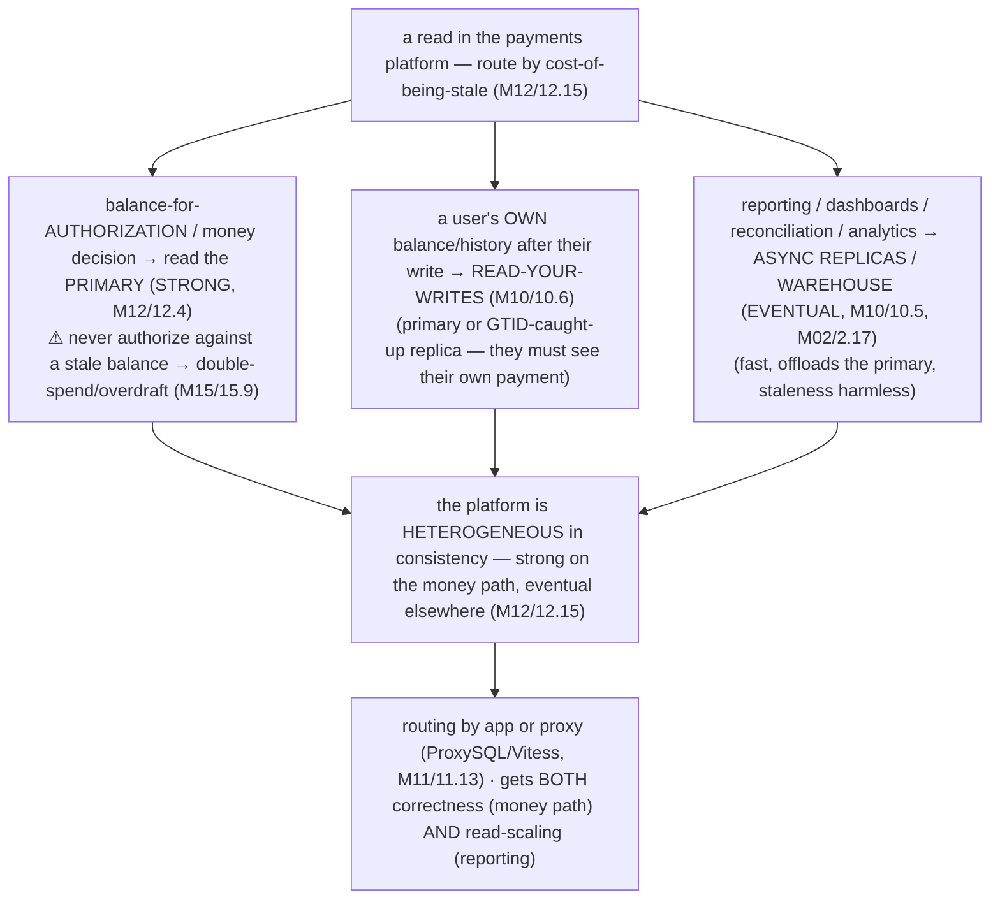

# M16 · Pass C — Architecture Diagrams & Design Walkthroughs · Challenges 16.1–16.5

> **Pass C scope:** the **architecture diagram** + the **design walkthrough** (the design, narrated, composing prior modules). Pairs with `01-…`. Challenges 16.1/16.2/16.3/16.4 use **★ bespoke architecture SVGs**; 16.5 uses Mermaid. Domain: payments/wallet, the ledger — *the system being designed*. Each ends with the **💰 money-never-lies guarantee**.

---

## 16.1 · The fintech design frame ★

**★ Diagram (custom SVG):**

![The fintech design frame. Step 1, start from the invariants (money-never-lies) — derive the design from these: money conserved (sum of debits equals credits), never lost/duplicated, always provable (auditable), always recoverable. The layers: (2) Ledger — immutable double-entry, derived balances (M01/M02/M03); (3) Correct — atomic plus idempotent money movement (M07/M08/M11/M12); (4) Scale — replicas plus shards plus analytics offload (M10/M11/M02); (5) Operable — backup/PITR, monitor, online DDL, security (M13); (6) Survivable — prevention checklist plus DR (M15/M10/M13). Step 7, integrate reliably (outbox/CDC) plus reconcile (the backstop) — woven through all layers; build correctness before scale, weave survivability and reconciliation throughout. Step 8, name the tradeoffs (atomic-single-shard vs Saga, strong vs eventual per op, shard-or-not, the DR cost); don't trade away a money-never-lies invariant for performance — bulletproof the money path, optimize elsewhere. The meta-design: derive from the invariants, build correctness first, weave survivability and reconciliation throughout.](assets/16.1-design-frame.svg)

**Design walkthrough — how to attack "design a payments system."**
Whether in production or an interview, the frame (the SVG) prevents the mistake that loses money: jumping to architecture before nailing correctness. **Start from the invariants** (step ①) — *lead* with money-never-lies (conserved, never lost/duplicated, provable, recoverable) and *derive* the design from them. Then layer in order: **② model the immutable double-entry ledger** (16.2 — the heart, M01/M02/M03), **③ make money movement correct** (atomic + idempotent, 16.3/16.4 — M07/M08/M11/M12), **④ scale** (replicas → shards → analytics offload, 16.10 — M10/M11), **⑤ make it operable** (M13), **⑥ make it survivable** (M15's prevention + DR, 16.11). Throughout, **⑦ integrate reliably** (outbox/CDC, 16.12) and **reconcile** (the backstop, 16.7) — woven through *all* layers, not bolted on. And **⑧ name the tradeoffs** out loud (atomic-single-shard vs Saga, strong vs eventual per operation, shard-or-not, what DR costs). The discipline the frame enforces: **build correctness *first* (the ledger, atomic+idempotent movement) — *then* scale, and weave survivability + reconciliation throughout** — and *never* trade away a money-never-lies invariant for performance (bulletproof the money path, optimize elsewhere). This is how you ensure you don't miss something that loses money — the meta-design the rest of the module fills in. **💰 Guarantee:** the frame *guarantees* money-never-lies by *deriving the design from the invariants* — every layer built to preserve "conserved, never lost/duplicated, provable, recoverable."

---

## 16.2 · The Ledger: double-entry, immutability, debit=credit ★

**★ Diagram (custom SVG):**

![The double-entry ledger. The immutable ledger_entry table is append-only — never UPDATE/DELETE. A transfer of $100 from account A to account B is one atomic transaction (M07) writing two balanced entries: a debit (account A, minus 10000 minor units, txn_42) and a credit (account B, plus 10000 minor units, txn_42) — so the sum is zero, money is conserved (the double-entry invariant). Money is integer minor units (never FLOAT); corrections are new compensating entries. Balances are derived: balance equals the sum of the account's immutable entries, cached for fast reads (updated atomically with the entries) and re-derivable for reconciliation. Why immutable plus double-entry plus derived (vs a naive mutable balance column): an audit trail (permanent, tamper-evident, for compliance), no lost-update risk (entries immutable), money conserved per transaction, and the balance re-derivable so reconciliation can always recompute the truth. The naive mutable balance has no history, is lost-update prone, and can't prove correctness — wrong for money. Money-never-lies, structural: double-entry conserves, immutability proves, derived re-derives (reconcilable). Partitioned by time for retention; immutability enforced by privilege.](assets/16.2-ledger.svg)

**Design walkthrough — modeling the ledger.**
The ledger is the *heart* of the platform, and getting it right is the foundation everything else builds on (the SVG). The model (M01/M02/M03): **accounts** (money locations) and an **immutable `ledger_entry` table** (append-only). A transfer of $100 from A to B is *one atomic transaction* (M07) writing *two balanced entries* — a −$100 debit on A and a +$100 credit on B (in minor units, M03) — so **Σ = 0** (money is *conserved* — the double-entry invariant; money moved, none created or destroyed). **Immutability** is key: entries are *never* updated or deleted (corrections are *new* compensating entries, M01/1.17) — so the ledger is a *permanent, tamper-evident audit trail* (for compliance, 16.8). **Balances are derived** (M02/2.17): an account's balance = Σ its entries — kept as a *cached* `balance_minor` column (updated *atomically with* the entries, M07, for fast reads) *and* re-derivable from the entries (so **reconciliation**, 16.7, can always recompute the truth and detect drift). The whole design contrasts with the naive *mutable balance column* (the SVG's warning) — which has no history (fails audit), is lost-update prone (M15/15.9), and can't prove correctness. Money is **minor units / DECIMAL** (M03 — never FLOAT). The ledger is **partitioned by time** for retention (M13/13.2) and **immutable by privilege** (M13/13.14 — app accounts can't `UPDATE`/`DELETE` it). **💰 Guarantee:** the ledger *is* money-never-lies made structural — double-entry → *conserved*, immutability → *provable*, derived balances → *re-derivable* (so reconciliation can always recompute the truth and catch any drift). The foundation of every other challenge.

---

## 16.3 · Idempotency & exactly-once ★

**★ Diagram (custom SVG):**

![Idempotency for money. A client pays $100 with idempotency key K7 and, on a timeout, retries with the same key. First request (K7 new) — one atomic transaction (M07): INSERT key K7 (unique) plus debit plus credit plus ledger entries — apply once, record the result, return it; key and effect are atomic so a crash between them can't double-apply. Retry (same K7) — the unique constraint fails, recognized as already-processed, so do not re-apply; return the recorded result — charged exactly once, no double-charge; the database enforces dedup atomically via the unique index. You can't prevent duplicate delivery (exactly-once delivery is a myth) — make duplicate processing harmless: at-least-once delivery (never lost) plus idempotent processing (duplicates no-op) equals exactly-once effect. The primitive under transfers, Saga steps, and CDC consumers; non-negotiable for money. The single most important money-never-lies protection at the request level — no double-charge; plus the atomic ledger and reconciliation means every payment moves money exactly once, provably.](assets/16.3-idempotency.svg)

**Design walkthrough — the payment API that prevents the double-charge.**
Payment requests *will* be retried (timeouts, at-least-once delivery, M12/12.13), and without protection a retry *double-charges* — so the payment API must be *safely retryable* (the SVG). The client generates a unique **idempotency key** per *logical* payment (`K7` — reused across *retries* of the same payment, M12/12.9). On each request, the server, *in the same atomic transaction* as the money movement (M07): `INSERT`s `K7` into an `idempotency_key` table with a **unique constraint** (M03/M05). **First time** (`K7` new) → the insert succeeds → process the payment (atomic debit+credit+ledger-entries, 16.2) → record the result → return it. **Retry** (`K7` seen) → the insert *fails the unique constraint* → the server recognizes the duplicate → *doesn't re-process* → returns the *recorded* result. The customer is charged **exactly once**, no matter how many times the request is delivered. The *atomicity* (key-insert + money-movement in one transaction, M07) is critical — a crash between them *can't* double-apply (the SVG's note). The database *enforces* dedup *atomically* (the unique index). This achieves **exactly-once effect** despite **at-least-once delivery** (exactly-once *delivery* being impossible, M12/12.13). It's the *load-bearing primitive* — under transfers, Saga steps (M12/12.8), and CDC consumers (M12/12.13). **💰 Guarantee:** idempotency *guarantees no double-charge* — the single most important money-never-lies protection at the request level. With the atomic ledger (16.2) + reconciliation (16.7), every payment moves money *exactly once, provably*.

---

## 16.4 · Money movement: atomic transfers, holds, two-phase capture ★

**★ Diagram (custom SVG):**

![Money movement. The atomic transfer (the common case): one transaction (M07), co-located single-shard (M11/11.9) — debit A, credit B, balanced ledger entries, plus an idempotency key and outbox row — atomic conditional UPDATE (no lost update), single-shard ACID, all M07-M09 guarantees; money moved exactly once, atomically. Auth-hold-capture (two-phase, card flows): (1) authorize places a hold (reserve funds, no move yet); (2) capture settles (write ledger entries, release the hold); or release/expire the hold (funds available again); available balance equals settled minus the sum of active holds. Cross-shard money movement (accounts on different shards) is a Saga over local transactions plus clearing accounts, never fragile 2PC, plus idempotency and reconciliation — the rare minority, designed to co-locate so most transfers are single-shard. The key subtlety: pending vs settled money — held funds aren't double-spent (available equals settled minus holds); every hold captured or released (no leaks); holds have expirations; partial/multiple captures; each step atomic plus idempotent. Every money movement — simple or two-phase, single- or cross-shard — moves money exactly once, atomically, provably.](assets/16.4-money-movement.svg)

**Design walkthrough — a card payment: authorize (hold) → capture (settle), and the atomic transfer.**
Money moves in more than one way (the SVG). The **atomic transfer** (the common case): one transaction (M07), co-located single-shard (M11/11.9) — debit A, credit B, write balanced ledger entries (16.2), update cached balances, plus the idempotency key (16.3) and outbox row (16.12) — *all atomic*, single-shard ACID (M07–M09), with an atomic conditional `UPDATE` (no lost update, M08/M15/15.9). Money moves *exactly once*. The **two-phase auth-hold-capture** (a card payment): **authorize** places a **hold** — *reserve* the funds (the *available* balance drops) *without moving them yet* (no ledger entry — the money hasn't moved). Later, **capture** *settles* — converts the hold to a real transfer (write the balanced ledger entries, release the hold) — possibly a *partial* capture (capture less, release the rest) or *multiple* captures. Or **release/expire** — an uncaptured hold auto-releases (funds available again). The key subtlety (the SVG): **available balance = settled balance − Σ active holds** — so *held funds aren't double-spent* (a second payment sees the reduced available balance), and *every hold is eventually captured or released* (no leaked holds). Each step is atomic + idempotent. **Cross-shard movement** (accounts on different shards) → a **Saga** (M12/12.8) over local transactions + clearing accounts (M11/11.9), never fragile 2PC — the rare minority (design to co-locate). **💰 Guarantee:** every money movement — simple or two-phase, single- or cross-shard — moves money *exactly once, atomically, provably*: atomic (no loss) + holds (no double-spend of reserved) + two-phase (pending tracked) + idempotent (no double-move on retry).

---

## 16.5 · Consistency for money: what to read where

**Diagram — the per-operation consistency map:**

**Design walkthrough — routing each payments read to its correct consistency level.**
In a replicated/sharded platform, *reading the wrong consistency for a money decision loses money* (the Mermaid) — so you classify *each* read by cost-of-being-stale (M12/12.15). A **balance-for-authorization** (deciding whether to move money) reads the **primary** (*strong* — the latest committed state) — *never* an async replica, because a stale balance → authorizing a payment the real balance can't cover → **double-spend/overdraft** (M15/15.9). A user's **own balance/history after a payment** uses **read-your-writes** (M10/10.6 — route to the primary or a GTID-caught-up replica, so they *see* their own payment and don't panic-retry). **Reporting / dashboards / reconciliation / analytics** read **async replicas / the warehouse** (*eventual*, M10/10.5, M02/2.17 — fast, offloads the primary, staleness harmless). The platform is *heterogeneous* in consistency — **strong on the money path, eventual elsewhere** (M12/12.15) — getting *both* correctness (money decisions never against stale data) *and* read-scaling (reporting offloaded). Routing is by the app or a proxy (ProxySQL/Vitess, M11/11.13). **💰 Guarantee:** routing money decisions to *strong* reads guarantees *no decision against stale data* (preventing the stale-read double-spend, M15/15.9); read-your-writes prevents the user-confusion double-submit; eventual-for-reporting offloads safely — money is *never* lost/duplicated by reading the wrong consistency.

---

*Architecture diagrams + design walkthroughs for 16.1–16.5 complete (4 ★ custom SVGs + 1 Mermaid). Next Pass C file: 16.6–16.11 (★ hot-account, reconciliation, multi-currency, DR SVGs + Mermaid for audit, scaled topology).*
