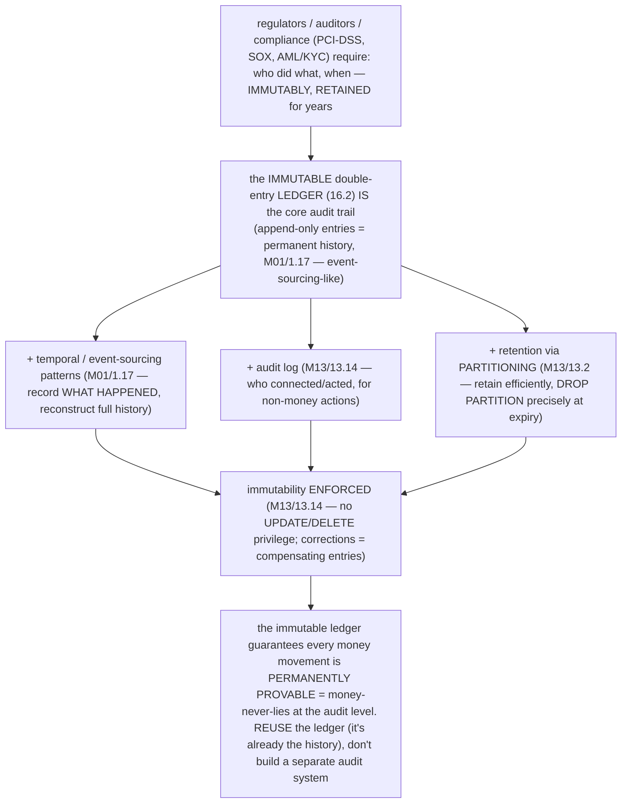
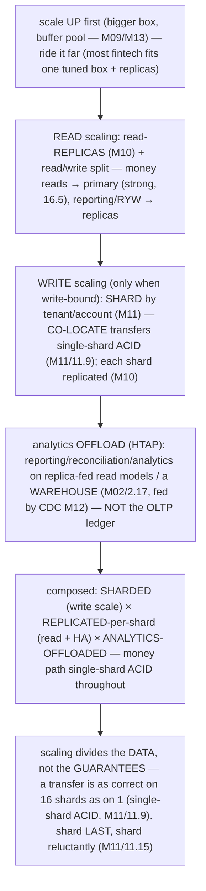

# M16 · Pass C — Architecture Diagrams & Design Walkthroughs · Challenges 16.6–16.11

> **Pass C scope:** the **architecture diagram** + the **design walkthrough**. Pairs with `02-…`. Challenges 16.6/16.7/16.9/16.11 use **★ bespoke architecture SVGs**; 16.8/16.10 use Mermaid. Domain: payments/wallet, the ledger. Each ends with the **💰 money-never-lies guarantee**.

---

## 16.6 · Hot account contention ★

**★ Diagram (custom SVG):**

![Hot account contention and the relief patterns. The problem: 10k transfers/sec into one merchant account all contend on its balance row, serialized into a bottleneck (deadlocks) — but contention is only on the derived balance; the append-only ledger is never contended (every transfer still writes an entry). Four relief patterns: (1) atomic UPDATE — set balance equals balance plus amount, no read-then-write gap, increments don't deadlock, the first-line fix (always use it); (2) split balances — split into N sub-balances, each transfer to a random sub-balance (spread N times), true balance equals the sum of sub-balances, turning one hot row into N warm rows; (3) batch/async — write the ledger entry now (append-only, uncontended), batch-apply to the balance async (one update for many), balance eventually consistent (reconciled); (4) SKIP LOCKED — queue-style processing, skip locked rows, no contention, for pending-queue work. The key insight: the immutable ledger is always the append-only, uncontended source of truth; contention is only on the derived balance, which you can split/batch/async and reconcile against the entries. Money conserved: every transfer still writes a ledger entry (never lost), the truth is complete, the balance-projection is scaled.](assets/16.6-hot-account.svg)

**Design walkthrough — a merchant account taking 10k payments/sec.**
A popular merchant's account receives 10,000 transfers/sec — and naively, *every* transfer contends on that account's *balance row* (a hot row, M08), serializing them into a bottleneck (transfers queue, deadlock, M15/15.13). The crucial insight (the SVG): **the contention is *only* on the derived *balance* — the immutable *ledger* (16.2) is *never* contended** (it's append-only; every transfer just *adds* an entry, no row-locking conflict). So the relief patterns all *scale the balance projection* while keeping the ledger as the uncontended truth: **① Atomic `UPDATE`** (`SET balance = balance + :amt` — no read-then-write gap, increments don't deadlock the way RMW does, M08; the first-line fix, always use it). **② Split balances** — split the hot account's balance into *N sub-balances* (buckets, M11); each transfer hits a *random* sub-balance (spreading contention across N rows → N× concurrency); the *true* balance = Σ sub-balances. **③ Batch/async** — write the ledger entry *immediately* (append-only, uncontended) but *batch-apply* to the balance *asynchronously* (one update for many transfers); the balance is eventually consistent (reconciled, 16.7). **④ `SKIP LOCKED`** (M08) — process the account's pending transfers from a queue, skipping locked rows (no contention). The design: atomic updates *always*; split balances or batching for the *genuinely* hot few accounts; the *immutable ledger is always the source of truth* (16.2). **💰 Guarantee:** the relief patterns *preserve* money-never-lies — every transfer *still writes an immutable ledger entry* (never lost; the *truth* is always complete), and the *derived* balance (split/batched/async) is *reconciled* against the entries (16.7). Money is conserved; only the balance-*projection* is scaled.

---

## 16.7 · Reconciliation: internal, external & drift detection ★

**★ Diagram (custom SVG):**

![Reconciliation, the money-never-lies backstop. Internal reconciliation: re-derive from the immutable ledger and compare to the cached balance — balance equals the sum of entries? the sum of debits equals the sum of credits? — a mismatch is drift (a lost update, a half-Saga, a bug). External reconciliation: match the platform's transactions against the processor/bank records — an unmatched item is drift (a missed event, a discrepancy). On drift: investigate (trace the cause), repair with a compensating ledger entry (never mutate), plus an audit trail and an alert. Runs on replicas/the warehouse (offloads the primary), fed by the outbox/CDC backbone. A backstop, not a primary mechanism — it detects residual errors after idempotency/atomic-transfers/outbox prevent most; it must use a genuinely independent source (the immutable ledger, external records) or it just re-confirms the same bug. The money-never-lies backstop — makes "did money get lost/duplicated?" answerable (no, reconciliation would catch it); why eventual consistency is safe for money; the immutable ledger makes it possible; the final guarantee under the platform.](assets/16.7-reconciliation.svg)

**Design walkthrough — the daily reconciliation catching a half-completed Saga.**
No system is perfectly consistent — so for money you need an *independent* detector of any drift: reconciliation (the SVG, the money-never-lies backstop, M12/12.14). It runs as periodic (daily/continuous) **independent verification**: **internal reconciliation** re-derives each balance *from the immutable ledger entries* (balance = Σ entries) and compares to the *cached* balance — *and* verifies Σ debits = Σ credits (money conserved) — any mismatch = **drift**. **External reconciliation** matches the platform's transactions against the *external processor's/bank's settlement records* — any unmatched = drift. Concretely: a **cross-shard Saga** (16.4/M12/12.8) silently *half-completed* (debit applied, credit lost) — so the affected account's *cached balance ≠ Σ entries*, *or* internal totals ≠ external records → the **daily reconciliation detects it**, *alerts*, and *repairs* (a **compensating ledger entry** — never mutate, M01/1.17 — with an audit trail). Reconciliation runs on **replicas/the warehouse** (M02/2.17, M10 — offloading the primary, fed by **CDC**, 16.12) so it doesn't load the money path. It's a *backstop* — it catches *residual* errors after the primary mechanisms (idempotency, atomic transfers, outbox) prevent *most* — and it *must* use a *genuinely independent* source (the immutable ledger, external records) or it just re-confirms the same bug. **💰 Guarantee:** reconciliation *is* the money-never-lies backstop — it makes "did money get lost or duplicated?" *answerable* ("no, reconciliation would catch it"), and it's *why* eventual consistency is *safe* for money (M12/12.14 — permitted to be temporarily inconsistent *because* reconciliation catches any persistent drift). The immutable ledger (16.2) makes it *possible*. The final guarantee under the whole platform.

---

## 16.8 · Audit trails & compliance

**Diagram — audit/compliance on the immutable ledger:**

**Design walkthrough — satisfying a regulator's "show every change to this account."**
Fintech is regulated — and a regulator/auditor demands "show *every* change to this account over this period, immutably, and prove nothing was altered" (the Mermaid). A *mutable* system (in-place updates, no history) *can't* answer this. The platform's answer: the **immutable double-entry ledger** (16.2) *is* the audit trail — the append-only entries *are* a permanent, complete, tamper-evident history of every money movement (M01/1.17 — event-sourcing-like: the entries record *what happened*). To answer the regulator: query the account's entries (indexed by account + time, M05) → the *complete, immutable, balanced* history. Augment with **temporal/event-sourcing patterns** (M01/1.17 — full history reconstructable), an **audit log** (M13/13.14 — who acted, for non-money actions), and **retention via partitioning** (M13/13.2 — retain the ledger/audit by time efficiently, `DROP PARTITION` precisely at the 7-year expiry). Immutability is *enforced* (M13/13.14 — no `UPDATE`/`DELETE` privilege on the ledger; corrections are compensating entries). The design *reuses* the ledger (it's *already* the immutable history) rather than building a separate audit system. **💰 Guarantee:** the immutable ledger guarantees *every money movement is permanently provable* — which *is* money-never-lies at the audit level (you can *prove* money was never lost/duplicated by examining the immutable, balanced, complete history) — satisfying compliance *and* enabling reconciliation (16.7, the same entries).

---

## 16.9 · Multi-currency & FX ★

**★ Diagram (custom SVG):**

![Multi-currency and FX. Per-currency minor units: amount_minor BIGINT plus currency CHAR(3), balances per (account, currency) — never add USD to EUR, never FLOAT. Rate snapshot: record the exact rate used at transaction time (immutable), for auditable/reproducible dispute and compliance. Rounding: a defined rule (round-half-even), deterministic and consistent, the residual goes to a rounding account, never silently dropped. A cross-currency transfer (USD to EUR) is two movements at a recorded rate: debit minus 10000 USD-minor (source), times rate 0.92 (snapshot, round-half-even), credit plus 9200 EUR-minor (destination). Multi-currency money-never-lies: per-currency minor units (no precision loss) plus rate snapshots (exact, auditable) plus rounding-residual accounting (no money silently lost); double-entry holds per currency (conservation within each currency). Over millions of transactions, sloppy rounding loses real money — treat each currency as its own money.](assets/16.9-multi-currency.svg)

**Design walkthrough — a cross-currency transfer: USD→EUR with a snapshotted rate.**
A global platform handles multiple currencies, and money correctness is *per-currency* (the SVG). **Per-currency minor units**: each amount is integer minor units + a currency code (`amount_minor BIGINT` + `currency CHAR(3)`, M03 — never FLOAT), and balances are *per (account, currency)* (an account holds separate USD/EUR/… balances — *never* mixed). A **cross-currency transfer** (USD→EUR) is *two movements at a recorded rate*: debit −10,000 USD-minor from the source, *times the rate* (0.92), credit +9,200 EUR-minor to the destination — and the conversion records a **rate snapshot** (the *exact* rate used, *immutable* — so the conversion is *auditable and reproducible* for disputes/compliance, 16.8). **Rounding** is careful: a *defined* rule (round-half-even / banker's rounding), deterministic and consistent, and the **residual** (the fraction lost/gained to rounding) goes to a *rounding account* — *never silently dropped* (preserving conservation; over millions of transactions, sloppy rounding *loses real money*). The double-entry invariant (16.2) holds *per currency* (the transfer balances within each currency via the FX/rounding accounts). The design treats **each currency as its own money** (per-currency balances, per-currency conservation) with FX as an explicit, rate-snapshotted, rounding-accounted conversion. **💰 Guarantee:** per-currency minor units guarantee *no precision loss* (M03); rate snapshots guarantee *FX is exact and auditable*; rounding-residual accounting guarantees *no money silently lost to rounding* — multi-currency money is *never lost or duplicated*, and every conversion is *provable*.

---

## 16.10 · Scaling the platform: read/write split, sharding, HTAP

**Diagram — the scaled topology:**

**Design walkthrough — scaling from one box to a sharded, replicated, analytics-offloaded platform.**
A growing platform must scale *correctly* — without breaking money-never-lies (the Mermaid). The composed toolkit (M14/14.11): **scale up first** (a bigger box, M09 — most fintech fits one tuned box + replicas a *long* way); then **read scaling** (read-replicas, M10, + read/write split — money reads to the primary for strong consistency, 16.5, reporting/RYW to replicas); then, *only* when genuinely write-bound, **write scaling** via **sharding** by tenant/account (M11 — *co-locating* each transfer's legs so it stays **single-shard ACID**, M11/11.9), each shard *itself replicated* (M10); and **analytics offload (HTAP)** — run reporting/reconciliation/analytics on **replica-fed read models / a warehouse** (M02/2.17, fed by CDC, M12 — *not* the OLTP ledger, M14/14.15). The composed topology: **sharded (write scale) × replicated-per-shard (read scale + HA) × analytics-offloaded (HTAP)** — with the money path **single-shard ACID throughout**. The key principle: **scaling divides the *data*, not the *guarantees*** — a transfer is as correct on 16 shards as on 1 (because it's single-shard ACID, M11/11.9). And: **shard *last*, shard *reluctantly*** (M11/11.15 — the complexity is permanent). **💰 Guarantee:** scaling *preserves* money-never-lies because the money path stays **single-shard ACID** (correct regardless of shard count), each shard is **durable + node-loss-survivable** (M09/M10), and **reconciliation still works** (16.7 — re-derive per shard). Money is never lost/duplicated *because* scaling divided the data, not the guarantees.

---

## 16.11 · Failure & DR: RPO/RTO, what zero-data-loss costs ★

**★ Diagram (custom SVG):**

![Failure and DR. RPO≈0 (no committed transfer lost): flush_log=1 plus sync_binlog=1 (no crash loss) plus semi-sync (durable on a replica, survives primary loss) plus a cross-region replica (survives region loss) plus tested PITR for logical disasters (which replicate, so failover is useless). Fast RTO (seconds to minutes downtime): automated fenced failover (promote a replica in seconds), fence the old primary (no split-brain), plus fast physical/snapshot restore for what failover can't fix, plus the full M15 prevention checklist and reconciliation to verify. What zero-data-loss really costs (the honest accounting): latency — semi-sync adds a round-trip per commit; infrastructure — replicas plus cross-region plus standby; operational rigor — tested restore drills, monitoring, fencing automation; true zero-data-loss is not free. The architect's job: quantify it and justify it (vs the cost of losing money, which for payments vastly exceeds it; often regulated). A committed transfer survives crash plus node loss plus region loss plus logical disaster — and is reconciled correct after recovery; money is never lost even when the system fails (the ultimate guarantee). The synthesis of M15's catastrophes are survivable; for lower-value systems, accept looser RPO/RTO — match cost to the cost of loss.](assets/16.11-dr-posture.svg)

**Design walkthrough — designing the platform's DR to survive node/region loss with no lost money.**
The platform must *survive* failures (node loss, region loss, catastrophe, M15) with *no lost money* and minimal downtime — and the architect must answer "what does zero-data-loss *cost*?" (the SVG). **RPO≈0** (no committed transfer lost): **`flush_log=1` + `sync_binlog=1`** (no crash loss, M09/M15/15.2) + **semi-sync** (durable on a replica → survives primary loss, M10) + a **cross-region replica** (survives region loss) + **tested PITR** for logical disasters (which *replicate*, so failover is useless — only backup-based recovery helps, M15/15.8). **Fast RTO**: **automated fenced failover** (promote a replica in seconds, M10) + *fence* the old primary (no split-brain, M15/15.3) + fast restore (M13) + the **M15 prevention checklist** (15.16) + **reconciliation** (16.7 — verify recovery). **The honest accounting** (the SVG's amber box — the architect's real job): zero-data-loss *costs* **latency** (semi-sync's round-trip per commit, M10/10.4), **infrastructure** (replicas, cross-region, standby), and **operational rigor** (tested drills, monitoring, fencing) — *true zero-data-loss is not free*. The architect must *quantify* it (latency/cost) and *justify* it (vs the cost of *losing* money, which for payments vastly exceeds it; often regulated). For *lower-value* systems, accept looser RPO/RTO (cheaper) — *match the cost to the cost of loss*. **💰 Guarantee:** a committed transfer survives crash (M09) + node loss (semi-sync) + region loss (cross-region) + logical disaster (tested PITR) — and is *reconciled* correct after recovery (16.7). Money is *never lost, even when the system fails* — the ultimate money-never-lies guarantee (the synthesis of M15's "catastrophes are survivable").

---

*Architecture diagrams + design walkthroughs for 16.6–16.11 complete (4 ★ custom SVGs + 2 Mermaid). Next Pass C file: 16.12–16.16 (Mermaid for outbox/CDC, anti-patterns, interview, adjacent + the ★ flagship complete-platform).*
