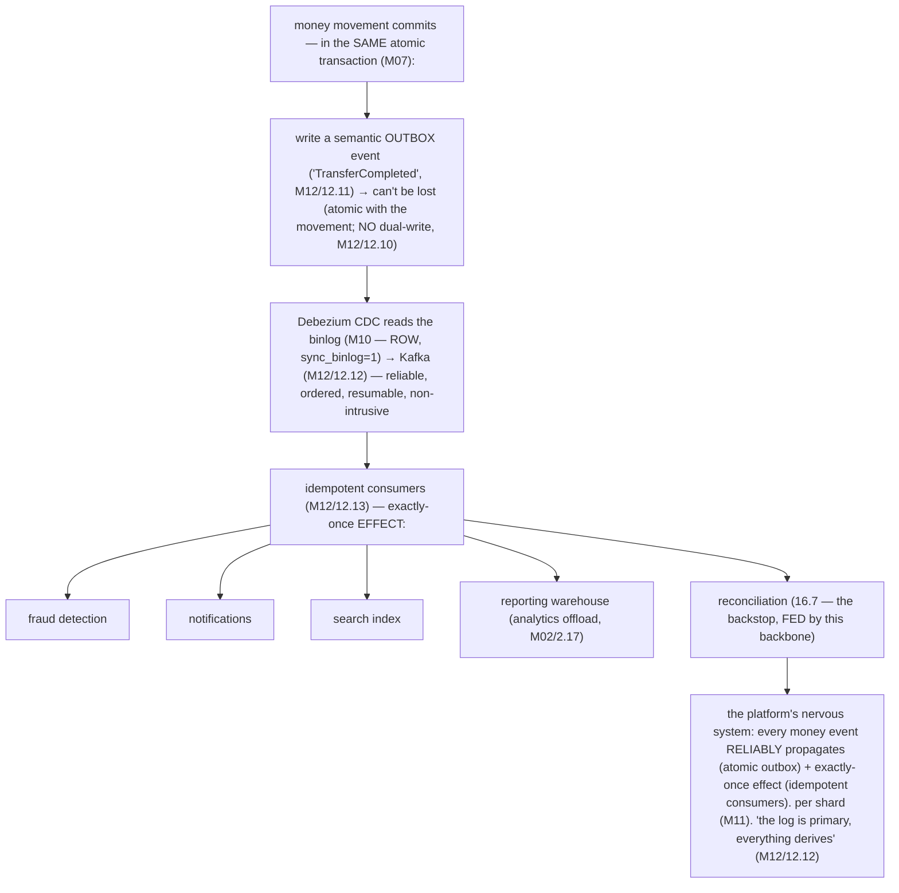
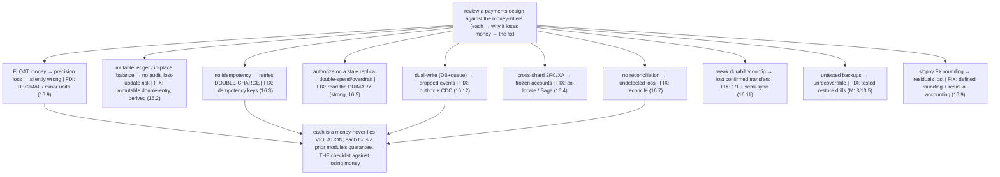
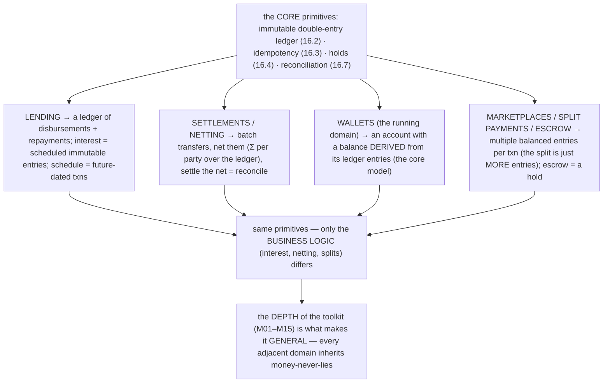

# M16 · Pass C — Architecture Diagrams & Design Walkthroughs · Challenges 16.12–16.16

> **Pass C scope:** the **architecture diagram** + the **design walkthrough**. Pairs with `03-…`. Challenge 16.16 uses the **★ flagship complete-platform SVG**; 16.12/16.13/16.14/16.15 use Mermaid. Domain: payments/wallet, the ledger. Each ends with the **💰 money-never-lies guarantee**. **16.16 completes the entire resource (M01–M16).**

---

## 16.12 · The outbox/CDC integration backbone

**Diagram — the integration backbone:**

**Design walkthrough — "TransferCompleted" reaching fraud, notifications, and reporting.**
Every money movement must *reliably reach* other systems — and dual-writes (commit, then publish) *silently drop events* on a crash (M12/12.10). The **outbox/CDC backbone** (the Mermaid, the platform's nervous system) solves it. When a transfer commits, *in the same atomic transaction* (M07), it writes a **semantic outbox event** ("TransferCompleted", M12/12.11) — so the event *can't be lost* (atomic with the movement; *no* dual-write). **Debezium CDC** reads the binlog (M10 — ROW format, `sync_binlog=1`) and streams the event to **Kafka** (M12/12.12 — reliable, ordered, resumable via GTID, non-intrusive). **Idempotent consumers** (M12/12.13 — dedup by event ID → exactly-once *effect*) subscribe: **fraud detection** (inspect the transfer real-time), **notifications** (the confirmation), **search**, the **reporting warehouse** (analytics offload, M02/2.17), and **reconciliation** (16.7 — *fed* by this backbone). So a "TransferCompleted" *never silently misses* fraud, notifications, settlement, or reporting. Per shard (M11), each shard's binlog is a CDC source. The principle: "the log is primary, everything derives" (M12/12.12 — the binlog, already there for replication, *is* the integration source). **💰 Guarantee:** the outbox guarantees *every money event reliably propagates* (never lost — atomic with the movement); idempotent consumers guarantee *no double-effect* (exactly-once). Money's *propagation* is as reliable as its *movement*.

---

## 16.13 · Common fintech anti-patterns (the money killers)

**Diagram — the fintech anti-pattern catalog:**

**Design walkthrough — reviewing a payments design against the money-never-lies anti-patterns.**
A fintech design *review* checks against the *specific catastrophic mistakes* that lose money (the Mermaid — each a money-never-lies violation, each fixed by a prior module's guarantee). Walk a candidate design: Is money stored as **FLOAT**? → *no, DECIMAL/minor units* (M03/16.9 — FLOAT silently loses precision). Is the ledger **mutable** (in-place balance)? → *no, immutable double-entry, derived balances* (16.2 — mutable has no audit + lost-update risk, M15/15.9). Are money operations **idempotent**? → *yes, idempotency keys* (16.3 — else retries double-charge). Do money decisions read the **primary**? → *yes* (16.5 — a stale replica → double-spend, M15/15.9). Any **dual-writes**? → *no, outbox + CDC* (16.12/M12/12.10). Cross-shard **2PC/XA**? → *no, co-locate or Saga* (16.4/M12). Is there **reconciliation**? → *yes* (16.7 — else loss goes undetected). Durability config **1/1 + semi-sync**? → *yes* (16.11/M15/15.2 — else lost confirmed transfers). Backups **tested**? → *yes* (M13/13.5 — else unrecoverable). FX **rounding** accounted? → *yes* (16.9 — else residuals lost). Each "no" is a money-leak; each fix is a module's guarantee. **💰 Guarantee:** this catalog *is* the money-never-lies checklist — reviewing against it *ensures* the invariants hold (each anti-pattern is a way money gets lost/duplicated; each fix prevents it).

---

## 16.14 · The interview playbook: designing a payments system

**Diagram — the interview structure:**

```mermaid
flowchart TB
    START["'design a payments system' — the structured walkthrough (correct-first, tradeoff-aware)"]
    START --> REQ["1. CLARIFY requirements: scale (TPS), consistency, DR (RPO/RTO), currencies, compliance — + the implicit money-never-lies"]
    REQ --> INV["2. STATE THE INVARIANTS (16.1) — conserved/never-lost/provable/recoverable — LEAD with these (signals you get money systems)"]
    INV --> LEDGER["3. MODEL THE LEDGER (16.2) — immutable double-entry, derived balances — the heart. DRAW it"]
    LEDGER --> MOVE["4. MONEY MOVEMENT (16.4) — atomic transfers, idempotency (16.3), holds/two-phase"]
    MOVE --> CONS["5. CONSISTENCY (16.5) — per-operation: strong for money, eventual for reporting"]
    CONS --> SCALE["6. SCALE (16.10) — replicas → shard by tenant (co-locate) → analytics offload. shard LAST"]
    SCALE --> REL["7. RELIABILITY (16.12 outbox/CDC) + RECONCILIATION (16.7 backstop)"]
    REL --> DR["8. DR (16.11) — semi-sync + fenced failover + tested PITR; NAME what zero-data-loss costs"]
    DR --> TRADE["9. NAME THE TRADEOFFS out loud + 10. mention the ANTI-PATTERNS you're avoiding (16.13)"]
    note["LEAD with money-never-lies, thread it through every decision — the staff-level answer. the master cheat-sheet (M14/14.16) is the recall sheet"]
    TRADE --> note
```

**Design walkthrough — a 45-minute "design a payments platform" interview.**
"Design a payments system" is a system-design staple, and the playbook (the Mermaid) is how to walk it — *correct-first, tradeoff-aware*. **Clarify requirements** (scale, consistency, DR/RPO/RTO, currencies, compliance — *and* recognize the implicit money-never-lies requirement). **State the invariants** (16.1 — conserved/never-lost/provable/recoverable — *lead* with these; it immediately signals you understand money systems). **Model the ledger** (16.2 — immutable double-entry, derived balances — *draw it*; it's the heart). **Money movement** (16.4 — atomic transfers, idempotency 16.3, holds/two-phase). **Consistency** (16.5 — per-operation: strong for money decisions, eventual for reporting). **Scale** (16.10 — replicas → shard by tenant co-locating transfers → analytics offload; *shard last*). **Reliability** (16.12 — outbox/CDC) + **reconciliation** (16.7 — the backstop). **DR** (16.11 — semi-sync + fenced failover + tested PITR; *name what zero-data-loss costs*). **Name the tradeoffs** out loud (interviewers reward this) and **mention the anti-patterns** you're avoiding (16.13 — shows depth). The key: *lead with money-never-lies and thread it through every decision* — the staff-level answer. The master cheat-sheet (M14/14.16) is the recall sheet. **💰 Guarantee:** the playbook *leads with* money-never-lies (invariants first) and threads it through every decision — exactly what distinguishes a strong fintech-design answer.

---

## 16.15 · Beyond the core: lending, settlements, wallets, marketplaces

**Diagram — adjacent domains → the same primitives:**

**Design walkthrough — applying the ledger + idempotency + reconciliation to a marketplace's split payments.**
Fintech is more than payments — and the *same primitives* extend to adjacent domains (the Mermaid). A **marketplace split payment** (buyer pays → split across seller + platform fee + escrow): the payment writes *multiple balanced ledger entries* per transaction (a −$100 debit on the buyer, a +$90 credit to the seller, a +$10 credit to the platform — *the split is just more entries*, and double-entry holds: Σ = 0, 16.2); **escrow** is a *holding account* (a hold, 16.4 — funds reserved until the buyer confirms delivery, then captured to the seller); **idempotency** (16.3 — the payment is safely retryable); **reconciliation** (16.7 — verify the splits balance against external records). Similarly: **lending** is a ledger of disbursements + repayments (interest = scheduled immutable entries); **settlements/netting** batch transfers and settle the net (= reconciliation over the ledger); **wallets** (the running domain) are accounts with derived balances (the core model). The *same* primitives — **immutable double-entry ledger, idempotency, holds, reconciliation** — compose into *every* fintech domain; only the *business logic* (interest, netting, splits) differs. **💰 Guarantee:** because the *primitives* carry the money-never-lies guarantees, *every* adjacent domain inherits them — lending, settlements, wallets, marketplaces are all money-never-lies by composing the same foundations. The depth of the toolkit (M01–M15) is what makes it *general*.

---

## 16.16 · The complete payments platform (end-to-end) ★

**★ Diagram (custom SVG):**

![The complete payments platform — every module, one architecture. The payments API (idempotent) talks to Vitess routing with per-operation consistency (money read to primary/strong, report to replica/eventual). The core: an immutable double-entry ledger sharded by tenant (M11/11.9) across three shards — a transfer is single-shard ACID (M07-M09): debit plus credit plus entries plus idempotency plus outbox in one commit; immutable entries with derived balances; IDs are ULID/Snowflake; money is minor units; cross-shard is a Saga; multi-currency, holds/two-phase, and hot-account relief apply; each shard is a primary plus replicas with semi-sync; history partitioned; a cross-region DR replica; audit/compliance on the ledger. The integration backbone: outbox event (atomic, no dual-write) to Debezium CDC to Kafka to idempotent consumers (exactly-once effect) — fraud, notifications, search, warehouse (HTAP). The backstop: reconciliation re-derives balances from the immutable ledger, matches external records daily, on replicas/warehouse, detecting/repairing any drift. Operable (M13): tested backups plus PITR, early-warning, online DDL, security, monitoring. Survivable (M15): prevention checklist plus DR (RPO≈0, fenced failover, tested PITR). Money never lies, end to end: a payment is atomic, idempotent, durable beyond node/region loss, never lost in propagation, survivable through catastrophe, always provable and recoverable. The synthesis of the entire journey M01 to M16: a correct, scalable, operable, survivable, money-never-lies fintech platform on MySQL.](assets/16.16-complete-platform.svg)

**Design walkthrough — the full end-to-end design: every M01–M15 concept in one platform.**
This is the capstone of the capstone — the *entire* platform, composing *every* module, narrated through the flagship diagram (the SVG). **The core (correctness, M01–M09):** an **immutable double-entry ledger** (16.2 — accounts + append-only balanced entries, derived balances, minor units M03), **sharded by tenant** (M11 — co-locating transfers, M11/11.9) so a transfer is a **single-shard ACID transaction** (16.4, M07–M09 — debit+credit+entries+idempotency-key+outbox-row in one commit) with **idempotency** (16.3) and **holds/two-phase** where needed (16.4). **Scale (M10–M11):** each shard **replicated** (semi-sync — node-loss durable; primary for strong reads, replicas for reporting), **distributed IDs** (ULID/Snowflake, M11/11.12), **multi-currency** (16.9), **hot-account relief** (16.6). **Consistency (M12):** **per-operation** (16.5 — strong for money, RYW for users, eventual for reporting); **cross-shard via Saga** (M12/12.8). **Integration (M12):** the **outbox/CDC backbone** (16.12 — atomic events, reliably propagated, idempotent consumers) → fraud, notifications, search, the **warehouse** (HTAP, M02/2.17). **The backstop:** **reconciliation** (16.7 — re-derive from the immutable ledger, match external records, daily). **Operability (M13):** tested backups + PITR, early-warning, online DDL, security. **Survivability (M15):** the **prevention checklist** + **DR** (16.11 — RPO≈0, fenced failover, tested PITR). Plus **audit/compliance** (16.8) on the immutable ledger. The design *minimizes the distributed surface* (co-locate so most transfers are single-shard ACID), *bulletproofs the money path* while *scaling the rest*, and *pays for survivability* because the cost of losing money exceeds it — every decision *derived from the money-never-lies invariants* (16.1). **💰 Guarantee (the journey's culmination):** the complete platform guarantees, *end to end*, that a payment is **atomic** (single-shard ACID, M07–M09), **idempotent** (no double-charge, M12), **durable beyond node/region loss** (semi-sync + cross-region, M10), **never lost in propagation** (outbox/CDC, M12), **survivable through any catastrophe** (M15 + tested DR, 16.11), and **always provable + recoverable** (immutable ledger + reconciliation, 16.2/16.7). **Money is never lost or duplicated, and always provable** — across crashes, node/region loss, scale, distribution, and catastrophe. This is the synthesis of the *entire journey* (M01 modeling → M09 durability → M12 distributed correctness → M15 survivability → M16 the platform): **a correct, scalable, operable, survivable, money-never-lies fintech platform on MySQL.** *The resource's flagship — and its destination.*

---

*Architecture diagrams + design walkthroughs for 16.12–16.16 complete (1 ★ flagship SVG + 4 Mermaid). **M16 Pass C is fully drafted (all 16 challenges): 9 ★ custom SVGs + 7 Mermaid + 16 design walkthroughs.** Next: validate Mermaid, then M16 Pass D (enrichment) — completing M16 and the entire M01–M16 resource.*
